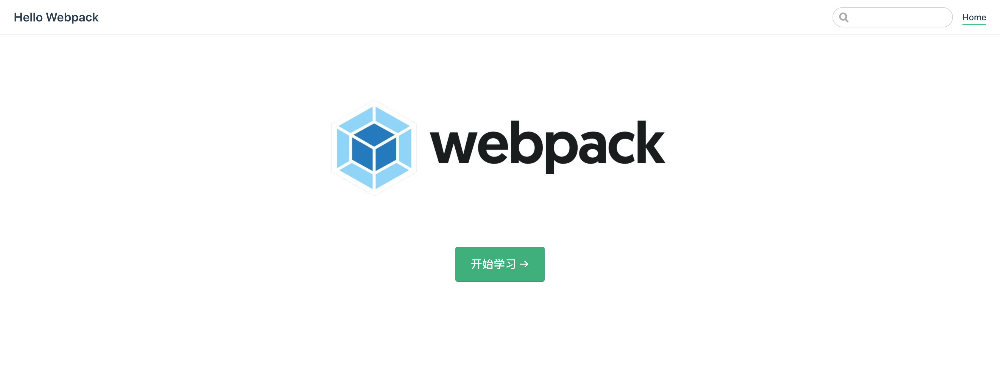
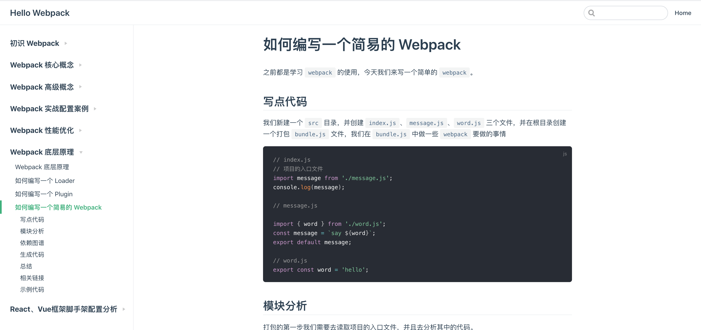

## 安装运行

```nginx
# clone 项目
git clone git@github.com:darrell0904/webpack-doc.git

# 安装依赖
npm install

# 启动项目
npm run dev
```


&nbsp;

## 写文档的原因

因为现在对于 `webpack` 的配置了解的不够全名，比较碎片话，同时有些很新的概念一直都没有应用。

这是我写这个文档原因，让自己更加系统全面的掌握 `webpack` ，毕竟 `webpack 5.0` 快要来了。


> 此篇文档的 `webpack` 的版本是 `4.0`


&nbsp;

## `github` 图片出不来？

* 首先打开 `host` 文件

```nginx
sudo vi /etc/hosts
```

* 接着添加以下内容

```nginx
# GitHub Start

192.30.253.112    github.com
192.30.253.119    gist.github.com
199.232.28.133    assets-cdn.github.com
199.232.28.133    raw.githubusercontent.com
199.232.28.133    gist.githubusercontent.com
199.232.28.133    cloud.githubusercontent.com
199.232.28.133    camo.githubusercontent.com
199.232.28.133    avatars0.githubusercontent.com
199.232.28.133    avatars1.githubusercontent.com
199.232.28.133    avatars2.githubusercontent.com
199.232.28.133    avatars3.githubusercontent.com
199.232.28.133    avatars4.githubusercontent.com
199.232.28.133    avatars5.githubusercontent.com
199.232.28.133    avatars6.githubusercontent.com
199.232.28.133    avatars7.githubusercontent.com
199.232.28.133    avatars8.githubusercontent.com

# GitHub End
```

* 保存，退出，重新刷新 `github` 页面


> 具体原因大家可以参考这篇文章：[解决github图片不显示的问题](https://blog.csdn.net/qq_38232598/article/details/91346392)


&nbsp;

## 项目截图






&nbsp;

## 项目文章目录


&nbsp;
### 初识 Webpack

* 前端的发展
* [前端模块化](https://github.com/darrell0904/webpack-doc/blob/master/docs/chapter0/module.md)
* [新框架](https://github.com/darrell0904/webpack-doc/blob/master/docs/chapter0/frame.md)
* [新语言](https://github.com/darrell0904/webpack-doc/blob/master/docs/chapter0/language.md)
* [常见的构建工具及对比](https://github.com/darrell0904/webpack-doc/blob/master/docs/chapter0/build_tools.md)
* [安装webpack](https://github.com/darrell0904/webpack-doc/blob/master/docs/chapter0/start.md)
* [一些补充](https://github.com/darrell0904/webpack-doc/blob/master/docs/chapter0/supplement.md)

&nbsp;
### Webpack 核心概念

* [webpack 的配置参数](https://github.com/darrell0904/webpack-doc/blob/master/docs/chapter1/README.md)
* [配置 entry 和 output](https://github.com/darrell0904/webpack-doc/blob/master/docs/chapter1/entry_output.md)
* [配置 loader](https://github.com/darrell0904/webpack-doc/blob/master/docs/chapter1/loaders.md)
* [配置 plugin](https://github.com/darrell0904/webpack-doc/blob/master/docs/chapter1/plugins.md)
* [配置 sourceMap](https://github.com/darrell0904/webpack-doc/blob/master/docs/chapter1/sourcemap.md)
* [配置 webpack-dev-derver](https://github.com/darrell0904/webpack-doc/blob/master/docs/chapter1/webpack_dev_server.md)
* [配置 HMR 热更新](https://github.com/darrell0904/webpack-doc/blob/master/docs/chapter1/hot_module_replacement.md)
* [打包 ES6 代码](https://github.com/darrell0904/webpack-doc/blob/master/docs/chapter1/webpack_babel.md)
* [打包 React 代码](https://github.com/darrell0904/webpack-doc/blob/master/docs/chapter1/webapck_react.md)
* [一些补充](https://github.com/darrell0904/webpack-doc/blob/master/docs/chapter1/supplement.md)

&nbsp;
### Webpack 高级概念

* webpack 的高级概念
* [配置 Tree Shaking](https://github.com/darrell0904/webpack-doc/blob/master/docs/chapter2/tree_shaking.md)
* [Develoment 和 Production 模式的区分打包](https://github.com/darrell0904/webpack-doc/blob/master/docs/chapter2/mode.md)
* [Webpack 和 Code Splitting](https://github.com/darrell0904/webpack-doc/blob/master/docs/chapter2/code_splitting.md)
* [配置 SplitChunksPlugin](https://github.com/darrell0904/webpack-doc/blob/master/docs/chapter2/split_chunks_plugin.md)
* [配置 Lazy Loading （懒加载）](https://github.com/darrell0904/webpack-doc/blob/master/docs/chapter2/lazy_loading.md)
* [打包分析 与 Preloading、Prefetching](https://github.com/darrell0904/webpack-doc/blob/master/docs/chapter2/analysis.md)
* [CSS 文件的代码分割](https://github.com/darrell0904/webpack-doc/blob/master/docs/chapter2/css_splitting.md)
* [Webpack 与浏览器缓存（Caching）](https://github.com/darrell0904/webpack-doc/blob/master/docs/chapter2/caching.md)
* [Shimming 的作用](https://github.com/darrell0904/webpack-doc/blob/master/docs/chapter2/shimming.md)
* [环境变量的使用](https://github.com/darrell0904/webpack-doc/blob/master/docs/chapter2/env.md)


&nbsp;
### Webpack 实战配置案例

* Webpack 实战配置案例
* [Library 打包](https://github.com/darrell0904/webpack-doc/blob/master/docs/chapter3/library.md)
* [PWA 打包](https://github.com/darrell0904/webpack-doc/blob/master/docs/chapter3/pwa.md)
* [SSR 打包](https://github.com/darrell0904/webpack-doc/blob/master/docs/chapter3/ssr.md)
* [TypeScript 打包](https://github.com/darrell0904/webpack-doc/blob/master/docs/chapter3/typescript.md)
* [webpack-dev-server 高级配置](https://github.com/darrell0904/webpack-doc/blob/master/docs/chapter3/webpack_dev_server.md)
* [配置 EsLint](https://github.com/darrell0904/webpack-doc/blob/master/docs/chapter3/esLint.md)
* [Webpack 多页面打包](https://github.com/darrell0904/webpack-doc/blob/master/docs/chapter3/more_page.md)

&nbsp;

### Webpack 性能优化

* Webpack 实战配置案例
* [Webpack 优化策略](https://github.com/darrell0904/webpack-doc/blob/master/docs/chapter6/performance.md)
* [使用多进程打包](https://github.com/darrell0904/webpack-doc/blob/master/docs/chapter6/multi_process.md)
* [使用 DllPlugin 提高打包速度](https://github.com/darrell0904/webpack-doc/blob/master/docs/chapter6/dllPlugin.md)

&nbsp;

### Webpack 底层原理
* [如何编写一个 Loader](https://github.com/darrell0904/webpack-doc/blob/master/docs/chapter4/writeLoader.md)
* [如何编写一个 Plugin](https://github.com/darrell0904/webpack-doc/blob/master/docs/chapter4/writePlugin.md)
* [如何编写一个简易的 Webpack](https://github.com/darrell0904/webpack-doc/blob/master/docs/chapter4/writeWebpack.md)

&nbsp;
### React、Vue框架脚手架配置分析
* [Create-React-App 中 Webpack 配置](https://github.com/darrell0904/webpack-doc/blob/master/docs/chapter5/createReactApp.md)
* [Vue-CLI3 中 Webpack 配置](https://github.com/darrell0904/webpack-doc/blob/master/docs/chapter5/vueCli3.md)


### 未完待续。。。


&nbsp;

## 参考资料

这里列举了笔者学习 `webpack` 的主要来源，其余的参考资料我会再每一节发出来。

* [从基础到实战 手把手带你掌握新版Webpack4.0（慕课网）](https://coding.imooc.com/class/316.html)
* [玩转webpack（极客时间）](https://time.geekbang.org/course/intro/190)
* [深入浅出 webpack（书籍）](https://webpack.wuhaolin.cn/)
* [使用 webpack 定制前端开发环境（掘金）](https://juejin.im/book/5a6abad5518825733c144469)