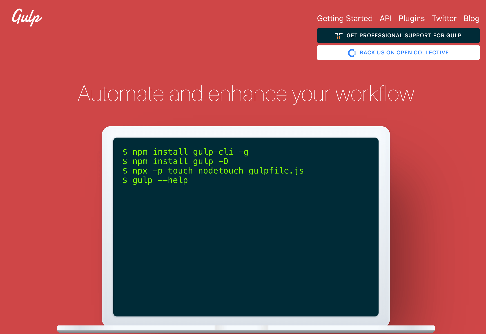
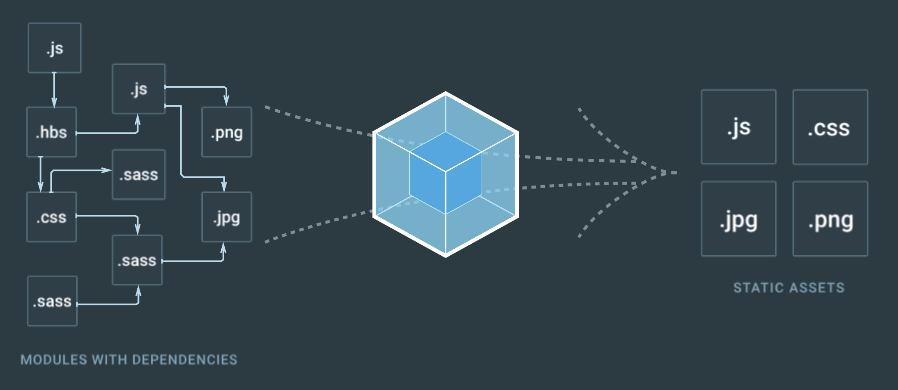

# 常见的构建工具及对比

## 什么是项目构建

构建就是做这件事情，把源代码转换成发布到线上的可执行 `javaScrip`、`CSS`、`HTML` 代码。

- 代码转换：编译项目中的 `js`、`sass`、`less`
- 文件优化：压缩 `js/css/html` 等资源文件（减小文件的大小，减小内存占用）
- 代码分割：提取多个页面的公共代码、提取首屏不需要执行部分的代码让其异步加载。
- 模块合并：在采用模块化的项目里会有很多个模块和文件，需要构建功能把模块分类合并成一个文件。
- 自动刷新：监听本地源代码的变化，自动重新构建、刷新浏览器。
- 代码校验：`js` 语法的检查
- 自动发布：更新完代码后，自动构建出线上发布代码并传输给发布系统。

构建其实是工程化、自动化思想在前端开发中的体现，把一系列流程用代码去实现，让代码自动化地执行这一系列复杂的流程。 构建给前端开发注入了更大的活力，解放了我们的生产力。

&nbsp;

## 构建工具的作用

简化项目构建，自动化完成构建

&nbsp;

## 常用的构建工具

### `Npm Script`

Npm 是在安装 Node.js 时附带的包管理器，Npm Script 则是 Npm 内置的一个功能，允许在 `package.json` 文件里面使用 `scripts` 字段定义任务：

```json
{
  "scripts": {
    "dev": "node dev.js",
    "pub": "node build.js"
  }
}
```

里面的 `scripts` 字段是一个对象，每个属性对应一段 Shell 脚本，以上代码定义了两个任务 `dev` 和 `pub`。

其底层实现原理是通过调用 Shell 去运行脚本命令，例如执行 `npm run pub` 命令等同于执行命令 `node build.js`。

更多配置可参考：[`Npm Script 官网`](https://docs.npmjs.com/misc/scripts)

&nbsp;

### `Grunt`


`Grunt` 和 `Npm Script` 类似，也是一个任务执行者。

#### 例子

```javascript
module.exports = function(grunt) {
  // 所有插件的配置信息
  grunt.initConfig({
    // uglify 插件的配置信息
    uglify: {
      app_task: {
        files: {
          'build/app.min.js': ['lib/index.js', 'lib/test.js']
        }
      }
    },
    // watch 插件的配置信息
    watch: {
      another: {
          files: ['lib/*.js'],
      }
    }
  });

  // 告诉 grunt 我们将使用这些插件
  grunt.loadNpmTasks('grunt-contrib-uglify');
  grunt.loadNpmTasks('grunt-contrib-watch');

  // 告诉grunt当我们在终端中启动 grunt 时需要执行哪些任务
  grunt.registerTask('dev', ['uglify','watch']);
};
```

在项目根目录下执行命令 `grunt dev` 就会启动 JavaScript 文件压缩和自动刷新功能。

&nbsp;

#### Grunt常用插件

* `grunt-contrib-clean` —— 清除文件(打包处理生成的)

* `grunt-contrib-concat` —— 合并多个文件的代码到一个文件中

* `grunt-contrib-uglify` —— 压缩 js 文件

* `grunt-contrib-jshint` —— `javascript` 语法错误检查；

* `grunt-contrib-cssmin` —— 压缩/合并 `css` 文件

* `grunt-contrib-htmlmin` —— 压缩 `html` 文件

* `grunt-contrib-imagemin` —— 压缩图片文件(无损)

* `grunt-contrib-copy` —— 复制文件、文件夹

* `grunt-contrib-requirejs` —— 合并压缩 `requirejs` 管理的所有 `js` 模块文件

* `grunt-contrib-watch` —— 实时监控文件变化、调用相应的任务重新执行

更多配置可参考：[Grunt](https://gruntjs.com/sample-gruntfile)

&nbsp;

### `Gulp`



`Gulp` 是一个基于流的自动化构建工具。 除了可以管理和执行任务，还支持监听文件、读写文件。Gulp 被设计得非常简单。

&nbsp;

#### 特点：

- 任务化
- 基于流（`gulp` 有一个自己的内存，通过指定 `API` 将源文件流到内存中，完成相应的操作后再通过相应的 `API` 流出去）
- 执行任务可以同步可以异步

&nbsp;

#### 一些 `api`

只通过下面5个方法就可以胜任几乎所有构建场景：

- 通过 `gulp.task` 注册一个任务；
- 通过 `gulp.run` 执行任务；
- 通过 `gulp.watch` 监听文件变化；
- 通过 `gulp.src` 读取文件；
- 通过 `gulp.dest` 写文件。

&nbsp;

#### 基本使用

`Gulp` 的最大特点是引入了流的概念，同时提供了一系列常用的插件去处理流，流可以在插件之间传递，大致使用如下：

```javascript
// 引入 Gulp
var gulp = require('gulp'); 
// 引入插件
var jshint = require('gulp-jshint');
var sass = require('gulp-sass');
var concat = require('gulp-concat');
var uglify = require('gulp-uglify');

// 编译 SCSS 任务
gulp.task('sass', function() {
  // 读取文件通过管道喂给插件
  gulp.src('./scss/*.scss')
    // SCSS 插件把 scss 文件编译成 CSS 文件
    .pipe(sass())
    // 输出文件
    .pipe(gulp.dest('./css'));
});

// 合并压缩 JS
gulp.task('scripts', function() {
  gulp.src('./js/*.js')
    .pipe(concat('all.js'))
    .pipe(uglify())
    .pipe(gulp.dest('./dist'));
});

// 监听文件变化
gulp.task('watch', function(){
  // 当 scss 文件被编辑时执行 SCSS 任务
  gulp.watch('./scss/*.scss', ['sass']);
  gulp.watch('./js/*.js', ['scripts']);    
});
```

&nbsp;

#### vs `Grunt`

* 在功能上： `Gulp` 增加了监听文件、读写文件、流式处理的功能。

* 在性能上：`Grunt` 处理过程中会产生多个中间态文件，有多次 `I/O` 操作，效率比较低；而 `Gulp` 只需要一次 `I/O` 操作，中间过程都是文件流在各任务之间流转，效率较高。

&nbsp;

#### 相关插件

- `gulp-concat`：合并文件(`js/css`)
- `gulp-uglify`：压缩 `js` 文件
- `gulp-rename`：文件重命名
- `gulp-less`：编译 `less` 转化 `less` 语法为 `css`
- `gulp-clean-css`：压缩 `css` 文件
- `gulp-livereload`：实时自动编译刷新

&nbsp;

#### 文档与代码

- 文档：[Gulp](http://gulpjs.com/)
- 代码：[示例代码](https://github.com/darrell0904/webpack-study-demo/tree/master/chapter0/build-tools/gulp-demo)

&nbsp;

### `Fis3`


`Fis3` 是一个来自百度的优秀国产构建工具。

`Fis3` 是面向前端的工程构建工具。解决前端工程中性能优化、资源加载（异步、同步、按需、预加载、依赖管理、合并、内嵌）、模块化开发、自动化工具、开发规范、代码部署等问题。

&nbsp;

#### 功能

- 读写文件：通过 `fis.match` 读文件，`release` 配置文件输出路径。
- 资源定位：解析文件之间的依赖关系和文件位置。
- 文件指纹：通过 `useHash` 配置输出文件时给文件 URL 加上 md5 戳来优化浏览器缓存。
- 文件编译：通过 `parser` 配置文件解析器做文件转换，例如把 ES6 编译成 ES5。
- 压缩资源：通过 `optimizer` 配置代码压缩方法。
- 图片合并：通过 `spriter` 配置合并 CSS 里导入的图片到一个文件来减少 HTTP 请求数。

&nbsp;

#### 例子

```javascript
// 加 md5
fis.match('*.{js,css,png}', {
  useHash: true
});

// fis3-parser-typescript 插件把 TypeScript 文件转换成 JavaScript 文件
fis.match('*.ts', {
  parser: fis.plugin('typescript')
});

// 对 CSS 进行雪碧图合并
fis.match('*.css', {
  // 给匹配到的文件分配属性 `useSprite`
  useSprite: true
});

// 压缩 JavaScript
fis.match('*.js', {
  optimizer: fis.plugin('uglify-js')
});

// 压缩 CSS
fis.match('*.css', {
  optimizer: fis.plugin('clean-css')
});

// 压缩图片
fis.match('*.png', {
  optimizer: fis.plugin('png-compressor')
});
```

`Fis3` 的优点是集成了各种 `Web` 开发所需的构建功能，配置简单开箱即用。但是目前官方已经不再更新和维护，不支持最新版本的 `Node.js`。

&nbsp;

#### 文档与代码

- 文档：[Fis3](http://fis.baidu.com/fis3/docs/beginning/intro.html)
- 代码：[示例代码](https://github.com/darrell0904/webpack-study-demo/tree/master/chapter0/build-tools/fis3-demo)

&nbsp;

### `Rollup`


`Rollup` 是一个和 `Webpack` 很类似但专注于 `ES6` 的模块打包工具。

它使用 `tree-shaking` 的技术使打包的结果只包括实际用到的 `exports`。 使用它打包的代码，基本没有冗余的代码，减少了很多的代码体积。

但是 `Rollup` 的这些亮点随后就被 `Webpack` 模仿和实现。

和 `webpack` 之间的区别：

- `Rollup` 是在 `Webpack` 流行后出现的替代品；
- `Rollup` 生态链还不完善，体验不如 `Webpack`；
- `Rollup` 功能不如 `Webpack` 完善，但其配置和使用更加简单；

&nbsp;

#### 文档与代码

* 文档：[rollup](https://rollupjs.org/guide/en/)
* 代码：[示例代码](https://github.com/darrell0904/webpack-study-demo/tree/master/chapter0/build-tools/rollup-demo)

&nbsp;

### `parcel`


`parcel` 相对于 `webpack`，有以下优点：

* 能做到无配置完成以上项目构建要求
* 使用 `worker` 进程去启用多核编译。同时有文件系统缓存，即使在重启构建后也能快速再编译。
* 内置了常见场景的构建方案及其依赖，无需再安装各种依赖；
* 具备开箱即用的对 JS, CSS, HTML, 文件 及更多的支持，而且不需要插件。
* 默认支持模块热替换，真正的开箱即用；

但也会有以下缺点：

- 不支持 `SourceMap`

在开发模式下，`Parcel` 也不会输出 `SourceMap`，目前只能去调试可读性极低的代码；

- 不支持 `tree shaking`

很多时候我们只用到了库中的一个函数，结果 `Parcel` 把整个库都打包了进来，所以会造成打包出来的文件会比较大。

* 使用场景受限

目前 `Parcel` 只能用来构建用于运行在浏览器中的网页，这也是他的出发点和专注点。

* `parcel` 需要为零配置付出代价

零配置的 `Parcel` 关闭了很多配置项，在一些需要的配置的场景下无法改变。比如：无法控制对部分文件的特殊处理，以实现诸如按需加载这样的需求；无法控制输出文件名的Hash值和名称；无法控制构建输出目录结构；等等；

&nbsp;

#### 文档与代码

- 文档：[parcel](https://parceljs.org/)
- 代码：[示例代码](https://github.com/darrell0904/webpack-study-demo/tree/master/chapter0/build-tools/parcel-demo)

&nbsp;

### `webpack`

`webpack` 是一个打包模块化 JavaScript 的工具，在 `Webpack` 里一切文件皆模块，通过 `Loader` 转换文件，通过 `Plugin` 注入钩子，最后输出由多个模块组合成的文件。

其官网的首页图很形象的画出了 `Webpack` 是什么，如下：



一切文件：`JavaScript`、`CSS`、`SCSS`、图片、模板，在 `Webpack` 眼中都是一个个模块，这样的好处是能清晰的描述出各个模块之间的依赖关系，以方便 `Webpack` 对模块进行组合和打包。 经过 `Webpack` 的处理，最终会输出浏览器能使用的静态资源。

`Webpack` 具有很大的灵活性，能配置如何处理文件，大致使用如下：

```javascript
module.exports = {
  // 所有模块的入口，Webpack 从入口开始递归解析出所有依赖的模块
  entry: './app.js',
  output: {
    // 把入口所依赖的所有模块打包成一个文件 bundle.js 输出 
    filename: 'bundle.js'
  }
}
```

`Webpack` 的优点是：

- 专注于处理模块化的项目，能做到开箱即用一步到位；
- 通过 `Plugin` 扩展，完整好用又不失灵活；
- 使用场景不仅限于 `Web` 开发；
- 社区庞大活跃，经常引入紧跟时代发展的新特性，能为大多数场景找到已有的开源扩展；
- 良好的开发体验。

更多配置可参考：[Webpack](https://webpack.js.org/)

&nbsp;

## 一些总结

对于大型项目的打包，笔者还是会选择 `webpack`，因为他的优点 **社区生态丰富**，**配置灵活和插件化扩展**，**官方更新迭代速度快**。

但是对于一些库或者小型项目的打包，笔者还是会选择 `rollup`。

此外 `gulp` 对于一些简单的任务处理，是一个非常不错的选择。 

&nbsp;

那么接下去我们就会开始系统性的来讲一些 `webpack`。

&nbsp;

## 相关链接

* [rollup](https://juejin.im/post/5dab0cc1e51d4524df35b7b4)

&nbsp;

## 示例代码

示例代码可以看这里：

- [构建工具  示例代码](https://github.com/darrell0904/webpack-study-demo/tree/master/chapter0/build-tools)


