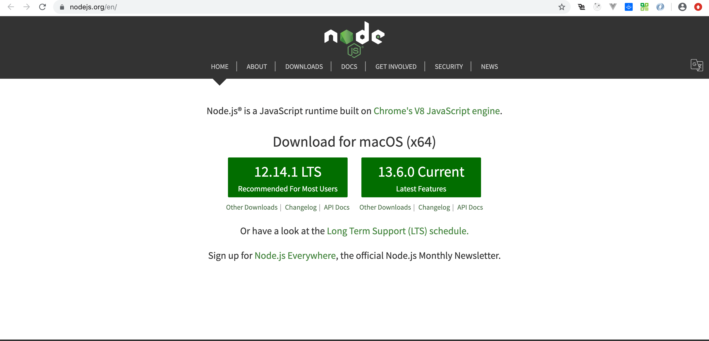
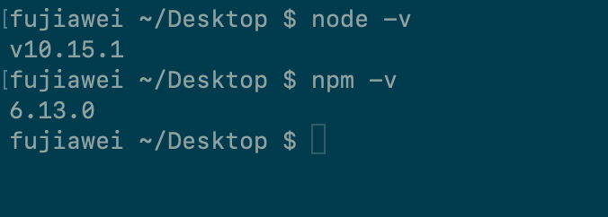
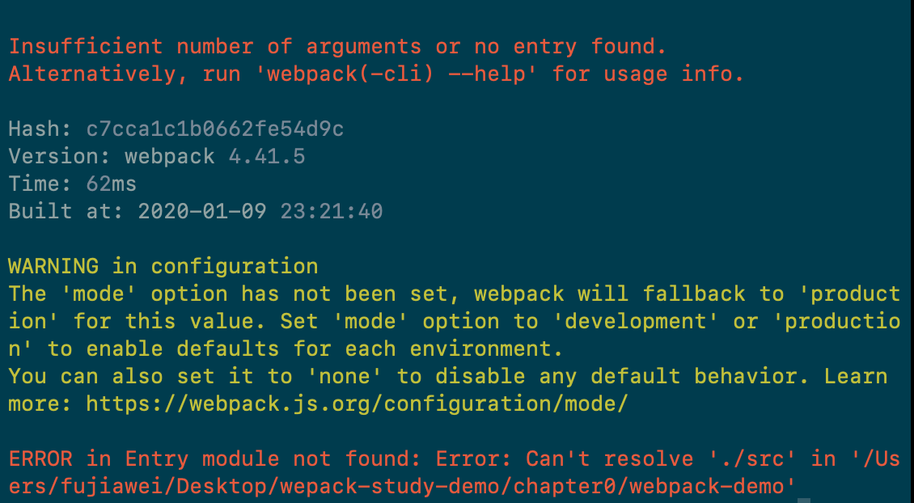
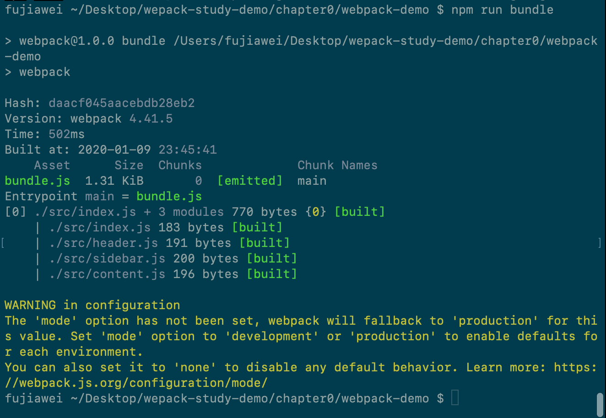
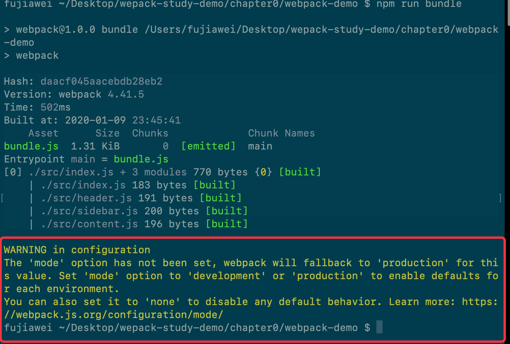
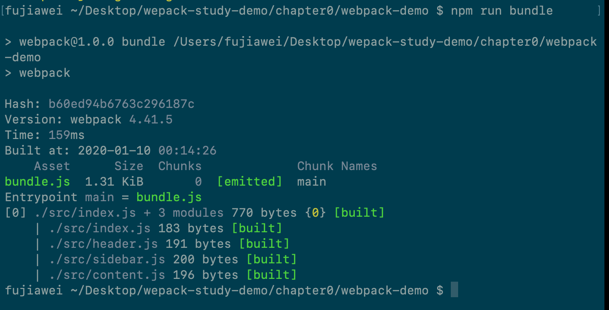
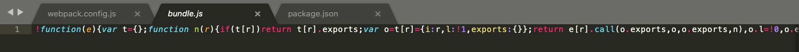
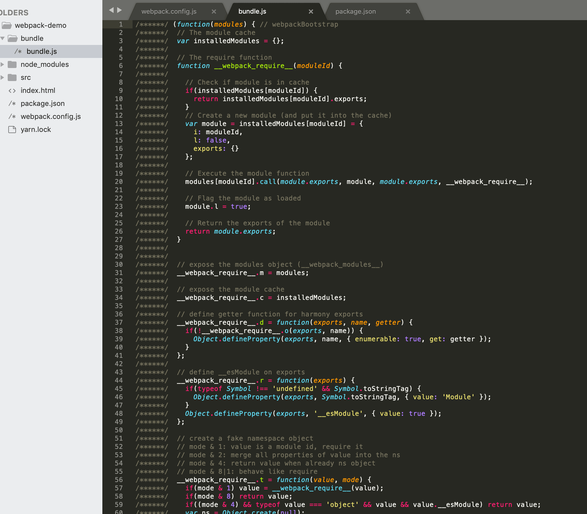

# 安装webpack

## webpack 究竟是什么？

> 官网的定义：*webpack* 是一个现代 JavaScript 应用程序的*静态模块打包器(module bundler)*。当 webpack 处理应用程序时，它会递归地构建一个*依赖关系图(dependency graph)*，其中包含应用程序需要的每个模块，然后将所有这些模块打包成一个或多个 *bundle*。


其实 **webpack** 是一个模块打包工具，

```javascript
import Header from './header.js';
import Content from './header.js';
import Sidebar from './header.js';
```

上面的 `Header`、`Content`、`Sidebar` 就是一个个模块。webpack 的作用就是将这一些模块 根据 入口文件，打包在一起。


我们在之前在前面提到过的 CommonJs、AMD、CMD都能使用 webapck 进行打包。

比如我们将 `chaptor0/webpack` 的引入方式改成 CommonJs 的

```javascript
// index.js

var Header = require('./header.js');
var Content = require('./content.js');
var Sidebar = require('./sidebar.js');

// 各个文件的导出方式改一下

// header.js
module.exports = Header;

// content.js
module.exports = Content;

// sidebar.js
module.exports = Sidebar;
```

然后在目录下运行命令

```javascript
npx webpack index.js
```

打开 index.html

在浏览器上我们依旧能够看到如下图所示：


这个就说明 webpack 能够打包 CommonJs 规范的模块。


此外，Webpack 能不仅仅能打包 js模块，还能打包css、字体文件、图片文件等等各种其他的资源。所以我们便说webpack 是一个 模块打包工具。


&nbsp;

&nbsp;

## 安装 webpack

如何安装webpack?

首先我们要安装 Node 环境，因为webpack 是基于Node开发的模块打包工具。

我们可以进入 [Node.js官网](https://nodejs.org/en/) 下载所需的Node 版本，



我们安装最新版本的稳定版本，也就是 `12.4.1 LTS` 这个版本的 Node.js， 因为新版本的 Node.js 会极大程度的提高webpack的打包速度，webpack 的文档里也说，提升webpack 打包速度的有两个非常重要的点，一个是保持 Node.js 版本尽量的新，一个是保持 webpack 版本尽量的新，高版本的webpack 会利用 Node 新版本中的特性来提高其打包速度。webpack  的作者也提到过，在某些项目中，最新版的webpack 会比 webpack3.0 打包速度 提升 90% 以上。

安装完成之后，在命令行里面输入：

```javascript
node -v // node 的版本号

npm -v // npm 的版本号
```

 如果上面的命令都输出了相应的版本号，那么就说明，你的Node.js环境已经安装好了。



接下来我们在桌面新建一个 `webpack-demo` 文件：

```nginx
mkdir webpack-demo // 创建文件夹

cd webpack-demo // 进入到这个文件夹中
```

然后在这个文件夹下，执行 `npm init` 命令， 这个的作用就是让我们创建一个以 Node 为规范的项目，一路回车之后，会生成一个 `package.json` 文件。

```json
{
  "name": "webpack-demo", // 名字
  "version": "1.0.0", // 项目版本
  "description": "", // 项目描述
  "main": "index.js", // 项目的入口文件
  "scripts": {
    "test": "echo \"Error: no test specified\" && exit 1" // 执行的script
  },
  "author": "", // 作者
  "license": "ISC"
}
```

接下去我们就可以安装webpack 了，webpack 有两种安装方式，一直是安装在全局，一种是安装在项目的依赖里面，我们一个一个来讲。

首先是全局安装

```javascript
npm install webpack webpack-cli -g // -g 代表全局安装

// 输入
webpack -v // 当出现 webpack 的版本号的时候，就说明 webpack 全局安装完成了
```

 但是全局安装有一些问题存在，就是 如果我有几个项目是依赖不同的 webpack 版本的话，那么全局的webpack 就会出现问题，所以我们这里就选择安装在项目的依赖里。

首先我们先卸载全局的 webpack:

```javascript
npm uninstall webpack webpack-cli -g // -g 代表全局安装

// 输入
webpack -v // 没有版本号输出，就说明删除了
```

然后局部安装，先进入 `webpack-demo`，输入：

```javascript
npm install webpack webpack-cli -D // -D 相当于 --save-dev
```

安装完成之后，文件夹中会生成相应的 node_modules 文件夹，这个文件夹就是 项目所需要的依赖。我们输入乳如下命令查看 webpack 的版本：

```javascript
npx webpack -v // 便会输出相应的 webpack 版本号；
```

npx 命令 会帮助我们 自动的在 项目的 node_modules 文件夹下找相应的 webpack 包。

安装在项目中的优点是，项目之间的依赖互不影响。不同的项目，可以使用不同版本的 webpack。


一般在 github 上下载相应的项目，是没有 node_modules 文件夹的，但是有相应的依赖，我们在项目根目录下面执行：

```javascript
npm install // 安装所有的项目所需依赖
```

来完成依赖的安装，然后才可以正常的执行程序。

&nbsp;

## webpack 的配置文件

当webpack 打包文件的时候，我们需要告诉webpack 打包的入口文件、打包后需要放在哪个文件夹下、哪些文件不需要被打包到 js 中去，比如一些图片是不需要被打包到js 中，我们只需要引用这个图片的路径即可。这里我们便需要 wenpack的配置文件来做这些事情，告诉webpack到底该怎么打包。

webpack 的配置文件就是 `webpack.config.js`，我们在 Webpack-demo 文件夹下，新建一个 `webpack.config.js` 文件。

我们直接在目录下面直接执行：

```javascript
npx webpack
```

会发现有一个如下报错



因为我们之前都是这样来运行webpack 的，会指定一个 index.js 文件

```javascript
npx webpack index.js
```

于是我们便可以在 `webpack.config.js` 进行一些配置：

```javascript
const path = require('path');

module.exports = {
  entry: './index.js', 				// 打包的入口文件
  output: { 							// 打包好的文件放在哪个文件夹下
    filename: 'bundle.js',			// 打包出来的文件的名字
    path: path.resolve(__dirname, 'bundle') // 打包完放置文件的文件夹
  }
}
```

重新运行 `npx webpack`，

我们会发现，在文件夹下面，生成了 `bundle` 文件夹，里面有 `bundle.js` 文件。

之前我们没有写 `webpack.config.js` 的时候，也能够正确打包，是因为，webpack4 为了我们开发方便，已经给我们内置了一个默认的配置文件，规定了默认的 入口文件和输出文件

```javascript
const path = require('path');

module.exports = {
  entry: './index.js', 				// 打包的入口文件
  output: './dist/main.js'			// output 文件路径与名称
}
```


当我们想要使用其他名字的配置文件的时候，比如你想使用 `webpackconfig.js` 这个作为你的配置文件，你可以通过下面命令实现：

```javascript
npx webpack --config webpackconfig.js
```


这里我们会发现，每次运行 webpack 都需要 执行 `npx webpack` 来执行，但是使用过 React 或者 Vue 的同学应该知道，我们基本上运行命令 会通过 `npm run ...` 来进行一些操作。我们可以在npm script 来简化我们的代码， `package.json` 加一行代码：

```json
{
  "name": "webpack-demo", // 名字
  "version": "1.0.0", // 项目版本
  "description": "", // 项目描述
  "main": "index.js", // 项目的入口文件
  "scripts": {
    "bundle": "webpack", // 执行命令
  },
  "author": "", // 作者
  "license": "ISC"
}
```

接下来我们就可以在命令行里输入:

```javascript
npm run bundle
```

我们会发现一样可以加载成功，如图：




* 这里我们讲一下 `webpack-cli` 的作用，它的作用就是让我们能够在命令行里面正确的执行 `webpack` 这个命令；如果不安装它的话，我们就不能够 在命令行里面使用 `webpack` 或者 `npx webpack`

&nbsp;

## webpack的打包输出内容

上面我们看到webpack打包成功之后 会输出如下的文件：

```javascript
Hash: daacf045aacebdb28eb2
Version: webpack 4.41.5
Time: 502ms
Built at: 2020-01-09 23:45:41
    Asset      Size  Chunks             Chunk Names
bundle.js  1.31 KiB       0  [emitted]  main
Entrypoint main = bundle.js
[0] ./src/index.js + 3 modules 770 bytes {0} [built]
    | ./src/index.js 183 bytes [built]
    | ./src/header.js 191 bytes [built]
    | ./src/sidebar.js 200 bytes [built]
    | ./src/content.js 196 bytes [built]
```

我们从上往下依次看：

```js
Hash 		// 代表本次打包对应的唯一哈希值
Version 	// 代表本次打包使用的 webpack 的版本值
Time		// 代表打包耗时
Asset		// 代表我们打包出了 bundle.js 文件
Size		// 代表这个文件的大小
Chunks		// 代表自己这个文件对应的 Id 值
Chunk Names	// 代表这个文件的名字
Entrypoint main = bundle.js // 入口文件 为 main

[0] ./src/index.js + 3 modules 770 bytes {0} [built]
    | ./src/index.js 183 bytes [built]
    | ./src/header.js 191 bytes [built]
    | ./src/sidebar.js 200 bytes [built]
    | ./src/content.js 196 bytes [built]	// 这个从入口文件开始，引用了几个文件
```

这里面会引入一个 `chunk` 的概念，**`chunk`表示一个文件**，默认情况下`webpack`的输入是一个入口文件，输出也是一个文件，这个文件就是一个`chunk`，`chunkId` 就是产出时给每个文件一个唯一标识id，`chunkhash` 就是文件内容的 `md5` 值，name 就是在`entry` 中指定的 `key` 值。


我们发现这里面的 Chunk Names 为 main 那么他是哪里来的呢？我们回过头来看看 `webpack.config.js` 的 `entry` 入口：

```js
// entry
...
entry: './src/index.js',
...
```

其实它等价于：

```js
// entry
...
entry: {
  main: './src/index.js'
}
...
```

代表了我们这个入口文件，他有一个名字，叫做 `main`，所以这个 `chunk names`  的 main 就是入口文件的名字。


我们发现打包成功之后的 webpack 给我们报了一个警告：



这个警告是说我们没有给 webpack 指定一个打包的模式，如果我们在配置文件中填上一个模式的话，webpack 就默认了 `mode` 为 `production` 模式，即生产环境样式。我们在配置文件中加上这一行：

```js
// webpack.config.js
...
mode: 'production',
...
```

 这样打包过程中就不会有警告了：



生产环境的打包出来的文件是会被压缩的，如果不想被压缩，我们可以指定 `mode` 为 `development`。在这个情况下面进行打包的话，代码就不会被压缩了，如下图所示：

生产环境：



开发环境：




最后我们修改一下，`index.html` 文件的引入 `js`，

```html
<!DOCTYPE html>
<html lang="en">
<head>
	<meta charset="UTF-8">
	<title>模块化问题例子</title>
</head>
<body>
  <p>网页内容</p>
  <div id='root'></div>
  <script src='./bundle.js'></script>
</body>
</html>
```

在浏览器中打开 `index.html` 文件


&nbsp;

&nbsp;

## 相关链接

&nbsp;

&nbsp;

## 示例代码

示例代码可以看这里：

* [安装 webpack 示例代码](https://github.com/darrell0904/webpack-study-demo/tree/master/chapter0/webpack-demo)