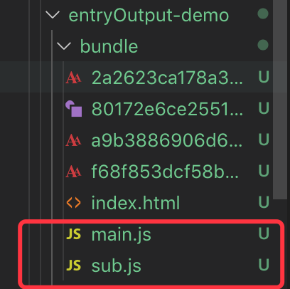
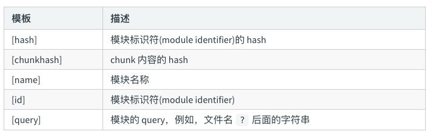
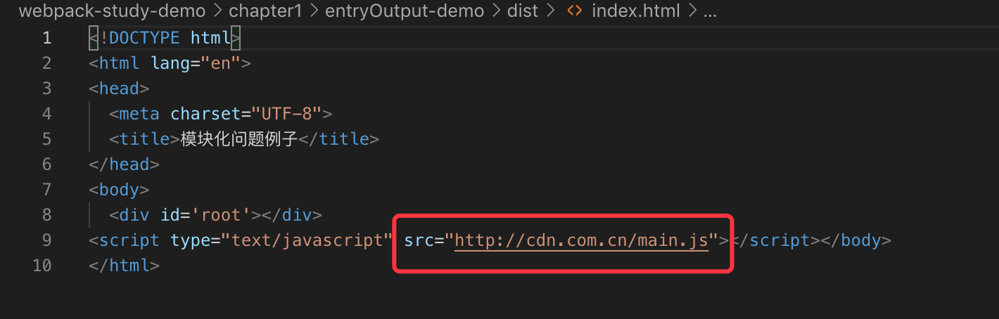

# 配置 entry 和 output

## entry

entry 是 webpack 开始打包的入口文件，从这个入口文件开始，应用程序启动执行。如果传递一个数组，那么数组的每一项都会执行。

`entry` 可以传入一个字符串或者一个字符串数组：

```js
// 字符串
...

entry: './src/index.js',

...

// 字符串数组
...

entry: ['./src/index.js', './src/index2.js'],

...
```

 如果在 output 选项里面没有配置 `filename` 选项名字的话，chunk 会被命名为 `main`，即生成 `main.js`。

其实上面的写法，实际上就是下面的简写：

```js
...

entry: {
    main: '.src/index.js'
}

...
```

打包结果如下图：




`entry` 也可以传入一个对象，并且 output 选项里面没有配置 `filename` 选项名字的话，则每个键(key)会是 chunk 的名称，该值描述了 chunk 的入口起点。

这个其实就是一个多页面的应用程序，每一个入口都是一个独立的页面。

```js
// 对象
...
entry: {
	main: './src/index.js',
	sub: './src/index2.js',
},
...
```

打包出来的结果如下图：


## output

output 的配置必须是一个对象，它指示 webpack 如何去输出、以及在哪里输出你的「bundle、asset 和其他你所打包或使用 webpack 载入的任何内容」。 

输出配置只有这一个，即使有多个入口也是只有这一个。

```js
// 最基础的单页面 output 应用配置
...
output: {
    filename: 'main.js',
	path: path.resolve(__dirname, 'dist')
}
...
```

`filename` 代表输出的文件名；

当项目是多页面应用的项目的时候，需要用 占位符来确保每个文件具有独立的名称。

```js
...
entry: {
    main: './src/index.js',
	sub: './src/index2.js',
},

output: {
	filename: '[name].js',
	path: path.resolve('./dist'),
}
...
```

这个时候在 dist 目录也会生成 main.js 与 sub.js：


filename 还有其他的占位符，如下：



有的时候我们想要把打包出来的资源放在 cdn 上面，比如我想给打包出来的 `main.js` 和 `sub.js` 加上一个 cdn 网址前缀 `http://cdn.com.cn`，我们可以在 output 配置中添加 publicPath 选项即可实现：

```js
...
output: {
    publicPath: 'http://cdn.com.cn',
	filename: 'main.js',
	path: path.resolve(__dirname, 'dist')
}
...
```

我们重新运行一下 `npm run bundle`，我们会发现在打包出来的 index.html 中，引用的 main.js 前加上了相应的前缀：




这一节的内容相对来说比较简单，更多配置大家可以参考官网：

* [entry](https://webpack.js.org/configuration/entry-context/)
* [output](https://webpack.js.org/configuration/output/)

