# 配置 HMR 热更新

## 什么是 HMR

模块热替换（`Hot Module Replacement` 或 `HMR`）是 `webpack` 提供的最有用的功能之一, 它允许在运行时更新各种模块，而无需进行完全刷新。

一般如果我们使用了 `webpack-dev-server`，当我们修改了项目中的文件的时候，一般会重新刷新一下页面，这会导致我们刚刚在页面中操作的东西都被还原。


## 举两个🌰

### `less` 中：

首先我们在修改 `index.js` 文件，下面的 `js` 代码的意思就是页面上插入一个按钮，点这个按钮的时候，生成一个 `<div>item</div>` 元素；

```javascript
import './index.less';
var btn = document.createElement('button');
btn.innerHTML = '新增';
document.body.appendChild(btn);

btn.onclick = function() {
	var div = document.createElement('div');
	div.innerHTML = 'item';
	document.body.appendChild(div);
}
```

&nbsp;

接着修改 `index.less` 文件：用于给偶数的 `item` 加一个背景色。

```less
div:nth-of-type(odd) {
	background: red;
}
```

&nbsp;

然后我们运行 `npm start`，点击 `item` 可以在页面中看到：

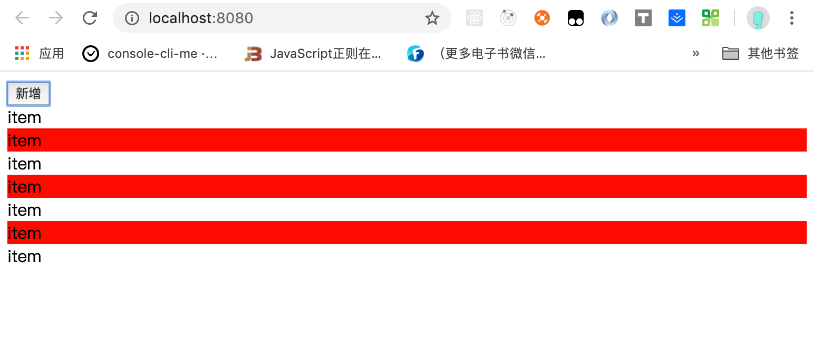

&nbsp;

我们在修改一下 `index.less` 文件，

```less
div:nth-of-type(odd) {
	background: yellow;
}
```

保存后我们会发现，页码被刷新了，重置了之前的红色条纹。当再点击的时候，才会出现 黄色条纹：

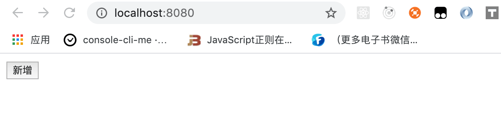

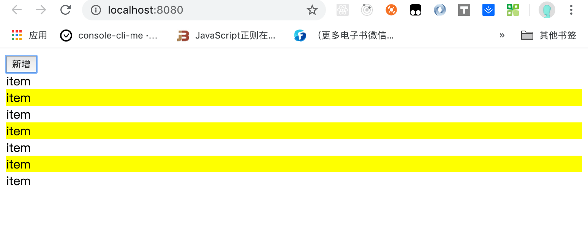


&nbsp;

### `js` 中

我们修改一下 `index.js`，并在 `src` 下新建 `number.js` 和 `counter.js`，当作我们项目的两个模块。

* `index.js` 如下：

```javascript
// import './index.less';
// var btn = document.createElement('button');
// btn.innerHTML = '新增';
// document.body.appendChild(btn);

// btn.onclick = function() {
// 	var div = document.createElement('div');
// 	div.innerHTML = 'item';
// 	document.body.appendChild(div);
// }

import counter from './counter';
import number from './number';

counter();
number();

if(module.hot) {
  module.hot.accept('./number', () => {
    document.body.removeChild(document.getElementById('number'));
    number();
  })
}


```


* `number.js`：新建一个 `div`，并给这个 `div` 赋值 `1000`

```javascript
function number() {
	var div = document.createElement('div');
	div.setAttribute('id', 'number');
	div.innerHTML = 3000;
	document.body.appendChild(div);
}

export default number;
```


* `counter.js`：新建一个 `div`，并给这个 `div` 赋值 `1`，并给这个 `div` 添加一个点击事件，每当点击的时候，自动加一。

```javascript
function counter() {
	var div = document.createElement('div');
	div.setAttribute('id', 'counter');
	div.innerHTML = 1;
	div.onclick = function() {
		div.innerHTML = parseInt(div.innerHTML, 10) + 1
	}
	document.body.appendChild(div);
}

export default counter;
```

&nbsp;

我们重新运行 `npm start`，我们可以看到如下图：

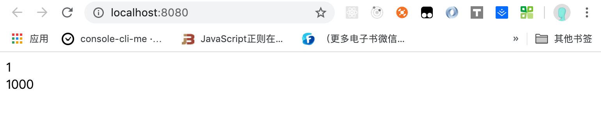


&nbsp;

接着我们点击 `counter.js` 导出的数字，让其变为 `16`，接着我们将 `number.js` 中的 `1000` 改为 `3000`，


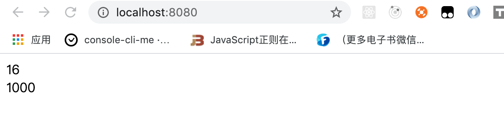

修改之后：

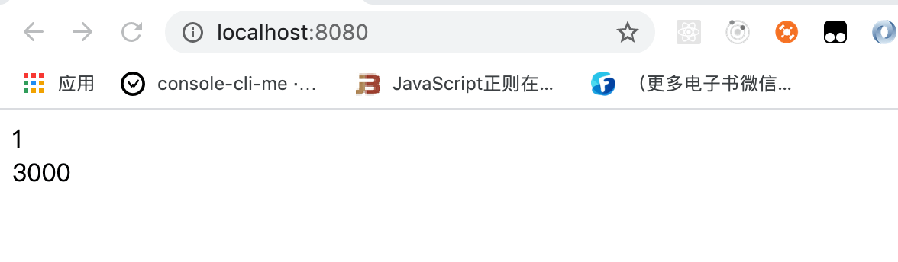

我们会发现上面我们辛苦点的数字又被还原到了 `1`。

&nbsp;

要解决上面两个问题，我们就需要使用 `HMR` 了。


## 配置

我们修改 `webpack.congig.js` 配置文件：

```javascript
const webpack = require('webpack');

...

module.exports = {
  ...
  devServer: {
		contentBase: './dist',
		open: true,
		port: 8080,
		hot: true,
		hotOnly: true
	},
  ...
  plugins: [
		...
		new webpack.HotModuleReplacementPlugin()
	],
  ...
}
```

修改完后，我们重启一下服务：`npm start`

&nbsp;

### 再看 `less`：

我们先点几下新增，如下图所示：

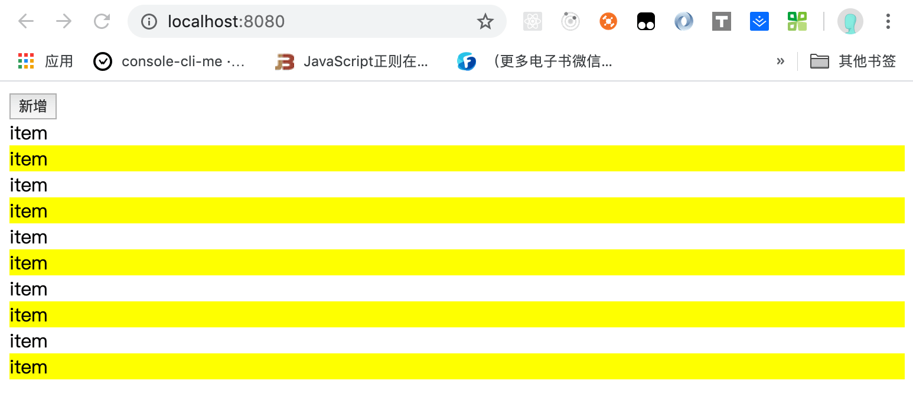

接着我们将 `less` 中 `yellow` 改为 `#4caf50`，保存后回到页面：

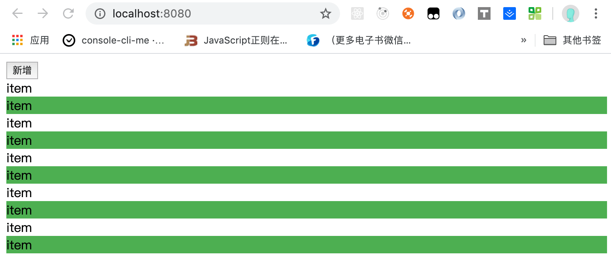

之前我们新增的 `item` 还在，而且颜色变成了我们修改后的样子。

&nbsp;

`less` 热更新成功


### 再看 `js`：

我们先点几下 `counter.js` 里面的数字，如下图所示：

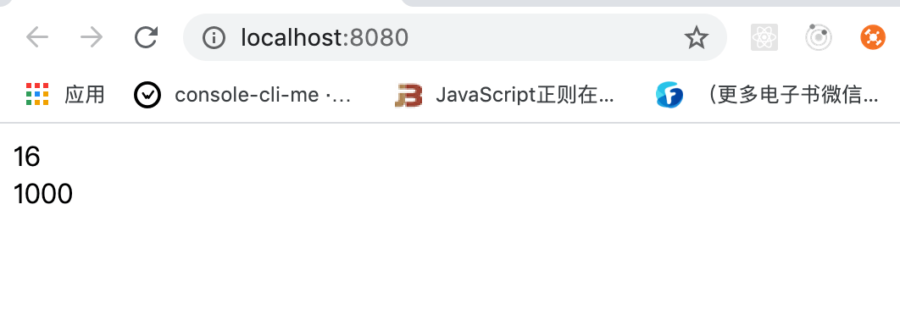

接着我们将 `number.js` 中的数字 `1000` 改为 `6000`，保存后回到页面：

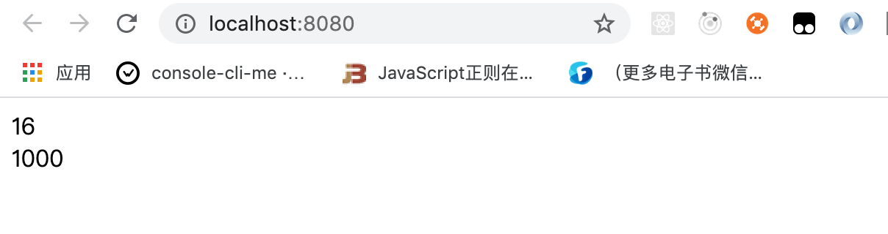

之前我们新增的 `16` 还在，但是数字没有变成 `6000`：

&nbsp;

这是因为我们还需要再 `index.js` 代码中加上一行代码：

```javascript
if(module.hot) {
	module.hot.accept('./number', () => {
		document.body.removeChild(document.getElementById('number'));
		number();
	})
}
```

上面的的代码意思就是 如果我们开启了热更新，并且我们发现 `number.js` 有变动的话，我们就重新的把原来的 `number.js` 创建的 `<div>` 删除，并重新运行一下 `number.js`

&nbsp;

重新起一下服务，在按照上面的步骤操作一下，我们发现新增的 `16` 还在，数字也改成了 `6000`：

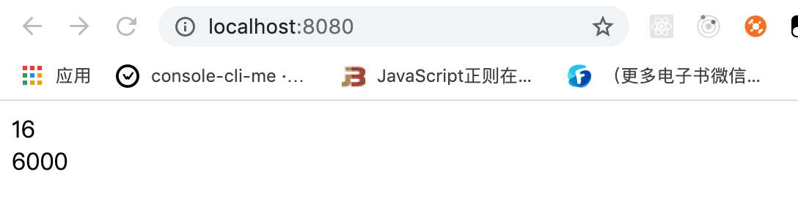

&nbsp;

那么为什么我们在打包 `less` 的时候就不需要写着一行代码呢，其实是因为 `css-loader` 默认已经帮我们做了这一件事情了，其中我们经常使用 `React`、`vue` 框架他们的底层已经帮我们做好了这些事情，所以我们在代码上面基本上没有看到过类似上面的代码。

&nbsp; 

至此， `js` 热更新成功。


## 实现原理


## 相关链接

* [HMR 使用](https://webpack.js.org/concepts/hot-module-replacement/)
* [HMR 相关API](https://webpack.js.org/api/hot-module-replacement/)


## 示例代码

示例代码可以看这里：

* [HMR 示例代码]()