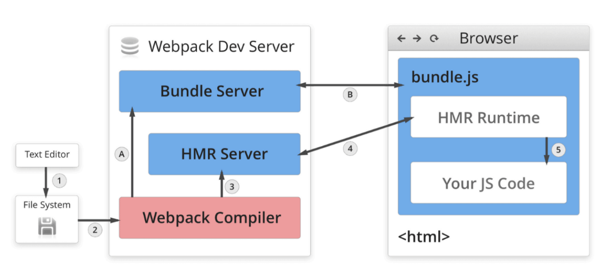
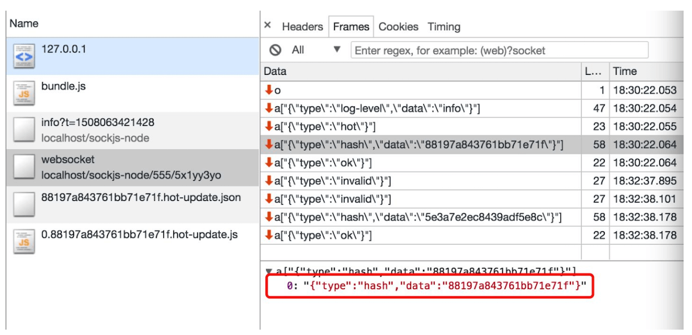
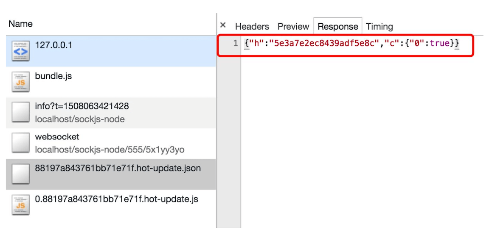
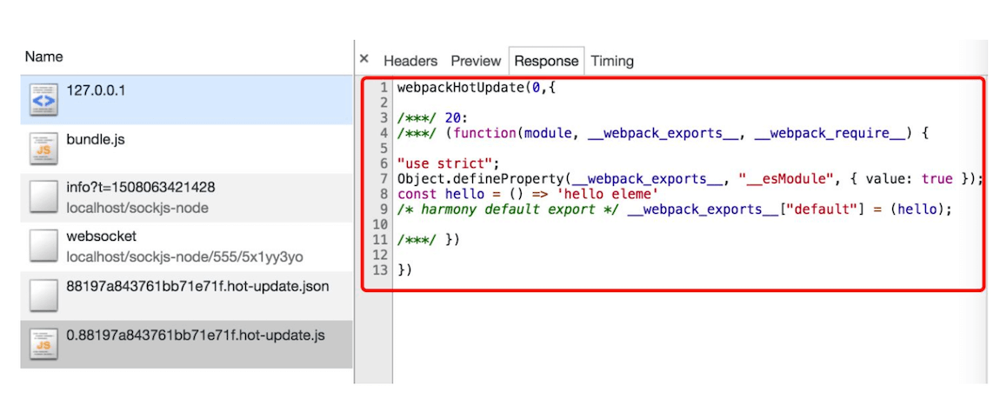

# 配置 HMR 热更新

## 什么是 HMR

模块热替换（`Hot Module Replacement` 或 `HMR`）是 `webpack` 提供的最有用的功能之一, 它允许在运行时更新各种模块，而无需进行完全刷新。

一般如果我们使用了 `webpack-dev-server`，当我们修改了项目中的文件的时候，一般会重新刷新一下页面，这会导致我们刚刚在页面中操作的东西都被还原。

&nbsp;

## 举两个🌰

### `less` 中：

首先我们在修改 `index.js` 文件，下面的 `js` 代码的意思就是页面上插入一个按钮，点这个按钮的时候，生成一个 `<div>item</div>` 元素；

```javascript
import './index.less';
var btn = document.createElement('button');
btn.innerHTML = '新增';
document.body.appendChild(btn);

btn.onclick = function() {
  var div = document.createElement('div');
  div.innerHTML = 'item';
  document.body.appendChild(div);
}
```

&nbsp;

接着修改 `index.less` 文件：用于给偶数的 `item` 加一个背景色。

```less
div:nth-of-type(odd) {
  background: red;
}
```

&nbsp;

然后我们运行 `npm start`，点击 `item` 可以在页面中看到：


&nbsp;

我们在修改一下 `index.less` 文件，

```less
div:nth-of-type(odd) {
  background: yellow;
}
```

保存后我们会发现，页码被刷新了，重置了之前的红色条纹。当再点击的时候，才会出现 黄色条纹：


&nbsp;

### `js` 中

我们修改一下 `index.js`，并在 `src` 下新建 `number.js` 和 `counter.js`，当作我们项目的两个模块。

* `index.js` 如下：

```javascript
// import './index.less';
// var btn = document.createElement('button');
// btn.innerHTML = '新增';
// document.body.appendChild(btn);

// btn.onclick = function() {
// 	var div = document.createElement('div');
// 	div.innerHTML = 'item';
// 	document.body.appendChild(div);
// }

import counter from './counter';
import number from './number';

counter();
number();

if(module.hot) {
  module.hot.accept('./number', () => {
    document.body.removeChild(document.getElementById('number'));
    number();
  })
}


```


* `number.js`：新建一个 `div`，并给这个 `div` 赋值 `1000`

```javascript
function number() {
  var div = document.createElement('div');
  div.setAttribute('id', 'number');
  div.innerHTML = 3000;
  document.body.appendChild(div);
}

export default number;
```


* `counter.js`：新建一个 `div`，并给这个 `div` 赋值 `1`，并给这个 `div` 添加一个点击事件，每当点击的时候，自动加一。

```javascript
function counter() {
  var div = document.createElement('div');
  div.setAttribute('id', 'counter');
  div.innerHTML = 1;
  div.onclick = function() {
    div.innerHTML = parseInt(div.innerHTML, 10) + 1
  }
  document.body.appendChild(div);
}

export default counter;
```

&nbsp;

我们重新运行 `npm start`，我们可以看到如下图：


&nbsp;

接着我们点击 `counter.js` 导出的数字，让其变为 `16`，接着我们将 `number.js` 中的 `1000` 改为 `3000`，


修改之后：


我们会发现上面我们辛苦点的数字又被还原到了 `1`。

&nbsp;

要解决上面两个问题，我们就需要使用 `HMR` 了。

&nbsp;

## 配置

我们修改 `webpack.congig.js` 配置文件：

```javascript
const webpack = require('webpack');

...

module.exports = {
  ...
  devServer: {
    contentBase: './dist',
    open: true,
    port: 8080,
    hot: true,
    hotOnly: true
  },
  ...
  plugins: [
    ...
    new webpack.HotModuleReplacementPlugin()
  ],
  ...
}
```

修改完后，我们重启一下服务：`npm start`

&nbsp;

### 再看 `less`：

我们先点几下新增，如下图所示：


接着我们将 `less` 中 `yellow` 改为 `#4caf50`，保存后回到页面：


之前我们新增的 `item` 还在，而且颜色变成了我们修改后的样子。

&nbsp;

`less` 热更新成功


### 再看 `js`：

我们先点几下 `counter.js` 里面的数字，如下图所示：


接着我们将 `number.js` 中的数字 `1000` 改为 `6000`，保存后回到页面：


之前我们新增的 `16` 还在，但是数字没有变成 `6000`：

&nbsp;

这是因为我们还需要再 `index.js` 代码中加上一行代码：

```javascript
if(module.hot) {
  module.hot.accept('./number', () => {
    document.body.removeChild(document.getElementById('number'));
    number();
  })
}
```

上面的的代码意思就是 如果我们开启了热更新，并且我们发现 `number.js` 有变动的话，我们就重新的把原来的 `number.js` 创建的 `<div>` 删除，并重新运行一下 `number.js`

&nbsp;

重新起一下服务，在按照上面的步骤操作一下，我们发现新增的 `16` 还在，数字也改成了 `6000`：


&nbsp;

那么为什么我们在打包 `less` 的时候就不需要写着一行代码呢，其实是因为 `css-loader` 默认已经帮我们做了这一件事情了，其中我们经常使用 `React`、`vue` 框架他们的底层已经帮我们做好了这些事情，所以我们在代码上面基本上没有看到过类似上面的代码。

&nbsp; 

至此， `js` 热更新成功。

&nbsp;

## 实现原理

来看一张图，如下：



先来讲几个概念：

* `File System`

代表我们的文件系统，里面有我们的所有代码文件

* `Webpack Compile`

`Webpack` 的编译器，将 `JS` 编译成 `Bundle` 

* `HMR Server`

将热更新的文件输出给 `HMR Rumtime`

* `Bundle server`

提供文件在浏览器器的访问

* `HMR Rumtime`

客户端 `HMR` 的中枢，用来更新文件的变化，与 `HMR server` 通过 `websocket` 保持长链接，由此传输热更新的文件

* `bundle.js`

代表构建出来的文件

&nbsp;

### 大致流程

分为两个流程，一个是文件系统的文件通过 `webpack` 的编译器进行编译，接着被放到 `Bundle Server` 服务器上，也就是 `1 -> 2 -> A -> B` 的流程；

第二个流程是，当文件系统发生改变的时候，`Webpack` 会重新编译，将更新后的代码发送给了 `HMR Server`，接着便通知给了 `HMR Runtime`，一般来说热更新的文件或者说是 `module` 是以 `json` 的形式传输给 浏览器的 `HMR Runtime` 的，最终 `HMR Runtime` 就会更新我们前端的代码。

要注意的几个点：

* `webpack-dev-server` 是将打包的代码放到内存之中，不是在 `output` 指定的目录之下，这样能使 `webpack` 速度更快。
* `webpack-dev-server` 底层是基于 [`webpack-dev-middleware`](https://github.com/webpack/webpack-dev-middleware) 这个库的，他能调用 `webpack` 相关的 `Api` 对代码变化进行监控，并且告诉 `webpack`，将代码打包到内存中。
* `Websocket  ` 不会将更新好的代码直接发给服务器端，而是发一个更新模块的哈希值，真正处理这个 `hash` 的还是 `webpack`。



* 浏览器端 `HMR.runtime ` 会根据最新的 `hash` 值，向服务器端拿到所有要更新的模块的 `hash` 值，接着再通过一个 `jsonp` 请求来获取这些 `hash` 对应的最新模块代码。





* 浏览器端拿到最新的更新代码后，如我们在配置文件中配置的一样，是根据 `HotModuleReplacementPlugin` 对新旧模块进行对比，决定是否更新模块，在决定更新模块后，检查模块之间的依赖关系，更新模块的同时更新模块间的依赖引用。
* 当模块的热替换过程中，如果替换模块失败，就会会推倒 `live reload` 操作，也就是进行浏览器刷新来获取最新打包代码。

更加详细的解读大家可以参考 [Webpack HMR 原理解析](https://zhuanlan.zhihu.com/p/30669007)，写的巨详细。大家有兴趣也可以看看源码，不必太深入，有一个大致了解即可。

之后有时间笔者也会专门针对这个原理写一篇文章。

&nbsp;

## 相关链接

* [HMR 使用](https://webpack.js.org/concepts/hot-module-replacement/)
* [HMR 相关API](https://webpack.js.org/api/hot-module-replacement/)
* [Webpack HMR 原理解析](https://zhuanlan.zhihu.com/p/30669007)
* [Webpack 热更新实现原理分析](https://zhuanlan.zhihu.com/p/30623057)
* [使用服务器发送事件](https://developer.mozilla.org/zh-CN/docs/Server-sent_events/Using_server-sent_events)
* [webpack-dev-server 仓库](https://github.com/webpack/webpack-dev-server)
* [webpack 仓库](https://github.com/webpack/webpack/tree/master/hot)
* [webpack 热更新相关代码](https://github.com/webpack/webpack/tree/master/lib/hmr)

&nbsp;

## 示例代码

示例代码可以看这里：

* [HMR 示例代码](https://github.com/darrell0904/webpack-study-demo/tree/master/chapter1/HMR-demo)