# 配置 Loader

`webpack` 开箱即用只支持 `JS` 和 `JSON` 两种文件类型，需要通过 `Loaders` 去支持其它文 件类型并且把它们转化成有效的模块，并且可以添加到依赖图中。

 `Loaders` 本身是一个函数，接受源文件作为参数，返回转换的结果。

&nbsp;

## 从打包图片说起

我们前面说过 `webpack` 可以打包除了 `js` 意外的其他文件，比如 图片文件，`css`文件等，那么我们就来试一下，我们在上节课的代码中  `src` 目录下面加上 一张图片 `webpack.png`，然后在 `index.js` 中引入：

```js
import webpackSrc from './webpack.png';
```

然后运行 `npm run bundle`。发现打包出错了，如下图：

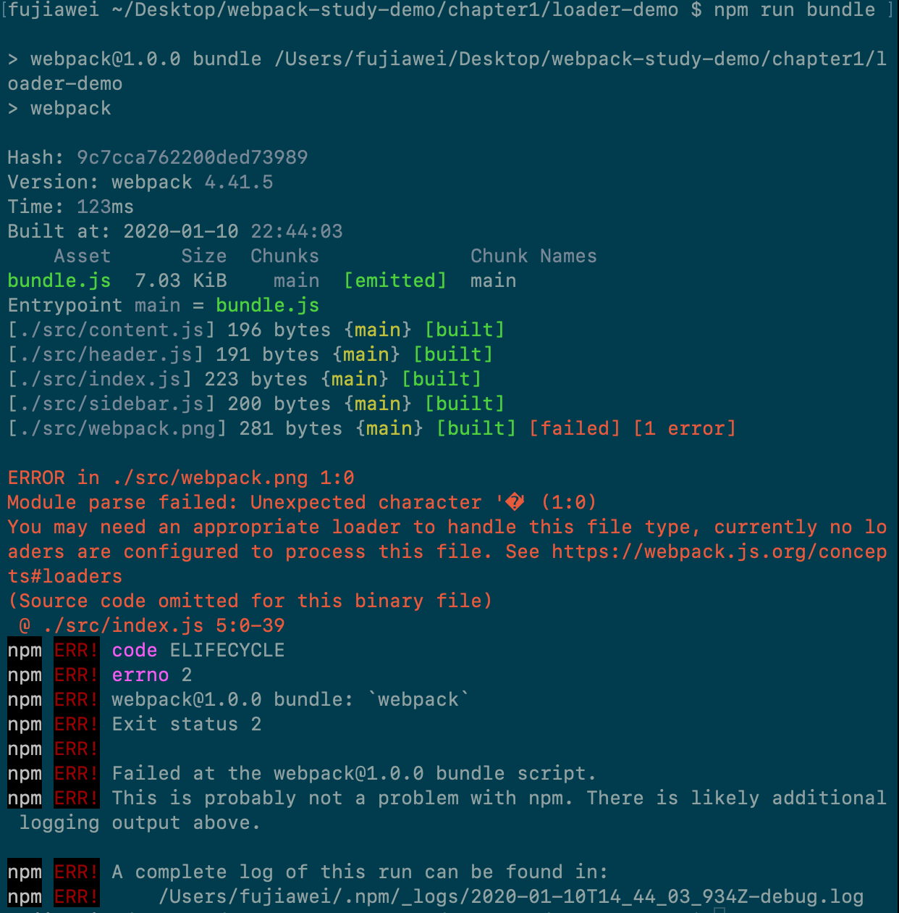

为什么会出现这个问题，是因为 `webpack` 默认是知道怎么打包 `js` 文件的，但是碰到其他类型的文件的时候，webpack 就不知道怎么进行打包了，因此我们需要在配置文件里面告诉 `webpack` 对于此类文件 **模块** 需要怎么进行打包。

于是我们在 `webpack.config.js` 中进行如下配置，添加一个 `module` 配置项：

```js
const path = require('path');

module.exports = {
  mode: 'development',
  entry: './src/index.js',
  module: {
    rules: [{
      test: /\.png$/,
      use: {
        loader: 'file-loader',
      }
    }]
  },
  output: {
    filename: 'bundle.js',
    path: path.resolve(__dirname, 'bundle')
  }
}
```

我们写了一个规则，就是说，当我们遇到 `png` 结尾的图片文件的时候，就使用 `file-loader` 来帮助我们进行打包这个文件模块。这里我们用到了 `file-loader` ，所以我们需要安装一下这个依赖：

```js
npm install file-loader -D
```

安装完依赖之后，我们重新运行 `npm run bundle` 这个命令，我们打包出了两个文件，一个是 `bundle.js` 文件，一个是 哈希值为名字的图片文件：

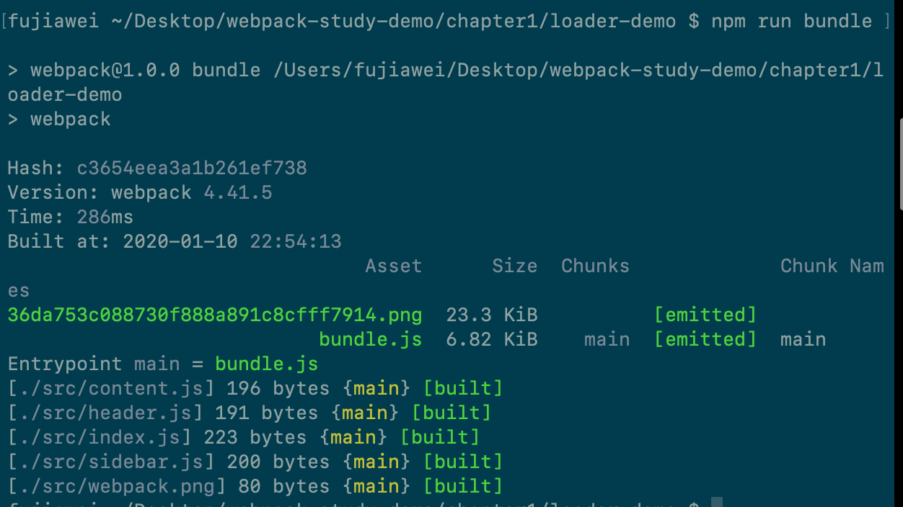


在上面我们 将这个 图片 `import` 进来了，但是我们不知道这是一个什么东西，我们就把它打印出来看一波：

```js
import webpackSrc from './webpack.png';

console.log(webpackSrc);
```

我们重新进行一次打包，并且在打包完成之后，将 `index.html` 在浏览器上打开，我们会发现`webpackSrc` 的值就是我们刚刚打包生成的图片的文件名:

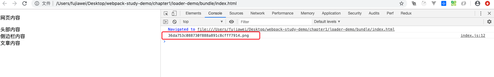


我们来分析一下 `webpack` 打包的流程，最开始我们通过运行 `npm run bundle`，开始打包，因为本身 `webpack` 是知道怎么打包 `js` 的，所以它就一直打包打包，但当他遇到了 图片文件的时候，他就不知道怎们进行打包了，它就到配置文件的 `module` 选项中去找相应的规则。在配置文件中我们规定了当 `webpack` 遇到 图片文件的时候，就使用 `file-loader` 来帮我们进行打包文件。

其实 `file-loader` 的底层原理其实就是，当它发现有图片文件的时候，它就帮图片文件自动打包移动到 `bundle` 这个文件夹下，同时会给这个图片给一个名字，现在是一个一长串哈希值作为名字，后买呢我们会讲如何给他改名，然后它会讲这个图片名称作为一个返回值返回给我们引入模块的变量之中。

`file-loader` 不能仅仅能打包图片文件，还能打包其他类型的文件，比如字体文件、`txt`、`Excel` 文件等，只要你想讲某个文件返回到某一个目录，并且返回这个文件名的时候，file-loader 都可以做到。

&nbsp;

## loader 是什么？

通过上面这个例子，我们来思考一下，`loader` 究竟是什么东西？

其实loader 就是一个方案规则，他知道对于某一个特定的文件，`webpack` 该怎么去进行打包，因为本身，webpak 自己是不知道怎么去打包的，所以需要去使用 loader 来打包文件。


我们再举一个例子，可能有些朋友写过 `vue`，在 `vue` 中，文件是以 `.vue` 文件结尾的文件，`webpack` 是不认识 `.vue` 文件的，所以需要安装一个 打包 `vue-loader` 来帮助 webpack 打包 vue 文件。

&nbsp;

## 如何配置loader

最开始，我们举了一个 `file-loader` 的例子来说明 `loader` 的作用，现在我们来看看如何配置 `loader`。

首先我们在 配置文件中加入 `module` 这个配置项，它是一个对象，在这个对象里面配置相应的处理模块的规则。

在 `module` 的选项里 有一个 `rules` 数组，`rules` 就是配置模块的读取和解析规则，通常就是用来配置 loader。数组里面的每一项都描述了如何处理对应的文件，配置一项 rules 时大致可以通过一项方式来完成：

* 条件匹配：通过 `test`、`include`、`exclude` 三个配置来选中 `Loader` 要应用的规则的文件
* 应用规则：对选中的文件，通过 use 配置项来应用`loader`，可以只应用一个`loader` 或者按照从后往前的顺序来应用一组 `loader`，同时我们可以分别向 `loader` 传入相应的参数。
* 重置 `loader` 的执行顺序：因为一组 `loader` 的执行顺序默认是从右到左执行的，通过 `enforce` 选项可以将一期中一个 `loader` 的执行顺序放到最前或者最后。

**举个🌰：**

```js
module: {
  rules: [
    {
      // 命中 js 文件
      test: /\.js$/,
      // 使用 babel-loader 来解析 js 文件
      use: ['babel-loader'],
      // 只命中 src 目录下的 js 文件，加快 webpack 的加载速度
      include: path.resolve(__dirname, 'src')
    },
    {
      // 命中 less 文件
      test: /\.less$/,
      // 从右到左依次使用 less-loader、css-loader、style-loader
      use: ['style-loader', 'css-loader', 'less-loader'],
      // 排除 node_modules 下面的 less 文件
      exclude: path.resolve(__dirname, 'node_modules')
    },
    {
      // 命中字体、图片文件
      test: /\.(gif|png|jpe?g|eot|woff|ttf|svg|pdf)$/,
      // 采用 file-loader 加载，并给 file-loader 传入
      // 相应的配置参数，通过 placeholders 指定 输出的名字
      use: {
        loader: 'file-loader',
        options: {
          name: '[name].[ext]',
        }
      },
    }
  ]
}
```

&nbsp;

## 常用的 `loader` 及其用法

### 打包静态资源（图片等）：`file-loader`、`url-loader`

在最开始的一节我们有讲过这个 `file-loader`, 但是我们发现通过 `file-loader` 打包出来的图片文件名，是一个哈希值，如果我们想要打包出来的图片要和原来的图片名字一样，这个我们就需要，往 `file-loader` 传入一下参数了我们往 `loader` 里面传入一些参数，如下图所示：

```js
rules: [{
  test: /\.png$/,
  use: {
    loader: 'file-loader',
    options: {
      name: '[name].[ext]'
    }
  }
}]
```

我们在进行一次打包，我们会发现我们打包出来的文件 变成了 `webpack.png` 了。上面代码中 `[name].[ext]` 其实在 `file-loader` 里面被称为 `placeholders` 占位符，通过官网我们可以看到 `file-loader` 有如下这么 占位符：

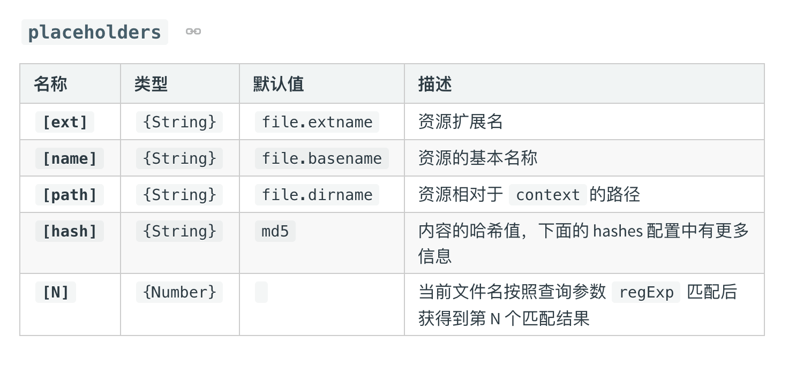

我们可以在试一下，在 `name` 后加上一个 哈希值，我们可以这么写：

```js
rules: [{
  test: /\.png$/,
  use: {
    loader: 'file-loader',
    options: {
      name: '[name]_[hash].[ext]'
    }
  }
}]
```

这样我们就能够看到 打包出来的图片 后面 跟上了一串哈希值；

有的时候，我们还有一个需求，就是想把图片打包到具体的一个文件夹中，我们可以进行如下配置：

```js
rules: [{
  test: /\.png$/,
  use: {
    loader: 'file-loader',
    options: {
      name: '[name]_[hash].[ext]',
      outputPath: 'images/',
    }
  }
}]
```

这样我们就可以看到打包出来了的图片文件 被放到了 `/images` 文件夹下。

其实 `file-loader` 的配置参数还有很多，我只是讲了其中的几个，具体其他的 参数值，大家可以在用到的时候自行去官网查询。

与 `file-loader` 比较相似的，有一个 `url-loader`，它也可以实现 所有的 `file-loader` 的所有功能，我们安装一下` url-loader`：

```js
npm install url-loader -D
```

 然后修改一下 `webpack` 的配置文件：

```js
module: {
  rules: [{
    test: /\.png$/,
    use: {
      loader: 'url-loader',
      options: {
        name: '[name]_[hash].[ext]',
        outputPath: 'images/',
      }
    }
  }]
},
```

我们 重新运行 `npm run bundle`，我们会发现，如片没有被打包到 `bundle` 的文件夹中，我们试着去访问一下`index.html`, 但是 `index.html` 会出现图片。

其实问题就出在 `url-loader` 已经把图片 转换成了 `base64` 格式并打包到了 `bundle.js` 中去了，我们可以看一下代码：

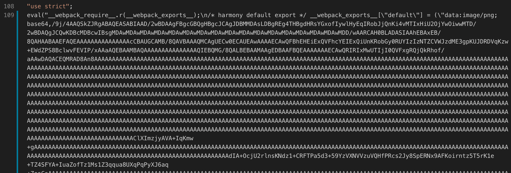

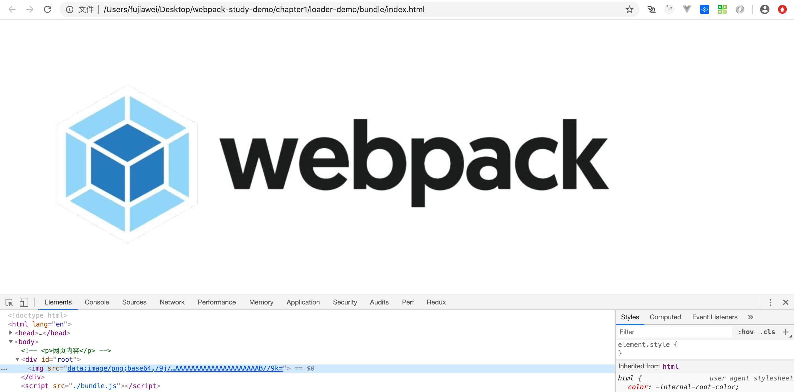

这样就会有问题出来，当我们的图片特别大的时候，打包出来的 `js` 就会特别大，加载这个`js` 文件的时间就会变长，页面会有一段时间的白屏，解决这个问题也很简单，我们可以再加一个 `limit` 配置参数：

```js
module: {
  rules: [{
    test: /\.png$/,
    use: {
      loader: 'url-loader',
      options: {
        name: '[name]_[hash].[ext]',
        outputPath: 'images/',
        limit: 10240,
      }
    }
  }]
},
```

这个配置参数的意思就是，当图片的大小 大于 `limit` 的时候， `url-loader` 就会跟 `file-loader` 一样，把图片打包到 `images` 文件夹下；当图片的大小 小于 `limit` 的时候，`url-loader` 会直接将图片转化成 `base64` 的格式打包到`js` 中，减少网络请求。

好，这两个loader 我们就先讲到这里，具体其他的参数大家可以参考官网：

* [url-loader](https://webpack.js.org/loaders/url-loader/)
* [file-loader](https://webpack.js.org/loaders/file-loader/)

&nbsp;

### 打包样式文件（样式篇）

打包样式我们会用到一下这些 `loaders`：`style-loader`、`css-loader`、`less-loader/sass-loader`、`postcss-loader`。

接下来我们一个一个讲：

加入我们想要将图片样式进行一下调整，于是我们就可以写一个样式文件 `index.css`：

```css
.avatar {
  width: 500px;
  margin-left: 500px;
}
```

接着我们给 `img` 添加 `avatar` 这个类名，并引入`index.css`：

```js
// ES Moudule 模块引入方式
import webpackSrc from './webpack.png';
import './index.css';

var img = new Image();
img.src = webpackSrc;
img.classList.add('avatar'); // 添加类名

var dom = document.getElementById('root');
dom.append(img);
```

因为 `webpack` 不知道 `css` 类型的文件怎么进行打包，所以我们需要安装相应的 `loader`，一般解析 `css` 我们需要安装 `style-loader` 和 `css-loader` :

```js
npm install style-loader css-loader -D
```

然后修改相应的 `webpack` 配置文件，往 `rules` 添加一条匹配规则 ：

```js
{
	test: /\.css$/,
	use: ['style-loader', 'css-loader']
}
```

我们重新运行 `npm run bundle`，我们可以看到，打包出来的图片上加上了相应的 类名：

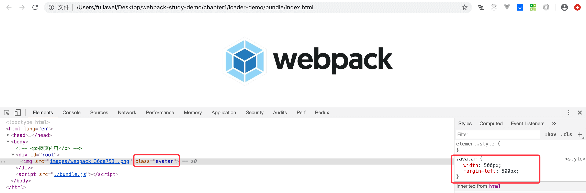

我们回过头来看看 `style-loader` 和 `css-loader` 的作用，`css-loader` 的作用就是帮我们分析出几个 `css` 文件之间的关系，并最终把这些 `css` 文件合并成一段 `css`，`style-loader` 的作用就是，在得到 `css` 生成的内容之后，把这段内容挂载到页面的 head 部分。所以在处理 `css` 文件的时候，我们一般需要 `style-loader` 与 `css-loader` 配合使用。

有时我们想要在项目中使用 `less`，来帮助我们更好的写 `css`，我们修改 `index.css` 后缀 `index.less`：

```less
// index.less
body {
  .avatar {
    width: 500px;
    margin-left: 500px;
  }
}
```

这个时候我们就需要安装相应的 `less-loader` 来帮助我们处理相应的 `less` 文件，我们安装一下依赖：

```js
npm install less-loader less -D
```

然后修改一下 配置文件：

```js
{
	test: /\.less$/,
	use: ['style-loader', 'css-loader', 'less-loader']
}
```

接着我们运行 `npm run bundle`，发现页面正确的输出了图片，还带上了样式。

这里我们还要继续强调一下，`loader` 的执行顺序是 从下到上，从右到左 的顺序执行的。


有的时候我们还会遇到一些问题，就是我们会在 `less` 文件里面使用一些最新的 `css3` 的属性，一般我们需要在这个属性上加上相应的浏览器的厂商前缀，如`-webkit`、`-ms`、`-moz` 等，我们在代码里加上：

```less
body {
  .avatar {
    width: 500px;
    margin-left: 500px;
    transform: scale(0.8);
  }
}
```

就是我们想要把这张图片缩放到原来的 `0.8` 倍，我们重新打包一下，我们可以看到这个 `transform` 没有带上相应的前缀：

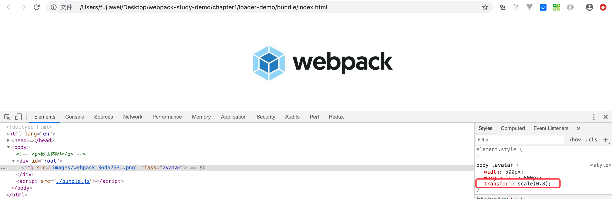

这个时候我们就需要`postcss-loader`，首先我们安装一下 `postcss-loader` 和 `autoprefixer`，同时在项目的根目录下创建 `postcss.config.js`，和 `webpack.config.js` 类似，用来 配置 `postcss`：

```js
npm install postcss-loader autoprefixer -D
```

我们修改一下 `postcss.config.js`:

```js
module.exports = {
  plugins: [
    require('autoprefixer')
  ]
}
```

同时我们修改 `webpack` 的配置文件：

```js
{
	test: /\.less$/,
	use: [
    'style-loader',
    'css-loader',
    'less-loader',
    'postcss-loader',
  ]
}
```

打开浏览器，我们会发现 `transform` 被加上了 浏览器的厂商前缀。

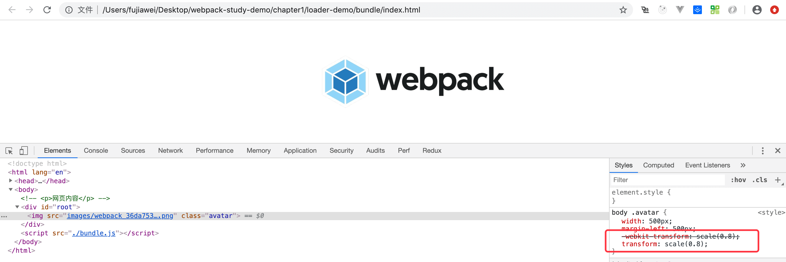

在这里我们来分析一下整个过程，当 `webpack` 开始加载 `index.less` 文件的时候，它会遵循 从右到左，从下到上的原则，依次走 `postcss-loader`，`less-loader`，`css-loader`，`style-loader`，当使用 `post-loader` 的时候，他会去找相应的 `posts.config.js` 配置文件，并执行 autoprefixer 这个插件，然后在依次往上执行，知道加载解析完成。


&nbsp;

#### loader 的执行顺序

有的时候，我们会在 `js` 里面加上` less` 文件的时候，`webpack` 会依次去走一下 4 个`loader`，但是有的时候 `less` 文件里面 引入其他的 `less` 文件，这个时候就有可能不去走 下面的 `less-loader` 与 `postcss-loader` 了，所以我们就需要在 `css-loader` 里面传入一个参数 `importLoaders` 为 2：

```js
{
  test: /\.less$/,
  use: [
    'style-loader',
    {
      loader: 'css-loader',
      options: {
        importLoaders: 2
      }
    },
    'less-loader',
    'postcss-loader',
  ]
}
```

上面这个参数的意思就是，通过在 `less` 里面引入的文件 还需要去走下面的两个 `loader`,这就保证了，不管你是 `js` 引入的还是`less` 引入的，都会从下到上依次去走四个 `loader`

&nbsp;

#### css 模块化

接下来我们讲一下  `less` 的模块化，我们 新建一个 `createAvatar.js` 用来创建一张图片：

```js
import webpackSrc from './webpack.png';

function createAvatar () {

  var img = new Image();
  img.src = webpackSrc;
  img.classList.add('avatar'); // 添加类名

  var dom = document.getElementById('root');
  dom.append(img);

}

export default createAvatar;
```

我们在 `index.js` 进行引入：

```js
// ES Moudule 模块引入方式
import webpackSrc from './webpack.png';
import createAvatar from './createAvatar';
import './index.less';

createAvatar();
var img = new Image();
img.src = webpackSrc;
img.classList.add('avatar'); // 添加类名

var dom = document.getElementById('root');
dom.append(img);

```

我们重新打包一下项目，我们可以看到页面中生成了两张图片：


但是现在我们如果只想改一下 `index.js`  生成的图片的样式，我们会发现一个问题，就是 `createAvatar` 这个模块产生的 `css` 页会被我们修改。换句话说就是，这个样式其实是一个全局的样式，一经修改，项目中所有的这个`calss` 类名 都会被修改。

所以这个时候我们就引入了一个概念 `CSS Module`（css 模块化），意识就是说这个 `css`  只在这个模块里面有效，其他模块不影响。这就很好的解决了我们上面说的那个问题。

我们在修改一下 `webpack.config.js`：

```js
{
  test: /\.less$/,
  use: [
    'style-loader',
    {
      loader: 'css-loader',
      options: {
        importLoaders: 2,
        modules: true,
      }
    },
    'less-loader',
    'postcss-loader',
  ]
}
```

同时我们修改一下各个模块的引入方式：

```js
// index.js
import webpackSrc from './webpack.png';
import createAvatar from './createAvatar';
// import './index.less';
import style from './index.less'

createAvatar();
var img = new Image();
img.src = webpackSrc;
img.classList.add(style.avatar); // 添加类名

var dom = document.getElementById('root');
dom.append(img);


// createAvatar.js
import webpackSrc from './webpack.png';
import style from './index.less'

function createAvatar () {
  var img = new Image();
  img.src = webpackSrc;
  img.classList.add(style.avatar); // 添加类名

  var dom = document.getElementById('root');
  dom.append(img);
}

export default createAvatar;
```

这样带来的好处就是，我们写的各个模块里的样式文件都只对自己的模块生效，非常独立，不会对其他模块产生影响。

&nbsp;

#### `px2rem-loader`

这个是一个 移动端 css `px` 自动转换为 `rem` 的 `loader`。

有的时候我们需要做移动端的自适应，以前我们可以通过 `css` 媒体查询来实现响应式布局，但是这样的话就需要写多套代码。

这个时候我们就可以使用 `rem` 来进行 `css` 布局，`rem` 是 `CSS3` 新增的一个相对单位。相对于 `html` 根元素。更详细的大家可以参考 [px、em、rem区别介绍](https://www.runoob.com/w3cnote/px-em-rem-different.html)。

我们可以搭配手淘的 [`lib-flexible`](https://github.com/amfe/lib-flexible)，我们首先安装相应的插件：

```shell
npm install amfe-flexible px2rem-loader -D
```

接着我们在配置一下：

```javascript
// ...

module.exports = {
  // ...
  module: {
    rules: [
      {
        test: /\.less$/,
        use: [
          'style-loader',
          {
            loader: 'css-loader',
            options: {
              importLoaders: 2,
              // modules: true,
            }
          },
          'less-loader',
          'postcss-loader',
          {
            loader: 'px2rem-loader',
            options: {
              remUnit: 75, // rem 相对 px 转换的单位，1rem = 75px
              remPrecision: 8 // px 转化为 rem 小数点的位数
            }
          },
        ]
      }]
  },
	// ...
}
```

接着在打包出来的 `index.html` 中引入我们的计算 `font-size` 的代码：

```html
<!DOCTYPE html>
<html lang="en">
<head>
  <meta charset="UTF-8">
  <title>模块化问题例子</title>
  <meta name="viewport" content="width=device-width, initial-scale=1, maximum-scale=1, minimum-scale=1, user-scalable=no">
  <script src="../node_modules/amfe-flexible/index.js"></script>
</head>
<body>
  <div id='root'></div>
</body>
</html>
```

接着我们就可以看到 `px` 可以转化为 `rem` 了：

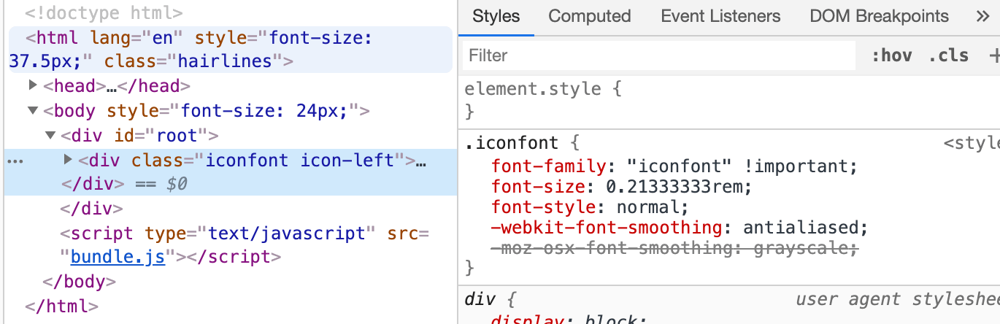

> 此外 `lib-flexible` 官方也说现在推荐我们使用 `viewport` 来代替它。`vw`的兼容方案可以参阅《[如何在Vue项目中使用vw实现移动端适配](https://www.w3cplus.com/mobile/vw-layout-in-vue.html)》一文。
>
> 或者我们还可以使用 [`hotcss`](http://imochen.github.io/hotcss/)，他也是移动端布局开发解决方案之一。

&nbsp;

#### `row-loader`

有的时候我们需要将资源内联到 `html` 中去，我们可以通过 `row-loader` 来内联 `html` 和 `js` 代码。

##### `html`

我们新建一个 `meta.html`，有的时候我们要在多个页面引入，就可以使用内联：

```html
<meta name="viewport" content="width=device-width, initial-scale=1, maximum-scale=1, minimum-scale=1, user-scalable=no">
```

接着我们在模版文件 `index.html` 使用 `raw-loader`，这里需要注意的是我们需要安装 `0.5.*` 版本的 `row-loader`，此外我们是通过 `html-webpack-plugin` 来生成 `html` 的，我们可以使用 `ejs` 的语法：

```html
<!DOCTYPE html>
<html lang="en">
<head>
  <meta charset="UTF-8">
  <title>模块化问题例子</title>
  ${require('raw-loader!./meta.html')}
  <script src="../node_modules/amfe-flexible/index.js"></script>
</head>
<body>
  <div id='root'></div>
</body>
</html>
```

&nbsp;

##### `js`

上面我们讲到的使用 `lib-flexible`，我们可以使用内联代码来做，但有的时候 `js` 代码可能会有 `es6`，因此我们也需要跑一下 `babel-loader`：

```html
<!DOCTYPE html>
<html lang="en">
<head>
  <meta charset="UTF-8">
  <title>模块化问题例子</title>
  ${require('raw-loader!./meta.html')}
  <script>${require('raw-loader!babel-loader!../node_modules/amfe-flexible')}</script>
</head>
<body>
  <div id='root'></div>
</body>
</html>
```

我们进行打包一下，可以在打包后的 `index.html` 引入了相应的文件：

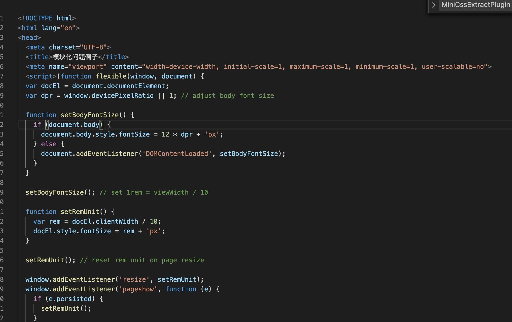

&nbsp;

##### `css`

内联 `css` ，我们有下面两个方案。

* `style-loader`

我们可以设置相应的参数完成内敛：

```javascript
// ...

module.exports = {
  // ...
  module: {
    rules: [
      {
        test: /\.less$/,
        use: [
          {
            loader: 'style-loader',
            options: {
              insertAt: 'top', // 样式插入到 <head>
              singleton: true, //将所有的style标签合并成一个
            }
          },
          // ...
        ]
       }
     ]
  },
	// ...
}
```

* [`html-inline-css-webpack-plugin`](https://github.com/Runjuu/html-inline-css-webpack-plugin)

这是用于将外部样式表转换为嵌入式样式表的 `webpack` 插件，配置如下：

```javascript
...
const HTMLInlineCSSWebpackPlugin = require("html-inline-css-webpack-plugin").default;

module.exports = {
  // ...
  plugins: [
    // ...
    new HTMLInlineCSSWebpackPlugin(),
  ],
  // ...
}
```

&nbsp;

### 打包图标字体

接下来我们将一下，如何打包图标字体，一般在网站中我们会使用各种各样的图标，那我们如何来使用 `webpack` 打包图标呢？

一般我们会从 [`iconfont`](https://www.iconfont.cn/) 网站下载相应的图标，大家可以注册一个账号新建一个项目，


大家可以随便添加几个图标并且点击下载，如图：

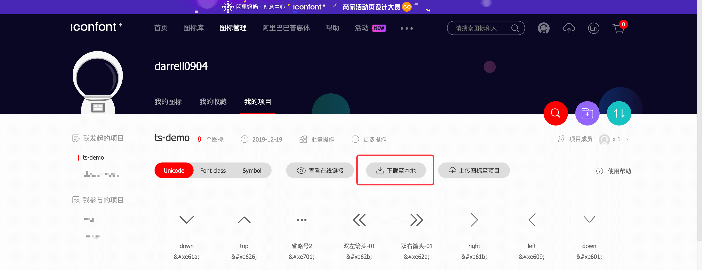

下载完成之后，解压文件夹如下：

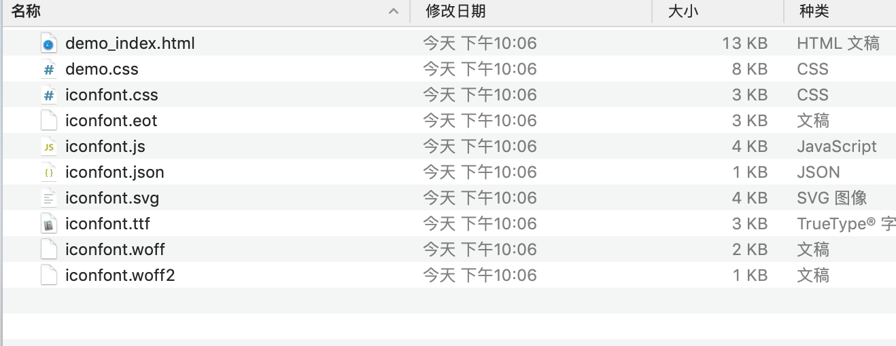

我们只需要下面的一些字体文件 `eot`、`svg` 、`woff`、`woff2`、`ttf` 以及应用这些文件的 `iconfont.css`，我们在项目中创建 `fonts` 文件夹，并将上面的字体文件拉入到 `fonts` 文件夹中。同时将 `iconfont.css` 中的文件复制到 index.less中，并修改一下引用路径：

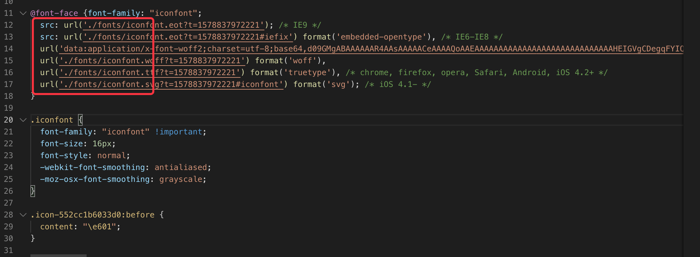

同时我们修改一下 `index.js`，插入一个图标文件：

```js
// ES Moudule 模块引入方式
// import webpackSrc from './webpack.png';
// import createAvatar from './createAvatar';
// import './index.less';
// import style from './index.less'

// createAvatar();
// var img = new Image();
// img.src = webpackSrc;
// img.classList.add(style.avatar); // 添加类名

// var dom = document.getElementById('root');
// dom.append(img);

var dom = document.getElementById('root');
dom.innerHTML = "<div class='iconfont icon-left'></div>"
```

最后我们修改一下 `webpack.config.js`，在 `rules` 中添加一条对字体文件的打包处理：

```js
{
  test: /\.(eot|ttf|svg|woff|woff2)$/,
  use: {
    loader: 'file-loader',
  }
},
```

我们执行一下 `npm run bundle`，在页面中出现了相应的图标：

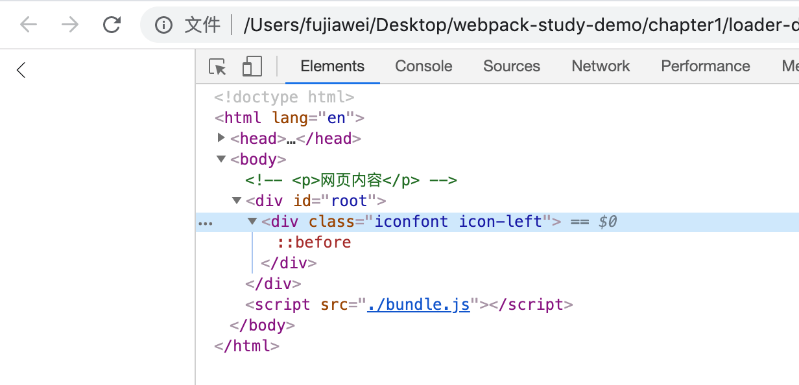


关于 `webpakc` 样式打包的相关 `loader`，我这变就介绍到这里，关于这几个 `loader` 的其他配置，大家可以参考官网对应 `loader` 介绍：

* [style-loader](https://webpack.js.org/loaders/style-loader/)
* [css-loader](https://webpack.js.org/loaders/css-loader/)
* [less-loader](https://webpack.js.org/loaders/less-loader/)
* [postcss-loader](https://webpack.js.org/loaders/postcss-loader/)

&nbsp;

### 其他常用 `loader`

其他的常用 `loader`，还有诸如：

* [`raw-loader`](https://webpack.js.org/loaders/raw-loader/)：将文件以字符串的形式导入
* [`thread-loader`](https://webpack.js.org/loaders/thread-loader/)：多进程打包 `js` 和 `css` 的 `loader`，我们会在 **Webpack 性能优化** 中讲到
* [`babel-loader`](https://webpack.js.org/loaders/babel-loader/)：转换 `ES6`、`ES7` 等 `JS` 新特性语法，我们会在接下去的小结专门讲一下
* `ts-loader`：将 `typescript` 代码转化为 `js`，我们会在 **Webpack 实战配置案例**  中讲到

其他的还有很多 [`loader`](https://webpack.js.org/loaders/) 是 `Webpack` 官方推荐的， 大家可以在需要用到的时候去查询相应的文档，笔者在这里就不细讲了。

&nbsp;

## 相关链接

- [官网 loader](https://webpack.js.org/loaders/)

&nbsp;

## 示例代码

示例代码可以看这里：

- [loader 示例代码](https://github.com/darrell0904/webpack-study-demo/tree/master/chapter1/loader-demo)
