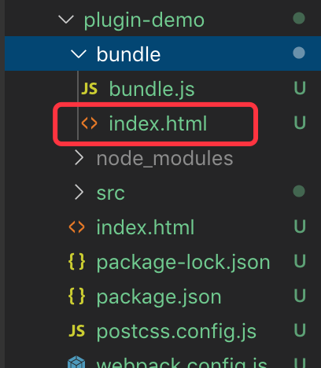
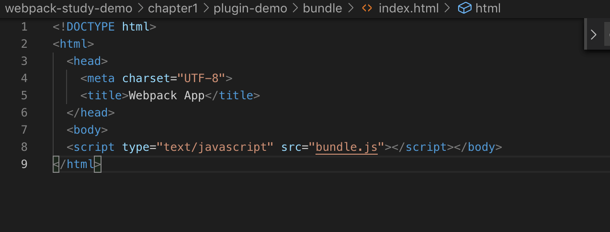
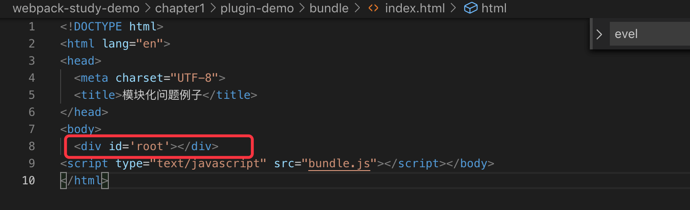
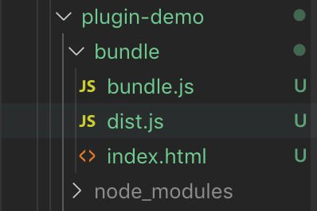

# 配置 plugin

上一节我们讲了 `loader`，我们知道了在 `webpack` 中，`loader` 可以完成对不同类型文件的打包，这一节我们讲一下 `plugins`，让我们的打包变得更加便捷。

&nbsp;

## 什么是 plugin

`webpack` 中的 `plugin` 大多都提供额外的能力，增强 `webpack` 。其用于 `bundle` 文件的优化，资源管理与环境变量的注入等。

它能使 `webapck` 运行到某一个时间段，做相应的事情，其实很类似 `react` 中的生命周期函数。它作用于整个构建过程，你其实还可以理解成任何 `loader` 无法做的事情都可以通过 `plugins` 来实现。

配置只需要把插件实例添加到 `plugins` 字段的数组中。不过由于需要提供不同的功能，不同的插件本身的配置比较多样化。

社区中有很多 webpack 插件可功能使用，包括 [webpack 官方推荐](https://webpack.js.org/plugins/) 的 以及社区中 [webpack plugins](https://github.com/webpack-contrib/awesome-webpack#webpack-plugins) ，有些的插件都会提供详细的使用说明文档，能让使用者快速上手。

下面我们就来讲几个常用的 plugin 来了解一下插件的使用方法。

&nbsp;

## 常用的 `plugins`

### `html-webpack-plugin`

这个插件会帮助我们在 webpack 打包结束后，自动生成一个 html 文件，并把打包产生文件引入到这个 html 文件中去。

接下来我们家来看看这个 plugin 的用法。

上一节我们将 loader 的时候，当我们运行完 `npm run bundle`，页面会生成 bundle 文件夹，并生成了一系列的打包文件，但是就是没有相应的 index.html 文件，所以我们需要手动的去添加 index.html，并在文件中引入打包出来的 `bundle.js` 文件，过程会比较麻烦。

所以我们可以借助 `htmlWebpackPlugin` 来帮我们生成 index.html，首先我们要安装一下：

```js
npm install html-webpack-plugin -D
```

接着修改我们的 `webpack.config.js`：

```js
// 引入 htmlWebpackPlugin
const htmlWebpackPlugin = require('html-webpack-plugin');

// 给 webpack 添加一项配置 plugins
...
plugins: [
  new htmlWebpackPlugin(),
]
...
```

删除一下 bundle 文件夹，重新运行  `npm run bundle`，我们会发现新生成的 bundle 文件夹多出了 一个 index.html：




但是我们会发现，通过webpack 生成的的 html 文件，少了一个 id 为 root 的 div 元素，



我们之前在 demo 里写的代码都是插入到 root 的 div 中的，所以这里我们需要给 htmlWebpackPlugin 传入一些配置来解决上面这个问题，我们在 src 目录创建一个 index.html：

```html
<!DOCTYPE html>
<html lang="en">
<head>
  <meta charset="UTF-8">
  <title>模块化问题例子</title>
</head>
<body>
  <div id='root'></div>
</body>
</html>
```

然后修改一下 `webpack.config.js`，向 htmlWebpackPlugin 传入一些配置文件：

```js
// 给 webpack 添加一项配置 plugins
...
plugins: [
  new htmlWebpackPlugin({
    template: 'src/index.html', // 模板文件
  }),
]
...
```

删除一下 bundle 文件夹，重新运行  `npm run bundle`，我们会发现现在的index.html，有了 id 为 root 的 div 元素。



上面的 template 参数的意思就是说，htmlWebpackPlugin 是以 src 下的 index.html 作为模版去生成 html 文件的。

&nbsp;

#### 更多配置

* `inject`

向 **template** 或者 **templateContent** 中注入所有静态资源，不同的配置值注入的位置不经相同。

> **true或者body**：所有**JavaScript**资源插入到body元素的底部
>
> **head**: 所有**JavaScript**资源插入到head元素中
>
> **false**： 所有静态资源css和JavaScript都不会注入到模板文件中

* `minify`

这个值可以用来压缩 `html`。

参数是一个对象或者 `false`，传递 `html-minifier` 选项给 `minify` 输出，`false` 就是不使用 `html` 压缩，`minify` 具体配置参数可以参考：[html-minifier](https://github.com/kangax/html-minifier#options-quick-reference)

* `chunks`

允许插入到模板中的一些 `chunk`，不配置此项默认会将 `entry` 中所有的 `chunk` 注入到模板中。在配置多个页面时，每个页面注入的 `chunk` 应该是不相同的，需要通过该配置为不同页面注入不同的 `chunk`；

这个值在之后我们将多页面打包会用到，大家可以参考 **多页应用打包** 那一节。

&nbsp;

更多的配置大家可以参考官网的：[htmlWebpackPlugin](https://webpack.js.org/plugins/html-webpack-plugin/)

&nbsp;

### `clean-webpack-plugin`

这个插件能帮我们在打包之前先删除掉打包出来的文件夹，比如我们修改了 `webpack.config.js` 中的 `output` 选项：

```js
...
output: {
  filename: 'main.js',
  path: path.resolve(__dirname, 'bundle')
}
...
```

重新运行  `npm run bundle`，我们会发现 bundle 文件夹下面的 bundle.js 文件还存在，同时并生成了 dist.js 文件：



但其实 bundle.js 在这里已经没有什么用了，所以我们需要在打包之前删除这个 bundle 文件夹，这个时候我们就可以借助 clean-webpack-plugin 来解决这个问题，首先我们安装一下：

```js
npm install clean-webpack-plugin -D
```

接着修改我们的 `webpack.config.js`：

```js
// 引入 clean-webpack-plugin
const { CleanWebpackPlugin } = require('clean-webpack-plugin');

...
plugins: [
  new htmlWebpackPlugin({
    template: 'src/index.html', // 模板文件
  }),
  new cleanWebpackPlugin(),
]
...
```

重新运行  `npm run bundle`，我们会发现，原来的 `bundle.js`  消失了。


在最新版的 `webpack` 中 `new CleanWebpackPlugin()` 中不需要写里面的目标路径，会自动清除生成的文件夹，比如是 `bundle` 文件夹，之前的版本中，我们需要传入要删除的相应文件夹名字：`new cleanWebpackPlugin(['bundle'])`；同时 `CleanWebpackPlugin` 的引入方式也要变一下。由原来的：

```js
const CleanWebpackPlugin = require('clean-webpack-plugin');
```

变成现在的：

```js
const { CleanWebpackPlugin } = require('clean-webpack-plugin');
```

关于 `CleanWebpackPlugin` 的更多用法，可以参考官网的 [clean-webpack-plugin](https://www.npmjs.com/package/clean-webpack-plugin)


### 其他常用的 `plugins`

* [`mini-css-extract-plugin`](https://webpack.js.org/plugins/mini-css-extract-plugin/)：`Webpack4.0` 中将 `css` 从 `bundle` 文件中提取成一个独立的 `css` 文件；在 `3.0` 版本使用 [extract-text-webpack-plugin](https://github.com/webpack-contrib/extract-text-webpack-plugin)。
* [`terser-webpack-plugin`](https://webpack.js.org/plugins/terser-webpack-plugin/)：压缩 `js` 的插件，支持压缩 `es6` 代码，`webpack4.0` 默认使用的一个压缩插件，在 `3.0` 版本使用 [`uglifyjs-webpack-plugin`](https://github.com/webpack-contrib/uglifyjs-webpack-plugin) 来压缩 `js` 代码。
* [`copy-webpack-plugin`](https://webpack.js.org/plugins/copy-webpack-plugin/)：将文件或者文件夹拷贝到构建的输出目录
* [`zip-webpack-plugin`](https://github.com/erikdesjardins/zip-webpack-plugin)：将打包出的资源生成一个 `zip` 包
* [optimize-css-assets-webpack-plugin](https://github.com/NMFR/optimize-css-assets-webpack-plugin)：压缩 `css`  代码的插件
* [`webpack.DefinePlugin`](https://webpack.js.org/plugins/define-plugin/)：创建一个在 **编译** 时可以配置的全局常量，比如设置 `process.env.NODE_ENV`，可以在 `js` 业务代码中使用。 
* [`webpack.DllPlugin`](https://webpack.js.org/plugins/dll-plugin/)：抽取第三方 `js`，使用 `dll` 打包，笔者会在之后 `Webpack` 性能优化将到。

更多的 `plugins` 大家可以参考 [官网 plugins](https://webpack.js.org/plugins/)，后续我们也会讲到到很多相关的 `plugins`，大家可以慢慢将这些 `plugins` 放到自己的知识储备库中去。

&nbsp;

## 相关链接

- [官网 plugins](https://webpack.js.org/plugins/)

&nbsp;

## 示例代码

示例代码可以看这里：

- [plugins 示例代码](https://github.com/darrell0904/webpack-study-demo/tree/master/chapter1/plugin-demo)