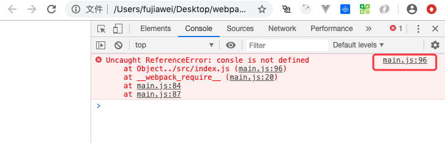
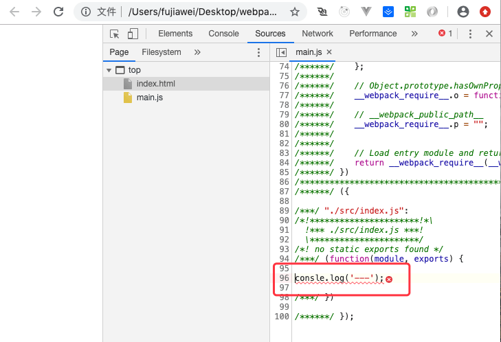
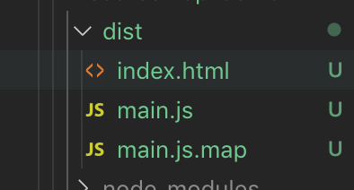
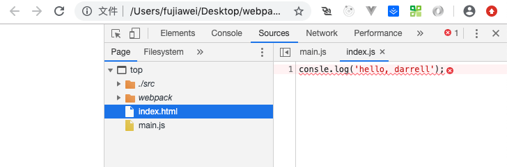
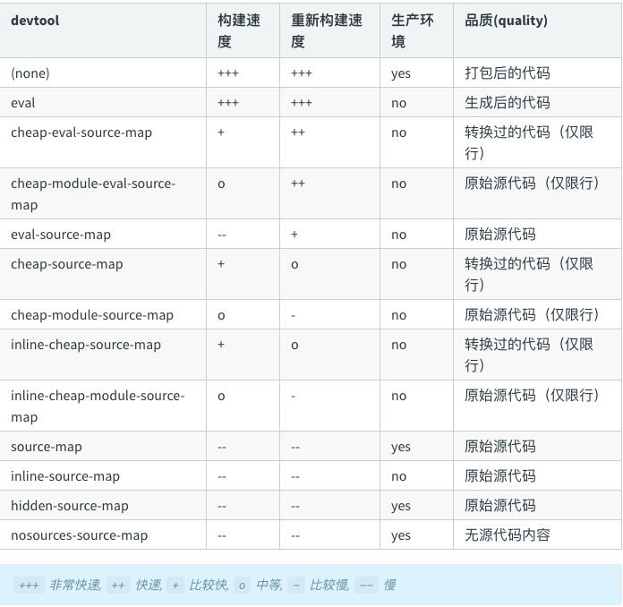
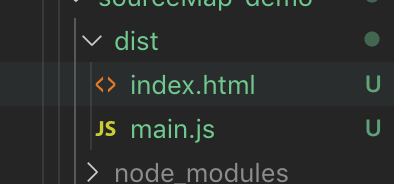
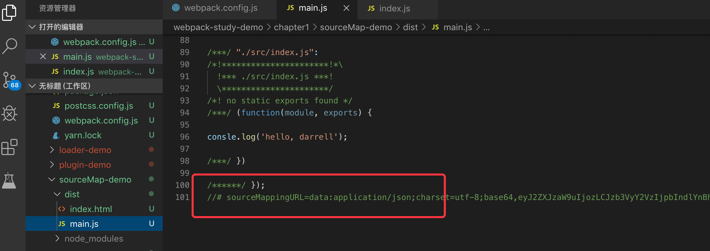
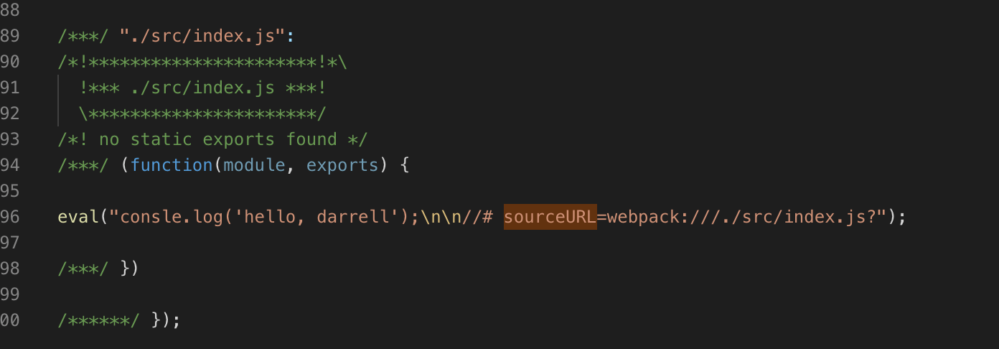

# 配置 sourceMap

## 什么是 `sourceMap`

`SourceMap` 是一个映射关系。能够帮我们更好的定位源码的错误。

举个例子，现在我们发现打包出来的 `dist` 目录下的 `main.js` 的 `97` 行报错了，但因为他是打包后的文件，我们知道 `main.js` 第几行报错其实没有任何意义。这个时候 `sourcemap` 就出来帮我们解决了这个问题，因为他是打包文件和源码的一个映射关系，它知道 `dist` 目录下 `main.js` 文件的 `97` 行 实际上对应的 `src` 目录下的 `index.js` 文件的第一行，这样我们就能够快速定位问题，并进行修复了。


## 如何配置 `sourceMap`

首先我们在修改一下 `webpack.config.js` 文件，添加参数 `devtool` 并且设置为 `none`，因为 webpack 默认会帮我们 把 sourceMap 给开起来，为了验证它的作用，我们暂时先把它关闭。

```js
// 添加参数
...

devtool: 'none',

...
```

并修改一下 `index.js` 文件：

```js
// 故意拼错 console.log，使 js 报错
consle.log('hello, darrell');
```

我们运行 `npm run bundle`，我们会发现打包成功执行，我们打开 `dist` 目录下的 `index.html`，我们会发现控制台有一个报错：



点击右上角的 `main.js`，我们会发现以下错误：



但其实我们并不想知道错误具体在 main.js 的哪一行，我们想知道 这一行代码是在 src 目录下面的哪一个文件，并且在哪一行。


所以这里我们可以修改配置  devtool 的参数：

```js
// 添加参数
...

devtool: 'source-map',

...
```

我们重新运行 `npm run bundle`，我们会发现在 `dist` 目录下面，除了 `index.html` 和 `main.js` ，还额外的生成了 一个 `main.js.map` 文件。



打开 `index.html`，控制台依然会报错，但是我们点击 `main.js`，便会发现跳到了 `src` 目录下的 `index.js` 下了。



这就是 source-map 的意义所在。


## devtool 的 相关配置

下面是官网给我们的 `devtool` 的相关配置的比较：



从上图中我们可以看到 devtool 有非常多的配置，不同的配置构建的速度会有一些差异，中间的很多参数都是可以穿插使用的。

* **`inine`** 有这个的配置，直接会将 `.map` 文件直接打包到对应的 `js` 中去，从而加快相应的速度

  

  

  使用这个我们会发现，打包出来的文件没有 .map 文件了，而是以 base64 的形式放入了打包的文件中了。

* **`cheap`** 有这个的配置，意思是 map 文件只会帮你定为到具体的 某一行，并不会把代码定位到 具体的 某一行 某一列，从而加快速度；`cheap` 还有一个作用，就是这个选项只使针对业务代码，也就是说只能定位到业务代码里面的错误，并不能定位到我们引用的第三方文件（比如说  `loader`，第三方模块）的错误。

* **`module`** 有这个的配置，意思是 它不仅会帮我们定位 自己的业务代码中的错误，还会同时帮我们定位第三方模块的错误。

* **`eval`** 有这个的配置，使用eval包裹模块代码，并且存在 `//@sourceURL`，这个是打包速度最快，性能最好的的一种方式，但是有的时候，对于代码比较复杂的情况，它提示出来的错误可能不够全面。

  

  从图中可以看到，打包完成的 js 中没有 base64 格式的 map 文件了，只有一段 被 eval 包裹的文件了。


## 项目开发的最佳实践

开发环境下：`development`

提示出来的错误比较全，打包速度比较快。

```js
...
devtool: 'cheap-module-eval-source-map'
...
```

生产环境下：`production`

即在线上环境，一般会关掉 source-map（因为没什么必要），但是有的时候，如果线上代码出了问题，我们也希望通过 source-map 快速定位问题，我们可以使用如下配置。

```js
...
devtool: 'cheap-module-source-map'
...
```


## 解析 source-map 文件 


## source-map 原理


更多配置大家可以参考官网的 [devtool](https://webpack.js.org/configuration/devtool/) 。