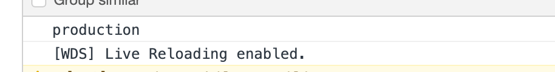
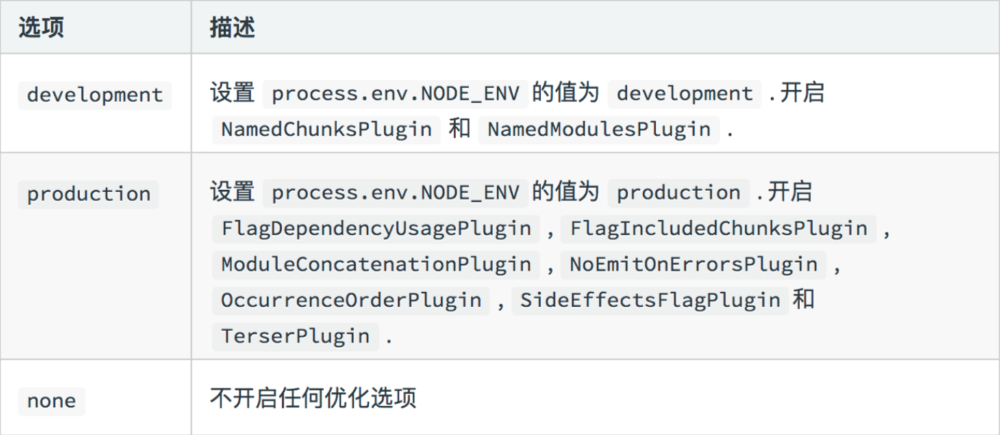
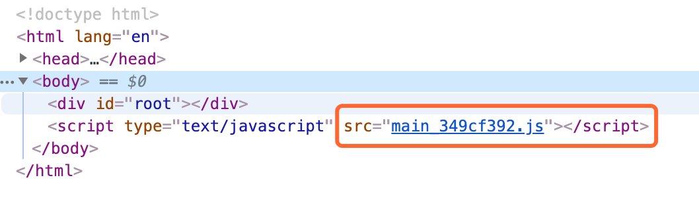
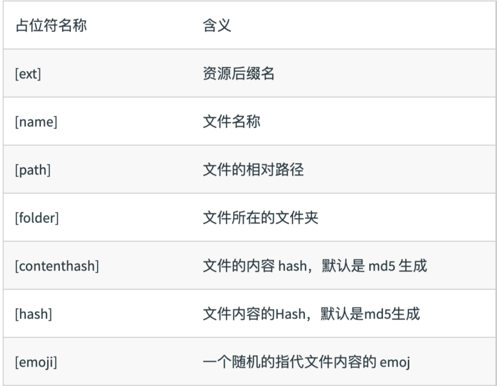

# 一些补充

## `Webpack` 的 `Mode`

`Mode` ⽤用来指定当前的构建环境是：`production`、`development` 还是 `none`；

设置完 `mode` 之后就可以使用 `webpack` 内置的函数了，默认值为 `production`；

设置完了之后，`webpack` 运行时还会根据 `mode` 设置一个全局变量 `process.env.NODE_ENV`，这里的`process.env.NODE_ENV`不是 `node` 中的环境变量，而是 `webpack.DefinePlugin` 中定义的全局变量，允许你根据不同的环境执行不同的代码。

举个例子，如果你的 `mode` 设置了 `production`，那么你在入口文件 `index.js` 中可以取到 `process.env.NODE_ENV` 的值为 `production`。

```javascript
// index.js
console.log(process.env.NODE_ENV);
```

我们打包一下 `npm run dev`，可以看到控制台输出了 `production`：



&nbsp;

### `Mode` 的内置函数功能



&nbsp;

## `Webpack` 中的文件监听

⽂文件监听是在发现源码发⽣生变化时，⾃自动重新构建出新的输出⽂文件。

### 两种方式

* 启动 `webpack` 命令时，带上 `--watch` 参数

```json
"scripts": {
  "bundle": "webpack --watch",
  ...
},
```

* 在配置 `webpack.config.js` 中设置 `watch: true`

&nbsp;

### 缺陷

每次需要手动的去刷新浏览器

&nbsp;

### 原理分析

文件监听是轮询判断文件的最后编辑时间是否变化。

某个文件发生了变化，并不会立刻告诉监听者，而是先缓存起来，等 `assregateTimeout` 时间到了，在统一去执行。

```javascript
module.export = {
  ...
  //默认 false，也就是不不开启
  watch: true,
  //只有开启监听模式时，watchOptions才有意义 
  wathcOptions: {
    //默认为空，不监听的文件或者文件夹，支持正则匹配
    ignored: /node_modules/,
    //监听到变化发生后会等300ms再去执行，默认300ms
    aggregateTimeout: 300,
    //判断文件是否发生变化是通过不停询问系统指定文件有没有变化实现的，默认每秒问1000次 
    poll: 1000
  }
  ...
}
```

更多 `watch` 参数可以参考 [官网 watch 配置](https://www.webpackjs.com/configuration/watch/)。

&nbsp;

## `Webpack` 的文件指纹

### 什么是文件指纹？

打包后输出的⽂文件名的后缀，如下图所示：



&nbsp;

### 如何生成

* `Hash`：和整个项目的构建相关，只要项⽬文件有修改，整个项目构建的 `hash` 值就会更改
* `Chunkhash`：和 `webpack` 打包的 `chunk` 有关，不同的 `entry` 会⽣成不同的 `chunkhash` 值
* `Contenthash`：根据⽂件内容来定义 `hash` ，⽂件内容不变，则 `contenthash` 不变


### 各文件中使用

#### `js 文件`

设置 `output` 的 `filename`，使⽤ `[chunkhash]`：如下配置：

```javascript
module.exports = {
  ...
	output: {
		filename: '[name]_[chunkhash:8].js',
		path: path.resolve(__dirname, 'dist')
	}
  ...
}
```

&nbsp;

#### `css 文件`

有的时候我们改了项目 `js` 的代码，但是 `css` 代码没有改变，这个时候 `css` 如果使用 `chunkhash` 的话，则 `css` 的 `hash` 也会引起变化，则会在浏览器中重新加载 `css` 代码，这是没有必要的。

所以我们可以设置 `MiniCssExtractPlugin` 的 `filename`， 使用 `[contenthash]`，只有当内容改变的时候，才会改变 `hash` 的值，具体可以设置 `MiniCssExtractPlugin` 的 `filename` 属性：

```javascript
const MiniCssExtractPlugin = require("mini-css-extract-plugin");

const prodConfig = {
  ...
  plugins: [
    new MiniCssExtractPlugin({
      filename: '[name]_[contenthash:8].css', // 入口文件 直接引用的 css
      chunkFilename: '[name].chunk.css' // 其他 chunk 间接引用的 css
    }),
  ],
  ...
}
```

 `MiniCssExtractPlugin` 详细的使用，会在之后提取 `css` 一节的时候讲到，笔者这里就不细讲了。

&nbsp;

#### `图片文件`

图片的文件指纹，我们只要设置 `file-loader` 的 `name`，使用 `[hash]` 占位符：

```javascript
...

module.exports = {
  ...
  module: {
    rules: [
      {
        test: /\.(png|jpg|gif)$/,
        use: {
          loader: 'file-loader',
          options: {
            name: '[name]_[hash:8].[ext]',
            outputPath: 'images/',
          }
        }
      }
      ...
    ]
  },
  ...
}
```


更多占位符可以看如下图，也可以参考 [webpack 官网 file-loader](https://webpack.js.org/loaders/file-loader/)：



&nbsp;

## `Webpack`  中的代码压缩

代码压缩可以分为三部分的内容的压缩：

### `HTML` 压缩

对于 `html`  的压缩，我么还是可以使用 `html-webpack-plugin`，设置压缩参数即可，如下设置：

```javascript
const MiniCssExtractPlugin = require("mini-css-extract-plugin");

const prodConfig = {
  ...
  plugins: [
    ...
    new HtmlWebpackPlugin({
      template: 'src/index.html',
      inject: true,
      minify: {
        html5: true,
        collapseWhitespace: true,
        preserveLineBreaks: false,
        minifyCSS: true,
        minifyJS: true,
        removeComments: false,
      }
    }),
  ],
  ...
}
```

重新打包一下，我们可以看到 `html` 代码被压缩了：


&nbsp;

### `CSS` 压缩

对于 `css` 的压缩，我们可以使用 `optimize-css-assets-webpack-plugin`，在 `webpack` 的 `optimization` 的 `minimizer` 数组中使用即可：

```javascript
const MiniCssExtractPlugin = require("mini-css-extract-plugin");
const OptimizeCSSAssetsPlugin = require("optimize-css-assets-webpack-plugin");

const prodConfig = {
  ...
  optimization: {
    minimizer: [new OptimizeCSSAssetsPlugin({})]
  },
}

...
```

更多的可以参考提取 `css` 一节，那里面笔者会详情讲到。


### `JS` 压缩

`webpack 4.0` 中内置了 `terser-webpack-plugin` 用来压缩 `js` 代码，只需要将 `mode` 设置为 `production` 即可，如果你想要设置更多参数，你可以这样设置：

```javascript
const TerserPlugin = require('terser-webpack-plugin');

const prodConfig = {
  ...
  optimization: {
    minimize: true,
    minimizer: [new TerserPlugin({
      // 你的配置参数
    })],
  },
}

...
```

关于 `terser-webpack-plugin` 的更多参数可以参考其 [官方文档](https://webpack.js.org/plugins/terser-webpack-plugin/)。

&nbsp;

## 相关链接

- [terser-webpack-plugin](https://webpack.js.org/plugins/terser-webpack-plugin/)
- [webpack 官网 watch 配置](https://www.webpackjs.com/configuration/watch/)

&nbsp;

## 示例代码

示例代码可以看这里：

- [supplement 示例代码](https://github.com/darrell0904/webpack-study-demo/tree/master/chapter1/supplement-demo)