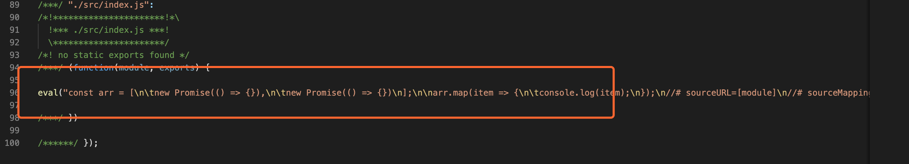
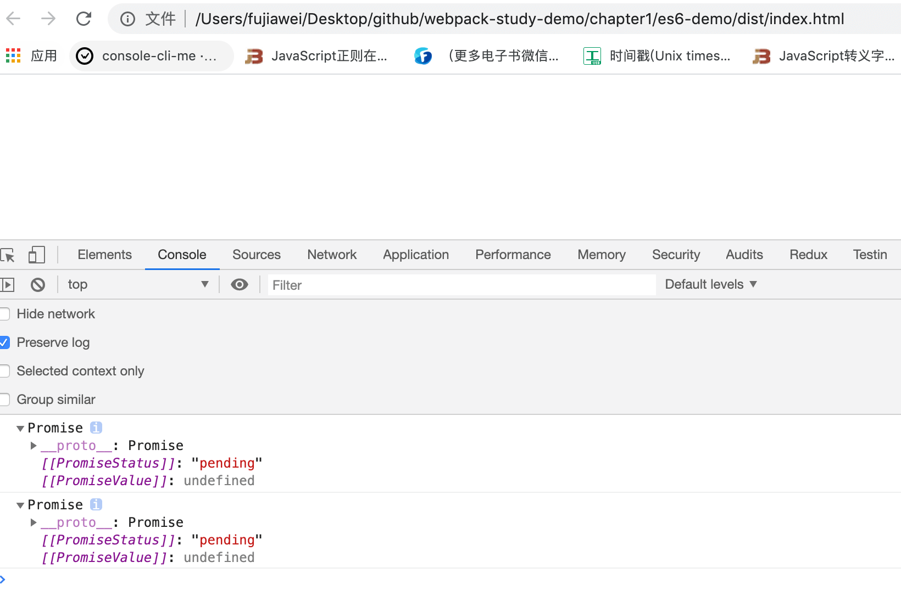
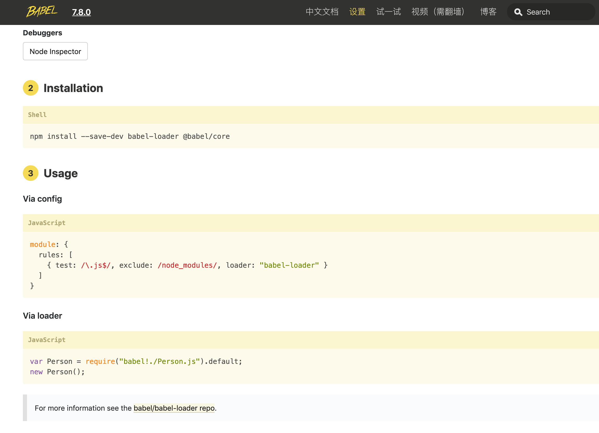
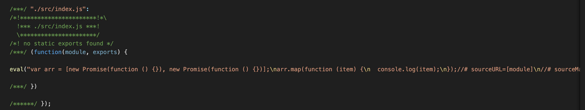
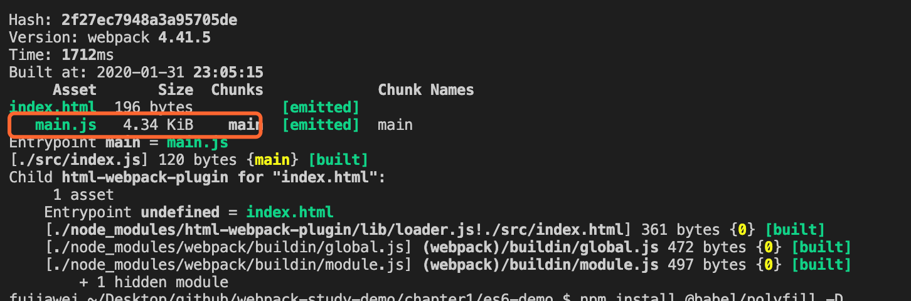
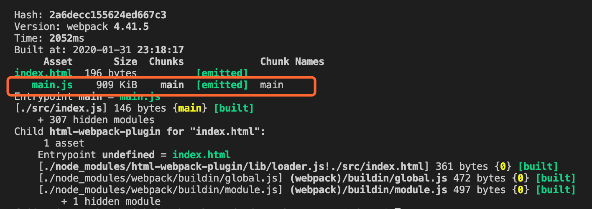
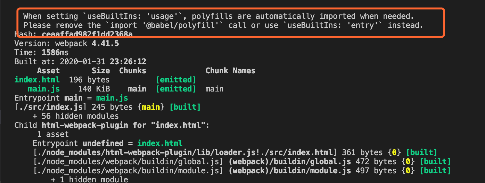
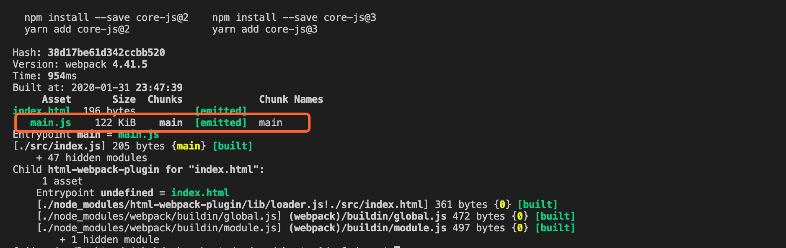
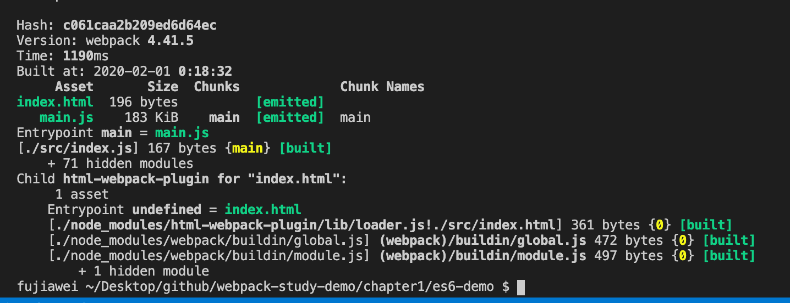

# 打包 ES6 代码

这一节我们讲一下使用 **`Babel`** 处理 `ES6` 的语法。


## 举个🌰：

首先我们修改 `src/index.js` 文件：

```javascript
// index.js

const arr = [
	new Promise(() => {}),
	new Promise(() => {})
];

arr.map(item => {
	console.log(item);
});
```

&nbsp;

执行 `npm run bundle`，我们可以看到其实 `promise` 的箭头函数 和 `map` 这几个 `es6` 的语法还是原样输出了：



&nbsp;

我们将打包出来的 `index.html` 在 `chorme` 打开，发现还是可以运行的，控制台打印出了两个 `promise`：



因为谷歌浏览器与时俱进，还是支持大部分的 `es6` 语法的，但是当碰到一些其他的浏览器的时候，比如 `IE` 浏览器，那就 `gg` 了。

所以这里我们就需要用到一种工具，能帮我们把 es6 语法的代码转化为 能让浏览器识别的 es5 代码，这个时候我们就要用到 `babel` 了。

&nbsp;

## 在 `webpack` 配置 `babel`

我们可以进入 [`Babel`](https://www.babeljs.cn/) 的官网，找到相应的关于 `webpack` 的配置，如下图：



* 首先安装依赖，`@babel/core` 是 `babel` 的核心模块，`babel-loader` 是能 `webpack` 使用 `babel`，`@babel/preset-env` 是 `babel` 真正帮我们转化 es6 代码的插件

```javascript
npm install babel-loader @babel/core @babel/preset-env -D
```

* 在 `webpack.config.js` 进行配置 `babel`：

```javascript
...
module: {
  rules: [{
    test: /\.js$/,
    exclude: /node_modules/,
    loader: 'babel-loader',
  },
  ...
 ]
}
...
```

* 我们可以在项目根目录下 创建 `.babelrc`  文件来更好的管理 `babel` 的配置

```javascript
// .babelrc
{
	"presets": ["@babel/preset-env"]
}
```

* 最后我们重新运行一下 `npm run bundle`，重新看一下 `main.js` 文件，我们可以发现 `es6` 代码的 箭头函数已经被转化为了普通函数：




但是这里面还会有一个问题，就是我们会发现上述的打包出来的代码中还有 `promise` 和 `map` 函数还没有被转化，有些低版本浏览器还不支持这些方法，所以我们要加一些垫片。


## 兼容低版本浏览器（`@babel/polyfill`）

> 从Babel 7.4.0开始，不推荐使用此软件包

加了垫片之后，我们就可以在低端浏览器内使用新的内置函数，如 `Promise` 或 `WeakMap`，静态方法如 `Array.from` 或 `Object.assign` ，实例方法如`Array.prototype.includes` 等等。

我们可以在业务代码中使用，如果你们的业务需要兼容低端浏览器。但是你们老板叫你兼容 ie6 的话，他可能就帮不了你了。

* 安装 `@babel/polyfill`

```javascript
npm install @babel/polyfill -D
```

* 在 `index.js` 中使用

```javascript
import "@babel/polyfill";

...
```

然后再重新运行 `npm run bundle`，我们会发现前后打包出来的 `main.js` 大小差了很多：





这是因为 `@babel/polyfill` 把所有的兼容低版本浏览器的方法都打包到了 main.js 中去，所以体积一下子就大了很多，但是这里我们只需要实现 `promise` 和 `map` 函数就行了，在这里我们需要按需引入，修改 `.babelrc` 配置文件：

```json
{
	"presets": [
    [
      "@babel/preset-env",
      {
        "useBuiltIns": "usage"
      }
    ]
  ]
}
```

重新运行 `npm run bundle`，此时我们会发现体积减小到了 `140kb`：



在上图中我们也发现，如果添加了 `useBuiltIns` 配置时，就不需要导入  `@babel/polyfill` 了。

同时我们还可以根据浏览器版本去告诉 `webpack` 是否要向打包的文件中注入一些兼容性的代码：

```javascript
{
	"presets": [
    [
      "@babel/preset-env",
      {
        "targets": {
          "chrome": "67",
          "browsers": ["last 2 versions","safari 7"]
        },
        "useBuiltIns": "usage"
      }
    ]
  ]
}
```

上面的代码的意思就是 针对大部分浏览器最新的两个版本以及 `IE 7+` 以及 `chrome25`版本进行转码编译，高版本 `chrome` 浏览器已经支持了 `es6`，就不再去打包注入相应的代码了。我们可以看到打包出来的 `main.js` 文件的体积变成了 `122kb`：




## 打包类库

当我们实现自己的类库的时候，并想让类库能在低端版本浏览器中运行，

如果使用了 `@babel/polyfill`，因为他要注入一些低端浏览器所需要的方法，他会采取一种全局注入的方式，所以有可能会影响全局环境。


所以在这里我们就要换一种打包的方式，我们可以通过 `@babel/plugin-transform-runtime` 来实现，我们可以通过照着 [官网的步骤](https://www.babeljs.cn/docs/babel-plugin-transform-runtime) 一步一步来。

* 首先安装依赖

```javascript
npm install @babel/plugin-transform-runtime @babel/runtime -D

npm install @babel/runtime @babel/runtime-corejs2 -S
```

* 修改 `.babelrc` 配置文件：

```javascript
{
  "plugins": [["@babel/plugin-transform-runtime", {
    "corejs": 2,
    "helpers": true,
    "regenerator": true,
    "useESModules": false
  }]]
}
```

* 重新运行 `npm run bundle`，我们会发现打包成功，输出如下图：



更多的配置大家可以参考官网：[@babel/plugin-transform-runtime](https://www.babeljs.cn/docs/babel-plugin-transform-runtime)


## 示例代码

示例代码可以看这里：

* [打包 ES6 示例代码]()


