# 打包分析 与 Preloading、Prefetching

今天来讲一下 `webapck` 中的打包分析与 `Preloading、Prefetching`


## 打包分析

其值得是当我们使用 `webpack` 帮我们进行代码的打包之后，我们可以借助打包分析的一些工具对我们打包出来的代码进行一些分析，从而分析其打包是否合理。

&nbsp;

### 官方工具

如果要对打包出来的代码进行一些分析，我们就需要生成一个对打包过程的描述文件，这样我们才能进行分析。官网提供了这样一条命令，我们将其添加到 `package.json` 文件的 `script` 中去

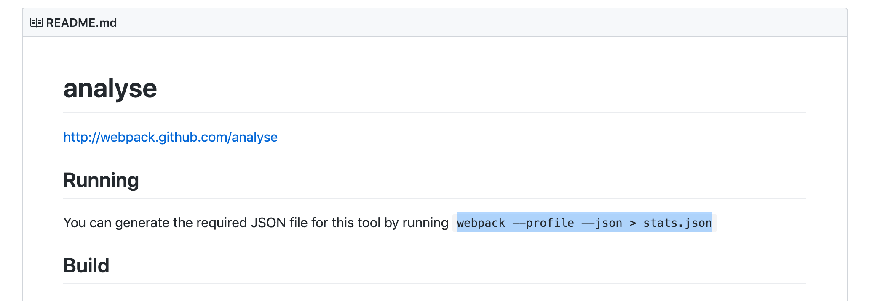

```json
...

"scripts": {
    "bundle": "webpack webpack --profile --json > stats.json --config ./config/webpack.dev.js",
    "dev": "webpack-dev-server --config ./config/webpack.dev.js",
    "build": "webpack --config ./config/webpack.prod.js",
  },
...
```

这句话的意思就是使用 `webpack` 打包的过程的一些文件放到 `stats.json` 中去。

我们打包一下 `npm run bundle`，页面根目录下会生成 `stats.json` 描述性文件。

我们通过官网提供的 [stats.json 分析工具](http://webpack.github.io/analyse/) 进行分析：

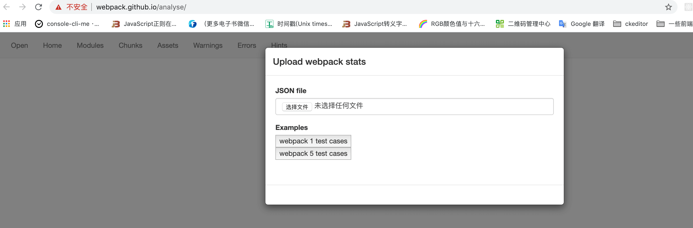

我们上传相应的 `stasts.json` 文件，我们会看到如下图所示页面：

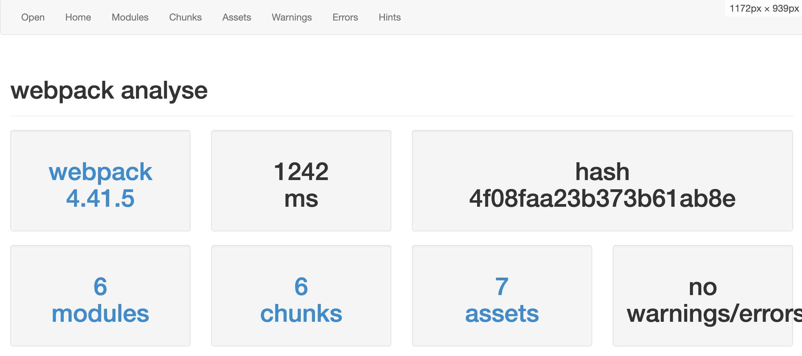

包括 `webpack` 的版本、打包时间、打包过程的 `hash` 值、模块数量( `modules` )、`chunk` 数量、打包生层的静态文件 `assets` 以及打包的警告和错误数。

我们还可以切换上面的 `tab` 查看其他信息：

#### `module`

这里告诉我们打包的模块之间的关系

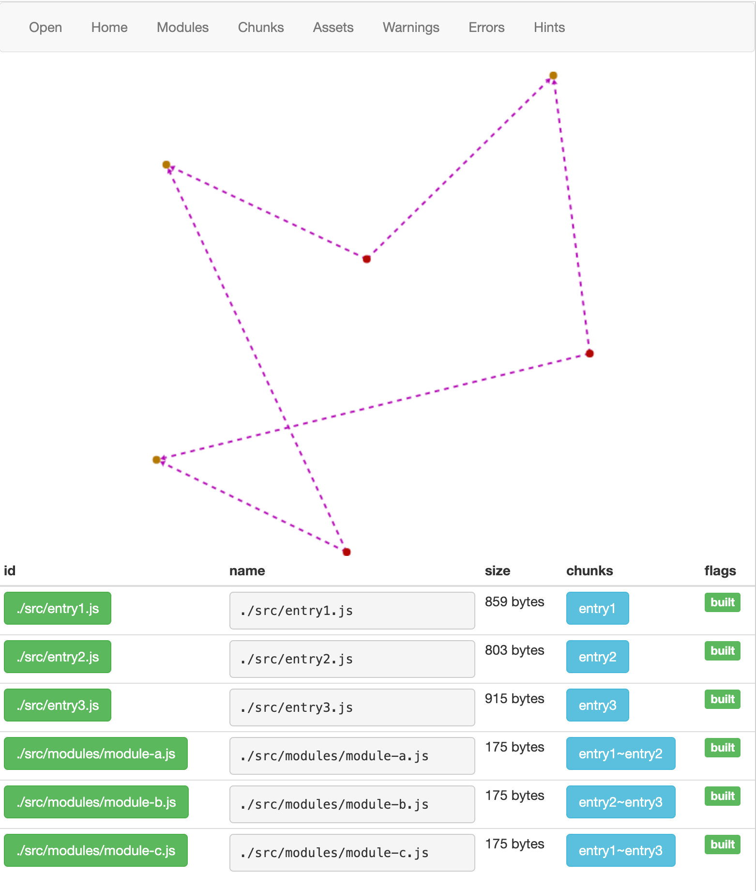

点击任意一个模块，我们可以看到里面的具体信息，包括相应的代码：

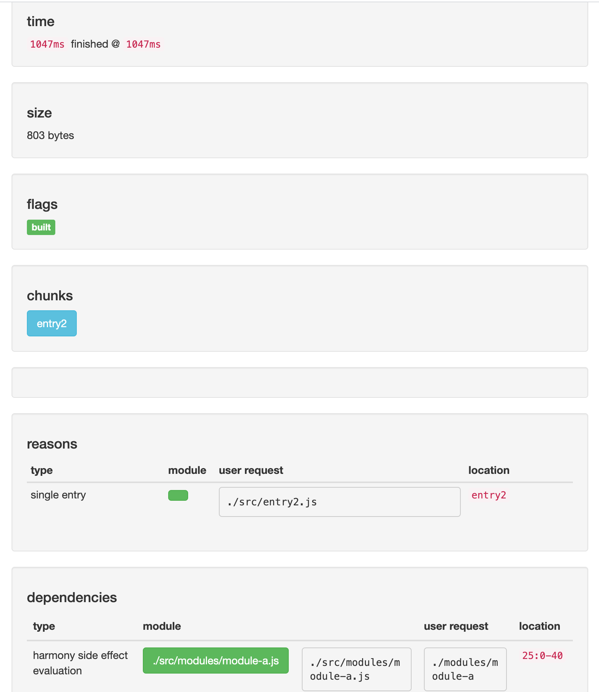


#### `chunks`

这里告诉我们打包生成了几个 `chunks`

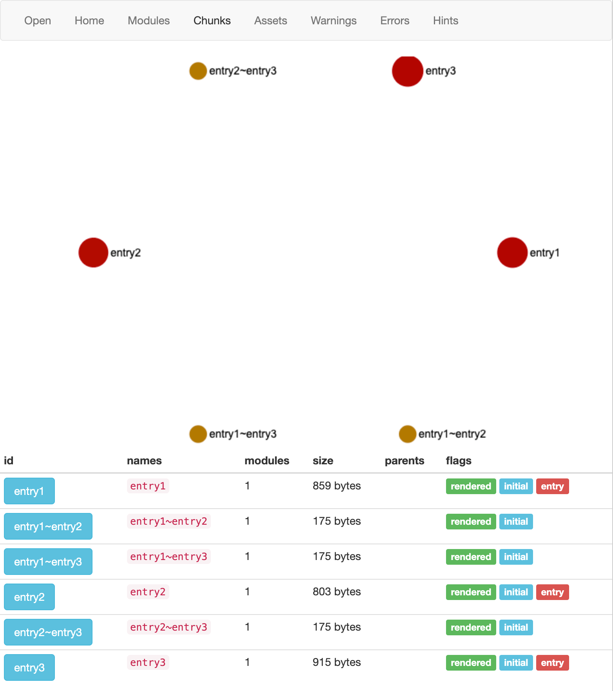

#### `assets`

这里告诉我们打包生成了几个静态资源

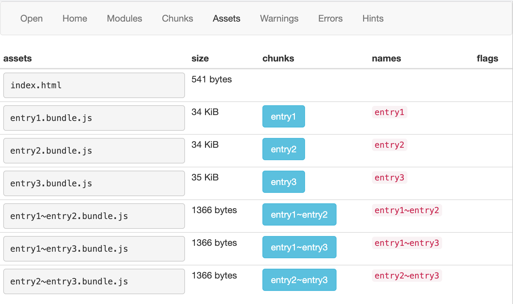


&nbsp;

### 其他工具

出了上面官方的这个工具，还有很多其他的工具能帮助我们进行打包分析。

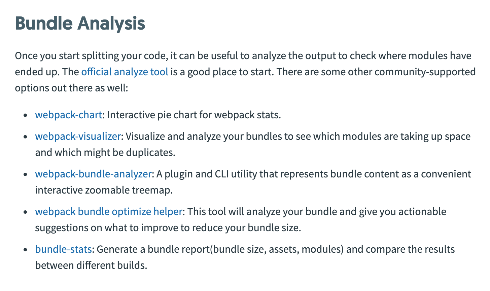

在这里笔者主要介绍 `webpack-bundle-analyzer` 这个打包工具，其他的工具笔者在这里也不过多介绍了。

#### `webpack-bundle-analyzer`

虽然在前面我们有讲到过，在这里我们就在讲一遍加深一下影响：

##### 安装依赖

```javascript
npm install webpack-bundle-analyzer -D
```

&nbsp;

##### 配置

修改 `/config/webpack.common.js`，在 `plugins` 配置中添加配置：

```javascript
const BundleAnalyzerPlugin = require('webpack-bundle-analyzer').BundleAnalyzerPlugin;

module.exports = {
  ...
  plugins: [
    ...
    new BundleAnalyzerPlugin({
      analyzerHost: '127.0.0.1',
      analyzerPort: 8889,
      openAnalyzer: false,
    }),
    ...
  ],
  ...
}
```

修改 `package.json` 的 `script`  参数：

```json
...

"scripts": {
  ...
  "analyz": "NODE_ENV=production npm_config_report=true npm run build"
},

...
```

我们开发环境打包一下：`npm run bundle`；我们可以看到打包结果：


我们打开 `http://127.0.0.1:8889/` 页面：


&nbsp;

我们可以很清楚的看到现在的项目打包出了几个文件。

&nbsp;

## `Preloading` 和 `Prefetching`

性能优化使用缓存是很有限的，现在更多的应该是再编写代码时，考虑到代码的覆盖率，如何让页面加载的 `js` 文件利用率提高，有些交互后才能用到的代码可以写在异步组件里通过 **懒加载** 的形式，把这块的代码逻辑加载进来，这样就可以提高代码的性能，页面访问速度也会加快。

### 一个例子

我们修改入口文件  `index.js`：

```javascript
document.addEventListener('click', () => {
  const element = document.createElement('div');
  element.innerHTML = 'Hello Darrell';
  document.body.appendChild(element);
})
```

这是我们一般的写法，当点击页面的时候，去做一些操作，我们打包一下，在页面中是可以输出`Hello Darrell`：

但是这样的写法真的是最好的写法吗，我们在浏览器中按 `Cmd + Shift + P` ，然后在弹出的对话框中输入 `coverage`：

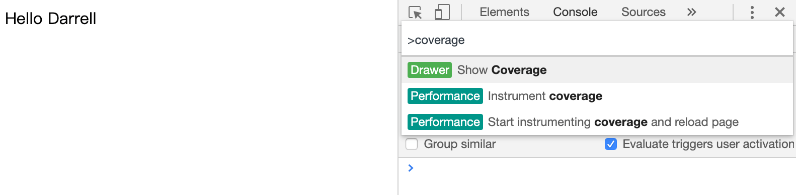

点击回车，然后再点击下面的刷新按钮，小黑圆点变成红圆点之后，刷新页面，我们可以看到在页面中会加载一个  `main.bundle.js`，但是他的代码利用率为 `61.8%`。

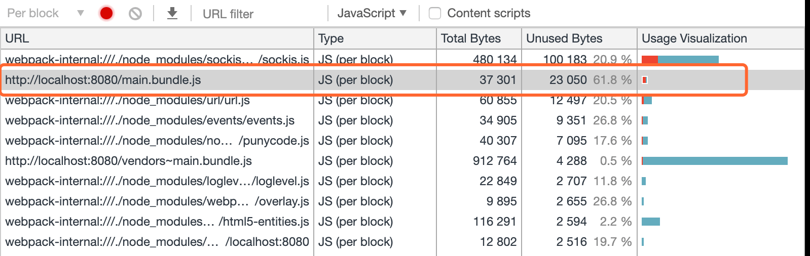

我们看一下其中的代码，会发现我们在 `click` 中写的代码，是被标红的，并没用被使用。

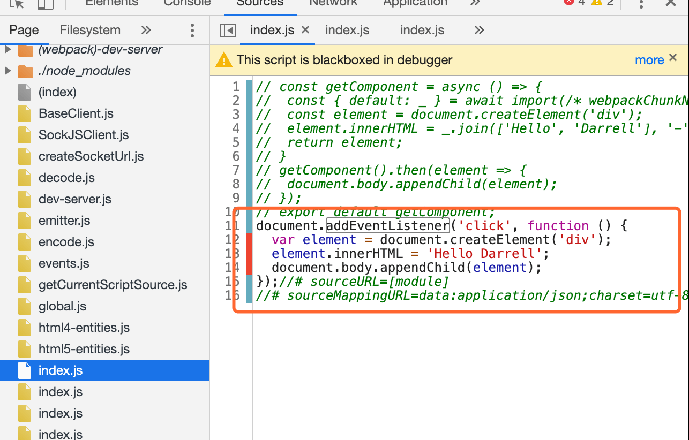

只有点击后才会被使用，才会被使用。

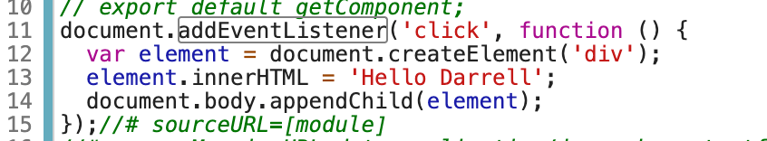

这种情况下其实 `webpack` 是建议我们使用异步引入的方式来写这个方法的，我们修改 `async.js` 文件：

```javascript
const handleClick = () => {
	const element = document.createElement('div');
  element.innerHTML = 'Hello Darrell';
  document.body.appendChild(element);
}

export default handleClick;

```

接着修改入口文件 `index.js`：

```javascript
document.addEventListener('click', () => {
  import('./async.js').then(({default: func}) => {
    func();
  })
})
```

重新打包，我们在看一下页面利用率，变成了 `70.9%`；

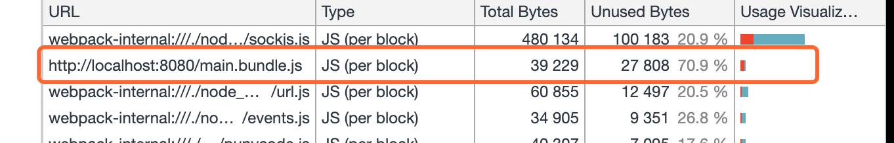

只有当我们点击页面的时候才回去加载 `async.js` ，从而增加了代码的利用率。

现在我们能理解为什么 `webpack` 在 `splitchunksPlugin` 的配置默认是 `chunks: 'async'` 了吧。

`webpack` 优化的侧重点是代码的使用率而不是缓存，只是使用缓存的方式来优化意义是不大的，通过异步的方式提高代码的利用率才能比较大程度地提高网站的性能。因为缓存只会加快第二次之后页面的加载速度，而 `webpack` 想要做到的是 第一次就很快。


&nbsp;

### `prefetch` 登场

这个时候你就会想如果我们上诉 `async.js` 特别特别的大，加载的时候需要一段时间，这样不是会影响页面的用户体验吗。

举个例子，一般的网站都会有登录，登录一般都是一个弹窗，这个时候我们可以去异步加载登录模块的相关代码，但是如果我们登录模块的代码文件非常的大，需要加载个 `5s`，这个时候我们就可以使用  `prefetch`，来帮我们解决这个问题。

如果要是感觉 **懒加载** 影响用户体验，这个时候就可以用 `prefetch`。

* `prefetch`（预取）：将来可能需要一些模块资源，在核心代码加载完成之后带宽空闲的时候再去加载需要用到的模块代码。
* `preload`（预加载）：当前核心代码加载期间可能需要模块资源，其是和核心代码文件一起去加载的。

我们先来使用一下，在要异步加载的文件前面加上 `/* webpackPrefetch: true */` 这个 `magic comment` 即可。

我们修改一些 `index.js`：

```javascript
document.addEventListener('click', () => {
  import(/* webpackPrefetch: true */ './async.js').then(({default: func}) => {
    func();
  })
})

```

上面的代码的意思是当我们主要的核心代码加载完成，浏览器有空闲的时候，浏览器就会帮我们自动的去下载 `async.js` 的代码。

在页面中会以 `<link rel="prefetch" href="async-chunk.js">`其附加在页面的开头，这将指示 **浏览器在空闲时间** 预取 `async-chunk.js` 文件。

我们可以看一下 `network`，

下图中的 `0.bundle.js` 是 `async.js` 打包之后，可以看出在页面加载完之后的空闲时间还没有点击页面时已经加载了 `0.bundle.js` ，当点击页面时，`0.bundle.js` 直接从缓存中读取，因此耗时非常短。

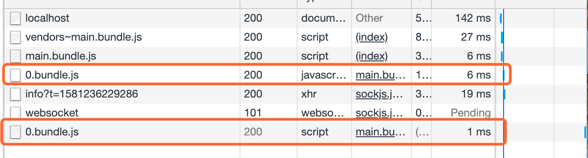


&nbsp;

### `prefetch` 与 `preload` 的区别

* `preload chunk` 会在父 `chunk` 加载时，以并行方式开始加载。`prefetch chunk` 会在父 `chunk` 加载结束后开始加载

* `preload chunk` 具有中等优先级，并立即下载。`prefetch chunk` 在浏览器闲置时下载

* `preload chunk` 会在父 `chunk` 中立即请求，用于当下时刻。`prefetch chunk` 会用于未来的某个时刻

* 浏览器支持程度不同


最后官网还告诉我们，**错误地使用webpackPreload实际上会损害性能，因此在使用时要小心。**

&nbsp;

## 相关链接

* [webpack 官方打包工具](https://github.com/webpack/analyse)
* [webpack bundle-analysis](https://webpack.js.org/guides/code-splitting/#bundle-analysis)
* [webpack-bundle-analyzer 官网](https://github.com/webpack-contrib/webpack-bundle-analyzer)
* [Prefetching/Preloading modules](https://webpack.js.org/guides/code-splitting/#prefetchingpreloading-modules)
* [webpack 之打包分析以及 prefetching 和 preloading ](cnblogs.com/nayek/p/12068348.html)

&nbsp;

## 示例代码

示例代码可以看这里：

- [打包分析 示例代码]()