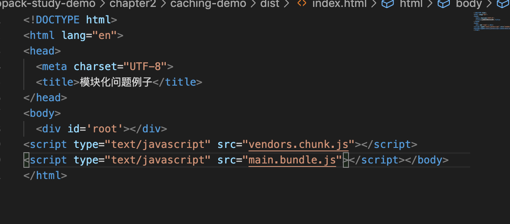
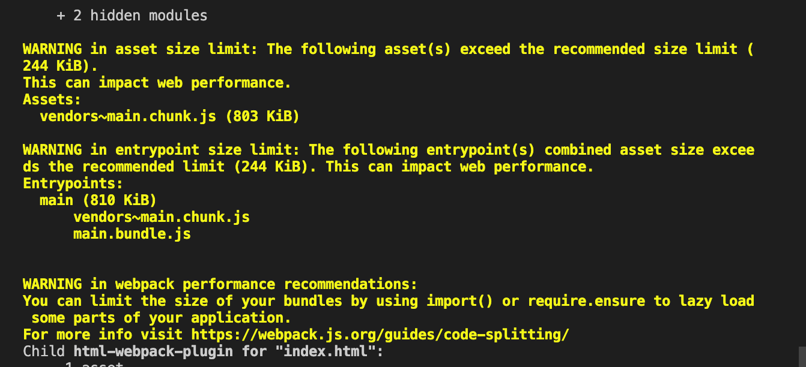
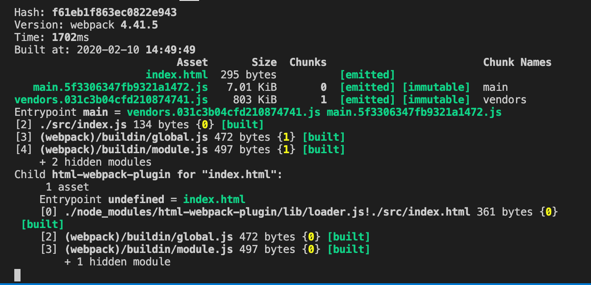
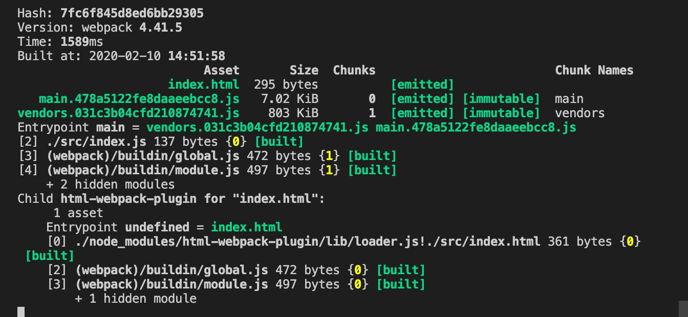
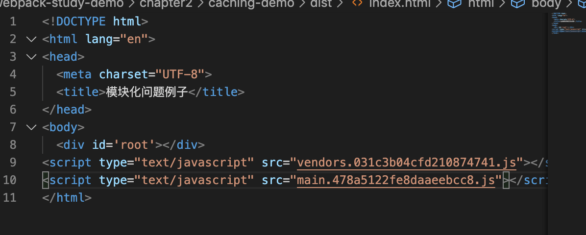

# Webpack 与浏览器缓存（Caching）

今天我们来讲一下 `webpack` 与浏览器缓存这一块内容。

想象一个场景，当我们的代码已经打包好的 `dist` 目录放到的服务器上，



当用户第一次访问 `index.html` 页面的时候，他会先下载我们所需的 `vendors.chunk.js` 和 `main.bundle.js` 两个文件，然后在刷新一下页面，他其实不会再向向服务器请求上面两个 `js` 文件了，直接从浏览器的缓存中读取使用了。因为两个 `js` 文件的名字没有改变过。

假设我们的业务代码进行修改了，我们重新打包，发现打包出来的代码还是上图所示。这个时候我们再将代码部署到服务器上，用户访问页面的时候，发现还是这两个名字的 `js`，于是就又使用了浏览器缓存中的文件。

因此我们需要对打包出来的 `js` 文件做一个名字上的配置。


&nbsp;

## 一个例子

我们修改入口文件 `index.js`：

```javascript
import _ from 'lodash';
import $ from 'jquery';

const dom = $('<div>');
dom.html(_.join(['Hello', 'darrell'], ' '));
$('body').append();

```

引入 `lodash` 和 `jquery`  文件，在页面上插入 `<div>Hello darrell</div>` 元素。


我们修改线上配置文件 `webpack.prod.js` 的 `output` 配置，在输出的文件名字上加上相应的 `[contenthash]` 占位符，顾名思义，`contenthash` 就是根据文件内容生成的 `hash` 值，只有当文件内容发生改变的时候，才会发生改变：

```javascript
...
const prodConfig = {
  ...
	output: {
		filename: "[name].[contenthash].js",
		chunkFilename: '[name].[contenthash].js', // 简介引入代码输出的名字
		path: path.resolve(__dirname, '../dist')
	}
  ...
}
...
```

我们打包一下 `npm run build`：

我们会发现有一个警告，这个是 `webpack` 告诉我们我们打包出来的文件有点大，在性能上可能会有一些问题，这里我们可以暂时先不管，在 `webpack.common.js` 中加入：



```javascript
...
module.exports = {
  ...
	performance: false, // 关闭性能上的一些问题
  ...
}
...
```

我们重新打包，可以看到打包出来的内容如下：



打包出来的内容中 `main` 开头的是我们的业务代码，然后 `vendors` 开头的就是我们的库代码，也就是 `lodash` 与 `jquery`。

接着我们修改一下 `index.js` 文件：

```diff
import _ from 'lodash';
import $ from 'jquery';

const dom = $('<div>');
- dom.html(_.join(['Hello', 'darrell'], ' '));
+ dom.html(_.join(['Hello', 'darrell123'], ' '));
$('body').append();


```

重新打包，可以看到打包出来 业务代码内容的 `hash` 变了，而库代码的内容 `hash` 没变。



这个时候用户重新访问我们的页面，`js` 的文件名字变了，这个时候便又会从服务器上面重新下载新的文件。而库对应的文件名字没有变，就还是会使用浏览器缓存中的代码。




&nbsp;

## 老版本 Webpack

老版本的 `Webpack` 中的 `contenthash` 有的时候即使你的内容没有变化，他还是会改变 `contenthash` 的值，

原因是我们的业务代码和库代码之间有一些关联代码，在 `webpack` 中被称为 `mainfest`，默认情况下 `mainfest` 的代码会存在于 `main.js` 和 `vendors.js` 代码之中的，他在旧版的 `webpack` 中打包可能会有差异，所以才会造成我们的内容没有变化，但是 `contenthash` 的值变化了。

这个时候需要在公共配置文件 `webpack.common.js` 中增加一个配置：

```javascript
...

module.exports = {
  ...
  optimization: {
		...
		runtimeChunk: {
			name: 'runtime',
		},
		...
	},
  ...
}
...
```

我们重新进行打包，会发现 `dist` 目录下多了 `runtime` 开头的一个文件：


上面的配置的意思就是将 `manifest` 关联代码抽离出来放到 `runtime.js` 中去，`main.js` 只写业务代码，`vendors.js` 只放库文件代码。

这个的时候在老版的 `webpack` 中也不会有相应的问题了。

&nbsp;&nbsp;

## 相关链接

- [webpack 官网 caching](https://webpack.js.org/guides/caching/)

&nbsp;

## 示例代码

示例代码可以看这里：

- [Caching  示例代码](https://github.com/darrell0904/webpack-study-demo/tree/master/chapter2/caching-demo)