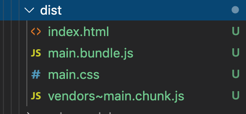
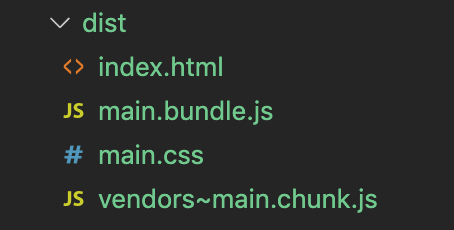
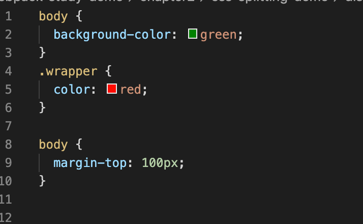
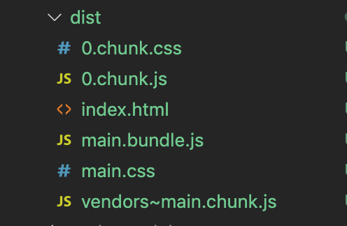
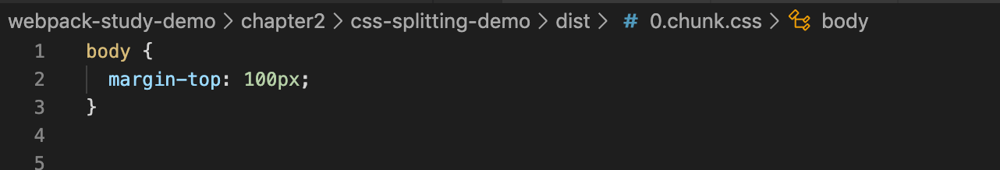
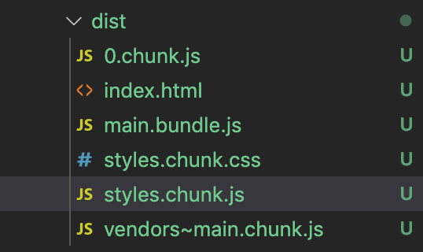
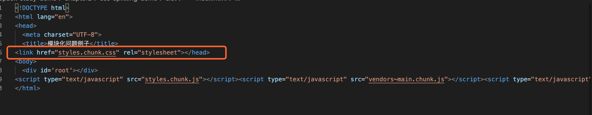
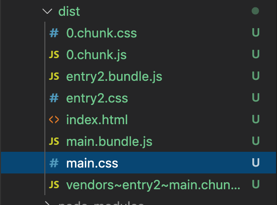
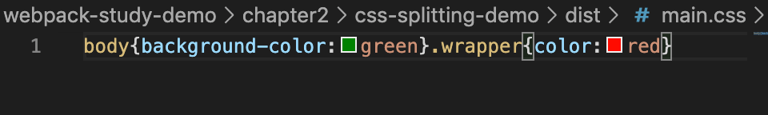

# CSS 文件的代码分割

之前我们写的 `css` 代码都是直接被打包到 `js` 文件中去的，然后使用 `style-loader`，以 `<style>` 标签的形式 将 `css` 插入到 `dom` 中。

但是并没有单独的打包出一个 `css` 文件，今天我们来讲一下讲如何单独打包出 `css` 文件。


在 `Webpack 4` 之前，我们使用 [extract-text-webpack-plugin](https://github.com/webpack-contrib/extract-text-webpack-plugin) 插件来提取项目中引入的样式文件，打包到一个单独的文件中。从 `Webpack 4` 开始，这个插件就过时了，需要使用 [MiniCssExtractPlugin](https://webpack.js.org/plugins/mini-css-extract-plugin/)。

&nbsp;

## 使用 `MiniCssExtractPlugin`

此插件能提取 `js` 中引入的 `css` 打包到单独文件中，然后通过标签 `<link>` 添加到头部；


### 安装依赖

```javascript
npm install mini-css-extract-plugin -D
```

&nbsp;

### 配置

我们修改 `webpack.common.js` 配置文件：

```javascript
...
const MiniCssExtractPlugin = require("mini-css-extract-plugin");
...

module.exports = {
  ...
  module: {
		rules: [
      ...
      {
        test: /\.less$/,
        use: [
          MiniCssExtractPlugin.loader,
          {
            loader: 'css-loader',
            options: {
              importLoaders: 2,
            }
          },
          'less-loader',
          'postcss-loader',
        ]
      }
      ...
    ]
  },
  plugins: [
		...
		new MiniCssExtractPlugin({
			filename: '[name].css', // 直接引用【index.html（入口文件） 引入的名字】
			chunkFilename: '[name].chunk.css' // 间接引用【其他地方引入使用的名字】
    }),
	],
  ...
}

...
```


&nbsp;

### 修改代码

修改 `index.less` 文件：

```less
body {
  background-color: green;
}

.wrapper {
  color: red;
}
```

在入口文件 `index.js` 中使用：

```javascript
import './index.less'
```

&nbsp;

### 打包

我们运行 `npm run bundle`，`dist` 文件下打包出了 `main.css` 文件：




&nbsp;

## 注意点

此插件**为每个包含 `css` 的 `js` 文件创建一个单独的 `css` 文件**，并支持 `css` 和 `source-map` 的按需加载。

**注意**：这里说的每个包含 `css` 的 `js` 文件，并不是说组件对应的 `js` 文件，而是打包之后的 `js` 文件！接下来会详细说明。

### 例子

我们修改 `async.js`，引入 `async.less`：

```javascript
import './async.less';

const handleClick = () => {
	for(let i = 0; i < 20; i++) {
		const element = document.createElement('div');
  	element.innerHTML = 'Hello Darrell';
  	document.body.appendChild(element);
	}
}

export default handleClick;

```

新建 `async.less` 文件：

```less
body {
  margin-top: 100px;
}
```

然后在入口文件 `index.js` 引入：

```javascript
import './index.less';
import fun from './async.js'

document.addEventListener('click', () => {
  func();
})

```

我们打包一下 `npm run bundle`，我们会发现并不是如我们所想的圣生成了 `2` 个 `css` 文件，反而只生成了一个 `main.css` 文件，因为 `async.js` 也被打包进了 `main.bundle.js`，所以 `async.less` 也相应的被打包到了 `main.css` 中去了：





&nbsp;

我们该一些 `index.js` 中 `async.js` 的引入方式，改为动态引入：

```javascript
import './index.less';

document.addEventListener('click', () => {
  import('./async.js').then(({default: func}) => {
    func();
  })
})

```

重新打包，我们会发现 `dist` 目录下多生成了一个 `0.chunk.js`，与之对应就是 `0.chunk.css` ，这就是我们在源码中的  `async.js` 与 `async.less`：





因为异步引入，`webpack` 会将其单独打包分离成一个 `chunk`。这个时候便有了有两个 `chunk`，对应了两个 `js` 文件，所以会提取这两个 `js` 文件中的 `css` 生成对应的文件。这才是 **为每个包含 CSS 的 JS 文件创建一个单独的 CSS 文件** 的真正含义。


> 所以再次强调：此插件会**为每个包含 `css` 的 `js` 文件创建一个单独的 `css` 文件**，但是一定要注意 **这里说的每个包含 `css` 的 `js` 文件，并不是说组件对应的 `js` 文件，而是打包之后的 `js` 文件！接下来会详细说明。**

&nbsp;

## 将所有的 `css` 打包到一个文件：

`MiniCssExtractPlugin` 底层也依赖 `splitChunksPlugin`，所以我们可以在 `splitChunksPlugin` 的缓存组中进行相应的配置：

我们修改 `webpack.common.js`：

```javascript
optimization: {
  splitChunks: {
    cacheGroups: {
      styles: {
      	name: 'styles', // 名字命名为 styles
        test: /\.(c|le)ss$/, // 对所有的 less 或者 css 文件
        chunks: 'all', // 代码分割类型
        enforce: true, // 忽略其他的参数，比如 minsize、minchunks 等，只要是样式文件就去做代码的拆分
      },
    }
  }
},

```

我们重新打包，我们会发现 `dist` 目录下多了 `styles.chunk.js` 和  `styles.chunk.css`，这里面主要用到的就是 `styles.chunk.css`，所有的 `css` 文件都被放进去了。我们的 `HtmlWebpackPlugin`  会自动将 `styles.chunk.css` 引入到 `index.html` 中去。






## 多页面打包 `css`

有的时候我们的项目有多个入口，如果我们想要根据入口来分别打包相应的 `css` 文件，我们可以通过再配置几个 `cacheGroups` 来实现相关的需求。

我们修改 `webpack.common.js`：

```javascript
...

function recursiveIssuer(m) {
  if (m.issuer) {
    return recursiveIssuer(m.issuer);
  } else if (m.name) {
    return m.name;
  } else {
    return false;
  }
}

...

const devConfig = {
	entry: {
		main: "./src/index.js",
		entry2: "./src/entry2.js",
	},
  optimization: {
    splitChunks: {
      cacheGroups: {
        fooStyles: {
          name: 'main',
          test: (m, c, entry = 'main') =>
            m.constructor.name === 'CssModule' && recursiveIssuer(m) === entry,
          chunks: 'all',
          enforce: true,
        },
        barStyles: {
          name: 'entry2',
          test: (m, c, entry = 'entry2') =>
            m.constructor.name === 'CssModule' && recursiveIssuer(m) === entry,
          chunks: 'all',
          enforce: true,
        },
      },
    },
  },
  ...
}
```

我们新增 `entry2.js` 与 `entry2.less`：

```javascript
// entry2.js

import './entry2.less';

document.addEventListener('click', () => {
  import('./async.js').then(({default: func}) => {
    func();
  })
})

```

```less
.entry2 {
  background-color: red;
}
```

我们打包一下，我们会发现 `dist` 目录下有多了 `entry2.css` 和 `entry2.bundle.js` 文件：



其中 `entry2.css` 中就是 我们在 入口二文件中引入的 `entry2.less`


&nbsp;

## 配置 `HMR`

样式文件的也有 `HMR`，如果没有配置 `HMR`，开发模式下，修改 `css` 源文件的时候，页面并不会自动刷新加载修改后的样式。需要手动刷新页面，才会加载变化。而 `HMR` 实现了被修改模块的热更新，使得变化即时显示在页面上，不再需要刷新整个页面。

在稍微早一点的 `MiniCssExtractPlugin` 版本中，是不支持 `HMR` 的。不过现在已经支持了。我们可以在开发环境的 `webpack.dev.js` 配置文件中做如下配置：

```javascript
...
const devConfig = {
  ...
	module: {
		rules: [{
			test: /\.less$/,
			use: [
				{
					loader: MiniCssExtractPlugin.loader,
					options: {
						publicPath: '/public/path/to/',
						// 只在开发模式中启用热更新
						hmr: true,
						// 如果模块热更新不起作用，重新加载全部样式
						reloadAll: true,
					},
				},
				{
					loader: 'css-loader',
					options: {
						importLoaders: 2,
					}
				},
				'less-loader',
				'postcss-loader',
			]
		}]
	},
  ...
}
...
```

&nbsp;

## 压缩 `css`

我们可以借助 `OptimizeCSSAssetsPlugin`，来帮助我们做 `css` 的代码压缩。

### 安装

```javascript
npm install optimize-css-assets-webpack-plugin -D
```

### 配置

因为此插件对开发模式下面貌似不会起作用，所以我们修改配置文件向上环境的配置文件 `webpack.prod.js`：

```javascript
const MiniCssExtractPlugin = require("mini-css-extract-plugin");
const OptimizeCSSAssetsPlugin = require("optimize-css-assets-webpack-plugin");

...
const prodConfig = {
  ...
	optimization: {
		minimizer: [new OptimizeCSSAssetsPlugin({})]
	},
  ...
}
...
```

我们运行一下线上打包命令 `npm run build`，我们可以看到打包出来的 `main.css` 被压缩了：



&nbsp;

## 相关链接

- [webpack 官网 MiniCssExtractPlugin](https://webpack.js.org/plugins/mini-css-extract-plugin/#getting-started)
- [【Webpack4】CSS 配置之 MiniCssExtractPlugin](https://juejin.im/post/5dee249e518825125f398f70)

&nbsp;

## 示例代码

示例代码可以看这里：

- [css代码分割 示例代码](https://github.com/darrell0904/webpack-study-demo/tree/master/chapter2/css-splitting-demo)