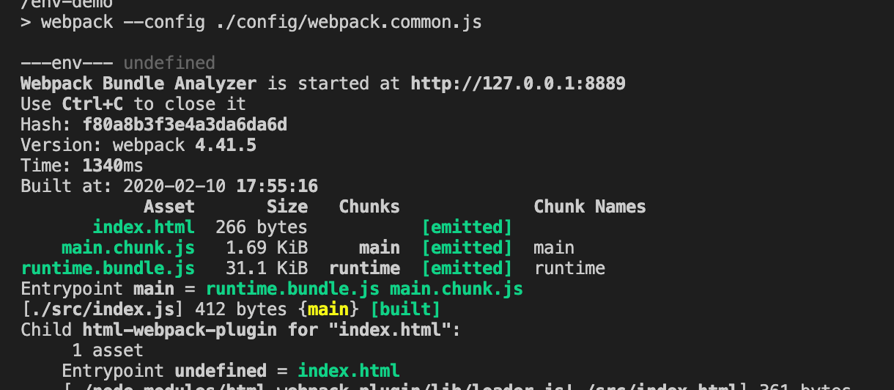
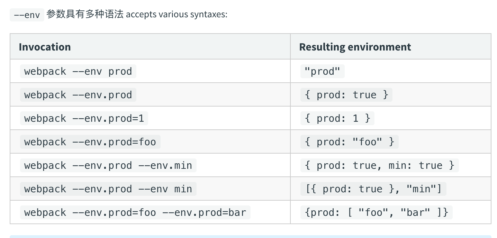

# 环境变量的使用

现在我们区分 **开发环境** 和 **生产环境** 的打包，是通过 `webpack.dev.js` 和 `webpack.prod.js` 这两个文件结合公共的配置文件来完成的。

* 开发环境

```javascript
"dev": "webpack-dev-server --config ./config/webpack.dev.js",
```

* 生产环境

```javascript
"build": "webpack --config ./config/webpack.prod.js",
```


我们还可以只跑通过一个配置文件 `webpack.common.js`，通过传参的方式来完成打包，这就是我们今天要讲的 环境变量。


## 修改配置文件

### 修改 `webpack.dev.js` 和 `webpack.prod.js`。

我们直接导出开发环境和生产环境的配置，不去 `merge` 公共的配置了。

```javascript
// webpack.dev.js

const path = require('path');
const MiniCssExtractPlugin = require("mini-css-extract-plugin");
const OptimizeCSSAssetsPlugin = require("optimize-css-assets-webpack-plugin");
const webpack = require('webpack');

const devConfig = {
  mode: 'development',
  devtool: 'cheap-module-eval-source-map', // development
  module: {
    rules: [{
      test: /\.less$/,
      use: [
        {
          loader: MiniCssExtractPlugin.loader,
          options: {
            publicPath: '/public/path/to/',
            // 只在开发模式中启用热更新
            hmr: true,
            // 如果模块热更新不起作用，重新加载全部样式
            reloadAll: true,
          },
        },
        {
          loader: 'css-loader',
          options: {
            importLoaders: 2,
          }
        },
        'less-loader',
        'postcss-loader',
      ]
    }]
  },
  devServer: {
    contentBase: './dist',
    // open: true,
    port: 8080,
    hot: true
  },
  plugins: [
    new webpack.HotModuleReplacementPlugin(),
    new MiniCssExtractPlugin({
      filename: '[name].css', // 直接引用
      chunkFilename: '[name].chunk.css' // 间接引用
    }),
  ],
  output: {
    filename: "[name].bundle.js",
    chunkFilename: '[name].chunk.js', // 简介引入代码输出的名字
    path: path.resolve(__dirname, '../dist')
  },
  optimization: {
    minimizer: [new OptimizeCSSAssetsPlugin({})]
  },
}

module.exports = devConfig;

// webpack.prod.js

const path = require('path');
const MiniCssExtractPlugin = require("mini-css-extract-plugin");
const OptimizeCSSAssetsPlugin = require("optimize-css-assets-webpack-plugin");

const prodConfig = {
  mode: 'production',
  devtool: 'cheap-module-source-map', // production
  module: {
    rules: [{
      test: /\.less$/,
      use: [
        {
          loader: MiniCssExtractPlugin.loader,
          options: {
            publicPath: '/public/path/to/',
            hmr: true,
          },
        },
        {
          loader: 'css-loader',
          options: {
            importLoaders: 2,
          }
        },
        'less-loader',
        'postcss-loader',
      ]
    }]
  },
  plugins: [
    new MiniCssExtractPlugin({
      filename: '[name].css', // 直接引用
      chunkFilename: '[name].chunk.css' // 间接引用
    }),
  ],
  optimization: {
    minimizer: [new OptimizeCSSAssetsPlugin({})]
  },
  output: {
    filename: "[name].[contenthash].js",
    chunkFilename: '[name].[contenthash].js', // 简介引入代码输出的名字
    path: path.resolve(__dirname, '../dist')
  }
}

module.exports = prodConfig;
```

&nbsp;

### 修改 `webpack.common.js`：

接着我们引入两个环境的配置对象，将 `module.exports` 从导出一个对象变成了导出一个函数，当 `webpack` 配置对象 [导出为一个函数](https://webpack.js.org/configuration/configuration-types/#exporting-a-function) 时，可以向起传入一个 **"环境对象( `environment`)"**。

可以通过 `env` 判断之后的返回值，这个 `env` 是外部传过来的一个变量，我们会在打包的时候传进去。

```javascript
const webpack = require('webpack');
const HtmlWebpackPlugin = require('html-webpack-plugin');
const BundleAnalyzerPlugin = require('webpack-bundle-analyzer').BundleAnalyzerPlugin;
const { CleanWebpackPlugin } = require('clean-webpack-plugin');

const devConfig = require('./webpack.dev.js');
const prodConfig = require('./webpack.prod.js');
const merge = require('webpack-merge');

const commonConfig = {
  entry: {
    main: "./src/index.js",
  },
  module: {
    rules: [{ 
      test: /\.js$/, 
      exclude: /node_modules/, 
      use: [
        'babel-loader',
        {
          loader: 'imports-loader?this=>window'
        }
      ]
    }, {
      test: /\.(png|jpg|gif)$/,
      use: {
        loader: 'file-loader',
        options: {
          name: '[name]_[hash].[ext]',
          outputPath: 'images/',
        }
      }
    }, {
      test: /\.(eot|ttf|svg|woff|woff2)$/,
      use: {
        loader: 'file-loader',
      }
    }]
  },
  plugins: [
    new CleanWebpackPlugin(),
    new HtmlWebpackPlugin({
      template: 'src/index.html',
    }),
    new BundleAnalyzerPlugin({
      analyzerHost: '127.0.0.1',
      analyzerPort: 8889,
      openAnalyzer: false,
    }),
    new webpack.ProvidePlugin({
      $: 'jquery',
      _: 'lodash',
      _join: ['lodash', 'join']
    })
  ],
  optimization: {
    usedExports: true,
    runtimeChunk: {
      name: 'runtime',
    },
    splitChunks: {
      chunks: 'all',
      cacheGroups: {
        vendors: {
          test: /[\\/]node_modules[\\/]/,
          priority: -10,
          name: 'vendors',
        }
      }
    },
  },
  performance: false, // 关闭性能上的一些问题
}

module.exports = (env) => {
  if (env && env.production) {
    return merge(commonConfig, prodConfig);
  } else {
    return merge(commonConfig, devConfig);
  }
};
```


&nbsp;

### 修改 `package.json` 

我们修改 `package.json` 下的 `script` 字段，都改为使用 `webpack.common.js`，并在线上环境打包的时候传入一个全局参数 `--dev.production`

```json
"scripts": {
    "bundle": "webpack --config ./config/webpack.common.js",
    "dev": "webpack-dev-server --config ./config/webpack.common.js",
    "build": "webpack --env.production --config ./config/webpack.common.js",
},
```

我们可以运行看一下函数的 `env` 参数是什么。

我们运行 `npm run bundle`，其 `env` 参数是 `undefined`



我们运行 `npm run build`，其 `env` 参数是 `{production: true}`


我们还可以这样穿全局参数：

```json
"scripts": {
  "build": "webpack --env production --config ./config/webpack.common.js",
},
```

这个时候我们接受参数便需要写成：

```javascript
module.exports = (production) => {
  if (production) {
    return merge(commonConfig, prodConfig);
  } else {
    return merge(commonConfig, devConfig);
  }
};
```

更多的传参方式大家可以参照下图：




由此我们便可以通过一个文件来完成区分环境打包的需求。

&nbsp;

## 相关链接

- [webpack 官网 Environment Options](https://webpack.js.org/api/cli/#environment-options)
- [webpack 官网 导出类型](https://webpack.js.org/configuration/configuration-types/#exporting-a-function)

&nbsp;

## 示例代码

示例代码可以看这里：

- [环境变量  示例代码](https://github.com/darrell0904/webpack-study-demo/tree/master/chapter2/env-demo)

