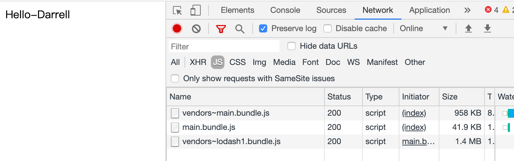
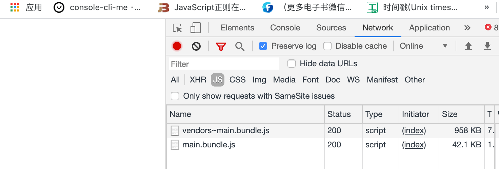

# 配置 Lazy Loading （懒加载）

关于懒加载的我们其实之前几节课上面都有用到，其实就是代码的异步引入。

&nbsp;

## 写点代码

修改 `async.js`，导出一个简单的在页面写入文字的一个方法。

```javascript
const getComponent = async () => {
	const { default: _ } = await import(/* webpackChunkName:"lodash1" */ 'lodash');
	const element = document.createElement('div');
	element.innerHTML = _.join(['Hello', 'Darrell'], '-');
	return element;
}

export default getComponent;
```


在入口文件使用 `index.js`：

```javascript
import getComponent from './async';

getComponent().then(element => {
	document.body.appendChild(element);
});

```

我们运行 `npm run dev`，我们可以在浏览器上面看到加载了三个 `js` 文件：



这个因为我们在入口文件直接执行了这个函数，我们在修改一下 `index.js`：

```javascript
import getComponent from './async';

document.addEventListener('click', () => {
  getComponent().then(element => {
    document.body.appendChild(element);
  });
})

```

当我们点击页面任何地方的时候，再去加载 `loadsh.js`， 我们重新打包，可以看到页面一进来只加载了两个文件，等到点击的页面的时候，才会去加载 `loadsh.js`




## 相关延伸

###  `react`、`vue` 的框架

如果我们写过相关的 `react`、`vue` 的框架代码的话，这些框架都是单页应用，里面会有一个路由切换的概念，一般当我们访问首页的时候，它其实会把诸如 详情页、编辑页、列表页等页面都给加载完成，这个时候我们只需要首页的代码就够了。可以把这些页面做一个代码分割，然后等到路由切换到相应的页面的时候在异步载入相应的代码即可，这样就一定程度上提高页面的加载效率。

&nbsp;

### 是 `ECMAScript` 的语法

懒加载实际上就是 `import` 的语法，他不是 `webpack` 的功能，而是 `ECMAScript` 的语法，`webpack` 做的只是识别这种语法并应用。

&nbsp;

### 返回的是 `promise` 类型

`import` 实际上返回的是一个 `promise` 的类型，如果我们的项目对于低端浏览器也有相应的支持，我们就需要安装 `@babel/polyfill` 来诸如一些兼容低端浏览器的方法：不过我们也可以在 `.babelrc` 中配置相应的 `useBuiltIns` ：

```json
{
	"presets": [
    [
      "@babel/preset-env",
      {
        "useBuiltIns": "usage"
      }
    ],
    "@babel/preset-react"
  ]
}
```

我们还可以使用 `async await` 来更加优雅的改写我们 `async.js` 中的文件：

```javascript
const getComponent = async () => {
	const { default: _ } = await import(/* webpackChunkName:"lodash1" */ 'lodash');
	const element = document.createElement('div');
	element.innerHTML = _.join(['Hello', 'Darrell'], '-');
	return element;
}

export default getComponent;

```


&nbsp;

## 相关链接

* [webpack 官网 lazy loading](https://webpack.js.org/guides/lazy-loading/)


&nbsp;

## 示例代码

示例代码可以看这里：

- [Lazy Loading 示例代码]()