# 显示日志和异常处理优化

## 优化构建显示日志

现在我们代码打包回展示一大堆日志，但其实很多并不需要我们来关注，如下图所示：

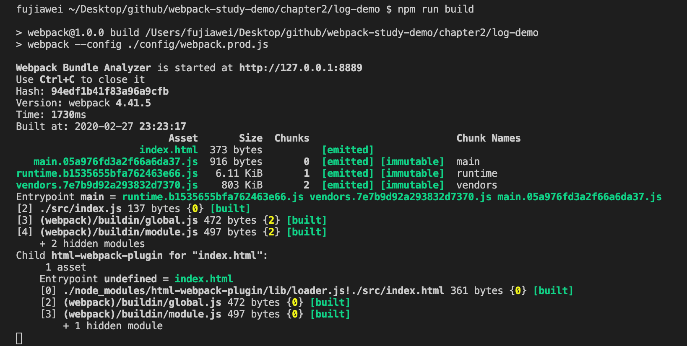

### `stats`

在 `webpack` 中有一个配置 `stats`，他的意思是：

> 如果你不希望使用 `quiet` 或 `noInfo` 这样的不显示信息，而是又不想得到全部的信息，只是想要获取某部分 `bundle` 的信息，使用 `stats` 选项是比较好的折衷方式。

更多配置如下图：

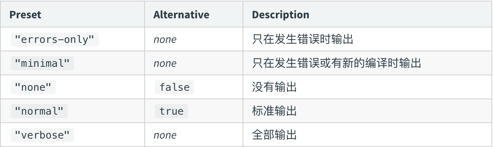


一般来说我们可以设置为 `errors-only`，如果你是在 `devServer` 打包，你需要将此配置的放到 `devServer` 的配置文件中去。

配置完之后，线上打包阶段如下图：

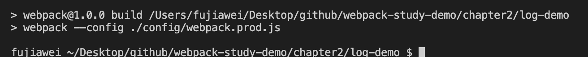

开发环境打包：

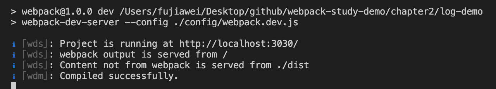

我们可以看到在线上打包阶段如果没有任何错误，在命令行中不会有任何提示，这其实也不是特别友好，因此我们可以使用一个 `webpack` 插件 `friendly-errors-webpack-plugin` 来帮我们再一次进行优化。

&nbsp;

### `friendly-errors-webpack-plugin`

[friendly-errors-webpack-plugin](https://github.com/geowarin/friendly-errors-webpack-plugin) 能给我们带来更好的日志提示体验，提供三种界面，如下：

* `success`：构建成功的⽇志提示

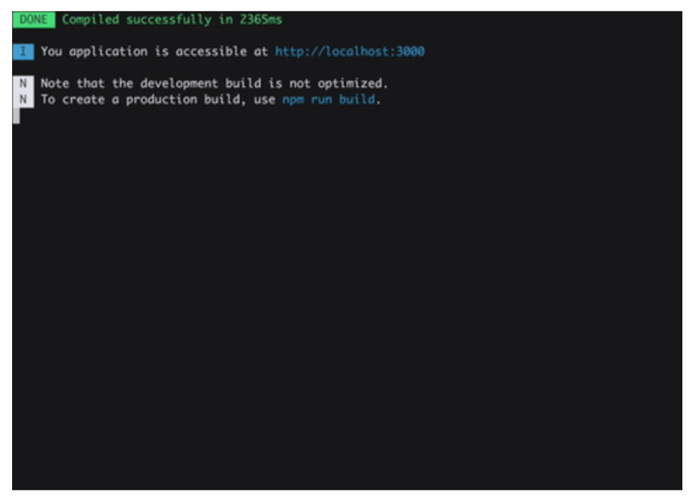

* `warning`：构建警告的⽇志提示

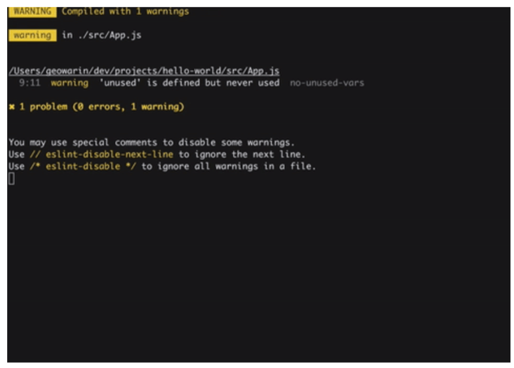

* `error`：构建报错的⽇志提示

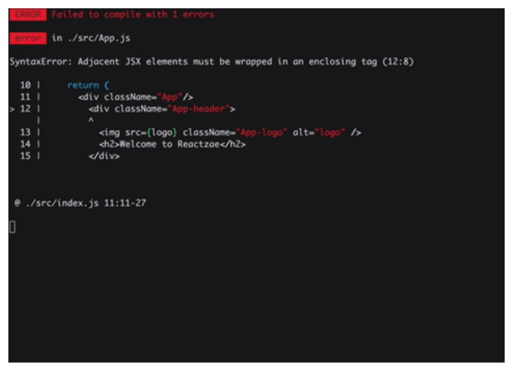

#### 安装

```shell
npm install friendly-errors-webpack-plugin -D
```

#### 配置

这个插件是与 `stats:error-only` 配合使用的：

```javascript
// ...
const FriendlyErrorsWebpackPlugin = require('friendly-errors-webpack-plugin');

module.exports = {
  // ...
  plugins: [
    // ...
    new FriendlyErrorsWebpackPlugin(),
  ],
  // ...
  stats: 'errors-only',
}
```

我们可以在 `index.js` 默认是输出一行字，可以看到打包成功：

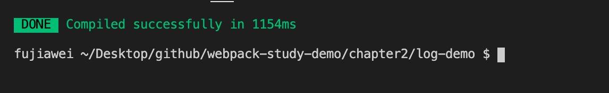

接着在 `index.js` 写点 `jsx` 代码，并去掉 `babel-loader`，可以看到打包报错：

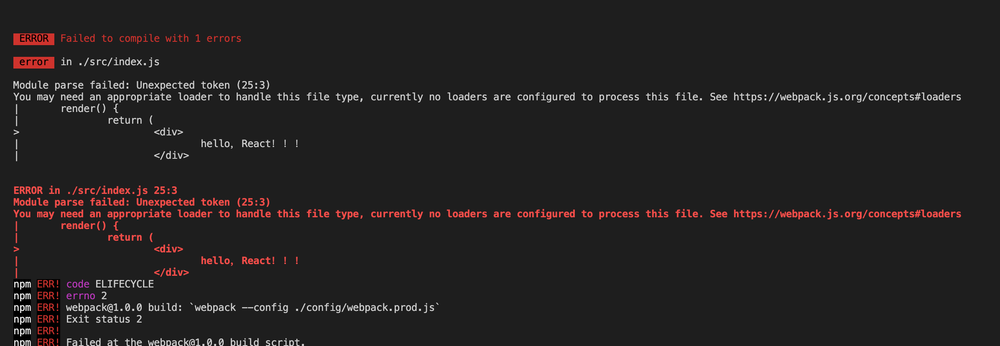

接着我们引入一下 `lodash`、`jquery` 在页面中输出一行字，我们会发现打包会报警告：

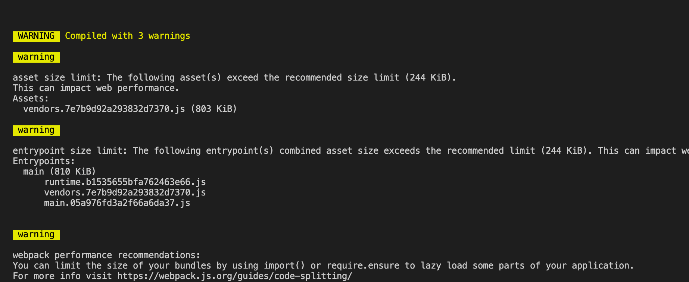

&nbsp;

到此为止，我们控制台的日志的优化就完成了。

&nbsp;

## 异常处理优化

### 如何判断构建是否成功?

这里我们要思考一个问题，我们如何判断构建成功，当然我们可以在控制台中直观的看到，但是如果我们要做代码的部署发布或者文件同步的时候，我们需要知道当前的构建状态。

我们可以在每次构建完成后输⼊ `echo $?` 获取错误码，当这个值不为 0 的时候，就代表这次构建是失败的。如下图：

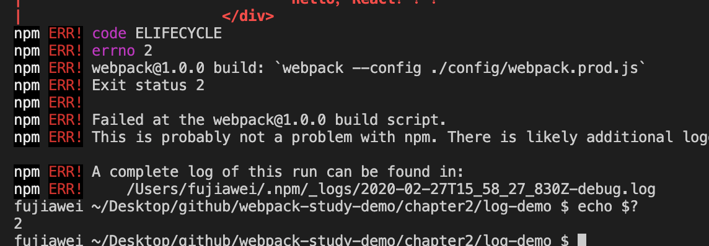

&nbsp;

### 构建异常和中断处理

`webpack4` 之前的版本构建失败不不会抛出错误码 (`error code`)。

那么 `webpack3.0` 该怎么做呢？我们可以通过 `Node.js` 中的 `process.exit` 规范：

* 0 表示成功完成，回调函数中，`err` 为 `null`
* 非 0 表示执行失败，回调函数中，`err` 不为 `null`，`err.code` 就是传给 `exit` 的数字。

&nbsp;

### `webpack` 主动捕获错误并处理

如果我们想在构建错误的时候，去做一点我们自己的事情，我们可以通过一个 `hook` 来实现。

在 `Webpack` 的 `compiler` 对象中有一个打包结束的 `hook` ——  `done`，我们可以在这个钩子里面去要做的事情，如错误上报等。

我们可以新增一个函数： 

```javascript
// ...
const FriendlyErrorsWebpackPlugin = require('friendly-errors-webpack-plugin');

module.exports = {
  // ...
  plugins: [
    // ...
    function() {
      this.hooks.done.tap('done', (stats) => {
        if (stats.compilation.errors && stats.compilation.errors.length && process.argv.indexOf('--watch') == -1)
        {
          console.log('build error，no babel loader');
          process.exit(1);
        }
      })
    } 
  ],
  // ...
  stats: 'errors-only',
}
```

我们打包一下，可以看到打印出了相应的错误，并将错误码改为了 `1`，默认我们在上面看到是 `2`：


关于 `webpack` 插件和`hooks` 的相关知识，笔者会在底层原理那节讲到。


&nbsp;

## 一些说明

这一节内容，笔者是参考 《极客时间 `webpack` 课程》的相关章节内容。


&nbsp;

## 相关链接

- [webpack 官网 stats](https://webpack.js.org/configuration/stats/)
- [friendly-errors-webpack-plugin](https://github.com/geowarin/friendly-errors-webpack-plugin)
- [webpack 官网 Compiler Hooks](https://webpack.js.org/api/compiler-hooks/)
- [webpack 官网 编写一个插件](https://webpack.js.org/contribute/writing-a-plugin/)

&nbsp;

## 示例代码

示例代码可以看这里：

- [日志优化显示 示例代码](https://github.com/darrell0904/webpack-study-demo/tree/master/chapter2/log-demo)

