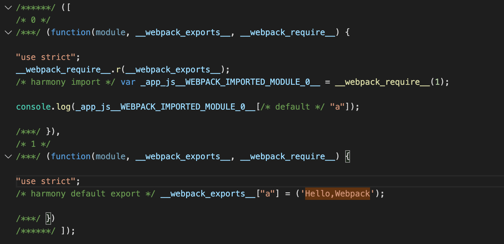
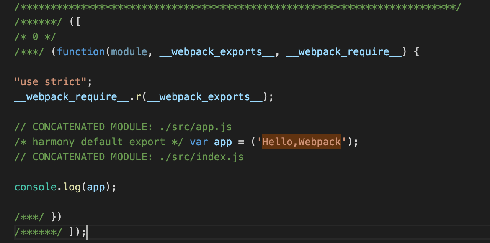
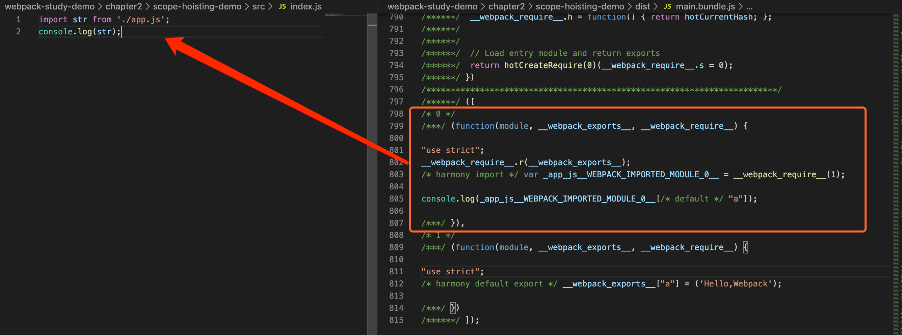
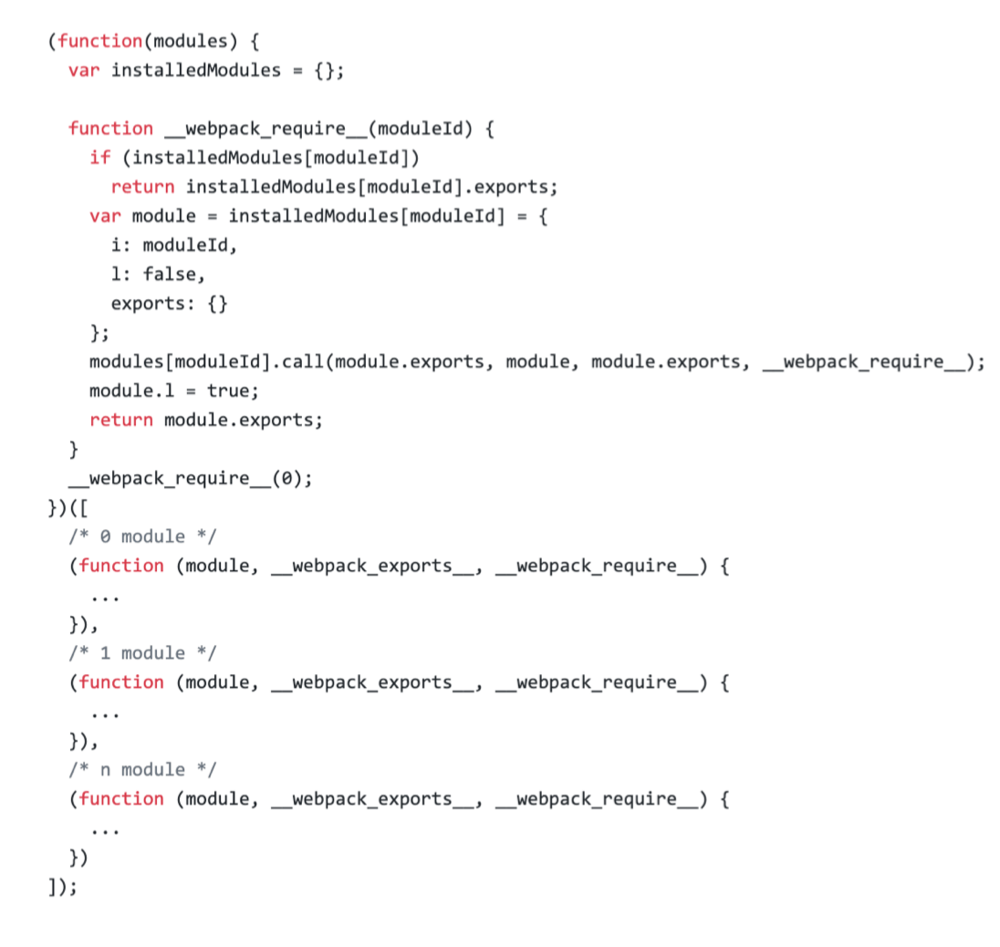

# Webpack 中的 ScopeHoisting

`Scope Hoisting` 可以让 `Webpack` 打包出来的代码文件更小、运行的更快，它又译作 "作用域提升"。它是 `Webpack 3` 推出的功能。

&nbsp;

## 看一个现象

先写点代码，新增 `app.js`，导出一段字符串：

```javascript
// app.js

export default 'Hello,Darrell';
```

接着修改 `index.js`：

```javascript
import str from './app.js';
console.log(str);
```

我们将配置文件的 `mode` 改为 `none`，打包一下 `npm run bundle`，如下图：



我们可以看到一个问题就是 **构建后的代码存在⼤大量量闭包代码**，这样就会导致以下问题：

* ⼤量作⽤域包裹代码，导致体积增大(模块越多越明显)
* 运行代码时创建的函数作用域变多，内存开销变⼤

这个时候我们就可以使用 `ScopeHoisting` 帮我们解决这些问题。

&nbsp;

## `scope hoisting` 原理

将所有模块的代码按照引用顺序放在一个函数作用域⾥，然后适当的重命名一些变量以防⽌变量名冲突，这样就可以减少函数申明代码和内存开销。

在 `webpack4.0` 中默认当 `mode` 为 `production` 的时候，就会开启 `scope hoisting`，或者我们可以使用 `Webpack` 的内置插件 `ModuleConcatenationPlugin`，我们在 `webpack.dev.js` 中做如下配置：

```javascript
...
const webpack = require('webpack');

const devConfig = {
	mode: 'none',
  // ...
  plugins: [
		// ...
		new webpack.optimize.ModuleConcatenationPlugin()
	],
	// ...
}

module.exports = devConfig;
```

重新打包 `npm run bundle`，可以看到如下图所示，把代码都打包到了同一个函数作用域中：



`scope hoisting` 帮我们分析出了模块之间的依赖关系，尽可能的把打散的模块合并到一个函数中去，但前提是不能造成代码冗余。

由于 `Scope Hoisting` 需要分析出模块之间的依赖关系，因此源码必须采用 `ES6` 模块化语句，不能使用 `commonjs`，不然它将无法生效。这其实和 `tree shaking` 是一样的。

&nbsp;

## 机制分析

我们可以看到 `index.js` 模块分析之后，会转换成一个模块初始化函数：



可以看到：

* 被 `webpack` 转换后的模块会带上一层包裹
* `import` 会被转换成 `__webpack_require`

可以再看一下 `webpack` 打包出来的 `bundle.js` 文件：



可以看到：

* 其实打包出来的是一个 IIFE（匿名函数）
* `modules` 是一个数组，每一项是一个模块初始化函数
* `__webpack_require` 用来加载函数，返回 `module.exports`
* 通过 `__webpack_require__(0)` 来启动程序。

如果开启了 `HMR` 之后，`bundle` 也会有相应的变化，但是整体结构还是不变的。

&nbsp;

## 相关链接

* [Webpack 官网 ModuleConcatenationPlugin](https://webpack.js.org/plugins/module-concatenation-plugin/#root)
* [通过Scope Hoisting优化Webpack输出](https://segmentfault.com/a/1190000012600832)
* [webpack 的 scope hoisting 是什么？](https://segmentfault.com/a/1190000018220850)
* [Webpack 3 的新功能：Scope Hoisting](https://zhuanlan.zhihu.com/p/27980441)

&nbsp;

## 示例代码

示例代码可以看这里：

- [ScopeHoisting 实例代码](https://github.com/darrell0904/webpack-study-demo/tree/master/chapter2/scope-hoisting-demo)

