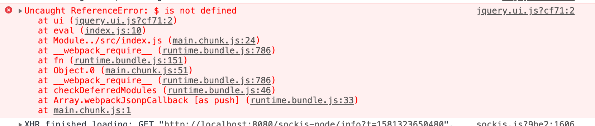
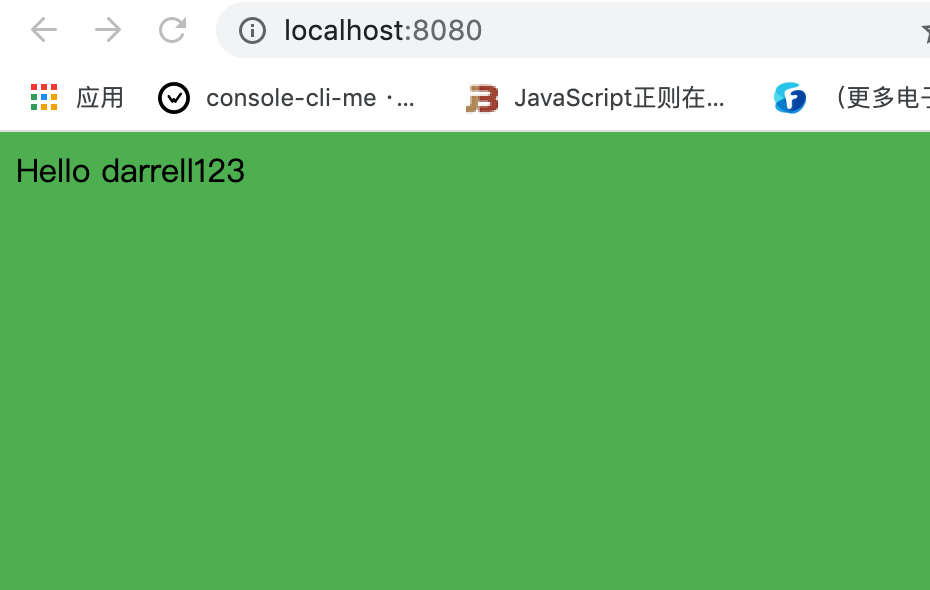
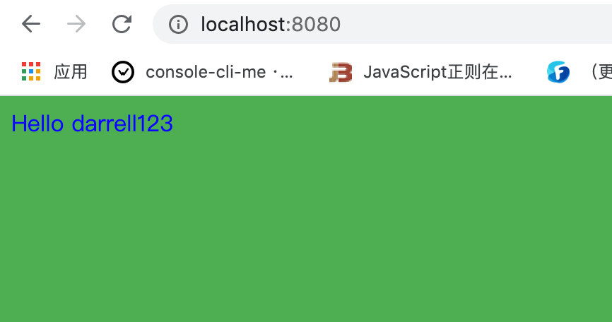
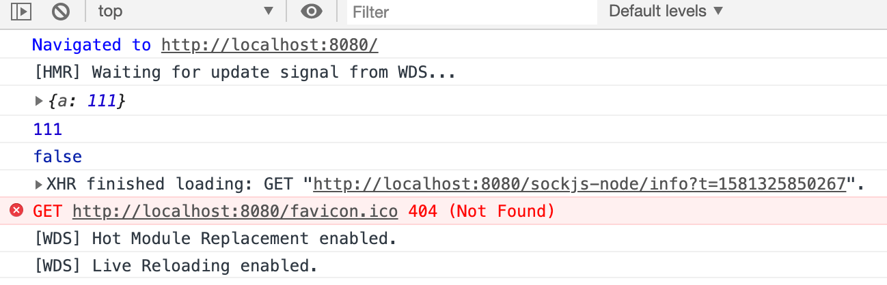
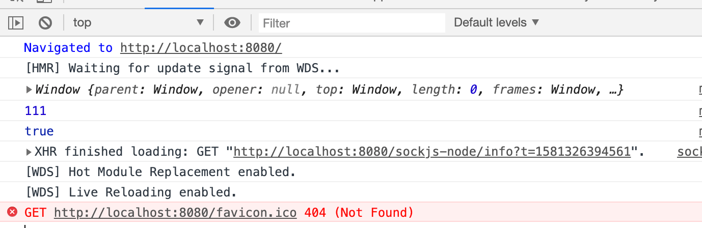

# Shimming 的作用

`shimming` 中文名 **垫片**，`webpack` 在打包的过程中，我们往往需要做一些代码上的兼容或者打包过程的兼容。

我们之前的使用过 `@babel/polyfill` 就是一个例子，为了在低版本的浏览器中自动帮我们去构建类似于 `promise` 这样的全局变量，从而能让我们的项目在低版本浏览器中也能运行。

 `@babel/polyfill` 就是一个 **垫片**，他能解决 `webpack` 打包过程中的一些兼容性的问题，但这仅仅是浏览器兼容性，还有其他各种各样的兼容性垫片。 


&nbsp;

## 几个例子

### 第一个例子

我们新建一个 `jquery.ui.js`，用来做 `jquery` 的一些处理：

```javascript
export function ui() {
  $('body').css('background', '#4caf50');
}
```

然后在 `index.js` 中导入并使用使用：

```javascript
import _ from 'lodash';
import $ from 'jquery';
import { ui } from './jquery.ui.js'

ui();
console.log('---123---');
const dom = $('<div>');
dom.html(_.join(['Hello', 'darrell123'], ' '));
$('body').append();

```

我们打包一下 `npm run dev`，我们发现页面报了一个错，内容是 `$` 找不到，



想想也是，`webpack` 打包的是一个一个模块，模块里面的变量只能在模块内使用，这也保证了模块与模块之间不存在耦合，方便错误定位。在 `index.js` 引入的 `jquery` 不能在 `jquery.ui.js` 中使用，因此我们可以修改 `jquery.ui.js`，引入 `jquery`：

```javascript
import $ from 'jquery';

export function ui() {
  $('body').css('background', '#4caf50');
}
```

重新打包一下，页面变成功的跑起来了。



但是如果这个库不是我们自己的代码，而是一个第三方的代码，我们又不能直接去修改人家的代码，这个时候该怎么办呢？

这个时候我们就需要一个垫片来帮我们解决这个问题。我们修改公共配置文件 `webpack.common.js`：

```javascript
...
const webpack = require('webpack');
...

module.exports = {
  ...
  plugins: [
		...
		new webpack.ProvidePlugin({
			$: 'jquery',
		})
	],
  ...
}
```

上面的配置的意思是当 `webpack` 发现相应的模块里面有 `$` 这个字符串，他就会自动的在你这个模块里面引入 `jquery`。

实际上就类似于在 `jquery.ui.js` 中帮我们自动导入了 `jquery` 并命名为 `$`。

我们重启一下服务，可以看到代码运行成功：


我们还可以在 `jquery.ui.js` 中使用一下 `lodash`，我们将背景色改为草料绿，文字颜色改为蓝色。

```javascript
export function ui() {
  $('body').css('background', _.join(['#4caf50'], ''));
  $('body').css('color', _join(['blue'], ''));
}
```

那么我们要在公共的配置文件中配置上 `lodash`：

```javascript
...
const webpack = require('webpack');
...

module.exports = {
  ...
  plugins: [
		...
		new webpack.ProvidePlugin({
			$: 'jquery',
      _: 'lodash'
		})
	],
  ...
}
```

重新打包一下，我们会发现代码运行成功了。




&nbsp;

## 第二个例子

我们在入口文件 `index.js` 打印 `this`，并且看看这个 `this` 是不是和 `window` 相等。

```javascript
this.a = 111;

console.log(this);
console.log(this.a);

console.log(this === window);
```

我们打包一下代码，其实这个 `this` 指向当前这个模块，可以在浏览器中看到其不等于 `window`：



那么我们想要所有的模块都指向 `window`，那该怎么做呢？

我们可以借助 `imports-loader` 来实现。

### 安装

```javascript
npm install imports-loader -D
```

### 配置

我们在公共配置文件中进行配置：

```javascript
...

module.exports = {
	...
	module: {
		rules: [
      { 
        test: /\.js$/, 
        exclude: /node_modules/, 
        use: [
          {
            loader: 'babel-loader'
          }, 
          {
            loader: 'imports-loader?this=>window'
          }
        ]
			},
      ...
   ],
  }
  ...
}
...
```

我们重新打包，可以在浏览器中看到现在的 `this` 指向了 `window`。 



上面这个插件其实就是改变了 `webpack`  中的一些默认的特性或者行为，这其实也是一个 **垫片** 的作用。


其实 **垫片** 所涵盖的场景有很多，大家可以在碰到相应的场景的时候在去网上自行查找，笔者也不做过多的介绍了。

&nbsp;

## 相关链接

- [webpack 官网 shimming](https://webpack.js.org/guides/shimming/)

&nbsp;

## 示例代码

示例代码可以看这里：

- [shimming  示例代码](https://github.com/darrell0904/webpack-study-demo/tree/master/chapter2/shimming-demo)

