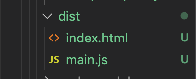

# SplitChunksPlugin 配置参数详解

`webpack`  之所以能够进行代码分割，原因是它内部集成了 `SplitChunksPlugin` 插件，它能够非常方便的帮我们进行代码分割。


## 给打包文件命名

上一节我们发现同步打包出来的名字是 `vendor~main.js`、异步打包出来的名字是 `0.js` ，现在我们想给打包出来的名字命名为 `loader.js` 。

### 异步代码举例

我们修改一下 `async.js`：

```javascript
const getComponent = async () => {
	const { default: _ } = await import(/* webpackChunkName:"lodash" */ 'lodash');
	const element = document.createElement('div');
	element.innerHTML = _.join(['Dell', 'Lee'], '-');
	return element;
}

export default getComponent;
```

上面 `/* webpackChunkName:"lodash" */` 这段代码的是 `webpack` 的 魔法注释。它的作用是告诉 `webpack` 将这段打包文件的名字设为 `lodash`

打包出来的文件如下：


为什么前面多了一个 `vendors～`，我们可以修改 `webpack` 配置文件下的 `optimization` 参数。

```javascript
// webpack.common.js

...
// 配置属性
optimization: {
    splitChunks: {
        chunks: "all",
        cacheGroups: {
            vendors: false,
            default: false,
        }
    }
},
...
```

我们重新进行打包，我们可以看到文件名变成了 `lodash.js`


&nbsp;

`optimization` 下的 `splitChunks` 有相当多的配置参数，接下来我们来讲一波。


## 官方默认配置

`optimization` 下的 `splitChunks` 官方给了默认配置：

```javascript
splitChunks: {
    chunks: "async", // 必须三选一： "initial" | "all"(推荐) | "async" (默认就是async)
    minSize: 30000, // 最小尺寸，30000
    minChunks: 1, // 最小 chunk ，默认1
    maxAsyncRequests: 5, // 最大异步请求数， 默认5
    maxInitialRequests: 3, // 最大初始化请求书，默认3
    automaticNameDelimiter: '~', // 打包分隔符
    name: true, // 打包后的名称，此选项可接收 function
    cacheGroups: {   // 这里开始设置缓存的 chunks ，缓存组
        vendors: {
            test: /[\\/]node_modules[\\/]/,
            priority: -10,
            filename: 'vendors.js'
        },
        default: {
            minChunks: 2,
            priority: -20,
            reuseExistingChunk: true, // 可设置是否重用该chunk
            filename: 'common.js'
        }
    }
}
```


## 默认配置介绍

`webpack` 将会基于以下条件自动分割代码块:

- 新的代码块被共享或者来自 `node_modules` 文件夹
- 新的代码块大于 `30kb` (在 `min+giz` 之前)
- 按需加载代码块的请求数量应该 `<=5`
- 页面初始化时加载代码块的请求数量应该 `<=3`


我们修改 `index.js`：

```javascript
// 同步引入
import _ from 'lodash';
console.log(_.join(['a', 'b', 'c'], '***'));


// 异步引入
// import getComponent from './async.js'
// getComponent().then(element => {
// 	document.body.appendChild(element);
// });
```


### `chunks`

这个参数意思是 `webpack` 打包何种引入方式的代码，

配置之后只会选择对应于初始化代码块，按需加载代码块，或者是所有代码块中的一个。

有三个参数：

* `all`：所有引入的方式都打包


* `initial`：`initial` 表示只从入口模块进行拆分

此情况下，使用我们的异步引入，模块是不会打包到相应的 `js` 中的。


* `aysnc`：异步引入，如我们上面讲到的

此情况下，使用我们的同步引入，代码是不会打包 `lodash.js` 的。

同步引入打包结果：



异步引入打包结果：


### `minSize`

此参数代码代表当包的大小大于 `30kb` 的时候，才会进行代码分割


### `minChunks`

此参数代表包至少被引用几次以上之后，才会进行代码分割


### `maxAsyncRequests`

此参数规定**按需加载的最大并行请求数**，当异步引入模块的时候，**按需加载的代码块（vendor-chunk）并行请求的数量小于或等于5个**。


### `maxInitialRequests`

此参数规定**最大的初始化加载次数**，最大的初始请求数是为了防止 `chunk` 划分的过于细致，导致大量的文件请求，降低性能。


### `automaticNameDelimiter`

此参数规定了打包出来的代码名字用什么符号连接。


## `name`

此参数规定了默认使用 `cacheGroups` 中配置的名字。


### `cacheGroups`

此参数称为配置缓存组：规定了要打包的文件最终会被放到哪一个文件组中去，最后在对我们设置的文件组进行打包。如果想继续细分代码，可以使用它。

> 官方默认参数的意思：缓存组( `Cache Groups` )。同样的，缓存组也有默认的配置；缓存组默认将 `node_modules` 中的模块拆分带一个叫做 `vendors` 的代码块中，将最少重复引用两次的模块放入 `default`中。
>
> 上面是缓存组的默认配置，可以通过 `default:false` 禁用默认的缓存组，然后就可以自定义缓存组，将初始化加载时被重复引用的模块进行拆分，就像这样：
>
> ```javascript
> cacheGroups: {
>   commons: {
>     name: "commons",
>     chunks: "initial",
>     minChunks: 2
>   }
> }
> ```
>
> 


#### `vendors`

这个是我们引入 `node_modules` 依赖包该放的文件组。


#### `default`

此组规定了至少引用两次，的模块都可以放到这个组中。


那么问题来了，当一个引用依赖，比如说 `jquery` 都满足两个条件的话，我们该怎么打包。

##### `priority`

此参数规定**表示缓存的优先级**，当一个模块同时满足两个要求的时候，我们会根据这个值来进行分组，先放到 此参数小的值中去。

上面的例子中，`webpack` 会将 `jquery` 打包到 `vendors` 的组中去，因为它的 `priority` 比 `default` 的大。


##### `reuseExistingChunk`：

此参数规定如果一个模块已经被打包过了，当我们再打包的时候，`webpack` 将不再将此模块打包，忽略这个模块，直接复用之前我们已经打包过的这个模块。


举个例子如果我们在项目中引用了 `jquery` 和 `lodash` 两个包，


## 相关链接

- [webpack官网 SplitChunksPlugin](https://webpack.js.org/plugins/split-chunks-plugin/)
- [webpack 官方 demo](https://github.com/webpack/webpack/tree/master/examples/)
- [一步一步的了解webpack4的splitChunk插件](https://www.jb51.net/article/147552.htm)


## 示例代码

示例代码可以看这里：

- [SplitChunksPlugin  示例代码]()