# 配置 SplitChunksPlugin

`webpack`  之所以能够进行代码分割，原因是它内部集成了 `SplitChunksPlugin` 插件，它能够非常方便的帮我们进行代码分割。

&nbsp;

## `webpack-bundle-analyzer`

此依赖是方便我们查看打包内容的的可视化分析工具。

&nbsp;

### 安装依赖

```javascript
npm install webpack-bundle-analyzer -D
```

&nbsp;

### 配置

修改 `/config/webpack.common.js`，在 `plugins` 配置中添加配置：

```javascript
const BundleAnalyzerPlugin = require('webpack-bundle-analyzer').BundleAnalyzerPlugin;

module.exports = {
  ...
  plugins: [
    ...
    new BundleAnalyzerPlugin({
      analyzerHost: '127.0.0.1',
      analyzerPort: 8889,
      openAnalyzer: false,
    }),
    ...
  ],
  ...
}
```

修改 `package.json` 的 `script`  参数：

```json
...

"scripts": {
  ...
  "analyz": "NODE_ENV=production npm_config_report=true npm run build"
},

...
```

我们开发环境打包一下：`npm run bundle`；我们可以看到打包结果：

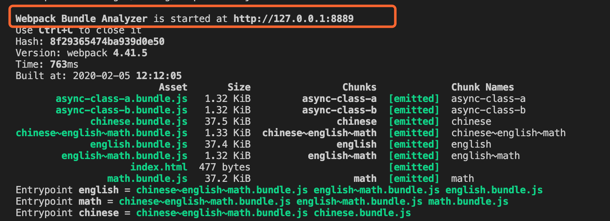

我们打开 `http://127.0.0.1:8889/` 页面：

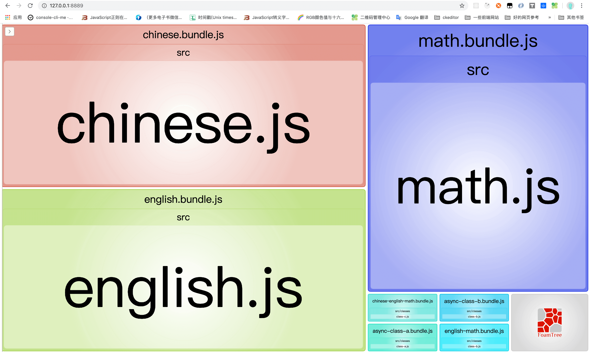


&nbsp;

我们可以很清楚的看到现在的项目打包出了几个文件。

&nbsp;

## `html-webpack-externals-plugin`

再将 `splitChunksPlugin` 之前，我们先来讲一下 [`html-webpack-externals-plugin`](https://github.com/mmiller42/html-webpack-externals-plugin)，此插件可以将一些公用包提取出来使用 `cdn` 引入，不打入 `bundle` 中：

我们先修改一下 `index.js`，写几行 `react` 代码：

```jsx
import React, { Component } from 'react';
import ReactDom from 'react-dom';

class App extends Component {
	render() {
		return (
			<div>
				hello，React！！！
			</div>
		)
	}
}

ReactDom.render(<App />, document.getElementById('root'));
```

我们先打包一下，可以看到如下图：

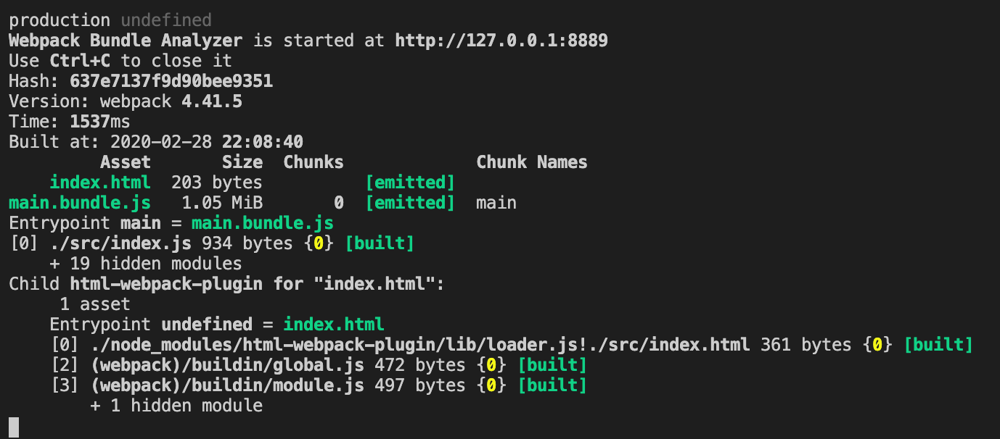

可以看到 `bundle` 的大小为 `1.05MB`，接着我们配置一下 `html-webpack-externals-plugin`。

### 安装

```shell
npm install html-webpack-externals-plugin -D
```

### 配置

```javascript
// ...
const HtmlWebpackExternalsPlugin = require('html-webpack-externals-plugin');

const commonConfig = {
  // ...
	plugins: [
		// ...
		new HtmlWebpackExternalsPlugin({
			externals: [
				{
					module: 'react', // 模块名称
					entry: 'https://11.url.cn/now/lib/16.2.0/react.min.js', // 引入的cdn
					global: 'React', // 创建一个全局对象 React
				},
				{
					module: 'react-dom',
					entry: 'https://11.url.cn/now/lib/16.2.0/react-dom.min.js',
					global: 'ReactDOM',
				},
			]
		}),
	],
	// ...
}

// ...
```

我们重新打包一下，可以看到 `bundle` 的大小变成了 `10.1KB`：

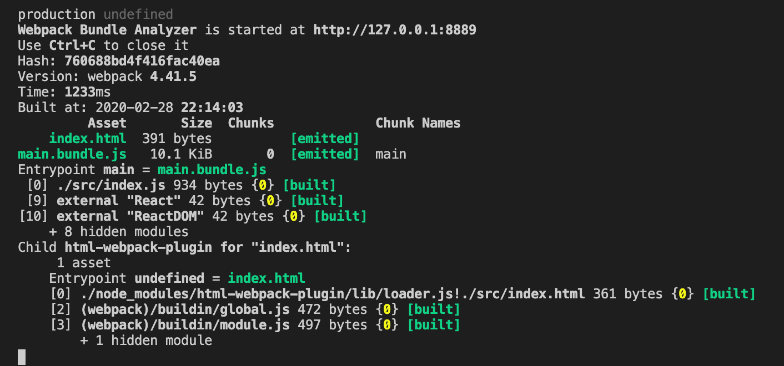

同时在打包出来的 `index.html` 中也引入了对应的 `CDN`：

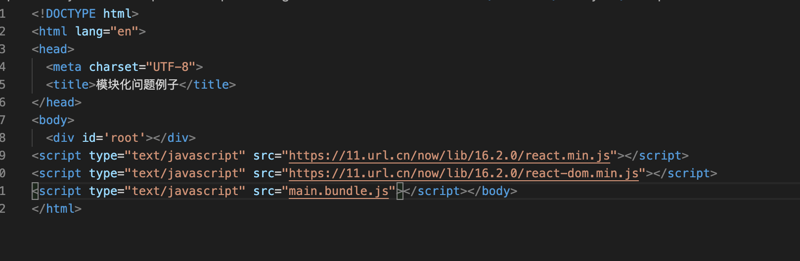

不过此插件需要和 `html-webpack-plugin` 一起使用，因为需要将 `CDN` 的地址引入到 `html` 中去。

更多的配置文件大家可以参考： [`html-webpack-externals-plugin`](https://github.com/mmiller42/html-webpack-externals-plugin)。

接下来我们就开始讲 `splitChunksPlugin`。

&nbsp;

## 给异步模块命名

上一节我们发现同步打包出来的名字是 `vendor~main.js`、异步打包出来的名字是 `0.js` ，现在我们想给打包出来的名字命名为 `loader.js` 。

### 代码举例

我们修改一下 `async.js`：

```javascript
const getComponent = async () => {
  const { default: _ } = await import(/* webpackChunkName:"lodash" */ 'lodash');
  const element = document.createElement('div');
  element.innerHTML = _.join(['Hello', 'Darrell'], '-');
  return element;
}

export default getComponent;
```

上面 `/* webpackChunkName:"lodash" */` 这段代码的是 `webpack` 的魔法注释。它的作用是告诉 `webpack` 将这段打包文件的名字设为 `lodash.js`

打包出来的文件如下：

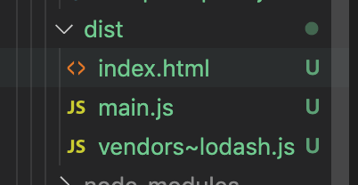

为什么前面多了一个 `vendors～`，我们可以修改 `webpack` 配置文件下的 `optimization` 参数。

```javascript
// webpack.common.js

...

// 配置属性
optimization: {
  splitChunks: {
    chunks: "all",
    cacheGroups: {
      vendors: false,
      default: false,
    }
  }
},

...
```

我们重新进行打包，我们可以看到文件名变成了 `lodash.js`

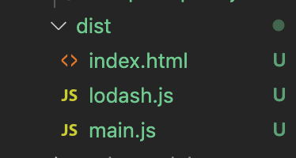


&nbsp;

`optimization` 下的 `splitChunks` 有相当多的配置参数，接下来我们来讲一波。


&nbsp;

## 官方默认配置

`webpack` 将会基于以下条件自动分割代码块:

- 新的代码块被共享或者来自 `node_modules` 文件夹
- 新的代码块大于 `30kb` (在 `min+giz` 之前)
- 按需加载代码块的请求数量应该 `<=5`
- 页面初始化时加载代码块的请求数量应该 `<=3`


`optimization` 下的 `splitChunks` 官方给了默认配置：

```javascript
splitChunks: {
  chunks: "async", // "initial" | "all"(推荐) | "async" (默认就是async) | 函数
  minSize: 30000,              // 最小尺寸，30000
  minChunks: 1,                // 最小 chunk ，默认1
  maxAsyncRequests: 5,         // 最大异步请求数， 默认5
  maxInitialRequests: 3,       // 最大初始化请求书，默认3
  automaticNameDelimiter: '~', // 打包分隔符
  name: true,       // 打包后的名称，此选项可接收 function
  cacheGroups: {   // 这里开始设置缓存的 chunks ，缓存组
    vendors: {
      test: /[\\/]node_modules[\\/]/,
      priority: -10,
    },
    default: {
      minChunks: 2,
      priority: -20,
      reuseExistingChunk: true, // 可设置是否重用该chunk
    }
  }
}
```


&nbsp;

## 新建测试代码

我们新建下面相关文件：

```javascript
.
├─ src    	  // 目录
   ├─ module 	// 模块
      ├─ module-1.js
      ├─ module-a.js
      ├─ module-b.js
      ├─ module-c.js
      └─ module-d.js
   ├─ entey1.js   // 工具函数目录
   ├─ entey2.js   // typescripe 的接口定义
   └─ entey3.js   // 样式文件目录
```

### `entry1.js`

```javascript
// entry1.js
import classB from './modules/module-b';
import classC from './modules/module-c';

let engligh = {
  teacher: 'english', age: 47
};

import( /* webpackChunkName: "async-class-a" */  './modules/module-a').then(classA =>{
  classA.push(engligh);
});

classB.push(engligh);
classC.push(engligh);
```

### `entry2.js`

```javascript
// entry2.js
import classB from './modules/module-b';
import classC from './modules/module-c';

let math = {
  teacher: 'math', age: 47
};

import(/* webpackChunkName: "async-class-a" */  './modules/module-a').then(classA =>{
  classA.push(engligh);
});

classB.push(math);
classC.push(math);
```

### `entry3.js`

```javascript
// entry3.js
import classC from './modules/module-c';

let engligh = {
  teacher: 'english', age: 47
};


import(/* webpackChunkName: "async-class-a" */ './modules/module-a').then(classA =>{
  classA.push(engligh);
});

import(/* webpackChunkName: "async-class-b" */ './modules/module-b').then(classB =>{
  classB.push(engligh);
});

classC.push(engligh);
```

### `module-1.js`

```javascript
// module-1.js
export default [
  {student: "大红1", age: 18},
  {student: "大米1", age: 19},
  {student: "大爱1", age: 17},
  {student: "大明1", age: 20}
]
```


### `module-a.js`

```javascript
// module-a.js
export default [
  {student: "大红", age: 18},
  {student: "大米", age: 19},
  {student: "大爱", age: 17},
  {student: "大明", age: 20}
]
```


### `module-b.js`

```javascript
// module-b.js
export default [
  {student: "小红", age: 18},
  {student: "小米", age: 19},
  {student: "小爱", age: 17},
  {student: "小明", age: 20}
]

```


### `module-c.js`

```javascript
// module-c.js
export default [
  {student: "张三", age: 18},
  {student: "李四", age: 19},
  {student: "王五", age: 17},
  {student: "赵六", age: 20}
]

```


### `module-d.js`

```javascript
// module-c.js
export default [
  {student: "张三", age: 18},
  {student: "李四", age: 19},
  {student: "王五", age: 17},
  {student: "赵六", age: 20}
]

```


我们修改配置文件 `webpack.common.js`：

```javascript
...

module.exports = {
  entry: {
    entry1: "./src/entry1.js",
    entry2: "./src/entry2.js",
    entry3: "./src/entry3.js",
  },
  ...
  optimization: {
    splitChunks: {
      chunks: 'all',
      minSize: 0,  // 对所有大小的模块 都进行拆分
      automaticNameDelimiter: '~',
    },
  },
  ...
}

```


&nbsp;

## 配置介绍


### `chunks`

表示对哪些模快进行优化。

有四个选项：

* `all`：表示对**所有模块**进行分离优化，**一般情况下**都用 `all`。

我么根据案例代码，打包一下 `npm run bundle`，我们可以看到打包出来6个文件，其中三个是入口文件

`entry1.bundle.js`、`entry2.bundle.js`、`entry3.bundle.js`， 这没什么好说的。

`module-a.js`、`module-b.js`、`module-c.js` 文件被分别打包为 `async-module-a.bundle.js`、`async-module-b.bundle.js`、`entry1~entry2~entry3.bundle.js`。


如下图所示：

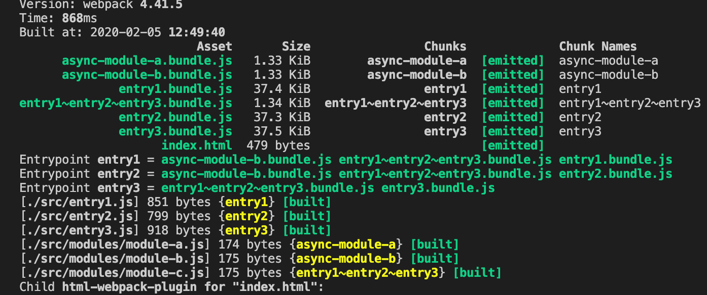

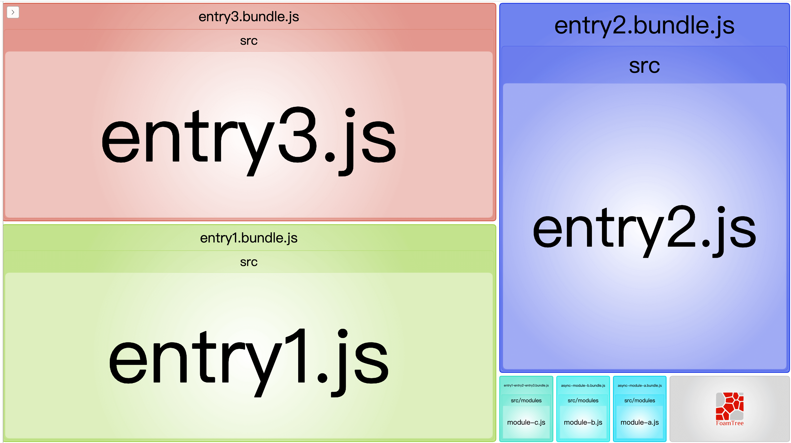


此时的 `webpack` 不会区分动态还是非动态，只是将需要的文件分离出一份。只要从非动态或者动态中分离出了一份之后，所有情况都能引用分离出来的代码。

从打包结果看，因为 `webpack`  分离出了 `async-module-b.bundle.js`，所以其内部原理可能是 **只要这个模块被动态加载了一次，就按动态加载处理。然后共享给其他非动态的模块。**


因为我们在`entry3.js` 中动态的引入了 `module-b`

```javascript
import(/* webpackChunkName: "async-module-b" */ './modules/module-b').then(classB =>{
  classB.push(engligh);
});
```

接着他就会共享给其他非动态的模块，如 `entry1.js`：

```javascript
import classB from './modules/module-b';
```


* `initial`：表示对初始化值进行分离优化。

**此属性的意思是告诉 `webpack`，我希望将动态导入的文件和非动态导入的文件分别打包，如果一个模块被动态引入，也被非动态引入。那么这个模块将会被分离2次。被分别打包到不同的文件中。**

我们修改一下配置文件 `chunks` 为 `initial`，接着我们重新打包 `npm run build`。

我们可以看到打包出来7个文件。相较于 `all` 参数多了一个 `entry1~entry2.bundle.js`，此选项代码了 在 `entry1.js` 和 `entry2.js` 中共同同步引入的 `classB`

```javascript
import classB from './modules/module-b';
```


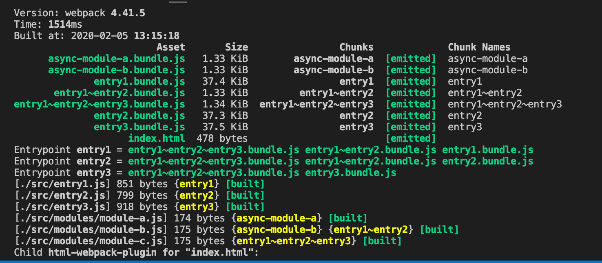

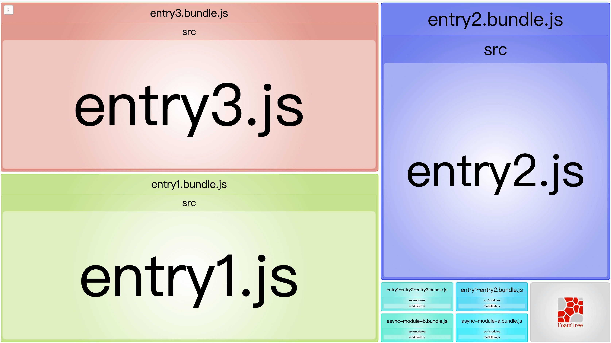


* `aysnc`：表示对动态（异步）导入的模块进行分离。

**此属性只会对异步引入的模块有效**

我们修改一下配置文件 `chunks` 为 `async`，接着我们重新打包 `npm run build`。

我们可以看到打包出来5个文件。相较于 `all` 参数少了 `entry1~entry2~entry3.bundle.js`，因为我们只对异步引入的模块进行分离。

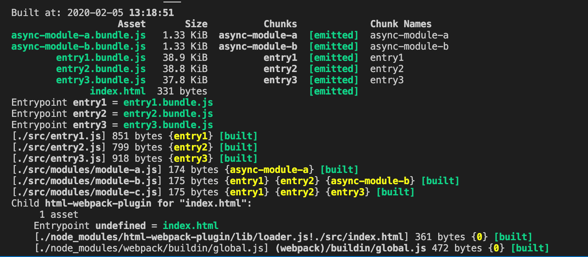

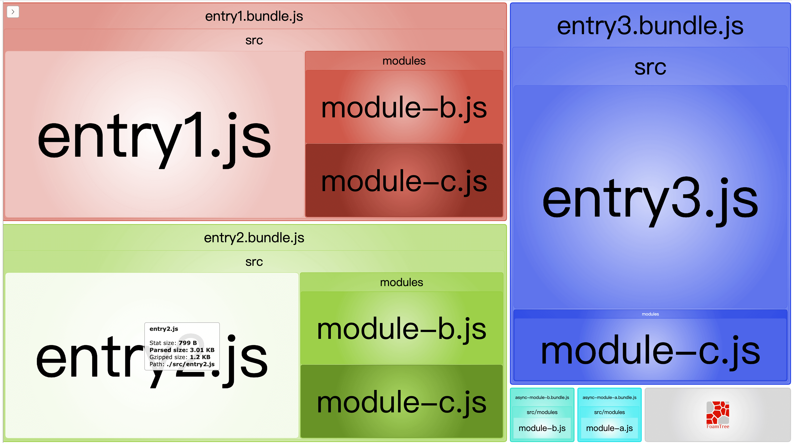


* 函数：代表对指定的模块快分离优化，相当于定制优化。


首先我们可以打印一下 `chunk.name`，看看他里面究竟是什么东西：

```javascript
// webpack.common.js
// optimization.splitChunks.chunks

chunks: function (chunk) {
  console.log(chunk.name);
},
```

如下图所示：

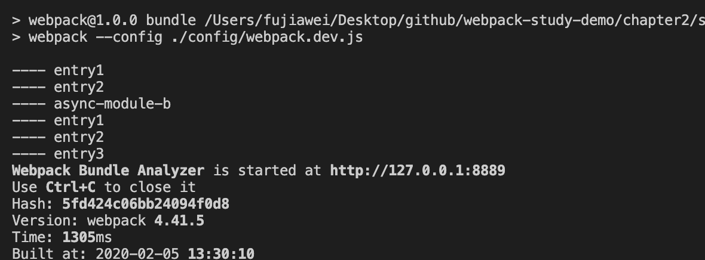


我们更改 `chunks`：

```javascript
// webpack.common.js
// optimization.splitChunks.chunks

chunks: function (chunk) {
  return chunk.name !== ''
},
```

当函数里面 `== ''` 的时候，其实际上的意识就相当于是 `all`。

我们再修改一下：

```javascript
// webpack.common.js
// optimization.splitChunks.chunks

chunks: function (chunk) {
  return chunk.name !== 'entry2'
},
```

我们在重新进行打包，我们会发现，打包出来的文件还是6个没错，但是一个 `entry1~entry2~entry3.bundle.js` 变成了 `entry1~entry3.bundle.js`。我们打开 `entry2.bundle.js`，我们会发现其中 `module-b` 与 `module-c` 并没有分离出去，但是动态加载的 `module-a` 却被分离了出去，在 `entry2.bundle.js` 我们可以看到是异步引入 `module-a` 的。

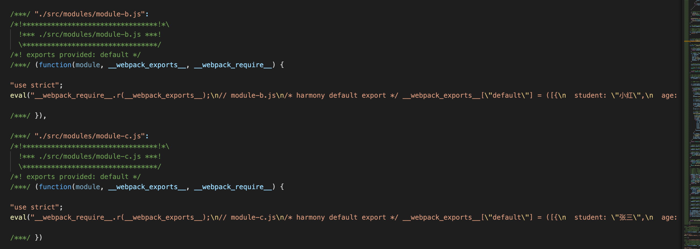

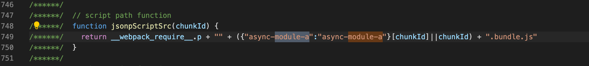

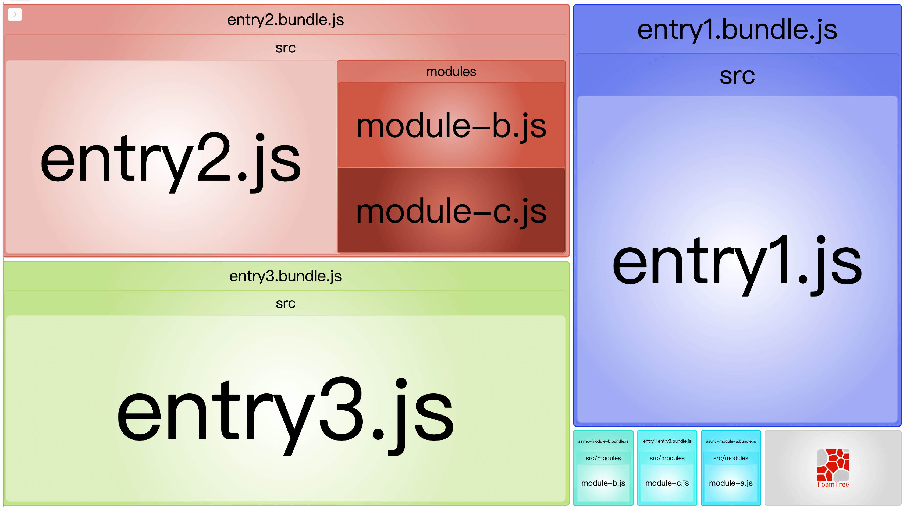


### `minSize`

此参数代码代表当包的大小大于 `30kb` 的时候，才会进行代码分割，我们在上面的例子中设置为了 `0`，是为了方便测试。

官方默认配置是 `30000`，即 `30kb`。


### `minChunks`

此参数代表包被引用几次以上之后，才会进行代码分割。

官方默认配置是 `1`，当然你还可以在缓存组中进行此参数的配置，比如官方的默认配置的 `default` 配置，至少被引用两次以上才会放到这个缓存组中来：

```javascript
cacheGroups: {
  defaultVendors: {
    test: /[\\/]node_modules[\\/]/,
    priority: -10
  },
  default: {
    minChunks: 2,
    priority: -20,
    reuseExistingChunk: true
  }
}
```


### `maxAsyncRequests`

此参数规定**按需加载的最大并行请求数**。

当异步引入模块的时候，**按需加载的代码块（vendor-chunk）并行请求的数量小于或等于的数量**。

官方默认配置是 `5`个。


### `maxInitialRequests`

此参数规定**最大的初始化加载次数**，最大的初始请求数是为了防止 `chunk` 划分的过于细致，导致大量的文件请求，降低性能。

官方默认配置是 `3` 个。

举个例子：

我们先讲上面的三个入口的文件都改成同步引入的模式，去除异步引入的方式：

```javascript
// entry1.js
import classA from './modules/module-a';
import classC from './modules/module-c';

let engligh = {
  teacher: 'english', age: 47
};

classA.push(engligh);
classC.push(engligh);

// entry2.js
import classA from './modules/module-a';
import classB from './modules/module-b';

let math = {
  teacher: 'math', age: 47
};

classA.push(math);
classB.push(math);

// entry3.js
import classC from './modules/module-c';
import classB from './modules/module-b';

let chinese = {
  teacher: 'chinese', age: 47
};

classB.push(chinese);
classC.push(chinese);

```

* #### 将 `maxInitialRequests` 设为1

打包后只生成 `3` 个文件。

**也就是说打包完成后每个入口文件最多之只能由 `1` 个文件组成。所以没有分离出来任何独立的模块。**

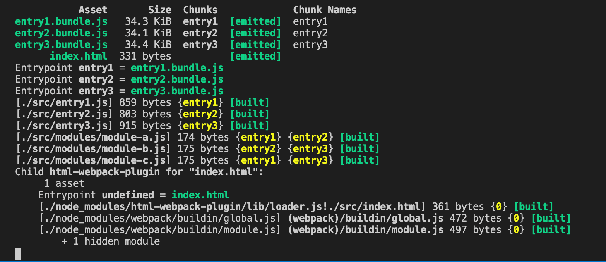

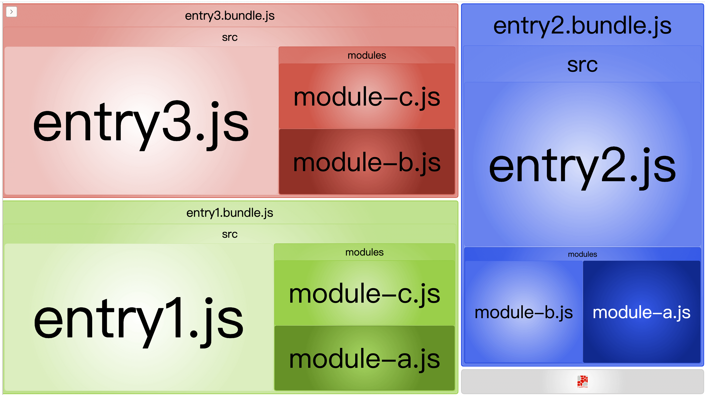


* #### 将 `maxInitialRequests` 设为2

打包后只生成 `4` 个文件，比之前多生成了一个 `entry1~entry2.bundle.js`，文件内是 `module-a` 模块。

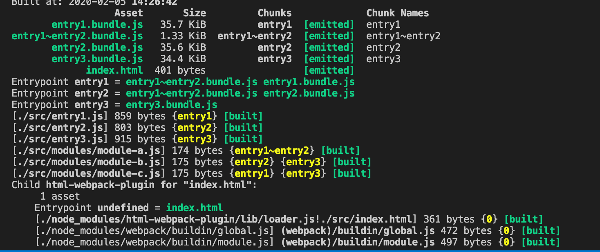

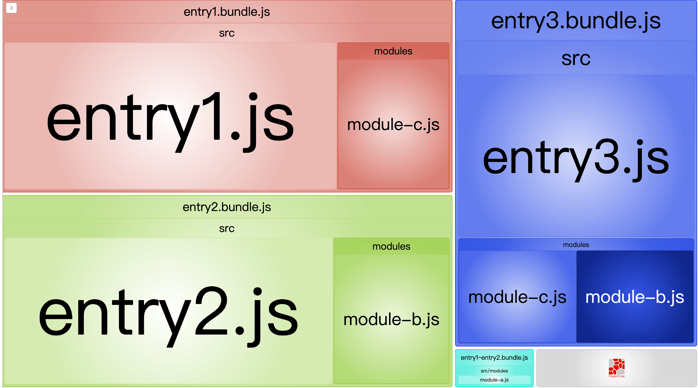

**但是 `module-b.js` 和 `module-c.js` 模块也被引入了两次。为什么是 `module-a` 被打印了出来？**

可能原因是跟模块的名字有关，我们把所有引入的 `module-c` 都改成 `module-1`，我们重新打包一下，我们会发现，此时多出来的是 `entry1~entry3.bundle.js`，文件内变成了 `module-1` 模块。

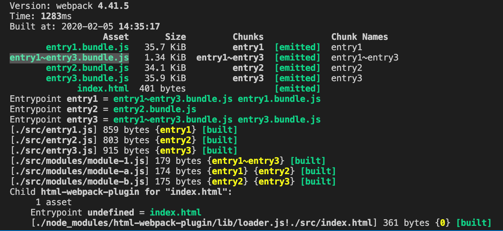

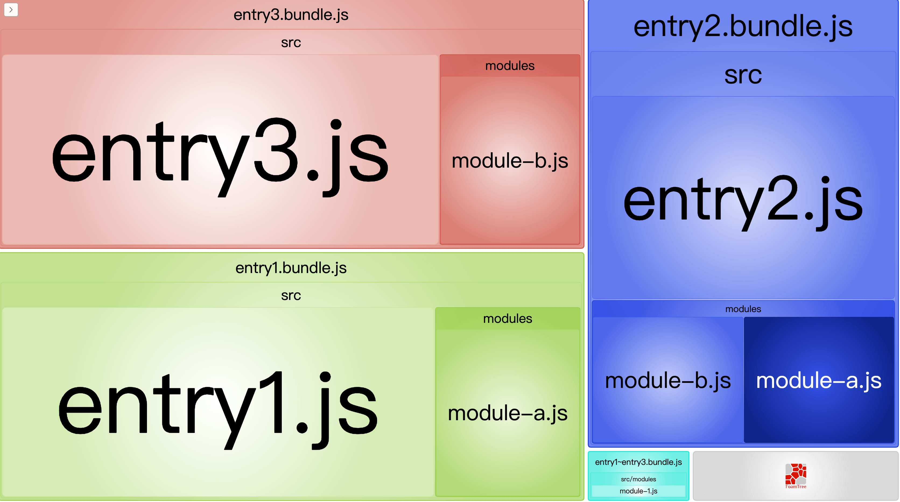

&nbsp;

同理我们可以将 `module-a` 改为  `module-d`，将 `module-c` 改回来， 重新打包一下，我们会发现打包出来的  `entry2~entry3.bundle.js`，文件内变成了 `module-b` 模块。


**一个入口打包完成后最多之能有2个文件组成。**

`entry1.bundle.js` 和 `entry2.bundle.js` 都引入 `entry1~entry2.bundle.js` 已经达到上限了。`entry3.bundle.js` 如果想在把 `module-c` 或者 `module-b` 在分离出来的话，其他两个就会超出限制，所以 `entry3.bundle.js` 就没有任何模块分离出来。


* #### 将 `maxInitialRequests` 设为3

打包后只生成 `6` 个文件，除了三个入口文件的 `js`  文件外，还多了 `entry1~entry2.bundle.js`、`entry2~entry3.bundle.js`、`entry1~entry3.bundle.js`，分别包含了 `module-a`、`module-b`、`module-c` 三个文件。这三个模块都被分离出来了。

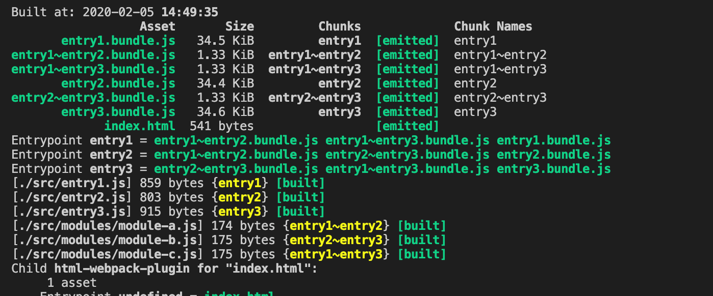

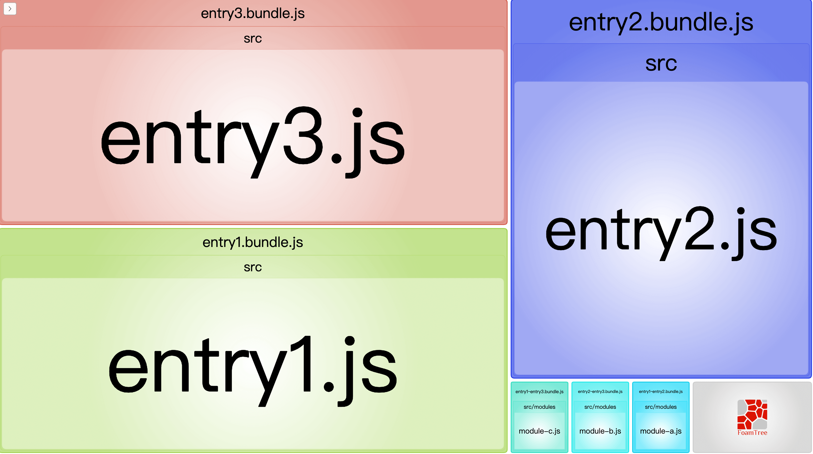


如果我们将 `maxInitialRequests` 设置为了 `3` 以上时，在重新打包，结果和 `3` 是一样的。因为webpack 没有必要再分离出更多的模块了。


### `automaticNameDelimiter`

此参数规定了打包出来的文件名字用什么符号连接。

官方默认配置是 `～`。


### `name`

此参数规定了拆分出来块的名字，默认由块名和 `hash` 值自动生成。


### `cacheGroups`

此参数称为配置缓存组：规定了要打包的文件先会被放到某一个缓存组中，最后再对我们设置的缓存组进行打包。

**如果想继续细分代码，可以使用它。**


> 官方默认参数的意思：
>
> 缓存组也有默认的配置；
>
> * 缓存组默认将 `node_modules` 中的模块拆分带一个叫做 `vendors` 的代码块中。
> * 将最少重复引用两次的模块放入 `default`中。


可以通过 `default:false` 禁用默认的缓存组，然后就可以自定义缓存组，将初始化加载时被重复引用的模块进行拆分，就像这样：

```javascript
...
cacheGroups: {
  commons: {
    filename: "commons",
    chunks: "initial",
    minChunks: 2
  }
}
...
```


##### `test`

用于控制哪些模块被这个缓存组匹配到。


##### `priority`

此参数规定 **表示缓存的优先级**，当一个模块同时满足两个要求的时候，我们会根据这个值来进行分组，参数越大优先级越高。

举个例子，在项目中引用 `jquery` 如果共识满足了两个条件，`webpack` 会将 `jquery` 打包到 `vendors` 的组中去，因为它的 `priority` 比 `default` 的大。


##### `filename`

打包后缓存组的名字。


##### `reuseExistingChunk`：

此参数规定如果一个模块已经被打包过了，当我们再打包的时候，`webpack` 将不再将此模块打包，忽略这个模块，直接复用之前我们已经打包过的这个模块。


&nbsp;

## 相关链接

- [webpack 官网 SplitChunksPlugin](https://webpack.js.org/plugins/split-chunks-plugin/)
- [webpack 官方 demo](https://github.com/webpack/webpack/tree/master/examples/)
- [一步一步的了解 webpack4 的splitChunk插件](https://juejin.im/post/5af1677c6fb9a07ab508dabb)
- [webpack v4 中的断舍离 - 代码分离 SplitChunksPlugin](https://juejin.im/post/5b6a4d71f265da0fa8676814)
- [Webpack4之SplitChunksPlugin规则](https://blog.csdn.net/napoleonxxx/article/details/81975186)

&nbsp;

## 示例代码

示例代码可以看这里：

- [SplitChunksPlugin  示例代码](https://github.com/darrell0904/webpack-study-demo/tree/master/chapter2/split-chunks-plugin-demo)

