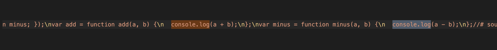
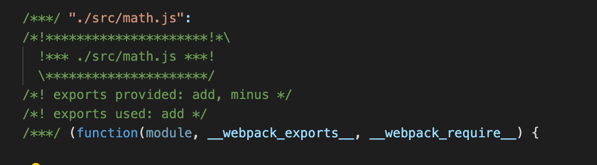
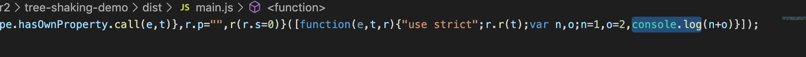
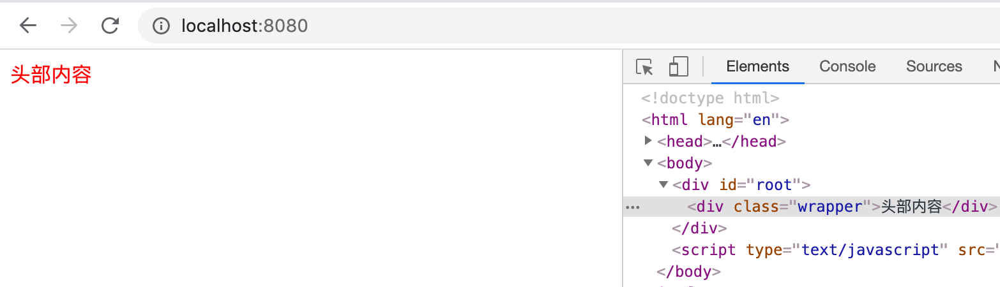
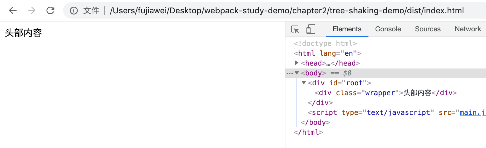
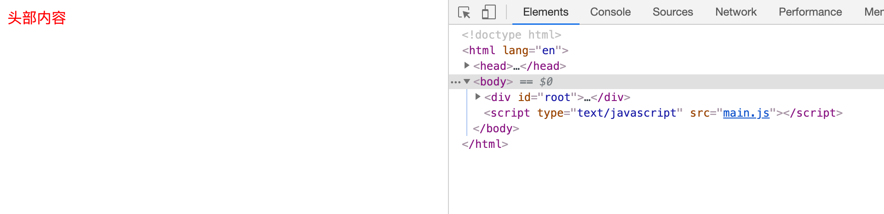

# Tree Shaking 概念详解

`tree-shaking` 简称摇树。它的作用是 **能够在模块的层面上做到打包后的代码只包含被引用并被执行的模块，而不被引用或不被执行的模块被删除掉，以起到减包的效果。**


## 写点代码

我们在 `src` 下新建 `math.js`

```javascript
export const add = (a, b) => {
  console.log( a + b );
}

export const minus = (a, b) => {
  console.log( a - b );
}
```

在 `math.js` 下到处两个方法，接着我们在 `index.js` 中使用 `add` 方法：

```javascript
import { add } from './math.js';

add(1, 2);
```

我们运行打包命令，`npm run bundle`，实际上运行的是：

```javascript
webpack --config ./config/webpack.dev.js
```

我们打开打包出来的 `main.js` 文件，我们发现虽然我们没有使用 `math.js` 下的 `minus` 方法，但是 `webpack` 还是将其打包进去了：



其实在这个时候我们不需要打包 `minus` 这个方法了。


## 相关配置

我们修改 `config` 下的 `webpack.dev.js` 文件：(区分环境打包可以看下一节内容)

```javascript
const devConfig = {
    ...
    optimization: {
		usedExports: true,
	},
    ...
}
```

同时我们需要在 `package.json` 下加上 `sideEffects` 配置：

```json
{
  "name": "webpack",
  "version": "1.0.0",
  "description": "",
  "sideEffects": false, // 对所有的文件都启用 tree_shaking
  ...
}
```

这个配置等等我们会讲，接着我们重新打包，在打开 `main.js`，我们会发现虽然 `minus` 代码还在，但是在其上面多出了一行话，那个模块被使用了：



这里的原因是因为我们的 `webpack` 配置文件，它对应的打包环境是 `development`，即开发环境。在开发环境下面，`webpack` 默认不会删除我们的代码，而是会加上几行注释，如果删除的话，可能会影响我们开发时定位错误。


&nbsp;

那我们使用：`npm run build` 命令，实际上运行的是：

```javascript
webpack --config ./config/webpack.prod.js
```

以线上的环境打包 `webpack`，我们看打包出来的 `main.js`，我们会发现，代码被压缩了，同时 `minus` 这个方法也被去掉了。



> 其实在打包线上环境的时候，我们就不需要配置
>
> ```javascript
> optimization: {
> 	usedExports: true,
> },
> ```
>
> `webpack` 默认帮我们在线上环境开启了 `tree_shaking`


### sideEffects

`sideEffects` 是指 `tree_shaking` 对哪些文件有用，像我们上面的例子，因为需要对所有的文件都启用 `tree_shaking`，所以我们可以设置为 `false`：

```javascript
"sideEffects": false,
```


我们在 `src` 先新建一个 `header.js` ：

```javascript
function Header() {
  var dom = document.getElementById('root');
  var header = document.createElement('div');
  header.innerText = '头部内容';
  header.classList.add('wrapper')
  dom.append(header);
}

export default Header;
```

作用是向页面添加一个 `<div class="wrapper">头部内容</div>` 的元素。

我们修改一下 `index.less`：

```less
.wrapper {
  color: red;
}
```

然后我们在 `index.js` 中引入：

```javascript
import './index.less'
import header from './header.js';

header();
```


我们运行一下 `npm run dev`，我们会发现页面的字体变红了：




接着我们运行一下 `npm run build`，打开 `index.html`，这个时候我们会发现，页面中的字体没有变红，这是为什么呢。




&nbsp;

原因是因为这段代码的问题：

```javascript
import './index.less'
```

 `tree_shaking` 会认为你没有导出任何模块，在打包过程中，他直接就把它给忽略掉了，所以打包后的文件中根本没有这个 `index.less` 文件。


&nbsp;

又比如说，我们上一节讲到的，引入 `@babel/polly-fill`

```Javascript
import '@babel/polly-fill'
```

`tree_shaking` 也会认为你没有导出任何模块，然后就直接忽略。


这个时候我们需要配置 `sideEffects`，

```json
"sideEffects": [
    "*.less",
    "@babel/polly-fill",
]
```

这里面的意思就是，我们碰到上面的几个模块，我们就不去进行 `tree_shaking`。

我们重新打包一下，打开 `index.html`，我们发现字体变红了：




## `tree-shaking` 的局限性

* 只能是静态声明和引用的 `ES6` 模块，不能是动态引入和声明的。

而CommonJS模块，所以不能对CommonJS模块进行tree-shaking处理。

`CommonJS` 模块是支持动态结构，它通过 `require()` 引入模块，所以是不能被 `tree-shaking` 进行处理的。

在打包阶段对冗余代码进行删除，就需要 `webpack` 需要在打包阶段确定模块文件的内部结构，而 `ES` 模块的引用和输出必须出现在文件结构的第一级 `（'import' and 'export' may only appear at the top level）`，否则会报错。

```javascript
// webpack编译时会报错
if (condition) {
  import module1 from './module1';
} else {
  import module2 from './module2';
}
```


* 只能处理模块级别，不能处理函数级别的冗余；

因为 `webpack` 的 `tree-shaking` 是基于模块间的依赖关系，所以并不能对模块内部自身的无用代码进行删除。


* 只能处理 `JS` 相关冗余代码，不能处理 `CSS` 冗余代码。

目前 `webpack` 只对 `JS` 文件的依赖进行了处理，`CSS` 的冗余并没有给出很好的工具。


## 相关链接

* [webpack官网 tree_shaking](https://webpack.js.org/guides/tree-shaking/)
* [webpack中tree-shaking技术介绍](https://www.cnblogs.com/wmhuang/p/7905972.html)


## 示例代码

示例代码可以看这里：

* [Tree Shaking  示例代码]()