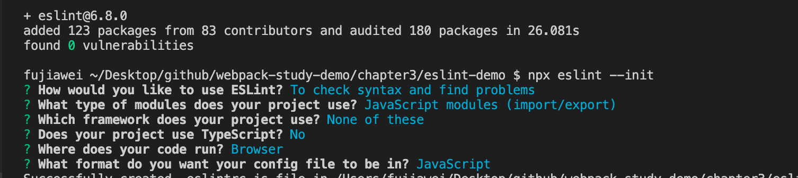
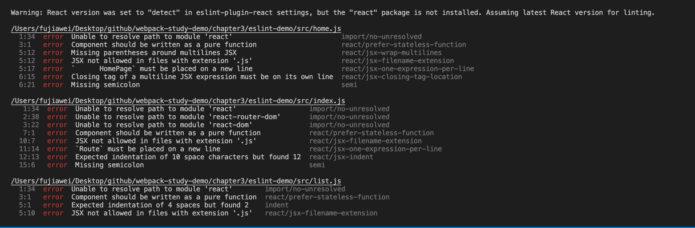
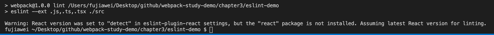
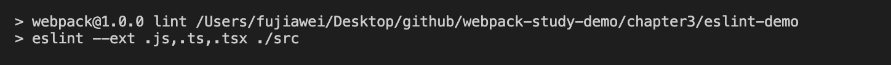
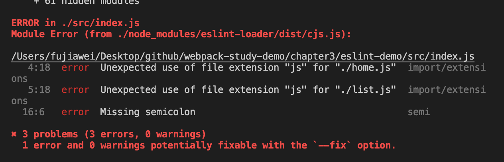
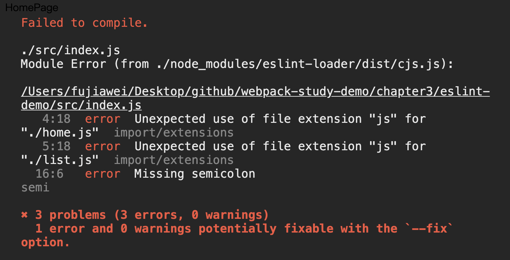
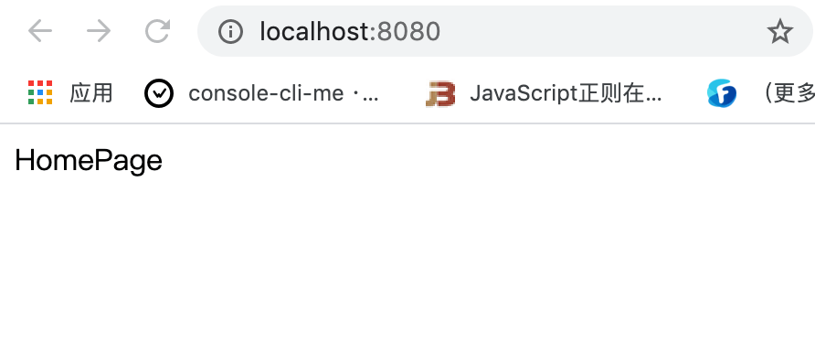
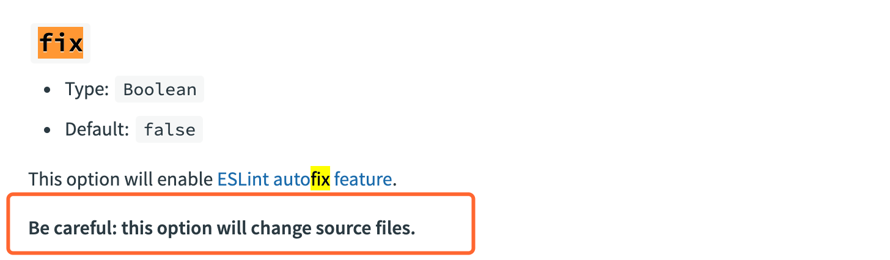

# 配置 EsLint

今天我们来讲一下 `webpack` 中 `eslint` 的配置。

&nbsp;

## Eslint 使用

`eslint` 是代码规范工具，目标是保证代码的一致性和避免错误。

 其实 `eslint` 与 `webpack` 是没有多大的关系的。

### 安装

```javascript
npm install eslint -D // eslint@6.8.0
```

### 配置文件

`eslint` 需要有一个配置文件 `.eslintrc.js`，我们可以通过 `npx eslint --init` 快速生成，我们可以在编辑器看到以下界面：



执行完之后，他会帮我们生成如下配置文件：

```javascript
module.exports = {
    "env": {
        "browser": true,
        "es6": true
    },
    "extends": "eslint:recommended",
    "globals": {
        "Atomics": "readonly",
        "SharedArrayBuffer": "readonly"
    },
    "parserOptions": {
        "ecmaVersion": 2018,
        "sourceType": "module"
    },
    "rules": {
    }
};
```

具体的配置笔者在这里也不细讲了，大家可以参考 [Eslint 官方配置 ](https://eslint.bootcss.com/docs/user-guide/configuring)。


我们在项目中这里使用 `airbnb` 的 `eslint` 变态检测规范，因为我们的示例代码里面是 `react` 的代码，我们进行如下安装：

```javascript
npm install babel-eslint eslint-config-airbnb eslint-plugin-import eslint-plugin-react eslint-plugin-jsx-a11y -D
```


> * `babel-eslint`：项目中需要使用到 `es6` 的语言规范，因此需要安装 **babel-eslint** 这个 **parser**
> * `eslint-config-airbnb`：配置一些 `eslint rules` 的规范
> * `eslint-plugin-import `：在使用 `import` 的时候，一些 `rules` 规范
> * `eslint-plugin-react`：一些 `react` 的 `eslint` 的 `rules` 规范
> * `eslint-plugin-jsx-a11y`：一些 `jsx` 的 `rules` 规范


我们修改 `.eslintrc.js` 配置文件，换一个 `parser` 和 `extends`：

```javascript
module.exports = {
    "env": {
        "browser": true,
        "es6": true
    },
    "parser": "babel-eslint",
    "extends": "airbnb", // 使用 eslint
    "globals": {
        "Atomics": "readonly",
        "SharedArrayBuffer": "readonly"
    },
    "parserOptions": {
        "ecmaVersion": 2018,
        "sourceType": "module"
    },
    "rules": {
    }
};
```

接着我们修改 `package.json` 中的 `script` 对象，新增一条对 `eslint` 的解析，即在 `src` 下的文件都需要跑 `eslint`：

```json
"scripts": {
    ...
    "lint": "eslint --ext .js,.tsx ./src",
    ...
},
```

最后我们运行一下 `npm run lint`，我们可以看到控制台上会出现相应的错误了：



这样我们就算配置完成了，可以根据命令行的提示进行修改。

假设我们不想要遵循 `airbnb` 的规范，我们可以将此名字提取出来，放到 `rules` 中，并设为 `0` 就可以了。

```javascript
...
"rules": {
   "react/prefer-stateless-function": 0,
   "react/jsx-filename-extension": 0,
   "import/no-unresolved": 0,
}
...
```

到这里我们会发现，我们的错误基本上都解决完了，但是命令行提示：



其实我们只要在 `.eslintrc.js`， 中加上下面这一段就行：

```javascript
module.exports = {
    ...
    "settings": {
        "react": {
          "version": "detect",
        },
    },
		...
};
```

现在我们的命令行边没有这一行警告了：




到目前为止，我们还是没有使用到 `webpack` 的，那么接下来我们就来讲讲在 `webpack` 中使用 `eslint`：

 

&nbsp;

## 在 `webpack` 中使用

我们需要安装对应 `eslint-loader`，来帮助我们在 `webpack` 中进行配置。

```javascript
npm install eslint-loader -D
```

我们在 `webpack.common.js` 中进行配置：

```javascript
...
const commonConfig = {
	...
	module: {
		rules: [
      { 
        test: /\.js|jsx$/, 
        exclude: /node_modules/, 
        use: ['babel-loader','eslint-loader']
			},
      ...
    ]
	},
  ...
}
...
```

我们先使用 `eslint-loader` 对代码进行校验，接着再去使用 `babel-loader` 进行代码的转化。如果要将 `eslint-loader` 放到 `babel-loader` 前面的话，就需要加上 `force: 'pre'` 参数保证其在 `babel-loader` 之前限制性。

我们打包一下代码 `npm run dev`，我们会发现在打包的过程中会出现跟我们上面提到的 `npm run lint` 是一样的命令行错误提示。



我们可以在 `devserver` 中配置一个参数 `overlay: true`，这个参数的作用就是在命令行中有错误的时候，就会在浏览器弹出一个层显示相应的错误。 

修改开发环境的配置文件：

```javascript
...

const devConfig = {
	...
	devServer: {
		overlay: true,
		contentBase: './dist',
		port: 8080,
		hot: true
	},
  ...
}

...

```

我们重新打包一下 `npm run dev`，会发现在浏览器中弹出了一个错误层：



我们改完对应错误之后，会即时消失掉：



这个效果就跟我们使用 `vue` 脚手架的时候出现错误的弹层是一样一样的。

&nbsp;

### `eslint-loader` 更多参数

* `fix`

如果代码中有一些浅显的问题，`eslint-loader` 会自动帮你修复掉，但是官方也说他可能会修改你的源码。



* `catch`

此参数会降低 `eslint` 对打包过程的性能的损耗。如果我们在代码打包的时候，提前使用了 `eslint-loader` 他就会对整个项目的代码规范都会检查一遍，配置了此参数之后，就会相应的减少在代码打包时候的损耗。

更多的配置大家可以参考官网的 [eslint-loader](https://webpack.js.org/loaders/eslint-loader/)


## 真实项目配置

在真实项目中我们一般不会在 `webpack` 中配置 `eslint-loader`，因为如果配置了会不可避免的对打包性能上有所损耗。

因此我们一般的做法是，在提交代码到代码仓库的时候，去跑一下 `eslint`，只有符合代码规范的代码才能提交到仓库中去。

如果项目使用了 `git`，可以通过使用 `pre-commit` 钩子在每次 **提交前检测**，如果检测失败则禁止提交。可以在很大一定程度上保证代码质量。

这里我们使用了 `pre-commit` 包来帮助我们实现这一目标。

```javascript
npm install pre-commit -D
```

接着修改 `package.json`，配置 `pre-commit` 参数，即在提交前自动去执行 `scripts` 中的 `lint` 命令。 

```json
"scripts": {
  ...
  "lint": "eslint --ext .js,.ts,.tsx ./src",
  ...
},
"pre-commit": [
	"lint"
]
```

我们还可以使用 `husky` 来满足我们的需求，具体笔者就不多讲了，大家可以参考 [husky 官网](https://github.com/typicode/husky)


## 在编辑器中安装插件


&nbsp;

## 相关链接

- [eslint 官网](https://eslint.bootcss.com/)
- [webpack eslint-loader](https://webpack.js.org/loaders/eslint-loader/)
- [husky 官网](https://github.com/typicode/husky)
- [pre-commit](https://github.com/pre-commit/pre-commit)

&nbsp;

## 示例代码

示例代码可以看这里：

- [Eslint  示例代码](https://github.com/darrell0904/webpack-study-demo/tree/master/chapter3/eslint-demo)

