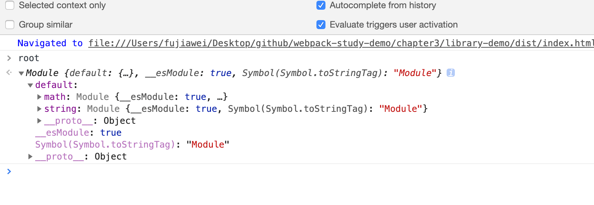
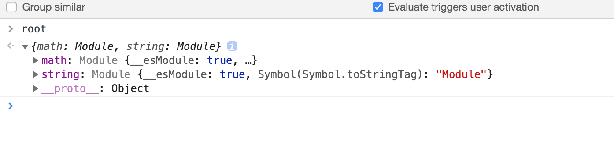
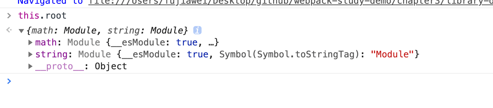
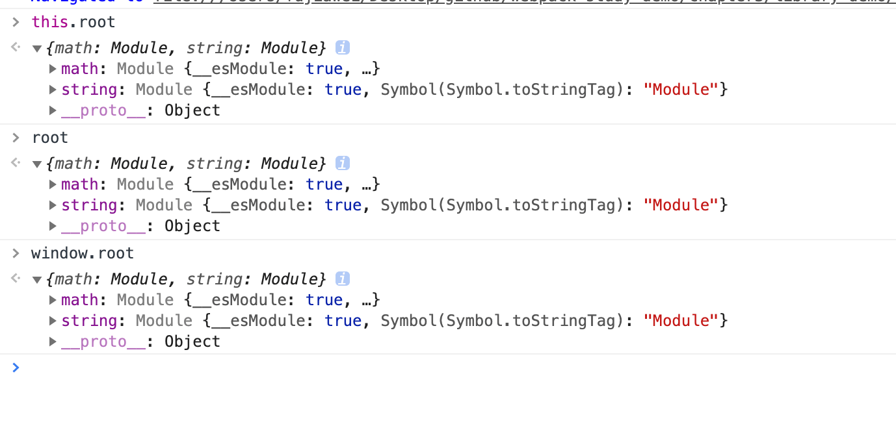
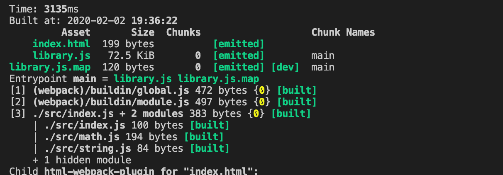
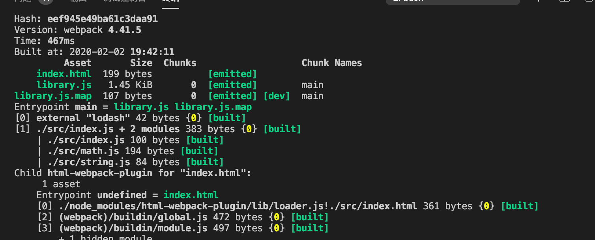

# Library 打包 

这一节来讲一下当我们开发类库的时候，`webpack` 需要怎么配置。


## 写点代码

首先在 `src` 下新建 `math.js` 和 `string.js`：

```javascript
// math.js

export function add(a, b) {
	return a + b;
}

export function minus(a, b) {
	return a - b;
}

export function multiply(a, b) {
	return a * b;
}

export function division(a, b) {
	return a / b;
}

// string.js

import _ from 'lodash';

export function join(a, b) {
	return _.join([a, b], ' ');
}
```

`math.js` 的作用是导出加减乘除四个方法；`string.js` 的作用是使用 `lodash` 进行数组拼接。


安装 `lodash`：

```javascript
npm install lodash -D
```


&nbsp;

现在我们需要讲我们写的几个方法导出去，让使用者可以用起来，这里我们先要在回顾一下引入类库的几种方式。


## 引入类库的几种方式

* 传统方式：`script` 标签

```javascript
<script src="demo.js"></script>
<script>demo();</script>
```


* `AMD`

```javascript
define(['demo'], function(demo) {
	demo();
});
```


* `commonjs` 方式

```javascript
const demo = require('demo');

demo();
```


* `ES6 module`

```javascript
import demo from 'demo';

demo();
```


上面是我们常用的几种模块类库导入方式，为什么我们直接就能导入这些类库，如果你是使用 `webpack`  打包的类库，那就是 `webpack` 配置 `output.library` 和 `output.libraryTarget` 提供的功能。


## 配置 `webpack`

接着我们修改一些 `config/webpack.prod.js` 生产环境打包文件：

```javascript
const path = require('path');

const prodConfig = {
	...
	output: {
		path: path.resolve(__dirname, '../dist'),
		filename: 'library.js', // 打包出来的名字
		library: 'root', // 用 <script> 方式引入，全局的变量名
    libraryTarget: 'umd', // 适用于 AMD、CommonJs、ES6 module引入方式
	}
  ...
}

module.exports = merge(commonConfig, prodConfig);
```

配置讲解：

### `library`：

其中我们上面也注释了，`library` 这个属性的意思是如果是 `HTML` 页面中使用 `script` 标签引入打包结果文件，那么变量 `myDemo` 对应的值将会是 **入口文件(entry file)** 的返回值。

我们在项目中运行 `npm run build`，会生成一个 `dist` 目录，我们打开 `index.html `，打开控制台，我们会发现在页面的 `window` 下会有一个 `root` 变量，在其下面就是我们所导出的 `module`：



但是我们发现，我们在项目中导出的方法，在 `root` 的 `default` 属性下。我们不应该直接通过 `root.math` 就能访问相关的方法了吗？

这是因为在浏览器、或者在其他不支持 `ES6` 的模块系统中都会出这个问题，它们并不认识 `default`。 所以其实在这种情况下，编译后的 `js` 文件实际上应当只输出 `default`，这就需要在我们在 `webpack` 配置里用 `libraryExport` 来控制，

```javascript
const prodConfig = {
	...
	output: {
		path: path.resolve(__dirname, '../dist'),
		filename: 'library.js', // 打包出来的名字
		library: 'root', // 用 <script> 方式引入，全局的变量名
    libraryTarget: 'umd', // 适用于 AMD、CommonJs、ES6 module引入方式
    libraryExport: 'default',
	}
  ...
}
```

我们重新打包一下文件，会发现这个时候的 `root` 下直接就是我们导出的两个方法了：




### libraryTarget：

>  这个配置规定了如何公开库。

打包的文件选用哪种引入方式，它一共支持的值如下，我们讲几个常用的配置，没讲到的大家可以通过 [outputlibrarytarget](https://webpack.js.org/configuration/output/#outputlibrarytarget) 自行查看。


#### **暴露一个变量**

以下选项会把打包返回的值（无论暴露的是什么）绑定到一个由`output.library`指定的变量上，无论包是被如何引用。

* `var`：默认值

使用这个配置，当库被加载时，那么库的返回值会被分配到使用用 `var` 申明的变量上。

```javascript
var myDemo = _entry_return_;

// In a separate script...
myDemo();
```

> 如果没有设置`output.library`值，那么将不会发生赋值行为。

* `assign`：

> 不常用

使用这个设置，会把库返回值分配给一个没使用 `var` 申明的变量中，如果这个变量没有在引入作用域中提前申明过，那么将会挂载在全局作用域中。（注意，**这个行为有可能会覆盖全局作用域中的已有变量**）


#### 通过对象属性暴露

* `this`：将导出的模块挂在 `this`上

当我们设置了 `this` 的时候，它会将模块自动的挂到 `this` 上，如下图：



因为浏览器中全局的 `this`，就是 `window`，所以我们也可以这样访问：




* `window`：可以参考 `this`
* `global`：适用于 `Node`，它会将模块挂到 `global` 上
* `commonjs`：

将库的返回值分配给 `exports` 对象的由 `output.library` 指定的属性。正如名字所指，这个选项可以使用在 `CommonJS` 环境，使用如下：

```javascript
// 导出的模块，类似于womenziji写的index.js
exports["myDemo"] = _entry_return_;

// 使用我们导出的模块
require("myDemo").doSomething();
```


#### 模块定义系统

**选项将产生一个包含更完整兼容代码的包，以确保与各种模块系统的兼容性。**

&nbsp;

* `commonjs2`

将库的返回值分配给 `module.exports`。正如名字所指，这个选项可以使用在 `CommonJS` 环境。

```javascript
module.exports = _entry_return_;

const myDemo = require("myDemo");
myDemo();
```

> 注意，在这个情况下 `output.library` 不是必须的，因为此时 `output.library` 选项将会被忽略。
>
> `CommonJS` 和 `CommonJS2` 长的非常像？他们的区别大家可以参考 [issue](https://github.com/webpack/webpack/issues/1114)


* `AMD`

> 不常用，现在基于 `AMD` 基本上已经不用了，除非是很老的代码。

这个选项会把库作为 `AMD` 模块导出。

`AMD` 模块要求输入脚本（例如由 `<script>` 标签加载的第一个脚本）被定义为具有特定属性，例如通常由 `RequireJS` 或任何兼容的加载器（诸如 `almond` ）提供的 `require` 和 `define` 属性。其实意思就是要加载一个 `require.js` 或者 类似的 `js`。

否则，直接加载生成的 `AMD` 捆绑包将导致类似 `define is not defined` 的错误。
由此定义生成的代码会如下：

```javascript
define("myDemo", [], function() {
	return _entry_return_;
});
```


以上的代码可以作为 `script` 标签引入代码的一部分被包含，然后在通过以下代码调用：

```javascript
require(['myDemo'], function(myDemo) {
	// Do something with the library...
	myDemo();
});
```

如果 `output.library` 没有定义有效值，那么生成的代码将如下：

```javascript
define([], function() {
	return _entry_return_;
});
```


因此在这种情况下，如果这些由服务器直接提供，那么 `output.path` 和 `output.filename` 配置可能变得非常重要。


* `umd`

> 现在的类库打包最常用的配置

这个选项会尝试把库暴露给前使用的模块定义系统，这使其和`CommonJS`、`AMD`兼容或者暴露为全局变量。
`output.library` 选项在这里是必须的。最终代码输出如下：

```javascript
(function webpackUniversalModuleDefinition(root, factory) {
if(typeof exports === 'object' && typeof module === 'object')
  module.exports = factory();
else if(typeof define === 'function' && define.amd)
  define([], factory);
else if(typeof exports === 'object')
  exports["MyLibrary"] = factory();
else
  root["MyLibrary"] = factory();
})(typeof self !== 'undefined' ? self : this, function() {
return _entry_return_;
});
```

如果 `output.library` 没有输入有效值，那么对于*全局变量*的处理会和上面提到的 `暴露一个变量` 一致。代码输出如下：

```javascript
(function webpackUniversalModuleDefinition(root, factory) {
  if(typeof exports === 'object' && typeof module === 'object')
    module.exports = factory();
  else if(typeof define === 'function' && define.amd)
    define([], factory);
  else {
    var a = factory();
    for(var i in a) (typeof exports === 'object' ? exports : root)[i] = a[i];
  }
})(typeof self !== 'undefined' ? self : this, function() {
  return _entry_return_;
});
```


从 `webpack 3.10.0` 版本开始，我们可以通过把 `output.library` 定义为对象来控制不同目标环境的输出值。如下图：

```javascript
output: {
  library: {
    root: "myDemo",
    amd: "my-demo",
    commonjs: "my-common-demo"
  },
    libraryTarget: "umd"
}
```


* `jsonp`

这个方法会使用 jsonp 的方式把结果包裹起来。


### externals：

这个参数的意思是将一些公用的库不打包到我们的类库中，等到要使用的时候，再去引入这些公用库。

#### 举个🌰：

我们在上面的 `string.js` 中使用了 `lodash`，打包完之后 `library.js` 的体积是 `72.5kb`：



这一下子就让我们的类库变得很大，其实我们本来就只有几 `kb` 的代码而已，所以我们可以配置 `externals`，将 `lodash` 不打包进去：

```javascript
...

const prodConfig = {
	mode: 'production',
  devtool: 'cheap-module-source-map', // production
	externals: 'lodash',
	...
}

...
```

接着我们重新打包，我们会发现，`library.js` 的大小变成了 `1.45kb`：



当别人要使用我们的库的时候，要事先导入 `lodash`：

```javascript
import _ from 'lodash';
import library from 'library';
```

&nbsp;

`externals` 支持数组和对象，

```javascript
// 数组
externals: ['lodash'],

// 对象
externals: {
  commonjs: 'lodash', // 通过 CommonJS 引入时，名字必须是 lodash
  root: '_', // 通过 <script> 标签引入时，名字必须是 "_"
}
```


&nbsp;

更详细的配置大家可以参考：

* [externals](https://webpack.js.org/configuration/externals/)


## 相关链接

* [outputlibrarytarget](https://webpack.js.org/configuration/output/#outputlibrarytarget)
* [webpack Externals](https://webpack.js.org/configuration/externals/#externals)
* [详解webpack的out.libraryTarget属性](https://blog.csdn.net/frank_yll/article/details/78992778)

* [webpack组织模块打包Library的原理及实现](http://www.cppcns.com/ruanjian/java/222299.html)


## 示例代码

示例代码可以看这里：

* [library 打包示例代码]()