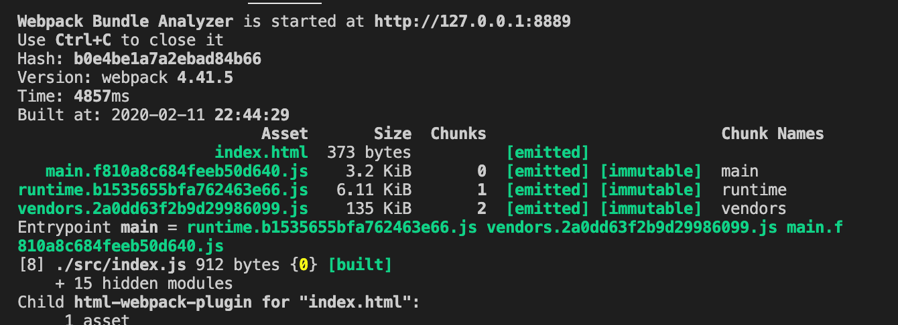
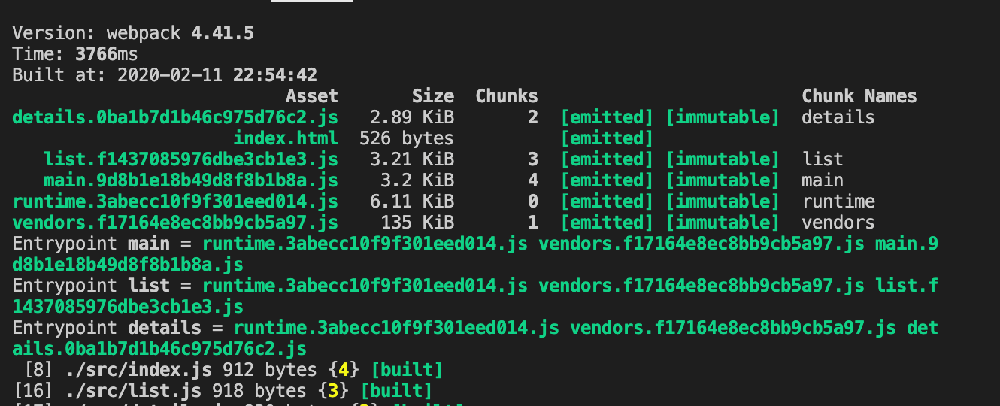
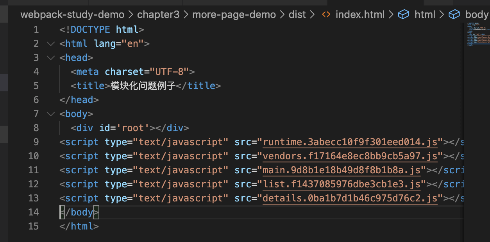
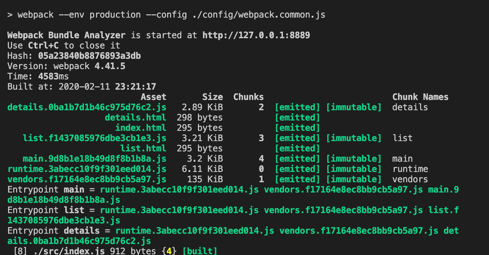
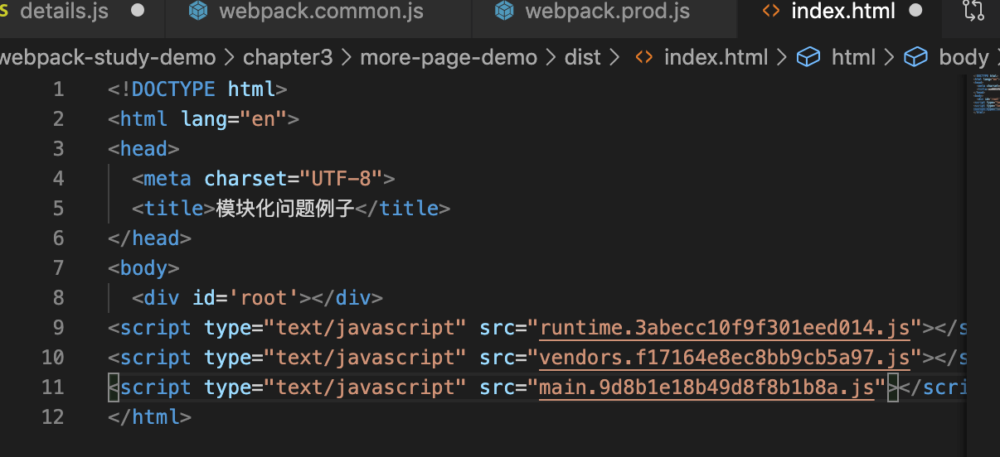
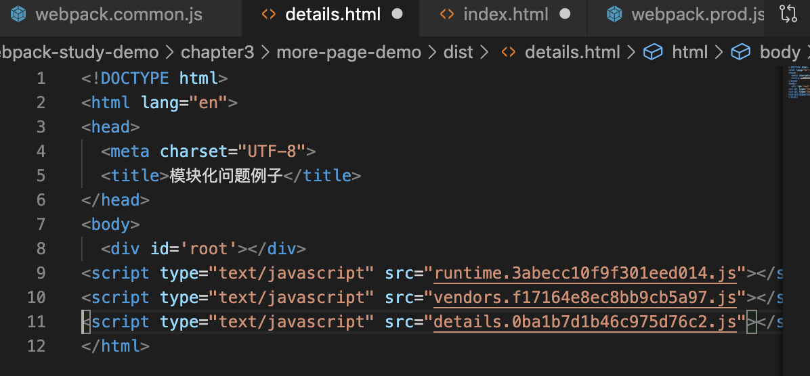
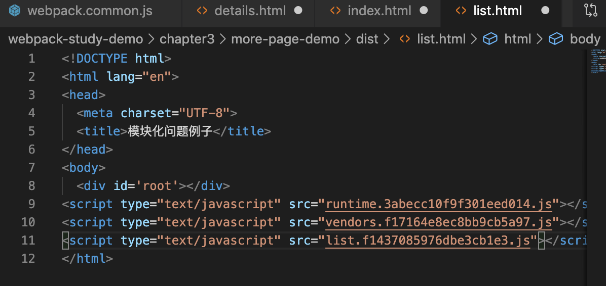
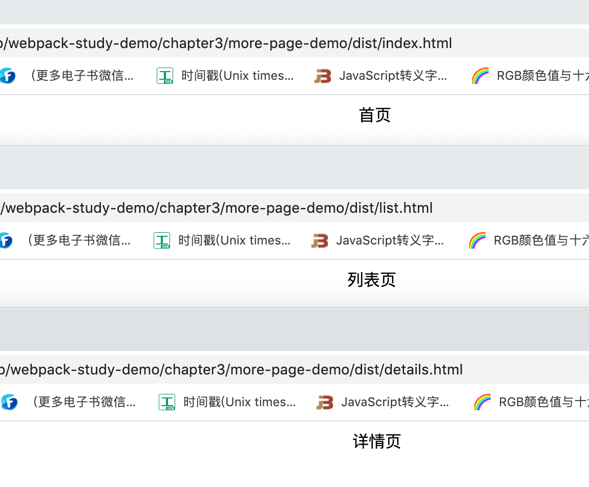
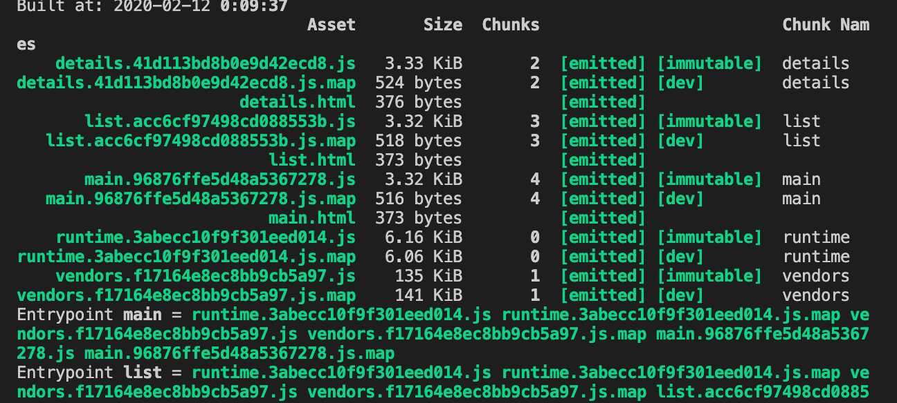
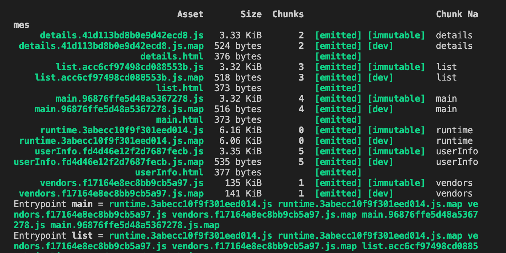

# Webpack 多页面打包

由于现在的前端框架 `React`、`Vue` 框架都是单页应用，单页应用的意思简单来说就是生成一个 `html` 文件，所有的 `js` 都在这个页面中引用执行。

今天我们来讲一下，多页应用在 `webpack` 中该怎么打包，即在打包过程中生成多个 `html` 文件。因为在一些老的代码中可能还是会存在一些使用多页应用的场景。

其实原理就是使用 `html-webpack-plugin` 帮助我们来实现。

&nbsp;

## 写点代码

除了入口文件 `index.js`，我们再创建两个文件 `list.js` 和 `detail.js`，以这三个作为我们打包的三个文件。

```jsx
// index.js
import React, { Component } from 'react';
import ReactDom from 'react-dom';

class App extends Component {
  render() {
    return <div>首页</div>;
  }
}

ReactDom.render(<App />, document.getElementById('root'));

// list.js
import React, { Component } from 'react';
import ReactDom from 'react-dom';

class App extends Component {
  render() {
    return <div>列表页</div>;
  }
}

ReactDom.render(<App />, document.getElementById('root'));

// details.js
import React, { Component } from 'react';
import ReactDom from 'react-dom';

class App extends Component {
  render() {
    return <div>详情页</div>;
  }
}

ReactDom.render(<App />, document.getElementById('root'));

```

现在是三个页面，我想生成三个页面 `index.html`、`list.html`、`details.html`，我们该怎么配置呢？

现在我们先打包一下文件，我们可以看到在页面中只生成了一个 `index.html`：




## 配置多入口

现在我们有三个 `js`，我们就需要配置三个入口文件：

```javascript
...

const commonConfig = {
	entry: {
		main: "./src/index.js",
		list: "./src/list.js",
		details: "./src/details.js",
	},
  ...
}

...
```

我们重新打包一下 `npm run build`，可以看到多打包出了 `details.***.js` 和 `list.***.js`：



但是 `html` 还是只有一个，在这个 `html` 页面中引入了我们所有打包出来的 `js` 文件，



这个不是我们想要的结果，我们想要结果是在 `index.html` 引入 `index.js`，在 `list.html` 引入 `list.js`，在 `details.html` 引入 `details.js`。

这种情况下我们就需要用到  `html-webpack-plugin` 帮我们多生成几个页面了，并将对应的文件或者说 `chunk` 引入进来。


## 配置 `html-webpack-plugin`

要想生成多个 `html`，我们还是需要使用 `html-webpack-plugin` 这个好东西，他下面有很多参数，大家可以参考 [html-webpack-plugin 官方文档](https://github.com/jantimon/html-webpack-plugin)，在这里我们要使用其中的 `filename` 和 `chunks` 参数，分别是对应生成的 `html` 名称和需要在页面中引入的 `chunks` 名字，我们修改配置 `webpack.common.js`，多增加两个 `html-webpack-plugin` ：

```javascript
...

const commonConfig = {
	entry: {
		main: "./src/index.js",
		list: "./src/list.js",
		details: "./src/details.js",
	},
	...
	plugins: [
		...

		new HtmlWebpackPlugin({
			template: 'src/index.html',
			filename: 'index.html',
			chunks: ['runtime', 'vendors', 'main'],
		}),
		new HtmlWebpackPlugin({
			template: 'src/index.html',
			filename: 'list.html',
			chunks: ['runtime', 'vendors', 'list'],
		}),
		new HtmlWebpackPlugin({
			template: 'src/index.html',
			filename: 'details.html',
			chunks: ['runtime', 'vendors', 'details'],
		}),
		...
	],
	optimization: {
		usedExports: true,
		runtimeChunk: {
			name: 'runtime',
		},
		splitChunks: {
			chunks: 'all',
			cacheGroups: {
				vendors: {
					test: /[\\/]node_modules[\\/]/,
					priority: -10,
					name: 'vendors',
				}
			}
		},
	},
}

...
```

`chunks` 的配置是要引入到 `html` 中的 `webpack` 打包后的 `js` 文件。

我们重新打包一下 `npm run build`，`dist` 目录下生成了三个 `html` 文件，并且每个 `html` 文件都引入了相应的 `js`：



##### `Index.html`



##### `details.html`



##### `list.html`




一些都顺利打包完成了，我们打开各自的页面，都能正常运行：




&nbsp;

## 配置优化

如果我们在新增一个入口，我们还需要再手动的去新增一个 `html-webpack-plugin`，并添加相应的参数配置。

如果我们能根据入口，来自动的添加新增 `html-webpack-plugin`，说搞就搞。

我们可以自己写一个方法，去组一个 `plugins`，而且根据入口文件组装 `html-webpack-plugin`：

```javascript
const HtmlWebpackPlugin = require('html-webpack-plugin');

...

const makePlugins = (configs) => {

	const plugins = [
		new CleanWebpackPlugin(),
	];

	Object.keys(configs.entry).forEach(item => { // 遍历输出入口文件，拼接 HtmlWebpackPlugin
		plugins.push(
			new HtmlWebpackPlugin({
				template: 'src/index.html',
				filename: `${item}.html`,
				chunks: ['runtime', 'vendors', item]
			})
		)
	});

	return plugins;
}

const commonConfig = {
  entry: {
		index: "./src/index.js",
		list: "./src/list.js",
		details: "./src/details.js",
	},
  ...
}

commonConfig.plugins = makePlugins(commonConfig);

...
```

我们重新打包一下 `npm run build`，页面打包成功了：



这个时候我们在新增入口的时候，我们就只需要在入口文件配置就行了。比如说我们想再增加一个 `userInfo` 页面，我们只需要在路口文件配置就行：

```javascript
...
const commonConfig = {
  entry: {
		index: "./src/index.js",
		list: "./src/list.js",
		details: "./src/details.js",
    userInfo: "./src/userInfo.js"
	},
  ...
}
...
```

我们重新打包一下，`userInfo.html` 页面自动生成了：




&nbsp;

## 相关链接

- [Webpack 官网 HtmlWebpackPlugin](https://webpack.js.org/plugins/html-webpack-plugin/)
- [html-webpack-plugin 官网](https://github.com/jantimon/html-webpack-plugin)


&nbsp;

## 示例代码

示例代码可以看这里：

- [多页面打包 示例代码](https://github.com/darrell0904/webpack-study-demo/tree/master/chapter3/more-page-demo)