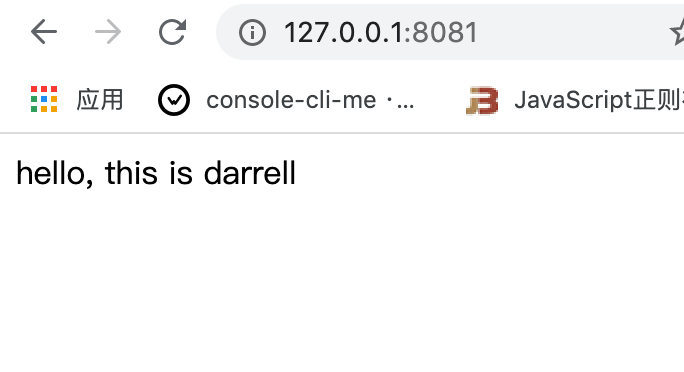
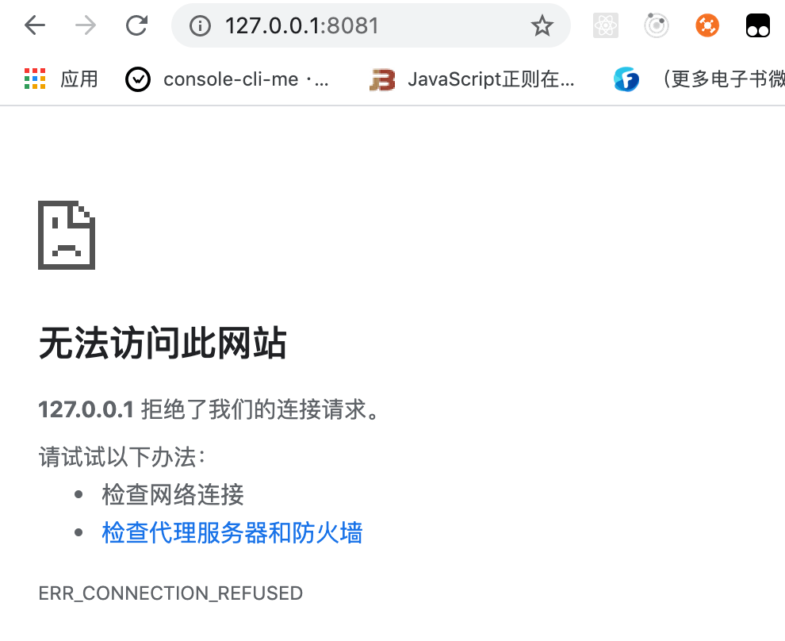
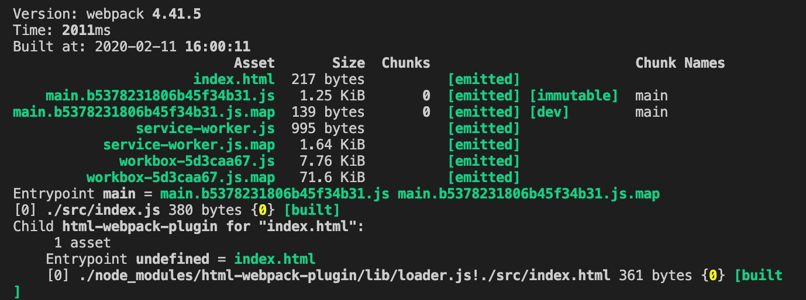
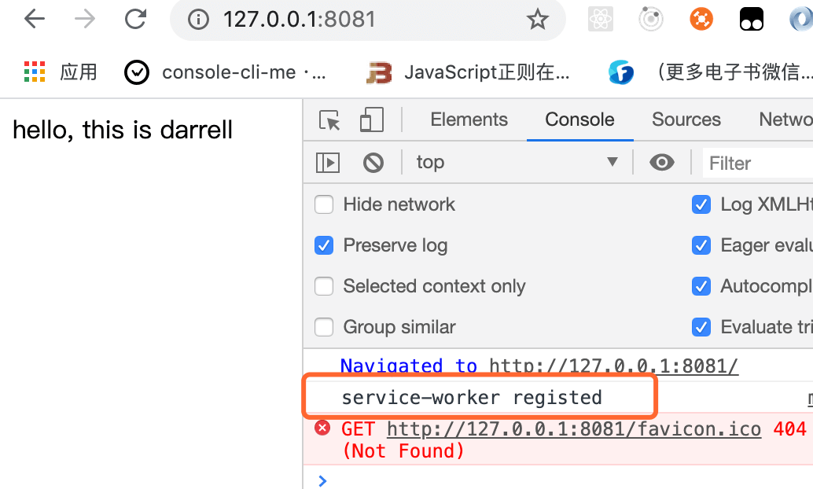
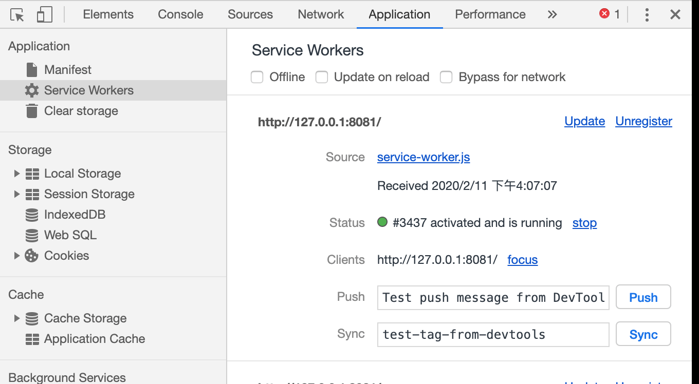
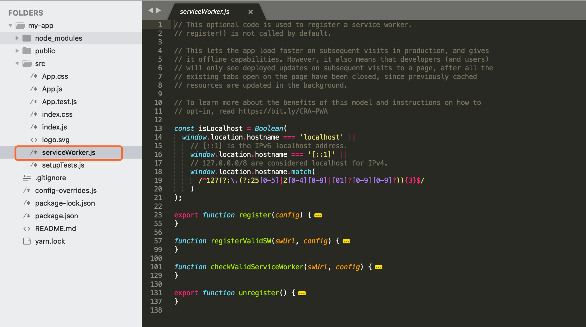

# PWA 打包

`PWA` 是 `Progressive Web App` 的英文缩写， 翻译过来就是 **渐进式增强 `WEB` 应用**， 是 `Google` 在2016年提出的概念，2017年落地的 `web` 技术。目的就是在移动端利用提供的标准化框架，在网页应用中实现和原生应用相近的用户体验的渐进式网页应用。

因为 `PWA` 涉及到知识点多，今天我们就简单讲一下 `PWA` 的在 `webpack` 中的打包，让大家有一个了解。


&nbsp;

## 举个例子

当我们访问网页的时候，只有在有网的时候才能刷出相应的页面：



如果我们的服务器在某段时间奔溃或者我们断网了了，那么用户的页面也会刷新不出来东西，如下图：




有没有什么办法可以在这种情况下也可以正常的显示页面的，这个时候就可以用到 `server-worker`了。


## 写点代码

我们修改 `index.js` 文件，在页面中打印出 `hello, this is darrell`：

```javascript
const root = document.getElementById('root');
root.innerHTML = 'hello, this is darrell';
```

&nbsp;

### 本地起一个服务

接着我们进行一次线上打包 `npm run build`，会生成一个 `dist` 目录，接着我们通过 `http-server` 来给我们本地起一个服务器

&nbsp;

#### 安装

```javascript
npm install http-server -D
```

&nbsp;

#### 修改 `package.json`

我们在 `scripts` 下增加一个命令，以 `dist` 为目录起一个服务器。

```json
...

"scripts": {
  "start": "http-server dist",
  "dev": "webpack-dev-server --config ./config/webpack.dev.js",
  "build": "webpack --config ./config/webpack.prod.js"
},

...
```

我们运行一下 `npm start`，可以看到我们本地起了一个服务器，页面也成功跑了起来：


&nbsp;

### 配置 `service-worker`

`PWA` 底层用到的一个知识点就是 `service-worker`，我们可以使用谷歌提供的 `workbox-webpack-plugin` 一个插件，能非常方便的帮助我们实现 `PWA`。

```javascript
npm install workbox-webpack-plugin -D
```

接着修改线上配置文件 `webpack.prod.js`：

```javascript
...
const WorkboxPlugin = require('workbox-webpack-plugin');

...

const prodConfig = {
	...
  plugins: [
		new WorkboxPlugin.GenerateSW({
			clientsClaim: true,
			skipWaiting: true
		})
	],
	...
}

...
```

接着我们重新打包一下，可以看到 `dist` 目录下多出了几个文件 `service-worker.js`、`workbox-***.js`



说明已经帮助我们生成了相应的 `service-worker` 文件，接着我们在入口文件中进行相应的使用：

```javascript
const root = document.getElementById('root');
root.innerHTML = 'hello, this is darrell';

if ('serviceWorker' in navigator) {
	window.addEventListener('load', () => {
		navigator.serviceWorker.register('/service-worker.js')
			.then(registration => {
				console.log('service-worker registed');
			}).catch(error => {
				console.log('service-worker register error');
			})
	})
}
```

我们重启服务 `npm start`，我们可以在浏览器中看到我们的配置已经起作用了，并且我们可以点开 `chomre` 的 `Application` 下的 `Service Workers` 选项，可以看到当前域名下的  `service-worker` 正在工作。






这个时候我们停止 `http-server` 服务，我们的页面还可以正常运行：


这是一个非常简单的例子，更多的 `PWA` 知识，我会贴几个网址，大家可以去相关网站学习。


&nbsp;

## 框架中

现在主流的一些脚手架会自动帮我们集成 `service-worker` 这个功能，比如我们通过 `create-react-app` 初始化的项目，会自带 `serviceWorker.js`：




&nbsp;

## 相关链接

- [MDN 渐进式 Web 应用（PWA）](https://developer.mozilla.org/zh-CN/docs/Web/Progressive_web_apps)
- [什么是 PWA](https://lavas.baidu.com/pwa)
- [segmentfault 讲讲PWA](https://segmentfault.com/a/1190000012353473)
- [workbox-webpack-plugin](https://www.npmjs.com/package/workbox-webpack-plugin)

&nbsp;

## 示例代码

示例代码可以看这里：

- [PWA  示例代码](https://github.com/darrell0904/webpack-study-demo/tree/master/chapter3/pwa-demo)