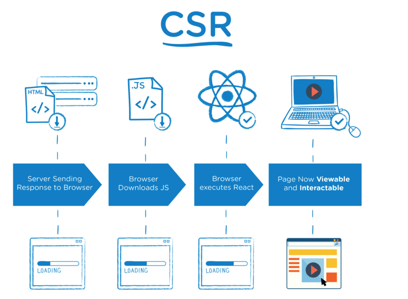
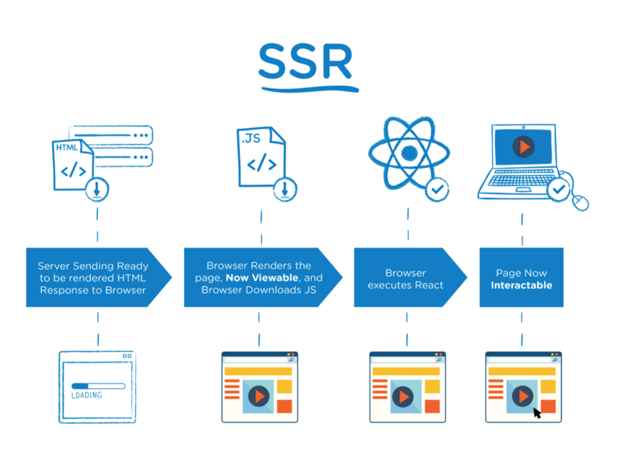
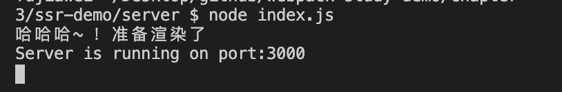
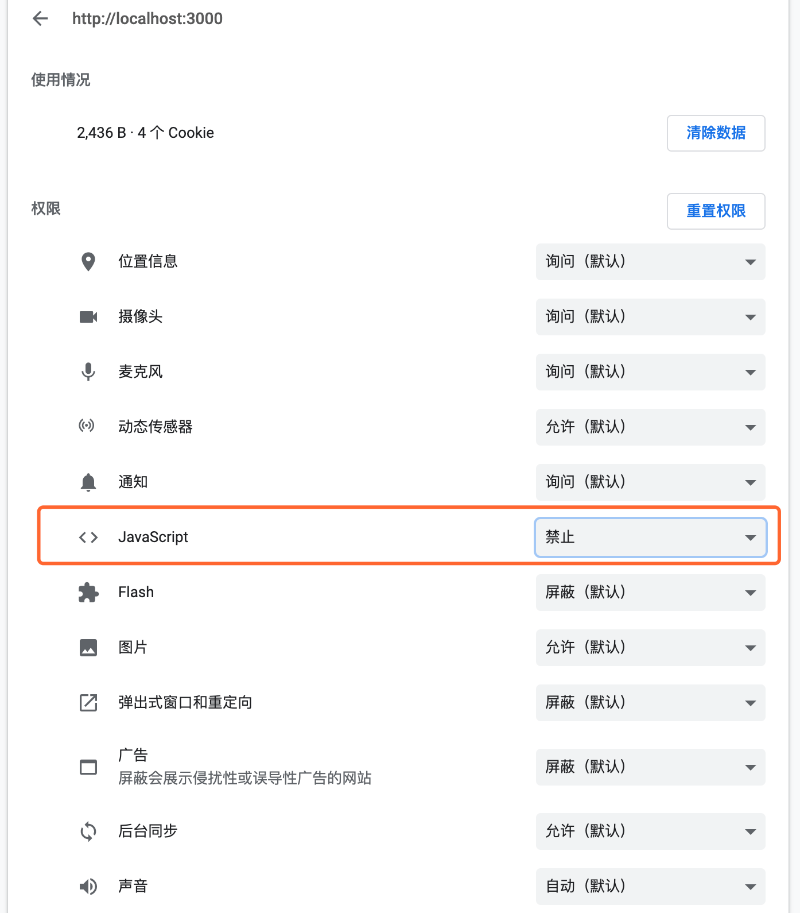

# `SSR` 打包

这一节我们来讲一下 `webpack` 的服务端打包。我们以 `react` 代码为例。


## 服务端渲染和客户端渲染

**服务器端渲染**：用户请求服务器，服务器上直接生成 `HTML` 内容并返回给浏览器。服务器端渲染来，页面的内容是由 `Server` 端生成的。

**浏览器端渲染**：页面初始加载的 `HTML` 页面中无网页展示内容，需要加载执行 `JavaScript` 文件中的 `React` 代码，通过 `JavaScript` 渲染生成页面，同时，`JavaScript` 代码会完成页面交互事件的绑定。



一般服务器端的渲染能力有限，如果要给相应的元素做一点交互，我们就需要引入相应的 `js` 来完成。

这就又涉及到另外一个概念 **同构**，他的意思就是让客户端渲染和服务器端渲染的一个整合。

我们把页面的展示内容和交互写在一起，让同一套代码代码执行两次。在服务器端执行一次，用于实现服务器端渲染，在客户端再执行一次，用于接管页面交互。




一般情况下，我们写的项目代码，页面都是由客户端执行 `JavaScript` 逻辑动态挂 `DOM` 生成的，也就是采用客户端渲染模式。


&nbsp;

## `ssr` 的优势

* 减少白屏时间，即首屏加载时间

在 `SPA` （单页应用） 模式下，所有的数据请求和 `Dom` 渲染都在浏览器端完成。所以当我们第一次访问页面的时候很可能会存在 **白屏** 等待，而服务端渲染所有数据请求和 `html` 内容已在服务端处理完成，浏览器收到的是完整的 `html` 内容，可以更快的看到渲染内容，在服务端完成数据请求肯定是要比在浏览器端效率要高的多。

* 对于 `SEO` 友好

由于在 `HTML` 中已经包含了网页的所有内容，所以网页的 `SEO` 效果也会变的非常好。

不过在项目中引入 `SSR`，势必会让项目变得更加复杂，提高了维护成本，如果不是特别需要，大家尽量还是不要用服务端渲染。


&nbsp;

## 整体流程

* 第一： 打包浏览器端代码：`npm run build`
* 第二： 打包服务端代码并启动服务：`npm run build:ssr`
* 第三： 用户访问，服务端读取浏览器端打包好的 `index.html` 文件为字符串，同时塞入 ssr 打包好的 `html` 文件，返回给浏览器 
* 第四： 浏览器直接渲染接收到的 `html` 内容，并且加载打包好的浏览器端 `js` 文件，进行事件绑定，初始化状态数据，完成同构。

&nbsp;

## `webpack` 打包

我们 在 `config` 下新增一个 `webpack.ssr.js`，我们将 `common.js` 中的代码复制一份，新增 `target: 'node'` 代表在 `Node` 环境中使用，同时在 `output` 属性中 `libraryTarget` 和 `libraryExport` 属性，因为现在我们是将 `React` 代码打包到服务器端中使用，在 `Node` 中不支持 `esmodule`，只支持 `commonjs` 引入；

`libraryExport` 这个属性的目的是，默认公开哪些模块，默认打包出来的是类似下面的样子：

```javascript
Object [Module] {
  default: // 你的 打包module 代码
}
```

我们选择属性 `default` 之后，就会直接返回 `// 你的 打包module 代码`，这在库打包那节会讲。

完整的配置文件如下：

```javascript
const path = require('path');

const ssrConfig = {
  mode: 'production',
  entry: {
    main: path.resolve(__dirname, '../src/index-server.js'),
  },
  target: 'node',
  module: {
    rules: [
      {
        test: /\.js|jsx$/, 
        exclude: /node_modules/, 
        use: [
          {
            loader: 'babel-loader',
          }
        ]
      },
      ...// 图片，css 处理省略了
    ]
  },
  ...
  output: {
    path: path.resolve(__dirname, '../dist'),
    filename: "[name]-server.js",
    libraryTarget: 'umd',
    libraryExport: 'default'
  },
  performance: false,
}

module.exports = ssrConfig;
```

然后我们在 `package.json` 的 `scripts` 下新增一个命令：

```json
"scripts": {
  ...
  "build": "webpack --env production --config ./config/webpack.common.js",
  "build:ssr": "webpack --config ./config/webpack.ssr.js",
},
```


接着我们就去创建一个入口文件 `index-server.js `并修改一下 `home.js`，

在 `home.js` 中绑定了点击图片，增加数字的一个事件，代码就不贴了，直接可以在示例代码中查看；

主要看一下 `index-server.js`，这个是服务端打包的入口文件，我们通过 [ReactDOMServer](https://react.docschina.org/docs/react-dom-server.html) 中的`renderToString` 这个方法将 `React` 元素渲染为初始 `HTML`。这样我们就能在服务器端拿到相应的 `html`，拼好好后，直接返回给浏览器了。

```jsx
// index-server.js
import React, { Component } from 'react';
import { renderToString } from 'react-dom/server';
import Home from './home';

class App extends React.Component {
  render() {
    return (
      <div>
        <Home />
      </div>
    );
  }
}

export default renderToString(<App />);

```

&nbsp;

## 服务器端代码

我们新建 `server` 目录，在下面新建一个 `index.js`，用来做服务器端的一些操作，这里需要注意的几个点：

* 我们最前面提过**同构** 这个概念，即让同一套代码在服务器中和浏览器中各运行一次，所以我们需要进行两次打包，一次是针对 `ssr` 的打包，也就是运行 `npm run build:ssr`，我们把打包代码放到 `dist` 下；接着对浏览器端代码进行一次打包，`npm run build`，把打包代码放到 `dist-client` 下，服务器返回给浏览器的 `html` 是浏览器端打包出来的模版，因为这样可以直接引入相应的 `css` 和 `js` 代码了，我们就只需将 `ssr` 打包出来的模版 `html` 注入就 ok 了。
* 服务器端代码是通过 `express` 来写的 
* 我们通过标识符 `<!--HTML_PLACEHOLDER-->` 插入 `html`，`<!--INITIAL_DATA_PLACEHOLDER-->` 插入相应的数据

```javascript
const fs = require('fs');
const path = require('path');
const express = require('express');
const SSR_HTML = require('../dist/main-server'); // ssr 打包出来的 html
const template = fs.readFileSync(path.join(__dirname, '../dist-client/index.html'), 'utf-8'); // 浏览器打包出来的 index.html 模版

// 一些伪数据
const data = require('./data.json');

const server = (port) => {
  const app = express();

  app.get('/', function(req, res){
    const html = renderMarkup(SSR_HTML);
    res.status(200).send(html);
  }); // 返回 html 给浏览器

  
  // express 设置静态资源目录，我们设置 浏览器打包出来的目录为静态资源目录
  app.use(express.static(path.join(__dirname, '../dist-client')));

  // 启动服务
  app.listen(port, () => {
    console.log('Server is running on port:' + port);
  });
};

server(process.env.PORT || 3000);

// 替换模版字符串中的标志位，替换成相应的 html，同时将相应的数据挂到 window 上
const renderMarkup = (str) => {
  const dataStr = JSON.stringify(data);
  console.log('---str---', str);
  return template.replace('<!--HTML_PLACEHOLDER-->', str)
    .replace('<!--INITIAL_DATA_PLACEHOLDER-->', `<script>window.__initial_data=${dataStr}</script>`);
}
```

`html` 模版：

```html
<!DOCTYPE html>
<html lang="en">
<head>
  <meta charset="UTF-8">
  <title>模块化问题例子</title>
</head>
<body>
  <div id='root'><!--HTML_PLACEHOLDER--></div>
  <!--INITIAL_DATA_PLACEHOLDER--> 
</body>
</html>
```

完成之后，我们依次运行：

* `npm run build`：打包浏览器代码
* `npm run build:ssr`：打包服务器代码
* 进入到 `server` 目录下，运行 `node index.js`，开启 `node` 服务

我们可以看到起了一个端口 3000 的服务：



我们访问一下 `localhost:3000`：

可以看到页面中显示如图：


点击图片，我们可以看到右边数字会相应的增加。


我们禁止浏览器执行 `js` 代码：



重新刷新，发现页面还是 `ok` 的，但就是我们的点击图片数字不会增加了。

这是因为事件的绑定是需要引入服务器端 `js` 代码的，但是浏览器端禁用了 `js` 之后，事件就绑定不上去了。

这个例子也能很好的说明 **同构** 的意思，让同一套代码代码执行两次。在服务器端执行一次，用于实现服务器端渲染，在客户端再执行一次，用于接管页面交互。


## 一些补充

到现在为止，我们就做了一个最简单的服务器端渲染，其实服务器端渲染还设计了特别多的知识点，比如：

* 服务器端和浏览器端的路由如何统一维护？
* 获取数据的方法和逻辑写在哪里？
* 数据注水和脱水的概念
* `Node` 环境中没有 `window`、`document` 等浏览器端拥有的全局变量，所以需要做兼容等等问题

这里我们就不细讲了，笔者贴了几篇文章，个人感觉比较好，同时还贴了 `React` 的 `SSR` 框架 `Next`，`Vue` 的 `SSR` 框架 `Nuxt`。大家有兴趣的话可以自己去研究研究，后续有时间的话，笔者会写一篇相应的 `ssr` 文章。

&nbsp;

## 相关链接

- [一文吃透 React SSR 服务端渲染和同构原理](https://segmentfault.com/a/1190000020417285?utm_source=tag-newest)
- [React SSR 探索 —— 服务器端渲染出组件](https://www.onlyling.com/archives/385)
- [React SSR 探索 —— 服务器端异步拉取数据](https://www.onlyling.com/archives/387)
- [教你如何在React及Redux项目中进行服务端渲染](https://www.cnblogs.com/imwtr/p/9576546.html)
- [React 中同构（SSR）原理脉络梳理](https://segmentfault.com/a/1190000016722457)
- [带你五步学会Vue SSR](https://segmentfault.com/a/1190000016637877)
- [Vue SSR Demo](https://github.com/youngwind/blog/issues/112)
- [Nuxt 基于 Vue 的 SSR 框架](https://nuxtjs.org/)
- [Next  基于 React 的 SSR 框架](https://nextjs.org/)

&nbsp;

## 示例代码

示例代码可以看这里：

- [ssr  示例代码](https://github.com/darrell0904/webpack-study-demo/tree/master/chapter3/ssr-demo)

