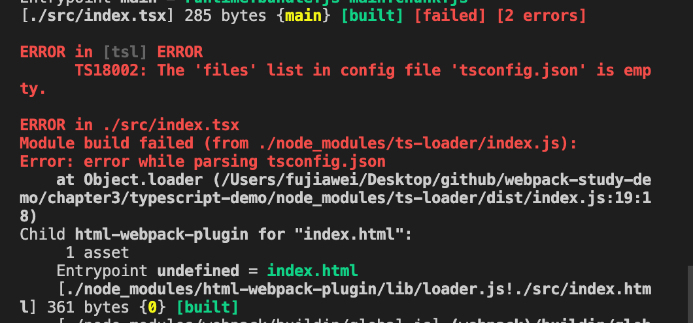
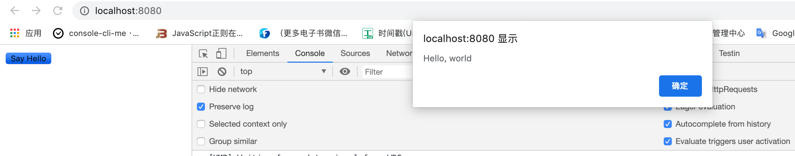
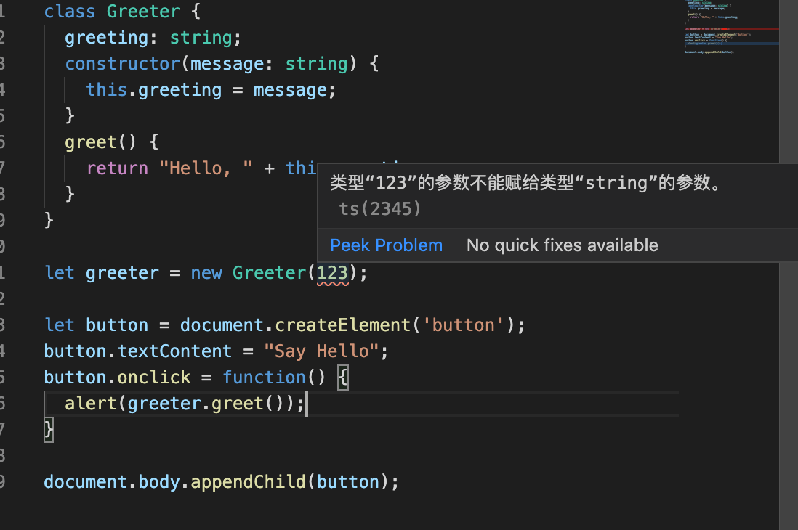
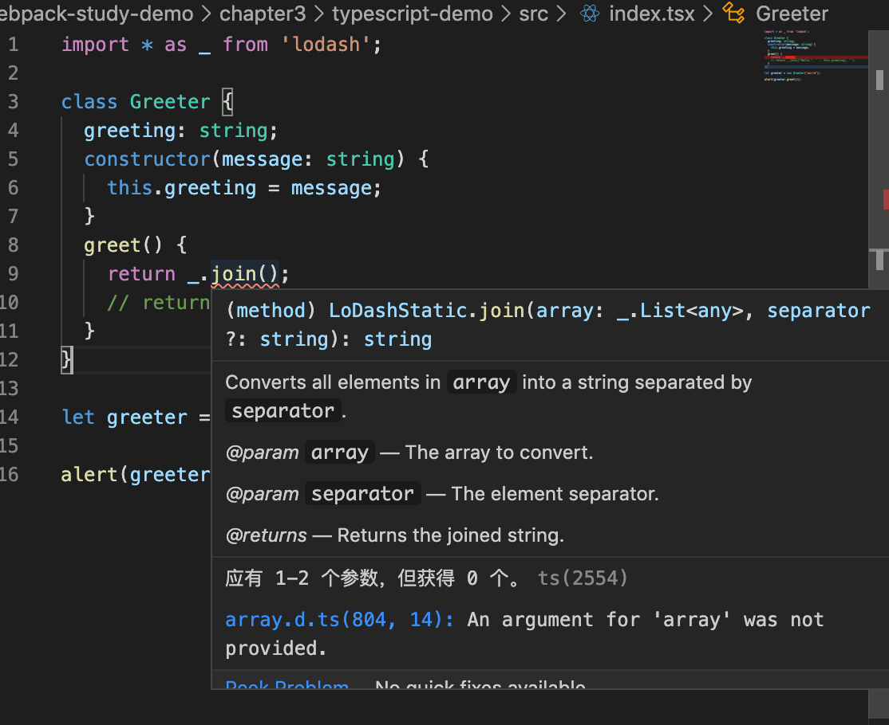
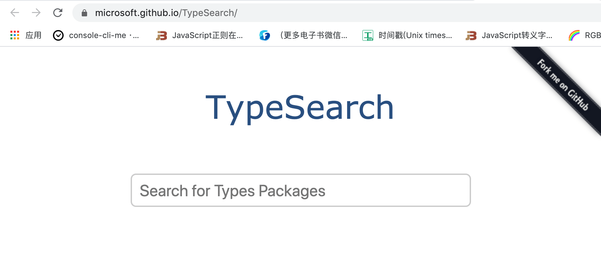

# TypeScript 打包

**TypeScript** 是一种由微软开发的自由和开源的编程语言。它是 `javascript` 的一个超集，而且本质上向这个语言添加了可选的静态类型和基于类的 **面向对象编程**。

今天我们就来讲一下 `typescript` 的打包。对于 `typescript` 的语法我们就不做过多的介绍了。


## 使用

### 安装

如果想要在项目中使用 `typescript` 我们首先就需要安装 `typescript`，以及处理 `typescript` 相应的 `ts-loader` 

```javascript
npm install typescript ts-loader -D
```


### 配置

接着我们在 `webpack.common.js` 添加 `ts-loader` 的配置：

```javascript
...
const commonConfig = {
	...
  module: {
    rules: [
      ...
      {
        test: /\.tsx?$/,
        use: 'ts-loader',
        exclude: /node_modules/
      },
      ...
    ]
  }
  ...
}

...
```


&nbsp;

接下来写一段 `typescript` 代码，我们修改入口文件 `index.tsx`：

```typescript
class Greeter {
  greeting: string;
  constructor(message: string) {
    this.greeting = message;
  }
  greet() {
    return "Hello, " + this.greeting;
  }
}

let greeter = new Greeter("world");

let button = document.createElement('button');
button.textContent = "Say Hello";
button.onclick = function() {
  alert(greeter.greet());
}

document.body.appendChild(button);
```


&nbsp;

我们打包一下 `npm run dev`，我们会看到一个错误，告诉我们需要安装一个 `tsconfig.json` 文件：



我们可以手动的添加 `tsconfig.json` 文件，也可以通过 `tsc --init` 命令来创建，不过这个命令需要在全局安装一下 `typescript`、或者可以使用 `npx tsx --init` 来自动生成。

我们手动添加一下 `tsconfig.json` 文件：

```json
{
  "compilerOpitons": {
    "outDir": "./dist", // 打包输出的目录，不配置也没事，因为在 webpack 已经配置了
    "module": "es6", // 打包的是 es6 d的代码
    "target": "es5", // 打包出来的内容是 es5，在大部分浏览器红都能使用
    "allowJs": true, // 允许 引入js
  },
  "include": ["src"], // 对 src 下的代码有效
}
```


我们重新打包一下 `npm run dev`，我们可以在浏览器中看到一个按钮，点击弹出 `hello world`，如下图：




如果我们给`Greeter` 传入数字 `123`，

```typescript
let greeter = new Greeter(123);
```

`vs code` 编辑器便会给我们提示相应的错误：




于是我们便可以快乐的开始写 `typescript` 代码了。


## 库使用 `typescript`

我们在代码中使用一下 `lodash`，我们修改一下 `index.tsx`，我们使用 `join` 方法，`join` 方法第一个参数需要传入一个数组。照理来说我们的编辑器应该会提示相应的错误，但是却没有提示相应的错误。

```typescript
import  _ from 'lodash';

class Greeter {
  greeting: string;
  constructor(message: string) {
    this.greeting = message;
  }
  greet() {
    return _.join();
    // return _.join(["Hello,", ' ', this.greeting], '');
  }
}

let greeter = new Greeter("world");

alert(greeter.greet());
```

这个时候我们就需要安装 `lodash` 的类型文件 `@types/lodash`：

```javascript
npm install @types/lodash -D
```

然后我们修改一下 `index.tsx` 中的 `lodash` 的引入方式：

```typescript
import * as _ from 'lodash';
```

这个时候编辑器就给我们提示了相应的错误了：




有很多库都有其对应的类型文件我们可以在 [TypeSearch](https://microsoft.github.io/TypeSearch/) 进行查找：




&nbsp;

## 相关链接

- [Typescript 官网](http://www.typescriptlang.org/)
- [Typescript DefinitelyTyped](https://github.com/DefinitelyTyped/DefinitelyTyped)
- [TypeSearch](https://microsoft.github.io/TypeSearch/)

&nbsp;

## 示例代码

示例代码可以看这里：

- [Typescript  示例代码](https://github.com/darrell0904/webpack-study-demo/tree/master/chapter3/typescript-demo)

