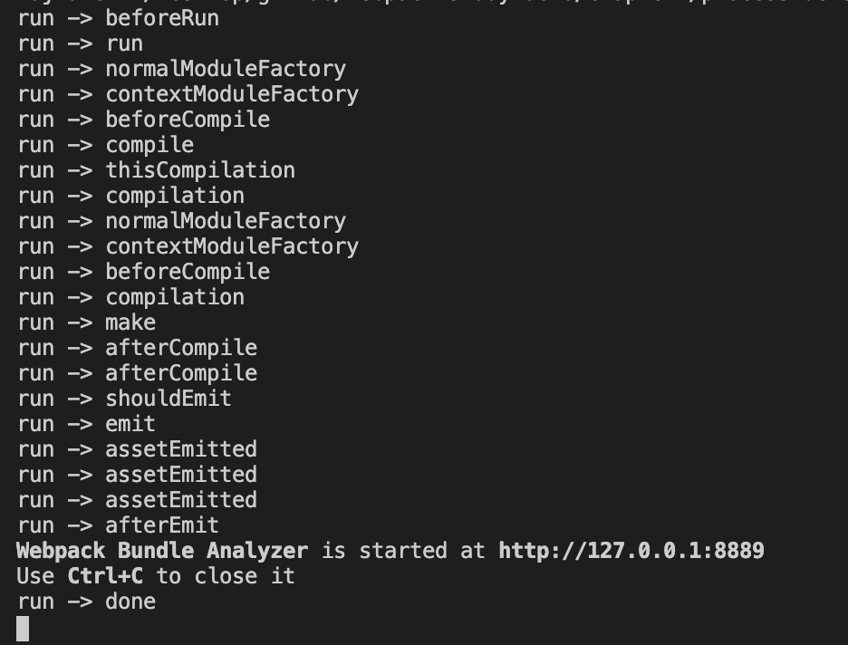
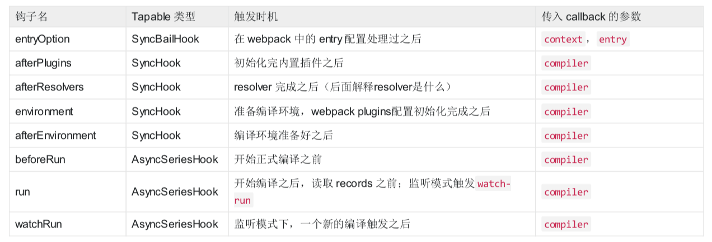
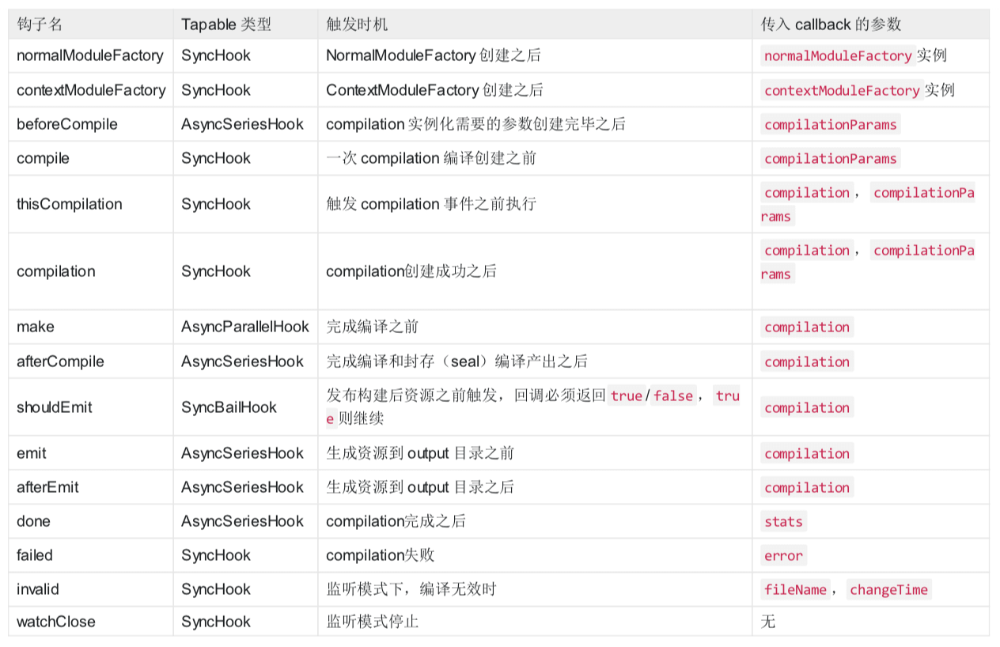
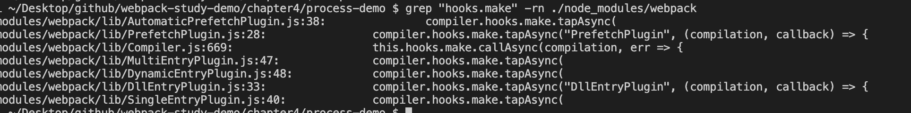

# Webpack 打包流程分析

## Compiler 和 Compilation

### Compiler

`Compiler` 继承自 `Tapable`，是 `Webpack` 的整个生命周期管理，代表了完整的 `Webpack` 环境配置。

每个`Webpack` 的配置，对应一个 `Compiler` 对象，记录了 `Webpack` 的 `options` 、`loader` 和 `plugin` 等信息，并且通过的 `Hook` 机制管理整个打包流程的生命周期。

#### 钩子

我们在代码中新建 `compilerHooks.js`，来看看我们执行 `webpack` 过程中运行了哪一些钩子：

```javascript
const webpack = require('webpack');
// 我们这里的配置文件是一个函数
const webpackConfig = require('./config/webpack.common.js');

const compiler = webpack(webpackConfig());

// 遍历hooks，添加回调，输出`hookName`
Object.keys(compiler.hooks).forEach(hookName => {
  if (compiler.hooks[hookName].tap) {
    compiler.hooks[hookName].tap('anyString', () => {
      console.log(`run -> ${hookName}`);
    });
  } 
});

// 触发webpack的编译流程
compiler.run();
```

接着在命令行中运行：`node compilerHooks.js`，可以看到如下输出：



这里面还只是 `webpack` 的 `compiler` 上面的部分钩子，还有很多钩子没有被打印，比如处理 入口文件 `entryOption`，准备编译环境 `environment`，打包失败 `failed` 等等，更多的大家可以参考 compiler 官方 hooks 文档。

一些参考如下图所示：





> 注意点：
>
> 这里有 `thisCompilation` 和 `compilation` 两个钩子，
>
> 是跟子编译( `child compiler` )有关，`Compiler` 实例通过 `createChildCompiler` 方法可以创建子编译实例 `childCompiler` 。创建 `childCompiler` 时，会复制 `compiler` 实例的任务点监听器。`compilation` 的钩子会被复制，而 `thisCompilation` 钩子则不会被复制。


### Compilation

`Compilation` 也继承自 `Tapable`，代表了一次资源版本构建，包含了当前的模块资源、编译生成资源、变化的文 件、以及被跟踪依赖的状态信息。

每次构建过程都会产生一次 `Compilation`，比如我们启动 `watch` 功能的时候，每当检测到一个文件变化，就会重新创建一个新的 `Compilation`，从而生成一组新的编译资源。

> `Webpack` 的插件是在 `apply` 方法接收 `Compiler` 对象来给某个流程添加钩子回调，钩子回调函数接收的是记录当前状态的 `Compilation` 对象。之后会在 `plugin` 小结讲到。

#### 钩子

在 `Compilation` 中处理的对象分别是 `module`、`chunk`、`asset`，由 `modules` 组成 `chunks`，由 `chunks` 生成 `assets`，处理顺序是 `module → modules → chunks → assets`，先从单个 module 开始处理，查找依赖关系， 最后完成单个 module 处理，拼装好 modules 之后，开始 chunks 阶段处理，最后在根据优化配置，按需生成assets。

`Compilation` 的钩子很多，就讲几个重要的钩子：

* seal：SyncHook

编译(`compilation`)停止接收新模块时触发

* optimize：SyncHook

优化阶段开始时触发

* optimizeModules：SyncBailHook

模块的优化

* optimizeChunks：SyncBailHook

优化 chunks

* additionalAssets：AsyncSeriesHook

为编译(compilation)创建附加资源(asset)

* optimizeChunkAssets：AsyncSeriesHook

优化所有 chunk 资源(asset)

* optimizeAssets：AsyncSeriesHook

优化存储在 compilation.assets 中的所有资源 (asset)

* normalModuleLoader：SyncHook

普通模块 loader，真正(一个接一个地)加载模块 图(graph)中所有模块的函数

更多的大家可以参考 Compilation 官方 hooks 文档。

> `Compilation` 有个很重要的对象是 `Stats` 对象，通过这个对象可以得到 `Webpack` 打包后的所有 `module`、`chunk` 和 `assets` 信息，通过分析 `Stats` 对象可以得到很多有用的信息，比如 `webpack-bundle-analyzer` 这类分析打包结果的插件都是通过分析 `Stats` 对象来得到分析报告的。
>
> 具体代码可以参考：`lib/Stats.js`


### Compiler 和 Compilation 关系

* `Compiler`：代表的是不变的 `Webpack` 环境，是针对 `Webpack` 的。例如 `watch` 模式下，传入的 `Webpack` 配置是不变的，不管执行几次 `Compilation` 都不变；
* `Compilation`：针对的是随时可变的项目文件，只要文件有改动，`Compilation` 就会被重新创建。

&nbsp;

## 流程

`Webpack` 的基本流程可以分为三个阶段：

* 准备阶段：主要是创建 `compiler` 和 `Compilation` 对象
* 编译阶段：这个阶段主要是完成 `modules` 解析，并且生成相应的 `chunks`
* 产出阶段：这个阶段的主要任务是根据 `chunks` 生成最终文件，主要有三个步骤：模板 Hash 更新，模板渲染 chunk，生成文件。

### 准备阶段

首先 `webapck` 会初始化参数，从配置文件和命令行中读取并合并参数，得到 `webpack` 最终的配置参数。（`shell` 中的参数的优先级高于配置文件）。

接着根据上面得到的配置参数，实例化一个 `compiler` 类，并且注册所有的插件，给对应的 `webpack` 构建生命周期绑上相应的 `hook`。

```javascript
// webpack 4.41.5
// lib/webpack.js

options = new WebpackOptionsDefaulter().process(options);

compiler = new Compiler(options.context);
compiler.options = options;

// 绑定 NodeEnvironmentPlugin
new NodeEnvironmentPlugin({
  infrastructureLogging: options.infrastructureLogging
}).apply(compiler);

// 绑定配置文件中的 plugins
if (options.plugins && Array.isArray(options.plugins)) {
  for (const plugin of options.plugins) {
    if (typeof plugin === "function") {
      plugin.call(compiler, compiler);
    } else {
      plugin.apply(compiler);
    }
  }
}
// 触发 compiler 环境 的 hook
compiler.hooks.environment.call();
compiler.hooks.afterEnvironment.call();
// 注册 webpack 内置插件
compiler.options = new WebpackOptionsApply().process(options, compiler);
```

其中上面 `WebpackOptionsApply` 用于将所有的配置 `options` 参数转换成 `webpack` 内置插件：

比如：

* output.library：使用 LibraryTemplatePlugin
* externals：使用 ExternalsPlugin
* devtool：使用 EvalDevtoolModulePlugin，SourceMapDevToolPlugin
* Mode=prodution：使用 FlagIncludedChunksPlugin、TerserPlugin 等

在 `WebpackOptionsApply` 跟构建流程相关性比较大的是 `EntryOptionPlugin`：

```javascript
// webpack 4.41.5
// lib/WebpackOptionsApply.js

const EntryOptionPlugin = require("./EntryOptionPlugin");

new EntryOptionPlugin().apply(compiler);
compiler.hooks.entryOption.call(options.context, options.entry);
```

它会解析传给 `Webpack` 的配置中的 `entry`。这里不同类型的 entry包括：`SingleEntryPlugin`、 `MultiEntryPlugin`、`DynamicEntryPlugin` 三类，分别对应着单文件入口、多文件入口和动态文件入口（函数）：

```javascript
// webpack 4.41.5
// lib/EntryOptionPlugin.js
const itemToPlugin = (context, item, name) => {
	if (Array.isArray(item)) {
		return new MultiEntryPlugin(context, item, name);
	}
	return new SingleEntryPlugin(context, item, name);
};

module.exports = class EntryOptionPlugin {
	/**
	 * @param {Compiler} compiler the compiler instance one is tapping into
	 * @returns {void}
	 */
	apply(compiler) {
		compiler.hooks.entryOption.tap("EntryOptionPlugin", (context, entry) => {
			if (typeof entry === "string" || Array.isArray(entry)) {
				itemToPlugin(context, entry, "main").apply(compiler);
			} else if (typeof entry === "object") {
				for (const name of Object.keys(entry)) {
					itemToPlugin(context, entry[name], name).apply(compiler);
				}
			} else if (typeof entry === "function") {
				new DynamicEntryPlugin(context, entry).apply(compiler);
			}
			return true;
		});
	}
};
```

除了 `EntryOptionPlugin`，其他的内置插件也会有特定的钩子在特定的任务点来完成特定的逻辑，当 `Compiler` 实例加载完内置插件之后，下一步就会直接调用 `compiler.run` 方法来启动构建。

```javascript
// webpack 4.41.5
// lib/Compiler.js

run(callback) {
  const onCompiled = (err, compilation) => {
    if (this.hooks.shouldEmit.call(compilation) === false) {
      // ...
    }

    this.emitAssets(compilation, err => {
      //...
    });
  };

  // 执行 beforeRun 钩子
  this.hooks.beforeRun.callAsync(this, err => {
    // 执行 run 这个 钩子
    this.hooks.run.callAsync(this, err => {
      if (err) return finalCallback(err);

      this.readRecords(err => {
        // 开始打包编译
        this.compile(onCompiled);
      });
    });
  });
}

// ...
compile(callback) {
  // Compilation类的参数
  const params = this.newCompilationParams();
  // 1. 执行beforeCompile 钩子回调
  this.hooks.beforeCompile.callAsync(params, err => {
    if (err) return callback(err);
    // 2. 执行 Compiler.compile 钩子回调
    this.hooks.compile.call(params);
    // 3. 实例化 Compilation
    const compilation = this.newCompilation(params);

    // 4. 执行 Compiler.make 钩子回调
    // make内实际主要是执行的compilation的addEntry方法(**注意这里**)
    this.hooks.make.callAsync(compilation, err => {
      if (err) return callback(err);

      compilation.finish(err => {
        if (err) return callback(err);
        
        // seal方法整理构建之后的chunk产出
        // 这里会做一些优化相关的事情，比如压缩代码等
        compilation.seal(err => {
          if (err) return callback(err);
          
          this.hooks.afterCompile.callAsync(compilation, err => {
            if (err) return callback(err);
            return callback(null, compilation);
          });
        });
      });
    });
  });
}
```

`newCompilationParams` 主要是生成对应 `compilation` 用到的参数：

```javascript
// webpack 4.41.5
// lib/Compiler.js
newCompilationParams() {
  const params = {
    // normal module
    normalModuleFactory: this.createNormalModuleFactory(),
    // context module
    contextModuleFactory: this.createContextModuleFactory(),
    // 依赖关系表
    compilationDependencies: new Set()
  };
  return params;
}
```

`compilation` 是后续构建流程中最核心最重要的对象，它包含了一次构建过程中所有的数据，一次构建过程对应一个 `Compilation` 实例。当 `Compilation` 实例创建完成之后，`Webpack` 的准备阶段已经完成，下一步将开始编译阶段。

&nbsp;

### 编译阶段

从 `Compiler` 的 `make` 钩子触发开始，此时内置插件 `SingleEntryPlugin`、`MultiEntryPlugin`、`DynamicEntryPlugin` (根据不同类型 `entry`)的监听器会开始执行。监听器都会调用 `Compilation` 实例的 `compilation.addEntry()` 方法，该方法将会触发第一批 `module` 的解析，这些 `module` 就是 `entry` 中配置的模块。

我们可以通过以下命令查找到 `webpack` 目录下所有 `hooks.make` 注册的函数：

```shell
grep "hooks.make" -rn ./node_modules/webpack
```

结果如下图所示：



拿 `SingleEntryPlugin.js` 举例，我们可以看到 make 钩子上注册的方法：`compilation.addEntry`，

```javascript
// webpack 4.41.5
// lib/SingleEntryPlugin.js
apply(compiler) {
	// ...

  compiler.hooks.make.tapAsync(
    "SingleEntryPlugin",
    (compilation, callback) => {
      const { entry, name, context } = this;

      const dep = SingleEntryPlugin.createDependency(entry, name);
      compilation.addEntry(context, dep, name, callback);
    }
  );
}
```

`compilation.addEntry` 方法如下：

```javascript
// webpack 4.41.5
// lib/Compilation.js
addEntry(context, entry, name, callback) {
  // ...
  // 执行内部 _addModuleChain 方法
  this._addModuleChain(
    context,
    entry,
    module => {
      this.entries.push(module);
    },
    (err, module) => {
      // ...
    }
  );
}
```

一个 `module` 解析完成之后的操作，`webpack` 会递归调用它所依赖的 `modules` 进行解析，所以当解析停止时，我们就能得到项目中所依赖的 `modules`，他们会存储在 `Compilation` 实例的 `modules` 属性中，并触发了 `Compilation` 的 `finishModules` 的钩子。

`module` 对象有 `NormalModule`、`ContextModule`、`ExternalModule`、`DelegatedModule`、`MultiModule`、`DllModule` 等多种类型（分别在对应的 `lib/*Module.js` 中实现）。

> `NormalModule`：普通模块
>
> `ContextModule`：`./src/a`、`./src/b`
>
> `ExternalModule`：`module.exports =jQuery`
>
> `DelegatedModule`：比如 `manifest` 文件
>
> `MultiModule`：`entry: ['a', 'b']`

我们以 `NormalModule` 为例讲解下 `module` 的解析流程：

`NormalModule` 的实例化是借助于 `NormalModuleFactory.create()` 方法，在  `_addModuleChain`  会有相应的区分，`NormalModuleFactory` 我们之前也讲过来自于创建 `compilation` 时传入的参数。

在 `NormalModule` 执行之前会调用 `resolver` 来获取一个 `modules` 的属性，比如解析这个 `module` 需要用到的 `loaders`，资源路径 `resource` 等等：

```javascript
// webpack 4.41.5
// lib/Compilation.js
buildModule(module, optional, origin, dependencies, thisCallback) {
  // ...
  this.hooks.buildModule.call(module);
  module.build(
    this.options,
    this,
    // 获取一个 modules 的属性
    this.resolverFactory.get("normal", module.resolveOptions),
    this.inputFileSystem,
    error => {
      // ...
      if (error) {
        // build 失败钩子
        this.hooks.failedModule.call(module, error);
        return callback(error);
      }
      // build 成功钩子
      this.hooks.succeedModule.call(module);
      return callback();
    }
  );
}
```

`resolver` 是指来自于 [`enhanced-resolve`](https://github.com/webpack/enhanced-resolve) 模块，它主要功能是一个提供异步 `require.resolve`，即从哪里去查找文件的路径，可以通过 `Webpack` 的 `resolve` 和 `resolverLoader` 来配置。`Compiler` 类有三种类型的内置 `Resolver`：

* `Normal`：通过绝对路径或相对路径，解析一个模块；
* `Context`：通过给定的上下文（`context`）解析一个模块；
* `Loader`：解析一个 `webpack loader`。

在创建完 `NormalModule` 实例之后会调用 `NormalModule.build()` 方法继续进行内部的构建，`NormalModule.build()` 会调用 `NormalModule.doBuild()`，在 `doBuild` 中执行 `loader`，生成 `AST` 语法树。


&nbsp;

## 相关链接

- [webpack详解](https://segmentfault.com/a/1190000013657042)
- [tapable\compiler\compilation](https://cloud.tencent.com/developer/article/1385858)
- [webpack 教程](https://cloud.tencent.com/developer/doc/1250)
- [细说 webpack 之流程篇](https://www.cnblogs.com/wuyifu/p/5993911.html)
- [webpack系列之五module生成2](https://juejin.im/post/5cc51b79518825250c76aac0)
- [webpack系列之一总览](https://juejin.im/post/5bf7c2186fb9a049fd0f7e8a)
- [玩转webpack（二）：webpack的核心对象]([https://lxzjj.github.io/2017/11/08/%E7%8E%A9%E8%BD%ACwebpack%EF%BC%88%E4%BA%8C%EF%BC%89/](https://lxzjj.github.io/2017/11/08/玩转webpack（二）/))
- [Webpack系列-第三篇流程杂记](https://www.cnblogs.com/Darlietoothpaste/p/10514660.html)
- [webpack module](https://www.cnblogs.com/Scar007/p/9166068.html)
- [minipack](https://github.com/chinanf-boy/minipack-explain)

&nbsp;

## 示例代码

示例代码可以看这里，具体是在 `node_modules` 中 `webpack` 文件：

- [示例代码](https://github.com/darrell0904/webpack-study-demo/tree/master/chapter4/tapable-demo)

