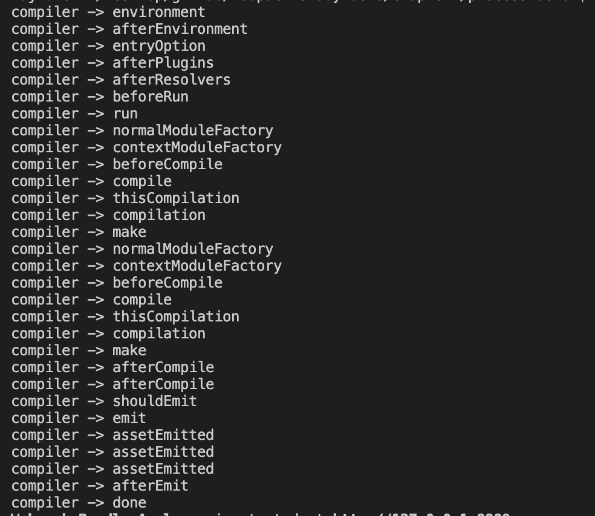
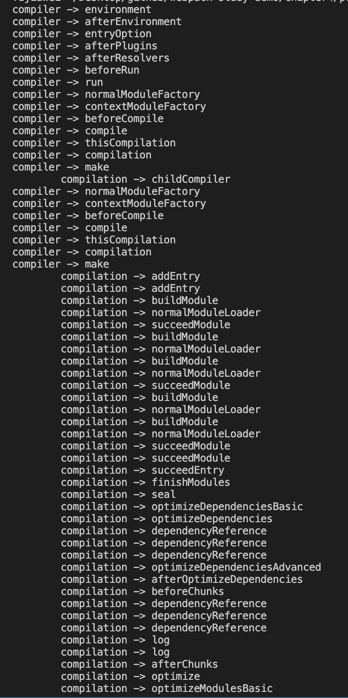
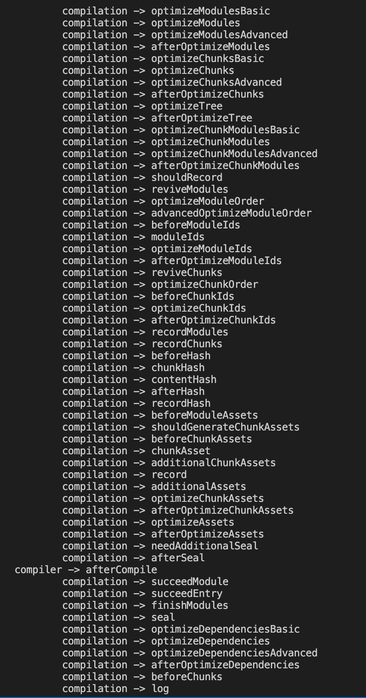
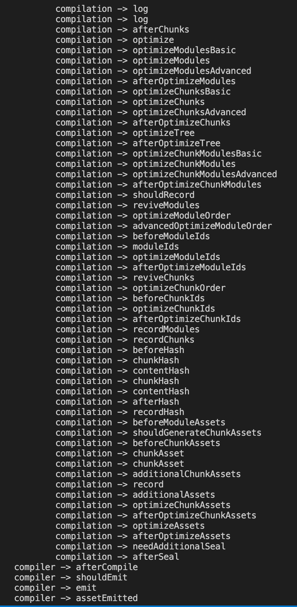
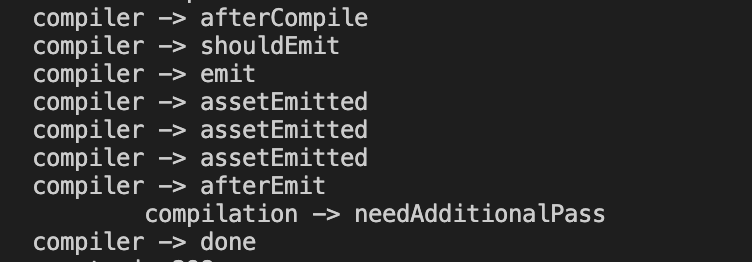
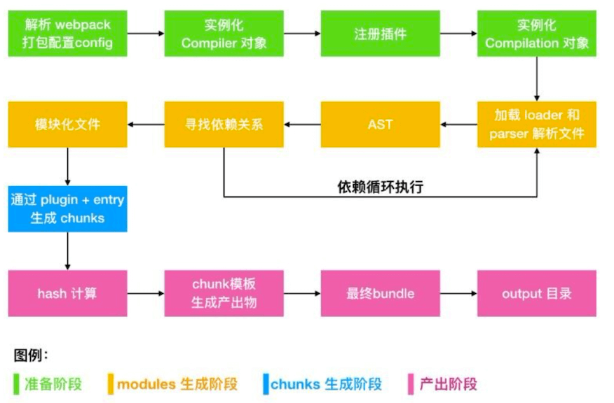

# Webpack 打包流程分析

## Compiler 和 Compilation

### Compiler

`Compiler` 继承自 `Tapable`，是 `Webpack` 的整个生命周期管理，代表了完整的 `Webpack` 环境配置。

每个`Webpack` 的配置，对应一个 `Compiler` 对象，记录了 `Webpack` 的 `options` 、`loader` 和 `plugin` 等信息，并且通过的 `Hook` 机制管理整个打包流程的生命周期。

#### 钩子

我们在代码中新建 `compilerHooks.js`，来看看我们执行 `webpack` 过程中运行了哪一些钩子：

```javascript
const webpack = require('webpack');
// 我们这里的配置文件是一个函数
const webpackConfig = require('./config/webpack.common.js');

const compiler = webpack(webpackConfig());

// 遍历hooks，添加回调，输出`hookName`
Object.keys(compiler.hooks).forEach(hookName => {
  if (compiler.hooks[hookName].tap) {
    compiler.hooks[hookName].tap('anyString', () => {
      console.log(`run -> ${hookName}`);
    });
  } 
});

// 触发webpack的编译流程
compiler.run();
```

接着在命令行中运行：`node compilerHooks.js`，可以看到如下输出：


这里面还只是 `webpack` 的 `compiler` 上面的部分钩子，还有很多钩子没有被打印，比如处理 入口文件 `entryOption`，准备编译环境 `environment`，打包失败 `failed` 等等，更多的大家可以参考 compiler 官方 hooks 文档。

一些参考如下图所示：


> 注意点：
>
> 这里有 `thisCompilation` 和 `compilation` 两个钩子，
>
> 是跟子编译( `child compiler` )有关，`Compiler` 实例通过 `createChildCompiler` 方法可以创建子编译实例 `childCompiler` 。创建 `childCompiler` 时，会复制 `compiler` 实例的任务点监听器。`compilation` 的钩子会被复制，而 `thisCompilation` 钩子则不会被复制。


### Compilation

`Compilation` 也继承自 `Tapable`，代表了一次资源版本构建，包含了当前的模块资源、编译生成资源、变化的文 件、以及被跟踪依赖的状态信息。

每次构建过程都会产生一次 `Compilation`，比如我们启动 `watch` 功能的时候，每当检测到一个文件变化，就会重新创建一个新的 `Compilation`，从而生成一组新的编译资源。

> `Webpack` 的插件是在 `apply` 方法接收 `Compiler` 对象来给某个流程添加钩子回调，钩子回调函数接收的是记录当前状态的 `Compilation` 对象。之后会在 `plugin` 小结讲到。

#### 钩子

在 `Compilation` 中处理的对象分别是 `module`、`chunk`、`asset`，由 `modules` 组成 `chunks`，由 `chunks` 生成 `assets`，处理顺序是 `module → modules → chunks → assets`，先从单个 module 开始处理，查找依赖关系， 最后完成单个 module 处理，拼装好 modules 之后，开始 chunks 阶段处理，最后在根据优化配置，按需生成assets。

`Compilation` 的钩子很多，就讲几个重要的钩子：

* seal：SyncHook

编译(`compilation`)停止接收新模块时触发

* optimize：SyncHook

优化阶段开始时触发

* optimizeModules：SyncBailHook

模块的优化

* optimizeChunks：SyncBailHook

优化 chunks

* additionalAssets：AsyncSeriesHook

为编译(compilation)创建附加资源(asset)

* optimizeChunkAssets：AsyncSeriesHook

优化所有 chunk 资源(asset)

* optimizeAssets：AsyncSeriesHook

优化存储在 compilation.assets 中的所有资源 (asset)

* normalModuleLoader：SyncHook

普通模块 loader，真正(一个接一个地)加载模块 图(graph)中所有模块的函数

更多的大家可以参考 Compilation 官方 hooks 文档。

> `Compilation` 有个很重要的对象是 `Stats` 对象，通过这个对象可以得到 `Webpack` 打包后的所有 `module`、`chunk` 和 `assets` 信息，通过分析 `Stats` 对象可以得到很多有用的信息，比如 `webpack-bundle-analyzer` 这类分析打包结果的插件都是通过分析 `Stats` 对象来得到分析报告的。
>
> 具体代码可以参考：`lib/Stats.js`


### Compiler 和 Compilation 关系

* `Compiler`：代表的是不变的 `Webpack` 环境，是针对 `Webpack` 的。例如 `watch` 模式下，传入的 `Webpack` 配置是不变的，不管执行几次 `Compilation` 都不变；
* `Compilation`：针对的是随时可变的项目文件，只要文件有改动，`Compilation` 就会被重新创建。

&nbsp;

## 流程

`Webpack` 的基本流程可以分为三个阶段：

* 准备阶段：主要是创建 `compiler` 和 `Compilation` 对象
* 编译阶段：这个阶段主要是完成 `modules` 解析，并且生成相应的 `chunks`
* 产出阶段：这个阶段的主要任务是根据 `chunks` 生成最终文件，主要有三个步骤：模板 Hash 更新，模板渲染 chunk，生成文件。

### 准备阶段

首先 `webapck` 会初始化参数，从配置文件和命令行中读取并合并参数，得到 `webpack` 最终的配置参数。（`shell` 中的参数的优先级高于配置文件）。

接着根据上面得到的配置参数，实例化一个 `compiler` 类，并且注册所有的插件，给对应的 `webpack` 构建生命周期绑上相应的 `hook`。

```javascript
// webpack 4.41.5
// lib/webpack.js

options = new WebpackOptionsDefaulter().process(options);

compiler = new Compiler(options.context);
compiler.options = options;

// 绑定 NodeEnvironmentPlugin
new NodeEnvironmentPlugin({
  infrastructureLogging: options.infrastructureLogging
}).apply(compiler);

// 绑定配置文件中的 plugins
if (options.plugins && Array.isArray(options.plugins)) {
  for (const plugin of options.plugins) {
    if (typeof plugin === "function") {
      plugin.call(compiler, compiler);
    } else {
      plugin.apply(compiler);
    }
  }
}
// 触发 compiler 环境 的 hook
compiler.hooks.environment.call();
compiler.hooks.afterEnvironment.call();
// 注册 webpack 内置插件
compiler.options = new WebpackOptionsApply().process(options, compiler);
```

其中上面 `WebpackOptionsApply` 用于将所有的配置 `options` 参数转换成 `webpack` 内置插件：

比如：

* output.library：使用 LibraryTemplatePlugin
* externals：使用 ExternalsPlugin
* devtool：使用 EvalDevtoolModulePlugin，SourceMapDevToolPlugin
* Mode=prodution：使用 FlagIncludedChunksPlugin、TerserPlugin 等

在 `WebpackOptionsApply` 跟构建流程相关性比较大的是 `EntryOptionPlugin`：

```javascript
// webpack 4.41.5
// lib/WebpackOptionsApply.js

const EntryOptionPlugin = require("./EntryOptionPlugin");

new EntryOptionPlugin().apply(compiler);
compiler.hooks.entryOption.call(options.context, options.entry);
```

它会解析传给 `Webpack` 的配置中的 `entry`。这里不同类型的 entry包括：`SingleEntryPlugin`、 `MultiEntryPlugin`、`DynamicEntryPlugin` 三类，分别对应着单文件入口、多文件入口和动态文件入口（函数）：

```javascript
// webpack 4.41.5
// lib/EntryOptionPlugin.js
const itemToPlugin = (context, item, name) => {
	if (Array.isArray(item)) {
		return new MultiEntryPlugin(context, item, name);
	}
	return new SingleEntryPlugin(context, item, name);
};

module.exports = class EntryOptionPlugin {
	/**
	 * @param {Compiler} compiler the compiler instance one is tapping into
	 * @returns {void}
	 */
	apply(compiler) {
		compiler.hooks.entryOption.tap("EntryOptionPlugin", (context, entry) => {
			if (typeof entry === "string" || Array.isArray(entry)) {
				itemToPlugin(context, entry, "main").apply(compiler);
			} else if (typeof entry === "object") {
				for (const name of Object.keys(entry)) {
					itemToPlugin(context, entry[name], name).apply(compiler);
				}
			} else if (typeof entry === "function") {
				new DynamicEntryPlugin(context, entry).apply(compiler);
			}
			return true;
		});
	}
};
```

除了 `EntryOptionPlugin`，其他的内置插件也会有特定的钩子在特定的任务点来完成特定的逻辑，当 `Compiler` 实例加载完内置插件之后，下一步就会直接调用 `compiler.run` 方法来启动构建。

```javascript
// webpack 4.41.5
// lib/Compiler.js

run(callback) {
  const onCompiled = (err, compilation) => {
    if (this.hooks.shouldEmit.call(compilation) === false) {
      // ...
    }

    this.emitAssets(compilation, err => {
      //...
    });
  };

  // 执行 beforeRun 钩子
  this.hooks.beforeRun.callAsync(this, err => {
    // 执行 run 这个 钩子
    this.hooks.run.callAsync(this, err => {
      if (err) return finalCallback(err);

      this.readRecords(err => {
        // 开始打包编译
        this.compile(onCompiled);
      });
    });
  });
}

// ...
compile(callback) {
  // Compilation类的参数
  const params = this.newCompilationParams();
  // 1. 执行beforeCompile 钩子回调
  this.hooks.beforeCompile.callAsync(params, err => {
    if (err) return callback(err);
    // 2. 执行 Compiler.compile 钩子回调
    this.hooks.compile.call(params);
    // 3. 实例化 Compilation
    const compilation = this.newCompilation(params);

    // 4. 执行 Compiler.make 钩子回调
    // make内实际主要是执行的compilation的addEntry方法(**注意这里**)
    this.hooks.make.callAsync(compilation, err => {
      if (err) return callback(err);

      compilation.finish(err => {
        if (err) return callback(err);
        
        // seal方法整理构建之后的chunk产出
        // 这里会做一些优化相关的事情，比如压缩代码等
        compilation.seal(err => {
          if (err) return callback(err);
          
          this.hooks.afterCompile.callAsync(compilation, err => {
            if (err) return callback(err);
            return callback(null, compilation);
          });
        });
      });
    });
  });
}
```

`newCompilationParams` 主要是生成对应 `compilation` 用到的参数：

```javascript
// webpack 4.41.5
// lib/Compiler.js
newCompilationParams() {
  const params = {
    // normal module
    normalModuleFactory: this.createNormalModuleFactory(),
    // context module
    contextModuleFactory: this.createContextModuleFactory(),
    // 依赖关系表
    compilationDependencies: new Set()
  };
  return params;
}
```

`compilation` 是后续构建流程中最核心最重要的对象，它包含了一次构建过程中所有的数据，一次构建过程对应一个 `Compilation` 实例。当 `Compilation` 实例创建完成之后，`Webpack` 的准备阶段已经完成，下一步将开始编译阶段。

&nbsp;

### 编译阶段

从 `Compiler` 的 `make` 钩子触发开始，此时内置插件 `SingleEntryPlugin`、`MultiEntryPlugin`、`DynamicEntryPlugin` (根据不同类型 `entry`)的监听器会开始执行。监听器都会调用 `Compilation` 实例的 `compilation.addEntry()` 方法，该方法将会触发第一批 `module` 的解析，这些 `module` 就是 `entry` 中配置的模块。

我们可以通过以下命令查找到 `webpack` 目录下所有 `hooks.make` 注册的函数：

```shell
grep "hooks.make" -rn ./node_modules/webpack
```

结果如下图所示：


拿 `SingleEntryPlugin.js` 举例，我们可以看到 make 钩子上注册的方法：`compilation.addEntry`，

```javascript
// webpack 4.41.5
// lib/SingleEntryPlugin.js
apply(compiler) {
	// ...

  compiler.hooks.make.tapAsync(
    "SingleEntryPlugin",
    (compilation, callback) => {
      const { entry, name, context } = this;

      const dep = SingleEntryPlugin.createDependency(entry, name);
      compilation.addEntry(context, dep, name, callback);
    }
  );
}
```

`compilation.addEntry` 方法如下：

```javascript
// webpack 4.41.5
// lib/Compilation.js
addEntry(context, entry, name, callback) {
  // ...
  // 执行内部 _addModuleChain 方法
  this._addModuleChain(
    context,
    entry,
    module => {
      this.entries.push(module);
    },
    (err, module) => {
      // ...
    }
  );
}
```

一个 `module` 解析完成之后的操作，`webpack` 会递归调用它所依赖的 `modules` 进行解析，所以当解析停止时，我们就能得到项目中所依赖的 `modules`，他们会存储在 `Compilation` 实例的 `modules` 属性中，并触发了 `Compilation` 的 `finishModules` 的钩子。

`module` 对象有 `NormalModule`、`ContextModule`、`ExternalModule`、`DelegatedModule`、`MultiModule`、`DllModule` 等多种类型（分别在对应的 `lib/*Module.js` 中实现）。

> `NormalModule`：普通模块
>
> `ContextModule`：`./src/a`、`./src/b`
>
> `ExternalModule`：`module.exports =jQuery`
>
> `DelegatedModule`：比如 `manifest` 文件
>
> `MultiModule`：`entry: ['a', 'b']`

我们以 `NormalModule` 为例讲解下 `module` 的解析流程：

`NormalModule` 的实例化是借助于 `NormalModuleFactory.create()` 方法，在  `_addModuleChain`  会有相应的区分，`NormalModuleFactory` 我们之前也讲过来自于创建 `compilation` 时传入的参数。

在 `NormalModule` 执行之前会调用 `resolver` 来获取一个 `modules` 的属性，比如解析这个 `module` 需要用到的 `loaders`，资源路径 `resource` 等等：

```javascript
// webpack 4.41.5
// lib/Compilation.js
buildModule(module, optional, origin, dependencies, thisCallback) {
  // ...
  this.hooks.buildModule.call(module);
  module.build(
    this.options,
    this,
    // 获取一个 modules 的属性
    this.resolverFactory.get("normal", module.resolveOptions),
    this.inputFileSystem,
    error => {
      // ...
      if (error) {
        // build 失败钩子
        this.hooks.failedModule.call(module, error);
        return callback(error);
      }
      // build 成功钩子
      this.hooks.succeedModule.call(module);
      return callback();
    }
  );
}
```

`resolver` 是指来自于 [`enhanced-resolve`](https://github.com/webpack/enhanced-resolve) 模块，它主要功能是一个提供异步 `require.resolve`，即从哪里去查找文件的路径，可以通过 `Webpack` 的 `resolve` 和 `resolverLoader` 来配置。`Compiler` 类有三种类型的内置 `Resolver`：

* `Normal`：通过绝对路径或相对路径，解析一个模块；
* `Context`：通过给定的上下文（`context`）解析一个模块；
* `Loader`：解析一个 `webpack loader`。

在创建完 `NormalModule` 实例之后会调用 `NormalModule.build()` 方法继续进行内部的构建，`NormalModule.build()` 会调用 `NormalModule.doBuild()`，在 `doBuild` 中执行 `loader`，生成 `AST` 语法树。

```javascript
// webpack 4.41.5
// lib/NormalModule.js
doBuild(options, compilation, resolver, fs, callback) {
  const loaderContext = this.createLoaderContext(
    resolver,
    options,
    compilation,
    fs
  );
  
  runLoaders(
    {
      resource: this.resource,
      loaders: this.loaders,
      context: loaderContext,
      readResource: fs.readFile.bind(fs)
    },
    (err, result) => {
      // ...
      if (err) {
        // ...
        return callback(error);
      }

      const resourceBuffer = result.resourceBuffer;
      const source = result.result[0];
      const sourceMap = result.result.length >= 1 ? result.result[1] : null;
      const extraInfo = result.result.length >= 2 ? result.result[2] : null;
			// ...
      // 这里是处理后的源码
      this._source = this.createSource(
        this.binary ? asBuffer(source) : asString(source),
        resourceBuffer,
        sourceMap
      );
      this._sourceSize = null;

      // 这里是ast
      this._ast =
        typeof extraInfo === "object" &&
        extraInfo !== null &&
        extraInfo.webpackAST !== undefined
        ? extraInfo.webpackAST
      		: null;
      return callback();
    }
  );
}
```

当一个模块编译成功之后，有会根据其 `AST` 查找依赖，递归整个构建流程，直到整个所有依赖都被处理完毕。得到 所有的 modules 之后，Webpack 会开始生成对应的 chunk。

查找依赖的过程是在 `doBuild` 的 `callback` 函数中使用 `lib/Parser.js` 这个函数来查找 `AST` 中的依赖，他是基于 [`acorn`](https://github.com/acornjs/acorn) 这个工具来进行依赖分析的。

```javascript
// webpack 4.41.5
// lib/NormalModule.js
build(options, compilation, resolver, fs, callback) {
  // ...
  return this.doBuild(options, compilation, resolver, fs, err => {
    this._cachedSources.clear();

    // if we have an error mark module as failed and exit
    if (err) {
      this.markModuleAsErrored(err);
      this._initBuildHash(compilation);
      return callback();
    }
    
    // ...
		// 遍历 AST 或者 源码 查找相关依赖
    try {
      const result = this.parser.parse(
        this._ast || this._source.source(),
        {
          current: this,
          module: this,
          compilation: compilation,
          options: options
        },
        (err, result) => {
          if (err) {
            handleParseError(err);
          } else {
            handleParseResult(result);
          }
        }
      );
      if (result !== undefined) {
        // parse is sync
        handleParseResult(result);
      }
    } catch (e) {
      handleParseError(e);
    }
  });
}
```

chunk 的生成算法如下：

1. Webpack 先将 entry 中对应的 module 都生成一个新的 chunk；

2. 遍历 module 的依赖列表，将依赖的 module 也加入到 chunk 中；

3. 如果一个依赖module是动态引入(import()、require.ensure())的模块，那么就会根据这个module创建一

   个新的 chunk，继续遍历依赖;

4. 重复上面的过程，直至得到所有的 chunks。

得到所有的 `chunks` 之后，`webpack` 会进入 `Compilation.seal()` 阶段，在这个阶段会对 `chunks` 和 `modules` 进行一些优化相关的操作，比如分配 `id`，排序，创建 `hash` 等，这个时候就会触发 `webpack.optimize` 配置中的用到的插件。

更多的 `seal` 阶段的操作，大家可以到 `lib/Compilation.js` 中去查看。

到这里，编译阶段结束了，到了产出阶段。

&nbsp;

### 产出阶段

在产出阶段，webpack 会根据 chunks 生成最终文件。主要有三个步骤：模板 hash 更新，模板渲染 chunk，生成 bunlde 文件。

Compilation 在实例化的时候，就会同时实例化三个对象：`mainTemplate`，`chunkTemplate` ，`moduleTemplate` ， 这三个对象是用来渲染 chunk 对象，得到最终代码的模板。

* `mainTemplate`：对应了在 entry 配置的入口 chunk 的渲染模板;
* `chunkTemplate`：动态引入的非入口 chunk 的渲染模板;
* `moduleTemplate`：chunk 中的 module 的渲染模板。

在开始渲染之前， Compilation 实例会调用 `Compilation.createHash()` 方法来生成这次构建的 `Hash`，在 Webpack 的配置中，我们可以在 `output.filename` 中配置 `[hash]` 占位符，最终就会替换成这个 `Hash`。同样，

`Compilation.createHash()` 也会为每一个 chunk 也创建一个 Hash，对应 `[chunkhash]` 占位符。

```javascript
// webpack 4.41.5
// lib/Compilation.js
seal(callback) {
  this.hooks.seal.call();
  // ...
  
  this.hooks.beforeHash.call();
  this.createHash();
  this.hooks.afterHash.call();
  
  // ...
}
```

当 `hash` 创建完成之后，下一步就会遍历 `Compilation` 对象的 `chunks` 属性，来渲染每一个 chunk。如果一个chunk 是入口 `(entry) chunk`，那么就会调用 `MainTemplate` 实例的 `render` 方法，否则调用 `ChunkTemplate` 的 `render` 方法：

```javascript
// webpack 4.41.5
// lib/Compilation.js
createHash() {
  // ...
  for (let i = 0; i < chunks.length; i++) {
    const chunk = chunks[i];
    const chunkHash = createHash(hashFunction);
    try {
      if (outputOptions.hashSalt) {
        chunkHash.update(outputOptions.hashSalt);
      }
      chunk.updateHash(chunkHash);
      // 根据类型选择模板
      const template = chunk.hasRuntime()
      ? this.mainTemplate
      : this.chunkTemplate;
      template.updateHashForChunk(
        chunkHash,
        chunk,
        this.moduleTemplates.javascript,
        this.dependencyTemplates
      );
      this.hooks.chunkHash.call(chunk, chunkHash);
      chunk.hash = /** @type {string} */ (chunkHash.digest(hashDigest));
      hash.update(chunk.hash);
      chunk.renderedHash = chunk.hash.substr(0, hashDigestLength);
      this.hooks.contentHash.call(chunk);
    } catch (err) {
      this.errors.push(new ChunkRenderError(chunk, "", err));
    }
  }
  // ...
}
```

当每个 `chunk` 的源码生成后，就会通过 `Compilation.emitAsset` 这个方法，添加到 `Compilation` 的 `assets` 属性中去

```javascript
// webpack 4.41.5
// lib/Compilation.js
emitAsset(file, source, assetInfo = {}) {
  if (this.assets[file]) {
    if (!isSourceEqual(this.assets[file], source)) {
      // TODO webpack 5: make this an error instead
      this.warnings.push(
        new WebpackError(
          `Conflict: Multiple assets emit different content to the same filename ${file}`
        )
      );
      this.assets[file] = source;
      this.assetsInfo.set(file, assetInfo);
      return;
    }
    const oldInfo = this.assetsInfo.get(file);
    this.assetsInfo.set(file, Object.assign({}, oldInfo, assetInfo));
    return;
  }
  this.assets[file] = source;
  this.assetsInfo.set(file, assetInfo);
}
```

当所有的 `chunk` 都渲染完成之后， `assets` 就是最终更要生成的文件列表。

完成上面的操作之后，`Compilation` 的 `seal` 方法结束，进入到 `compiler` 的 `emitAssets` 方法，`Compilation` 工作到此也全部结束了，这也意味着一次构建过程已经结束，接下来 `Webpack` 会直接遍历 `compilation.assets` 生成所有文件，然后触发任务点 `done`，结束构建流程。

&nbsp;

## 验证

我们可以遍历 `comipler.hooks`，使用 `hook.tap` 的方法添加回调函数，将 `hookName` 打印出来，前面我们有提到过相关方法，但是 `hooks` 会打印不全，前面是直接从 `run()` 方法时候开始的，缺少了环境变量和参数处理的流程，的比如 `environment`、`afterEnvironment` 会打印不出来。

为了显示全，我们可以在 `lib/Compiler.js` 中加入的 `constructor` 函数中加入如下代码：

```javascript
// webpack 4.41.5
// lib/Compiler.js
constructor() {
  // ...
  Object.keys(this.hooks).forEach(hookName => {

    if (this.hooks[hookName].tap) {
      this.hooks[hookName].tap('anyString', () => {
        console.log(`compiler -> ${hookName}`);
      });
    }
  });
}
```



可以看到相比较之前多出了下面几个过程：

```javascript
 environment
 afterEnvironment
 entryOption
 afterPlugins
 afterResolvers
```

接着我们可以使用同样的方法给 `Compilation` 添加上同样的方法，这样就可以看到 `webpack` 构建的整个钩子流程了：

```javascript
// webpack 4.41.5
// lib/Compilation.js
constructor() {
  // ...
  Object.keys(this.hooks).forEach(hookName => {

    if (this.hooks[hookName].tap) {
      this.hooks[hookName].tap('anyString', () => {
        console.log(`	Compilation -> ${hookName}`);
      });
    }
  });
}
```

这样我们就可以看到所有的 `hooks` 了：









接着我们可以运行 `npm run dev`，来更好的理解一下 `Compiler` 和 `Compilation` 的区别，这个时候 `webpack` 是处于 `watch` 模式，他与普通模式的流程还是有一些区别的，如下：

```javascript
// 普通模式
compiler -> afterResolvers
compiler -> beforeRun (不同)
compiler -> run (不同)
compiler ->	normalModuleFactory

// watch 模式
compiler ->	afterResolvers
compiler ->	watchRun (不同)
compiler ->	normalModuleFactory
```

我们修改一些入口文件 `src/index.js`，可以发现 `compiler` 只是从 `invaile -> watchRun` 开始，没有重新走流程，但是 `Compilation` 却走完了一个流程，在这里我们可以得出：**`compiler` 是管理整个生命周期的，而 `compilation` 是每次编译触发都会重新生成一次的。**

&nbsp;

## 总结

这一节我们主要分析了 `webpack` 的构建流程，我们在来回顾一波 `webpack` 的流程：

1. 初始化参数：包括从配置文件和 `shell` 中读取和合并参数，然后得出最终参数。

2. 使用上一步得到的参数实例化一个 `Compiler` 类，注册所有的插件，给对应的 `Webpack` 构建生命周期绑定`Hook`。

3. 开始编译：执行 `Compiler` 类的 `run` 方法开始执行编译。

4. `compiler.run` 方法调用 `compiler.compile`，在 `compile` 内实例化一个 `Compilation` 类，`Compilation` 是做构建打包的事情，主要事情如下：
   * 查找入口：根据 `entry` 配置，找出全部的入口文件
   * 编译模块：根据文件类型和 `loader` 配置，使用对应 `loader` 对文件进行转换处理
   * 解析文件的 `AST` 语法树
   * 找出文件依赖关系（`arcon`）
   * 递归编译依赖的模块
5. 递归完后得到每个文件的最终结果，根据 `entry` 配置生成代码块 `chunk`
6. 输出所有 `chunk` 到对应的 `output` 路径，打包完成。

**举例流程可参考下图**：




这篇文章具体是参考了 [慕课网专栏——Webpack 从零入门到工程化实战](http://www.imooc.com/read/29) 中的 **`webpack` 构建流程** 这一章，讲的贼仔细，墙裂推荐。

&nbsp;

## 相关链接

- [webpack详解](https://segmentfault.com/a/1190000013657042)
- [tapable\compiler\compilation](https://cloud.tencent.com/developer/article/1385858)
- [webpack 教程](https://cloud.tencent.com/developer/doc/1250)
- [细说 webpack 之流程篇](https://www.cnblogs.com/wuyifu/p/5993911.html)
- [webpack系列之五module生成2](https://juejin.im/post/5cc51b79518825250c76aac0)
- [webpack系列之一总览](https://juejin.im/post/5bf7c2186fb9a049fd0f7e8a)
- [玩转webpack（二）：webpack的核心对象]([https://lxzjj.github.io/2017/11/08/%E7%8E%A9%E8%BD%ACwebpack%EF%BC%88%E4%BA%8C%EF%BC%89/](https://lxzjj.github.io/2017/11/08/玩转webpack（二）/))
- [Webpack系列-第三篇流程杂记](https://www.cnblogs.com/Darlietoothpaste/p/10514660.html)
- [webpack module](https://www.cnblogs.com/Scar007/p/9166068.html)
- [minipack](https://github.com/chinanf-boy/minipack-explain)

&nbsp;

## 示例代码

示例代码可以看这里，具体是在 `node_modules` 中 `webpack` 文件：

- [示例代码](https://github.com/darrell0904/webpack-study-demo/tree/master/chapter4/process-demo)

