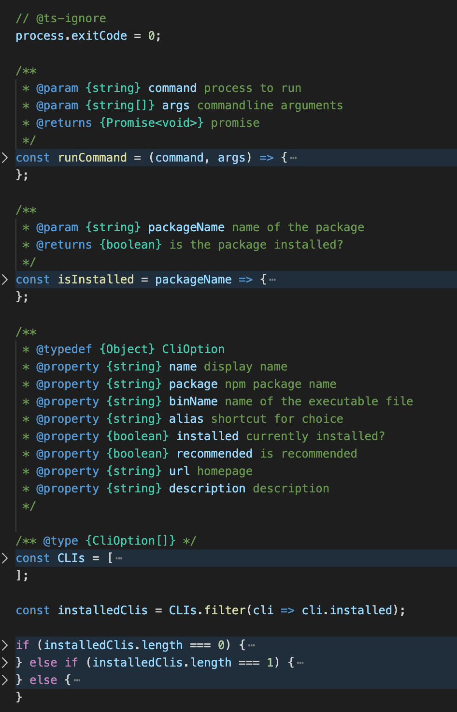
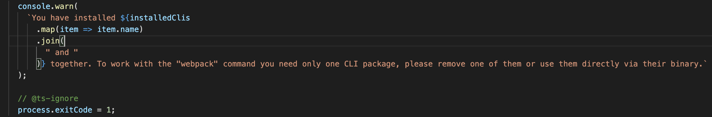
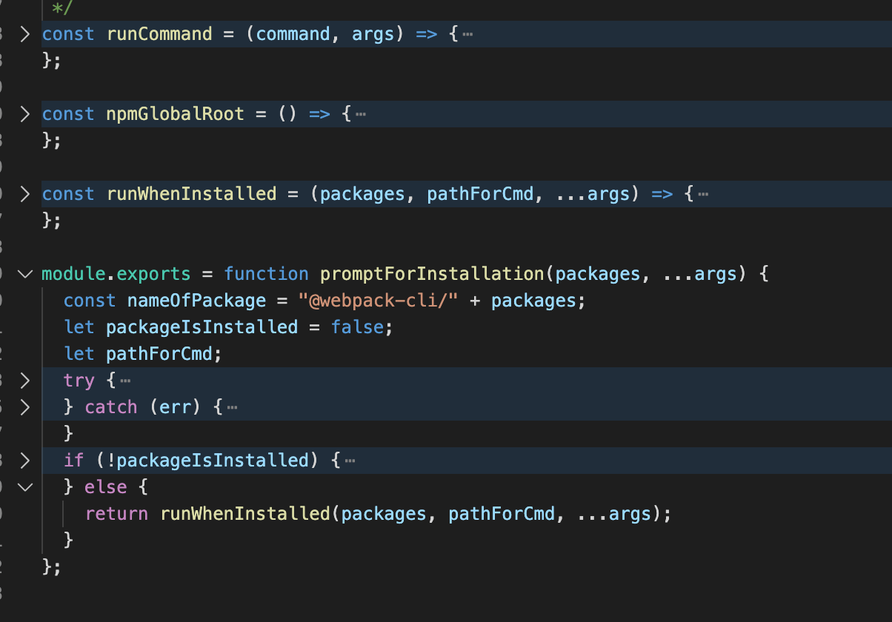
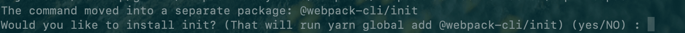
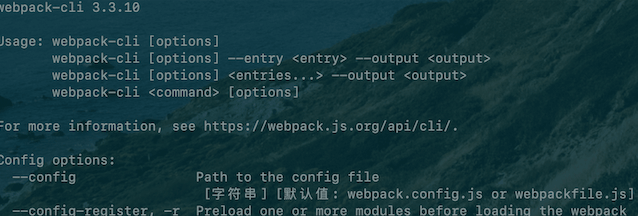

# Webpack 启动过程分析

## Webpack 入口文件

### 入口文件

无论是通过 `npm scripts` 运行 `webpack`：

* 开发环境：`npm run dev`
* 生产环境：`npm run build`

还是通过 `webpack` 直接运行：

* `webpack entry.js bundle.js`

**在命令行运行了上述命令后，`npm` 会在命令行中进入 `node_modules/bin` 目录下去查找是否存在 `webpack.sh` 或者 `webpack.cmd` 文件，如果存在，就执行，不存在，就抛出错误。**

&nbsp;

我们在 `node_modules` 中我们可以找到 `webpack` 项目的 `package.json` 文件，可以发现有如下配置：

```json
{
  "name": "webpack",
  "version": "4.41.5",
  // ...
  "main": "lib/webpack.js",
  "web": "lib/webpack.web.js",
  "bin": "./bin/webpack.js",
  // ...
}
```

> `npm` 的 `bin` 字段作用：设置了之后 可执行文件 会被链接到当前项目的 `./node_modules/.bin` 中，在本项目中，就可以很方便地利用 `npm` 执行脚本，更多可参考 [npm的package.json字段含义](https://www.bbsmax.com/A/lk5anQE2d1/)。

在函数中引入 `webpack`，那么入口将会是`lib/webpack.js`。而如果在 `shell` 中执行，那么将会走到 `./bin/webpack.js`。

其实 `webpack` 实际的路口文件是 `node_modules/webpack/bin/webpack.js`。

&nbsp;

### 入口文件 `webpack.js` 分析

我们分析一下 `/bin/webpack.js`，文件很简单，主要分为六步，如下图：



1. 这一行代码正常执行返回

```javascript
process.exitCode = 0;
```

`exitCode` 代表错误码，0 的意思就是没有错误，当运行过程中有错误就会去修改相应的错误码。

2. 运行某个命令

```javascript
const runCommand = (command, args) =>{...};
```

通过 `Node.js` 核心模块 [`child_process`](http://nodejs.cn/api/child_process.html) 去运行某个命令，类似执行 `npm run webpack-cli` 这样。

3. 判断某个包是否安装

```javascript
const isInstalled = packageName =>{...};
```

这个方法是判断某个包是否安装

4. 指定 `webpack` 可用的 `CLI`：

```javascript
const CLIs = [
  {
    name: "webpack-cli",
    package: "webpack-cli",
    binName: "webpack-cli",
    alias: "cli",
    installed: isInstalled("webpack-cli"),
    recommended: true,
    url: "https://github.com/webpack/webpack-cli",
    description: "The original webpack full-featured CLI."
  },
  {
    name: "webpack-command",
    package: "webpack-command",
    binName: "webpack-command",
    alias: "command",
    installed: isInstalled("webpack-command"),
    recommended: false,
    url: "https://github.com/webpack-contrib/webpack-command",
    description: "A lightweight, opinionated webpack CLI."
  }
];
```

* `webpack-cli`：`webpack4.0` 之后将 `webpack-cli` 分离了出来，具有 `webpack` 所有的特性和功能。
* `webpack-command`：轻量级的 `webpack-cli`

5. 返回安装的 `CLI` 的个数

```javascript
const installedClis = CLIs.filter(cli => cli.installed);
```

判断上面的两个 `CLI` 是否安装了，并返回安装的 `CLI` 的个数。

6. 根据安装数量进行处理

```javascript
if (installedClis.length === 0){...}
else if(installedClis.length === 1){...}
else{...}.
```

* 当安装个数是 0 的时候，会提示我们需要至少安装一个 `CLI`，他会在命令行中给予一些选择，一步一步引导我们去安装 `CLI`：

```javascript
// ...
// 定义错误提示信息

let notify =
		"One CLI for webpack must be installed. These are recommended choices, delivered as separate packages:";

for (const item of CLIs) {
  if (item.recommended) {
    notify += `\n - ${item.name} (${item.url})\n   ${item.description}`;
  }
}

// ...
// 选择安装包工具

const isYarn = fs.existsSync(path.resolve(process.cwd(), "yarn.lock"));
const packageManager = isYarn ? "yarn" : "npm";
const installOptions = [isYarn ? "add" : "install", "-D"];

// ...

const question = `Do you want to install 'webpack-cli' (yes/no): `;
const questionInterface = readLine.createInterface({
  input: process.stdin,
  output: process.stderr
});

// 询问我们是否安装 webpack-cli
questionInterface.question(question, answer => {
  // ...

  // 运行 安装命令
  runCommand(packageManager, installOptions.concat(packageName))
    .then(() => {
    require(packageName); //eslint-disable-line
  })
    .catch(error => {
    console.error(error);
    process.exitCode = 1;
  });
});
```

* 当安装 `CLI` 个数是 1 个的时候，`webpack` 就会自动去执行这个 `CLI`：

```javascript
const path = require("path");
// 找到 package.json 文件夹
const pkgPath = require.resolve(`${installedClis[0].package}/package.json`);
// 引入 CLI
const pkg = require(pkgPath);
// 执行 bin 中的文件
// 以 webpack-cli 举例子 会执行 其文件中 ./bin/cli.js 文件
require(path.resolve(
  path.dirname(pkgPath),
  pkg.bin[installedClis[0].binName]
));
```

下面我们会具体讲一下 `webpack-cli` 具体做了一些什么事情。

* 当安装 `CLI` 个数是 2 个的时候，会提示我们报错，说只能使用一个 `CLI`，需要移除一个：




### 入口文件小结

在执行 `./bin/webpack.js` 文件之后，`webpack` 最终会找到 `webpack-cli`（`webpack-command`）这个 `npm` 包，并且执行 `CLI`。

&nbsp;

## `webpack-cli` 做的事情

上面我们分析了当我们运行 `webpack` 的时候，其实会去运行 `webpack-cli` 这个 `CLI`，其实运行 `webpack-cli`，最终运行的就是其目录下的 `./bin/cli.js` 那么 `webpack-cli` 是做什么的呢？

### 作用

`webpack-cli` 对配置文件（`webpack.config.js`）和命令行参数进行转换最终生成 `webpack` 构建所需要的配置选项参数，最终会根据配置参数实例化 `webpack` 对象，然后执行构建流程。

### 流程分析

首先在 `webpack-cli` 中引入了 `yargs` 工具，用于对命令行进行定制。


分析输入之后的命令行参数，对各个参数进行转换，组成编译配置项，最后通过引入 `webpack` 结合处理好的配置，进行编译和构建。

### 源码分析

#### `NON_COMPILATION_CMD`

有一些 `webpack` 命令不需要去实例化一个 `webpack` 去执行编译，在 `cli.js` 中定义了一个 `NON_COMPILATION_CMD` 字段，去处理这些不需要编译的命令：

```javascript
const { NON_COMPILATION_ARGS } = require("./utils/constants");

// ...

const NON_COMPILATION_CMD = process.argv.find(arg => {
  if (arg === "serve") {
    global.process.argv = global.process.argv.filter(a => a !== "serve");
    process.argv = global.process.argv;
  }
  return NON_COMPILATION_ARGS.find(a => a === arg);
});

if (NON_COMPILATION_CMD) {
  return require("./utils/prompt-command")(NON_COMPILATION_CMD, ...process.argv);
}
```

我们可以从 `./utils/constants` 文件中找到 `webpack-cli` 提供的不需要编译的命令：

```javascript
const NON_COMPILATION_ARGS = [
  "init", // 创建一份 webpack 配置文件
  "migrate", // 进行 webpack 版本迁移
  "serve", // 运行 webpack-serve 
  "generate-loader", // 生成 webpack loader 代码
  "generate-plugin", // 生成 webpack plugin 代码
  "info" // 返回与本地环境相关的一些信息
];
```

如果他属于不需要编译的命令，那么那就回去执行 `./utils/prompt-command` 这个模块，处理这些命令，其实这个模块与我们之前讲道德 `webpack.js` 比较类似，他会定义一个 `runCommand` 方法，接着去判断这个命令是否存在，存在就通过 `runWhenInstalled` 方法去执行，不存在的话就提示我们去安装，如下图：



我们在命令行中输入 `npx webpack init`，他会提示我们安装 `@webpack-cli/init`：



&nbsp;

### 工具包 yargs 介绍

#### 动态生成帮助信息

`yargs` 提供了命令和分组参数，动态生成 `help` 帮助信息，如下所示： 



这些命令行参数都写在了 `config/config-yargs.js` 中：

```javascript
const { GROUPS } = require("../utils/constants");

const {
	CONFIG_GROUP,
	BASIC_GROUP,
	MODULE_GROUP,
	OUTPUT_GROUP,
	ADVANCED_GROUP,
	RESOLVE_GROUP,
	OPTIMIZE_GROUP,
	DISPLAY_GROUP
} = GROUPS;

// ...
module.exports = function(yargs) {
  yargs
    .help("help")
    .alias("help", "h")
    .version()
    .alias("version", "v")
    .options({
      config: {
        type: "string",
        describe: "Path to the config file",
        group: CONFIG_GROUP,
        defaultDescription: "webpack.config.js or webpackfile.js",
        requiresArg: true
      },
      // ...
  })
}
```

在这里定义了所有的命令参数，并且将它们区分成了 8个组，加上 `webpack` 的通用参数，其实总共有九个组，我们可以查看 `utils/constants.js` 文件：

```javascript
// ...
const CONFIG_GROUP = "Config options:";
const BASIC_GROUP = "Basic options:";
const MODULE_GROUP = "Module options:";
const OUTPUT_GROUP = "Output options:";
const ADVANCED_GROUP = "Advanced options:";
const RESOLVE_GROUP = "Resolving options:";
const OPTIMIZE_GROUP = "Optimizing options:";
const DISPLAY_GROUP = "Stats options:";

// ...

const WEBPACK_OPTIONS_FLAG = "WEBPACK_OPTIONS";

// ...
```

具体参数的意思如下：

* Config options：配置相关参数（文件名称、运行环境等）
* Basic options：基础参数（ `entry` 设置、`debug` 模式设置、`watch` 监听设置、`devtool` 设置）
* Module options：模块参数，给 `loader` 设置扩展
* Output options：输出参数（输出路径、输出文件名称）
* Advanced options：高级用法（记录设置、缓存设置、监听频率、`bail` 等）
* Resolving options：解析参数（ `alias` 和 解析的文件后缀设置）
* Optimizing options：优化参数
* Stats options：统计参数
* options：通用参数（帮助命令、版本信息等）

&nbsp;

#### 处理命令行参数

对于 `yargs` 的使用用法，笔者举几个简单例子，新建一个 `yargs-demo`，

```shell
cd yargs-demo
npm init
npm install -D yargs
```

新建一个 `index.js` 文件：

```javascript
var argv = require('yargs').argv;

console.log('hello ', argv.name);
```

接着我们在命令行中输入：

```shell
$ node index.js --name=tom
--> hello tom

$ node index.js --name tom
--> hello tom
```

之前我们可以通过 `Node.js` 的 `process.argv` 获取相应的命令行参数：


**`yargs` 可以上面的结果改为一个对象，每个参数项就是一个键值对**：

```javascript
{ _: [], name: 'tom', '$0': 'index.js' }
```

&nbsp;

如果将 `argv.name` 改成 `argv.n`，就可以使用一个字母的短参数形式了。

```shell
$ node index.js -n tom
```

输出：

```javascript
{ _: [], n: 'tom', '$0': 'index.js' }
```

可以使用 `alias` 方法，指定 `name` 是 `n` 的别名，修改 `index.js`

```javascript
var argv = require('yargs')
  .alias('n', 'name')
  .argv;

console.log('hello ', argv.n);
```

输出：

```shell
$ node index.js -n tom
--> hello tom

$ node index.js --name tom
--> hello tom
```

&nbsp;

`argv` 对象有一个下划线（_）属性，可以获取非连词线开头的参数：

```shell
$ node index.js A -n tom B C
```

输出：

```javascript
{ _: [ 'A', 'B', 'C' ], n: 'tom', name: 'tom', '$0': 'index.js' }
```

笔者只是列举了几个比较简单的例子，更多用法大家可以参考：[Node.js 命令行程序开发教程](http://www.ruanyifeng.com/blog/2015/05/command-line-with-node.html) 和 [yargs 的 api](https://github.com/yargs/yargs/blob/HEAD/docs/api.md)。


### 生成配置项参数

`webpack-cli` 通过 `yargs` 来处理生层 `webpack` 所需的配置参数：

```javascript
yargs.parse(process.argv.slice(2), (err, argv, output) => {
  // arguments validation failed
  if (err && output) {
    console.error(output);
    process.exitCode = 1;
    return;
  }
  // help or version info
  if (output) {
    console.log(output);
    return;
  }
  // ...

  let options;
  try {
    options = require("./utils/convert-argv")(argv);
  } catch (err) {
    // ...
  }
  
  // 判断对象中是否存在相应对键值对
  function ifArg(name, fn, init) {
    // ...
  }
  
  // 最核心的方法
  function processOptions(options) {
    // ...
  }
  
  processOptions(options);
})
```

可以看到当 `webpack` 遇到错误或者输入 `-help` 和 `version` 的时候就直接返回不去处理配置参数了。

**`options`** 这个值就是代表要传给 `webpack` 的配置参数，它包含了两部分，一个是配置文件里面的配置，还有一个是命令行里面的配置参数，它会通过 `./utils/convert-argv` 这个模块返回最终处理好的配置参数。

最后将配置文件传入到 `processOptions` 这个函数中，启动 `webpack`，同时在函数中还会去定义一个 `outputOptions` 这个是用于在 `webpack` 编译后输出出来的配置项，具体可以看在 `compilerCallback` 中的使用。

```javascript
function processOptions(options) {
  // ...
  const webpack = require("webpack");
  let compiler;
  try {
    // 实例化 webpack 对象
    compiler = webpack(options);
  } catch (err) {
    // ...
  }
  
  // 回调函数
  function compilerCallback(err, stats) {
    // ...
  }
  
  // 如果是 watch 启动 webpack，使用 compiler.watch
  if (firstOptions.watch || options.watch) {
    // ...
    compiler.watch(watchOptions, compilerCallback);
  } else {
    // 正常启动，使用 compiler.run
    compiler.run((err, stats) => {
      if (compiler.close) {
        compiler.close(err2 => {
          compilerCallback(err || err2, stats);
        });
      } else {
        compilerCallback(err, stats);
      }
    });
  }
}
```

### 小结

笔者只是大致讲了一下流程，对于具体 `webpack-cli` 是怎么讲配置文件和命令行参数转化为具体的 `webpack` 所需的配置，这个大家有兴趣可以自己去研究一下，其实说到底还是使用 `yargs` 这个神器来解决的。 

&nbsp;

## 相关链接

- [webpack详解](https://segmentfault.com/a/1190000013657042)
- [Node.js 命令行程序开发教程](http://www.ruanyifeng.com/blog/2015/05/command-line-with-node.html)
- [yargs 的 api](https://github.com/yargs/yargs/blob/HEAD/docs/api.md)

&nbsp;

## 示例代码

示例代码可以看这里，具体是在 `node_modules` 中 `webpack` 文件：

- [示例代码](https://github.com/darrell0904/webpack-study-demo/tree/master/chapter4/plugins-demo)

