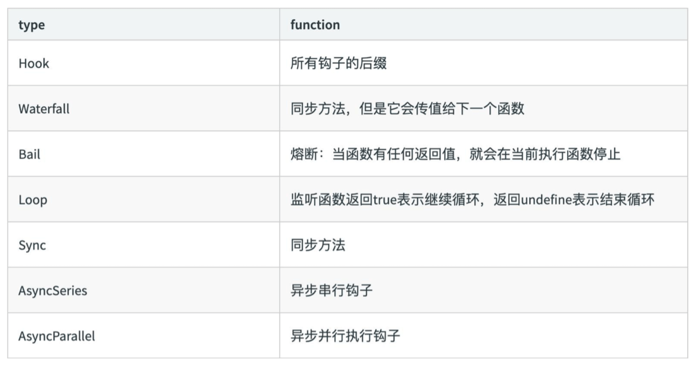
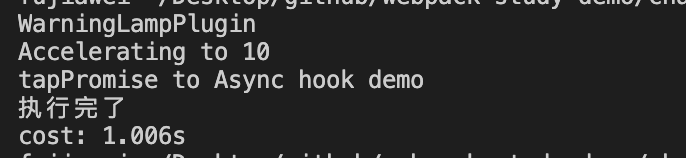
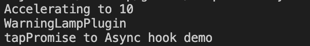
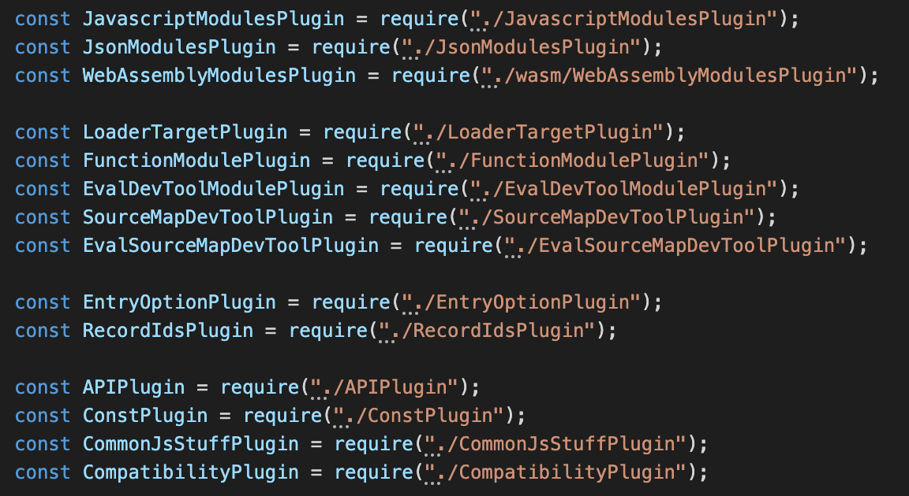

# Tapable 与 webpack

webpack 本质上是一种基于事件流的编程范例，它的工作流程就是将各个插件串联起来，而实现这一切的核心就是 [Tapable](https://github.com/webpack/tapable)。

webpack 中最核心的负责编译的 `Compiler` 和负责创建 `bundles` 的 `Compilation` 都是 `Tapable` 的实例。

```javascript
// 核心对象 Compiler 继承 Tapable
class Compiler extends Tapable {
	// ... 
}

// 核心对象 Compilation 继承 Tapable
class Compilation extends Tapable {
	// ... 
}
```

&nbsp;

## Tapable 是什么?

是一个类似于 `Node.js` 的 `EventEmitter` 的库，主要是控制钩子函数的发布与订阅，控制着 `webpack` 的插件系统。

### 各种类型 Hooks

```javascript
const {
  // 同步钩子 (简单的调用每个tap进去的函数)
  SyncHook,

  // 同步熔断钩子 
  // 当任何一个tap进去的函数,返回任何值, bail 类会停止执行其他的函数执行。(类似 Promise.race())
  SyncBailHook,
  // 同步流水钩子
  // 会调用每个tap进去的函数,不同的是,他会从每一个函数传一个返回的值到下一个函数
  SyncWaterfallHook,
  // 同步循环钩子
  SyncLoopHook,


  // async-parallel 异步并发钩子
  // 就是把异步钩子全部一起开启,不按顺序执行
  AsyncParallelHook,				// 异步并发钩子
  AsyncParallelBailHook,		// 异步并发熔断钩子


  // async-series 异步串行钩子
  // 会按顺序的调用每个方法.
  AsyncSeriesHook,					// 异步串行钩子
  AsyncSeriesBailHook,			// 异步串行熔断钩子
  AsyncSeriesWaterfallHook,	// 异步串行流水钩子
} = require("tapable");
```



上图像我们展示了 `Tapable hooks` 的类型，各种类型钩子其实就是上面的字段进行组装而来的。这让我想到了 `webpack` 中 `devtool` 中的配置也是这样的。

### Tapable 的使用

#### 新建钩子

`Tapable` 暴露出来的都是类方法，`new` 一个类方法获得我们需要的钩子。`class` 接受数组参数 `options`，非必传。类方法会根据传参，接受同样数量的参数。

```javascript
const hook1 = new SyncHook(["arg1", "arg2", "arg3"]);
```

#### 钩子的绑定与执行

`Tabpack` 提供了同步 `&` 异步绑定钩子的方法，并且他们都有绑定事件和执行事件对应的方法。

* `Async* `类型

绑定事件：`tapAsync` / `tapPromise` / `tap`

执行事件：`callAsync` / `promise`

* `Sync*` 类型

绑定事件：`tap`

执行事件：`call`

&nbsp;

### 基本用法示例

#### 一个最简单的例子

我们新建一个 `tapable-demo` 文件夹，先创建一个 `package.json` 文件，安装 `tapable` 依赖，并创建 `index.js` 文件：

```shell
$ cd tapable-demo
$ npm init
$ npm install -S tapable
```

在 `index.js` 加入我们的代码：

```javascript
const {
  SyncHook // 引入同步钩子
} = require('tapable');

// new 一个钩子
const hook = new SyncHook(['arg1', 'arg2', 'arg3']);

// 注册一个事件，类似 on
hook.tap('SyncPlugin', (arg1, arg2, arg3) => {
  console.log(arg1, arg2, arg3);
});

// 执行事件，类似 emit
hook.call(1, 2, 3);
```

我们在控制台中运行 `node index.js`：

```shell
$ node index.js
--> 1 2 3
```

上面的例子其实很简单，我们 `new` 了一个事件，并注册一个事件，`tap` 的第一个参数是插件的名字，第二个就是注册的方法，最后我们只要执行一下这个钩子就 `ok` 了。

&nbsp;

#### 官网例子

[官网](https://github.com/webpack/tapable) 给我们提供了关于 🚗子 的例子。

这个例子就是定义了一个 🚗 方法，在内部 `hooks` 上新建钩子。分别是

* 同步钩子 `accelerate` (加速方法，接受一个参数)、`brake`（刹车)
* 异步钩子 `calculateRoutes`：计算路程，使用 `tapPromise` 返回一个 `promise` 对象

接着只要在上面绑定相关钩子的执行方法就 `ok` 了。

我们新建一个 `car.js`文件，将上面的思路翻译成代码：

```javascript
const {
  SyncHook,
  AsyncSeriesHook
} = require('tapable');

// 定义一个 🚗 累
class Car {
  constructor() {
    this.hooks = {
      // new 一个加速钩子
      accelerate: new SyncHook(['newspeed']),
      // new 一个刹车钩子
      brake: new SyncHook(),
      // new 一个异步计算车程的钩子
      calculateRoutes: new AsyncSeriesHook(["source", "target", "routesList", 'callback'])
    }
  }
}

const myCar = new Car();

//绑定同步钩子
myCar.hooks.brake.tap("WarningLampPlugin", () => console.log('WarningLampPlugin'));
 
//绑定同步钩子 并传参
myCar.hooks.accelerate.tap("LoggerPlugin", newSpeed => console.log(`Accelerating to ${newSpeed}`));

//绑定一个异步Promise钩子
myCar.hooks.calculateRoutes.tapPromise("calculateRoutes tapPromise", (source, target, routesList, callback) => {
  // return a promise
  return new Promise((resolve, reject)=>{
      setTimeout(()=>{
          console.log(`tapPromise to ${source} ${target} ${routesList}`)
          resolve();
        	// 执行回调函数（只是一个例子，基本上不需要用到）
          callback();
      }, 1000)
  })
});

// 执行刹车钩子
myCar.hooks.brake.call();
// 执行加速钩子
myCar.hooks.accelerate.call(10);

// 计时
console.time('cost');

//执行异步钩子
myCar.hooks.calculateRoutes.promise('Async', 'hook', 'demo', () => {
  // 回调函数
  console.log('参数函数执行');
}).then(() => {
  // 打印技术事件
  console.timeEnd('cost');
}, err => {
  // 如果遇到错误就打印错误原因
  // 并输出时间
  console.error(err);
  console.timeEnd('cost');
});
```

在命令行中运行 `node car.js`，可以看到打印出了如下结果：



通过以上内容，我们大致知道了 `Tabable` 是个什么东西，并且举了一个简单的例子，接下来我们将一下 `Tapable` 如何与 `webpack` 联系起来的。

&nbsp;

## Tabable 如何与 Webpack 联系起来

首先我们先来看看 `webpack` 目录下的  `lib/webpack.js` 文件中的这段代码：

```javascript
const NodeEnvironmentPlugin = require("./node/NodeEnvironmentPlugin");
const WebpackOptionsApply = require("./WebpackOptionsApply");
const WebpackOptionsDefaulter = require("./WebpackOptionsDefaulter");

// ...

let compiler;
if (Array.isArray(options)) {
  // 如果 options 是数组
  // 则 new 多个 compiler
  compiler = new MultiCompiler(
    Array.from(options).map(options => webpack(options))
  );
} else if (typeof options === "object") {
  // 如果 options 是对象
  // 初始化 webpack 默认配置
  options = new WebpackOptionsDefaulter().process(options);
  // 通过默认 options 实例化一个 compiler
  compiler = new Compiler(options.context);
  compiler.options = options;
  // 调用 NodeEnvironmentPlugin 插件
  new NodeEnvironmentPlugin({
    infrastructureLogging: options.infrastructureLogging
  }).apply(compiler);
  // 注册用户配置的插件
  // 将 complier 传入配置参数中的 plugin 中
  if (options.plugins && Array.isArray(options.plugins)) {
    for (const plugin of options.plugins) {
      if (typeof plugin === "function") {
        plugin.call(compiler, compiler);
      } else {
        plugin.apply(compiler);
      }
    }
  }
  // 执行 compiler 的 environment 钩子
  compiler.hooks.environment.call();
  // 执行 compiler 的 afterEnvironment 钩子
  compiler.hooks.afterEnvironment.call();
  // 注册 webpack 内置插件
  compiler.options = new WebpackOptionsApply().process(options, compiler);
}

// ...
```

在 `webpack-cli` 中会执行 `compiler.run()` 事件，开始进行编译打包。从上面代码中我们可以发现一个 `plugin` 拥有 `apply` 方法，同时向这个 `apply` 中传入 `compiler`。

接下来我们就将之前的 🚗 方法改写成类似 `webpack` 代码的形式

我们新建一个 `compiler.js`，我们新创建一个 🚗 类，并给 🚗 类添加一个 `run` 方法，并在 `constructor` 注册实例化相应的钩子：

```javascript
const {
  SyncHook,
  AsyncSeriesHook
} = require('tapable');

module.exports = class Compiler {
  constructor() {
    // new 相应的钩子
    this.hooks = {
      accelerate: new SyncHook(['newspeed']),
      brake: new SyncHook(),
      calculateRoutes: new AsyncSeriesHook(["source", "target", "routesList"])
    }
  }
  // 开始运行代码
  run(){
    this.accelerate(10)
    this.break()
    this.calculateRoutes('Async', 'hook', 'demo')
  }
  // 加速
  accelerate(speed) {
    this.hooks.accelerate.call(speed);
  }
  // 刹车
  break() {
    this.hooks.brake.call();
  }
  // 计算车程
  calculateRoutes() {
    this.hooks.calculateRoutes.promise(...arguments).then(() => {
    }, err => {
      console.error(err);
    });
  }
}
```

接着我们新建一个 `my-plugin.js` 代表一个我们自己写的插件，并注册相关的钩子：

```javascript
module.exports = class MyPlugin{
  constructor() {}

  apply(compiler){
		compiler.hooks.brake.tap("WarningLampPlugin", () => console.log('WarningLampPlugin'));
    compiler.hooks.accelerate.tap("LoggerPlugin", newSpeed => console.log(`Accelerating to ${newSpeed}`));
    compiler.hooks.calculateRoutes.tapPromise("calculateRoutes tapAsync", (source, target, routesList) => {
      return new Promise((resolve,reject)=>{
        setTimeout(()=>{
          console.log(`tapPromise to ${source} ${target} ${routesList}`)
          resolve();
        },1000)
      });
    });
  }
}
```

最后我们新建一个 `run-plugin.js`，引入 `compiler` 和 `my-plugin` 来启动启动 `webpack.run` 方法：

```javascript
const Compiler = require('./compiler')
const Plugin = require('./my-plugin')

const myPlugin = new Plugin();

// 模拟 webpack 配置参数
// 并设置一个 plugins 参数，将 我们定义的 plugin 放进去
const options = {
  plugins: [myPlugin]
}

const compiler = new Compiler();

// 将 compiler 传入每一个 plugin 中
// 如果是函数，那就使用 call 方法，将 plugin 的 this 指向 compiler，并传入 compiler
// 其他就直接调用这个 plugin 的 apply 方法
for (const plugin of options.plugins) {
  if (typeof plugin === "function") {
    plugin.call(compiler, compiler);
  } else {
    plugin.apply(compiler);
  }
}

compiler.run();
```

我们运行一下 `node run-plugin.js`，在命令行中会输出如下：



&nbsp;

## 总结

这一节主要讲了一下 `Tapable` 的概念和用法，以及 `webpack` 是怎么和 `Tapable` 联系在一起的。不过只是讲了一些基本的概念，具体更多更深层次的大家可以自行查找资料。

比如 `webpack` 是怎么注册内部插件的，这个模块 `WebpackOptionsApply` 包含了各种各样 `webpack` 内置的插件：



比如当 `webpack` 的 `mode` 开启 `development` 或者 `production` 是会自行开启那些插件，都写在了这个模块中，这个文件大家可以自己阅读一波，还比较复杂。

&nbsp;

## 相关链接

- [tapable 官网 api](https://github.com/webpack/tapable)
- [webpack详解](https://segmentfault.com/a/1190000013657042)
- [这才是官方的tapable中文文档](https://segmentfault.com/a/1190000017420937)
- [Webpack 源码（一）—— Tapable 和 事件流](https://segmentfault.com/a/1190000008060440)

&nbsp;

## 示例代码

示例代码可以看这里，具体是在 `node_modules` 中 `webpack` 文件：

- [示例代码](https://github.com/darrell0904/webpack-study-demo/tree/master/chapter4/tapable-demo)

