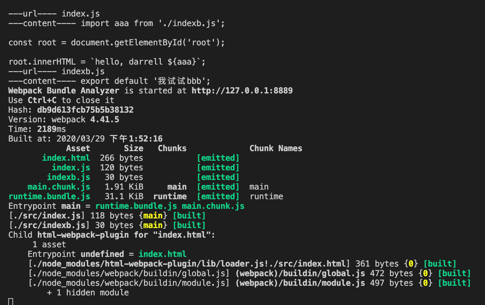
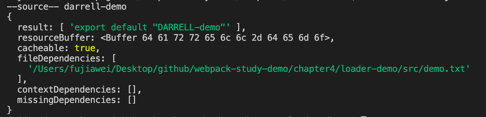
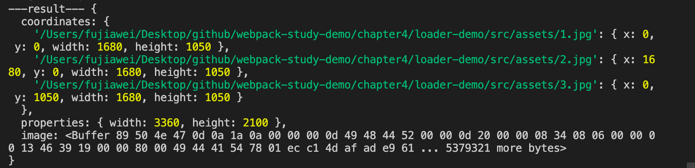

# 如何编写一个 Loader

这节我们来编写一个 `loader`，实现一个 `loader` 其实很简单，`loader` 就是一个函数，接受一个代码片段为参数

```javascript
module.exports = function(source) {
  // 做一波你的处理
  return soucre;
}; 
```

> `loader` 的执行顺序，是从后到前，从左至右。前面执行的结果，会作为传递给后面的参数。

接下来，我们实现一个简单的替换字符串的 `loader` 为例子。

&nbsp;

## 一个简单的例子

### 业务代码

我们在 `src` 先创建 `index.js`，简单的在页面中输出一个字符串：

```javascript
const root = document.getElementById('root');

root.innerHTML = 'hello, darrell';
```

&nbsp;

### 简单的loader

我们编写一个 `loader` 将 `Darrell` 字符串替换成 `loader`。

我们在根目录新建 `loaders` 文件夹，新建一个 `replaceLoader.js` 文件，在这个 `js` 中我们完成上述功能。

```javascript
module.exports = function(source) {
  return source.replace('darrell', 'world');
}
```

在这里我们要注意几个点：

* 在创建 `loader` 的时候，函数不能为箭头函数，必须是申明式的函数，`webpack` 会在调用 `loader` 的时候，对其 `this` 指向进行修改，如果使用箭头函数，`this` 指向就不对了。
* `source` 是我们引入文件的内容，值如下。其实 `loader` 的作用就是对 `source` 做一些我们想要的修改，再返回出去。


到这里我们一个简单的 `loader` 就实现了。

&nbsp;

### 配置

我们在公用的配置文件 `webpack.common.js` 中进行引用：

```javascript
...

const commonConfig = {
  ...
  module: {
    rules: [
      { 
        test: /\.js|jsx$/, 
        exclude: /node_modules/, 
        use: [
          {
            loader: path.resolve(__dirname, './loaders/replaceLoader.js'),
          },
        ]
      }
    ]
  },
  ...
}

...
```

上面的配置的意思是所有的 `js` 文件都是用我们的自己写的 `loader` 走一遍。

我们打包一下文件 `npm run dev`，可以在浏览器中看到输出了 `hello, world`：


&nbsp;

## 传递参数

有的时候我们需要向 `loader` 传一些参数，如我们要传一个 `name` 参数，用来替换 `Darrell`：

```javascript
...

const commonConfig = {
  ...
  module: {
    rules: [
      { 
        test: /\.js|jsx$/, 
        exclude: /node_modules/, 
        use: [
          {
            loader: path.resolve(__dirname, './loaders/replaceLoader.js'),
            options: {
              name: 'world',
            }
          },
        ]
      }
    ]
  },
  ...
}

...
```

这个参数我们可以在 `loader` 中通过 `this.query` 接收，我们修改 `replaceLoader.js`，将 `Darrell` 字符串改变为我们传入的 `name` 参数：

```javascript
module.exports = function(source) {
  console.log('---this.query', this.query);
  return source.replace('darrell', this.query.name);
}
```

我们打包一下可以看到 `this.query` 的值，同时可以看到浏览器中的值也变成了 `hello,world`：


但是接收参数官方会推荐我们使用 `loader-utils` 神器来帮我们处理传入的相应的参数：

```javascript
const loaderUtils = require('loader-utils');

module.exports = function(source) {
  const options =  loaderUtils.getOptions(this);
  return source.replace('darrell', options.name);
}
```

这样同样可以满足我们的需求。


## `loader` 更多的参数

### `this.query`

* 如果这个 loader 配置了 [`options`](https://www.webpackjs.com/configuration/module/#useentry) 对象的话，`this.query` 就指向这个 option 对象。

* 如果 loader 中没有 `options`，而是以 `query` 字符串作为参数调用时，`this.query` 就是一个以 `?` 开头的字符串。

> 官方推荐我们使用 `loader-utils` 中的 [`getOptions` 方法](https://github.com/webpack/loader-utils#getoptions) 来提取给定 `loader` 的 `option`。


### `this.callback`

一个可以同步或者异步调用的可以返回多个结果的函数。预期的参数是：

```javascript
this.callback(
  err: Error | null,
  content: string | Buffer,
  sourceMap?: SourceMap,
  meta?: any
);
```

* 第一个参数必须是 `Error` 或者 `null`

* 第二个参数是一个 `string` 或者 [`Buffer`](https://nodejs.org/api/buffer.html)。

* 可选的：第三个参数必须是一个可以被 [这个模块](https://github.com/mozilla/source-map) 解析的 `source map`

* 可选的：第四个选项，会被 webpack 忽略，可以是任何东西（例如一些元数据）

我们修改一下 `replaceLoader.js`，

```javascript
const loaderUtils = require('loader-utils');

module.exports = function(source) {
  const options =  loaderUtils.getOptions(this);
  const result = source.replace('darrell', options.name);
  this.callback(null, result);
}
```

重新打包一下代码，代码可以正常运行：


### `this.async`

当我们想要在 `loader` 中使用一个异步函数的话，比如如下：

```javascript
const loaderUtils = require('loader-utils');

module.exports = function(source) {
  const options =  loaderUtils.getOptions(this);

  setTimeout(() => {
    const result = source.replace('darrell', options.name);
    return result;
  }, 1000)
}
```

我们可以看到打包报错了，`webpack` 告诉我们必须返回一个结果，但是现在结果需要 `1s` 之后才能返回。

 

这里我们就需要用到 `this.async` 了，我们修改一下代码：

```javascript
const loaderUtils = require('loader-utils');

module.exports = function(source) {
  const options =  loaderUtils.getOptions(this);
  const callback = this.async();

  setTimeout(() => {
    const result = source.replace('darrell', options.name);
    callback(null, result);
  }, 1000)
}
```

`this.async` 告诉 [loader-runner](https://github.com/webpack/loader-runner) 这个 loader 将会异步地回调。返回 `this.callback`。

&nbsp;

### `this.sourceMap`

生成一个 `source map`。因为生成 `source map` 可能会非常耗时，你应该确认 `source map` 是否有必要。

&nbsp;

### `this.emitFile`

我们可以使用 `this.emitFile` 来进行文件写入，类似于 `file-loader` 也是依靠这个函数来实现文件的写入的。

我们新建一个 `emfile-loader.js`：

```javascript
const loaderUtils = require('loader-utils');

module.exports = function(content) {
  
  // 获取输出的文件路径
  // loaderUtils.interpolateName 方法是占位符替换
  const url = loaderUtils.interpolateName(this, "[name].[ext]", {
    content,
  });

  console.log('---url----', url);
  console.log('---content----', content);

  // 文件写入
  this.emitFile(url, content);
  // 执行回调
	this.callback(null, content);
}
```

同是我们新建 `indexb.js`，输出一段话，将其引入到 `index.js` 中，并在 `webpack.common.js` 中使用 `emFile-loader`，我们重新运行 `npm run bundle`，可以在控制台上看到，`index.js` 和 `indexb.js` 都被输出到了 `dist` 目录下：



更多的参数大家可以参考 [loader api 更多参数](https://webpack.js.org/api/loaders/)。

&nbsp;

## `resolveLoaders`

我们在上面引入 `loaders` 是通过相对路径来引入的，如果能够使用 `alias` 这样的别名来引入就爽了，这里我们可以配置  `webpack`  中的 `resolveLoaders` 参数来解决这个问题。

```javascript
...

const commonConfig = {
  ...
  resolveLoader: {
    modules: ['node_modules', './loaders']
  },
  ...
  module: {
    rules: [
      { 
        test: /\.js|jsx$/, 
        exclude: /node_modules/, 
        use: [
          {
            loader: 'replaceLoader',
            options: {
              name: 'world',
            }
          },
        ]
      }
    ]
  },
  ...
}

...
```

上面的参数意思是告诉 `webpack`  先到 `node_modules` 中去寻找，如果没找到再去 `loaders` 中去寻找。

我们重新打包一下，发现打包成功：


&nbsp;

## `loader-runner`

[`loader-runner`](https://github.com/webpack/loader-runner#readme) 是写 `loader` 的神器，它能够允许我们在不安装 `webpack` 的情况下运行 `loaders`，我们之前在讲 `webpack` 的流程那里，也将到在 `buildModule` 阶段，`webpack` 也使用了 `loader-runner` 来处理模块构建。

它能够使我们更方便的进行 `loader` 的开发与调试。

### 使用

```javascript
import { runLoaders } from "loader-runner";

runLoaders({
  resource: "/abs/path/to/file.txt?query",
  // String: 资源的绝对路径(可以增加查询字符串)

  loaders: ["/abs/path/to/loader.js?query"],
  // String[]: loader 的绝对路径(可以增加查询字符串)

  context: { minimize: true },
  // 基础上下文之外的额外 loader 上下文

  readResource: fs.readFile.bind(fs)
  // 读取资源的函数

}, function(err, result) {
	// err: Error?

	// result.result: Buffer | String
	// The result
})
```

我们在 `loaders` 下创建一个 `raw-loader.js`，用于替换相应的字符串，同时我们在 `src` 下新创建一个 `demo.txt` 文件，输入 `darrell-demo`，

```javascript
// raw-loader.js

module.exports = function(source) {
  console.log('--source--', source);
  const json = JSON.stringify(source)
  	.replace('darrell', 'DARRELL');

  return `export default ${json}`;
}
```

接着我们在根目录创建 `run-loader.js` 文件，用来测试 `raw-loader.js`：

```javascript
// run-loader.js
const { runLoaders } = require('loader-runner');
const fs = require('fs');
const path = require('path');

runLoaders({
  // 文件绝对地址
  resource: path.join(__dirname, './src/demo.txt'),
  // 使用的 loaders
  // 可以加入参数
  loaders: [
    {
      loader: path.join(__dirname, './loaders/raw-loader.js'),
      options: {
        name: 'test'
      }
    }
  ],
  context: {},
  readResource: fs.readFile.bind(fs)
}, (err, result) => {
  // 有错误就输出错误，否则输出结果
  err ? console.log(err) : console.log(result);
});
```

接着我们运行 `node run-loader.js `，我们可以看到，如下图所示，字符串被进行了替换：



&nbsp;

## 更多 `loaders`

我们如果想要对我们在业务之中发现源代码需要做一些包装，那么我们都可以使用 `loader` 来解决。

### 实现一个自动合成雪碧图 `loader`

有的时候在业务中我们需要减少图片的请求数，这就需要使用雪碧图，将多个图片转化为一张图片。

#### 前置知识

那么如何将两张图片合成一张图片呢，我们可以使用 [`spritesmith`](https://www.npmjs.com/package/spritesmith) 这个库，官网的使用方法如下：

```javascript
// 引入依赖
var Spritesmith = require('spritesmith');

// 生成雪碧图
// 自己的图片
var sprites = ['fork.png', 'github.png', 'twitter.png'];
// 执行 run 方法，并获取结果
Spritesmith.run({src: sprites}, function handleResult (err, result) {
  result.image; // 图片的 buffer
  result.coordinates; // 图片的长宽和 position {x, y, width, height}
  result.properties; // 元数据的属性，等会儿我们可以进行打印看一下
});
```

#### 支持语法

我们需要讲类似如下图的两张图片，合成一张图片，然后在 `css` 中进行替换：

```less
// 元数据
background: url('a.png?__sprite');
background: url('b.png?__sprite');

// 目标：
background: url('sprite.png');
```

#### 开始编写

我们在 `src` 目录下创建 `assets`，并放入三张图片，同时新建一个 `index.css` 文件，并写三个 `css` 样式：

```css
.img1 {
  background: url(./asset/1.jpg?__sprite);
}

.img2 {
  background: url(./asset/2.jpg?__sprite);
}

.img3 {
  background: url(./asset/3.jpg?__sprite);
}
```

接着我们新建 `sprite-loader.js`，同时安装 `spritesmith` 依赖，我们先写点测试代码：

```javascript
// 引入依赖
const Spritesmith = require('spritesmith');

const cwd = process.cwd();

// 生成雪碧图
var sprites = [
  `${cwd}/src/assets/1.jpg`,
  `${cwd}/src/assets/2.jpg`,
  `${cwd}/src/assets/3.jpg`,
];

// 执行 run 方法，并获取结果
Spritesmith.run({
  src: sprites,
}, (err, result) => {
  console.log('---err---', err);
  console.log('---result---', result);
});
```

我们运行 `node loaders/sprite-loader.js`，我么可以看到如下输出：



接着我们就可以开始编写 `loader` 代码了，我们先修改一下 `loader-runner.js`：

```javascript
const { runLoaders } = require('loader-runner');
const fs = require('fs');
const path = require('path');

runLoaders({
  // 指定 `css` 入口文件
  resource: path.join(__dirname, './src/index.css'),
  loaders: [
    {
      // 使用 sprite-loader.js
      loader: path.join(__dirname, './loaders/sprite-loader.js'),
    }
  ],
  context: {},
  readResource: fs.readFile.bind(fs)
}, (err, result) => {
  err ? console.log(err) : console.log(result);
});
```

然后我们修改 `sprite-loader.js`：

```javascript
// 引入依赖
const Spritesmith = require('spritesmith');
const fs = require('fs');
const path = require('path');

const cwd = process.cwd();

module.exports = function (source) {
  // 异步回调
  const callback = this.async();
  // 匹配 css 文件中 __sprite 结尾的事情
  const imgs = source.match(/url\((\S*)\?__sprite/g);
  // Spritesmith 要用到的数组
  const matchedImgs = [];

  // 遍历 imgs
  for (let i = 0; i < imgs.length; i++) {
    const img = imgs[i].match(/url\((\S*)\?__sprite/)[1];
    matchedImgs.push(path.join(`${cwd}/src`, img));
  }

  // 开始处理
  Spritesmith.run({
    // 传入图片
    src: matchedImgs,
  }, (err, result) => {
    // 输出 图片 到 dist 目录
    fs.writeFileSync(path.join(process.cwd(), 'dist/sprite.jpg'), result.image);

    // 替换源码中的 __sprite 结尾的文件
    source = source.replace(/url\((\S*)\?__sprite/g, (match) => {
      return `url(dist/sprite.jpg`;
    });

    // 输出 css 文件到 dist 目录
    
    fs.writeFileSync(path.join(process.cwd(), 'dist/index.css'), source);
    // 回调
    callback(null, source);
  });
}
```

> 在 `loader-runner` 中，我们不能使用 `this.emitFile` 输出文件内容到目录，所以我们在这里使用 `fs.writeFileSync` 输出文件到目录中。

我们运行 `node run-loader.js`，可以在 `dist` 目录里面看到生成的 `index.css` 如下，当然这里我们还没有添加相应的 `position`，还有待完善。

```css
.img1 {
  background: url(dist/sprite.jpg);
}

.img2 {
  background: url(dist/sprite.jpg);
}

.img3 {
  background: url(dist/sprite.jpg);
}
```

我们也可以看到输出的图片如下图所示：


到这里我们一个简单的雪碧图的 `loader` 已经编写完成了，大家有兴趣可以把 `position` 这一部分给完善起来。当然在社区中也有相应的插件来完成相应的雪碧图制作：[webpack-spritesmith](https://github.com/mixtur/webpack-spritesmith)

&nbsp;

## 相关链接

- [webpack 官网 loader api](https://webpack.js.org/api/loaders/)
- [webpack 官网 编写一个 loader](https://www.webpackjs.com/contribute/writing-a-loader/)
- [loader-runner](https://github.com/webpack/loader-runner)
- [webpack-spritesmith](https://github.com/mixtur/webpack-spritesmith)

&nbsp;

## 示例代码

示例代码可以看这里：

- [loader  示例代码](https://github.com/darrell0904/webpack-study-demo/tree/master/chapter4/loader-demo)

