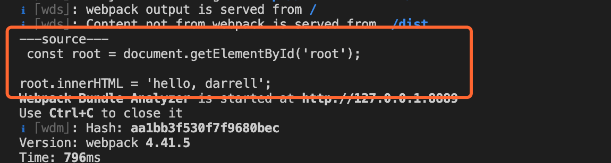
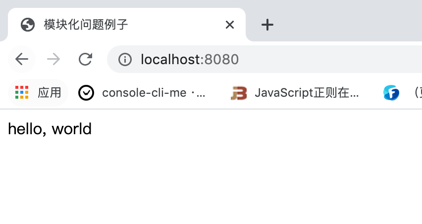
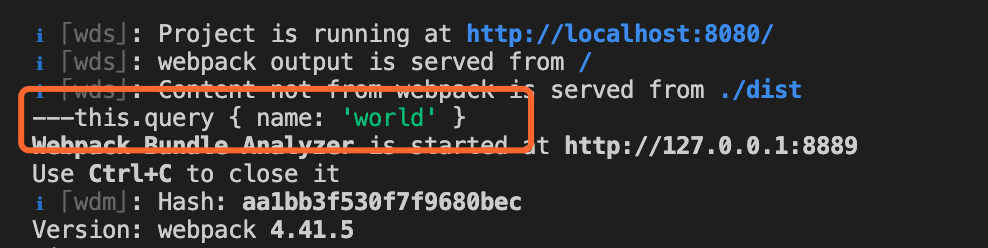
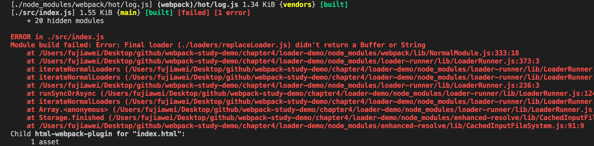

# 如何编写一个 Loader

这节我们来编写一个 `loader`，实现一个 `loader` 其实很简单，`loader` 就是一个函数，接受一个代码片段为参数

我们实现一个简单的替换字符串的 `loader` 为例子。


&nbsp;

## 一个简单的例子

### 业务代码

我们在 `src` 先创建 `index.js`，简单的在页面中输出一个字符串：

```javascript
const root = document.getElementById('root');

root.innerHTML = 'hello, darrell';
```


&nbsp;

### 简单的loader

我们编写一个 `loader` 将 `Darrell` 字符串替换成 `loader`。

我们在根目录新建 `loaders` 文件夹，新建一个 `replaceLoader.js` 文件，在这个 `js` 中我们完成上述功能。

```javascript
module.exports = function(source) {
  return source.replace('darrell', 'world');
}
```

在这里我们要注意几个点：

* 在创建 `loader` 的时候，函数不能为箭头函数，必须是申明式的函数，`webpack` 会在调用 `loader` 的时候，对其 `this` 指向进行修改，如果使用箭头函数，`this` 指向就不对了。
* `source` 是我们引入文件的内容，值如下。其实 `loader` 的作用就是对 `source` 做一些我们想要的修改，再返回出去。




到这里我们一个简单的 `loader` 就实现了。

&nbsp;

### 配置

我们在公用的配置文件 `webpack.common.js` 中进行引用：

```javascript
...

const commonConfig = {
  ...
  module: {
    rules: [
      { 
        test: /\.js|jsx$/, 
        exclude: /node_modules/, 
        use: [
          {
            loader: path.resolve(__dirname, './loaders/replaceLoader.js'),
          },
        ]
      }
    ]
  },
  ...
}

...
```

上面的配置的意思是所有的 `js` 文件都是用我们的自己写的 `loader` 走一遍。

我们打包一下文件 `npm run dev`，可以在浏览器中看到输出了 `hello, world`：




## 传递参数

有的时候我们需要向 `loader` 传一些参数，如我们要传一个 `name` 参数，用来替换 `Darrell`：

```javascript
...

const commonConfig = {
  ...
  module: {
    rules: [
      { 
        test: /\.js|jsx$/, 
        exclude: /node_modules/, 
        use: [
          {
            loader: path.resolve(__dirname, './loaders/replaceLoader.js'),
            options: {
              name: 'world',
            }
          },
        ]
      }
    ]
  },
  ...
}

...
```

这个参数我们可以在 `loader` 中通过 `this.query` 接收，我们修改 `replaceLoader.js`，将 `Darrell` 字符串改变为我们传入的 `name` 参数：

```javascript
module.exports = function(source) {
  console.log('---this.query', this.query);
  return source.replace('darrell', this.query.name);
}
```

我们打包一下可以看到 `this.query` 的值，同时可以看到浏览器中的值也变成了 `hello,world`：




但是接收参数官方会推荐我们使用 `loader-utils` 神器来帮我们处理传入的相应的参数：

```javascript
const loaderUtils = require('loader-utils');

module.exports = function(source) {
  const options =  loaderUtils.getOptions(this);
  return source.replace('darrell', options.name);
}
```

这样同样可以满足我们的需求。


## `loader` 更多的参数

### `this.query`

* 如果这个 loader 配置了 [`options`](https://www.webpackjs.com/configuration/module/#useentry) 对象的话，`this.query` 就指向这个 option 对象。

* 如果 loader 中没有 `options`，而是以 `query` 字符串作为参数调用时，`this.query` 就是一个以 `?` 开头的字符串。

> 官方推荐我们使用 `loader-utils` 中的 [`getOptions` 方法](https://github.com/webpack/loader-utils#getoptions) 来提取给定 `loader` 的 `option`。


### `this.callback`

一个可以同步或者异步调用的可以返回多个结果的函数。预期的参数是：

```javascript
this.callback(
  err: Error | null,
  content: string | Buffer,
  sourceMap?: SourceMap,
  meta?: any
);
```

* 第一个参数必须是 `Error` 或者 `null`

* 第二个参数是一个 `string` 或者 [`Buffer`](https://nodejs.org/api/buffer.html)。

* 可选的：第三个参数必须是一个可以被 [这个模块](https://github.com/mozilla/source-map) 解析的 `source map`

* 可选的：第四个选项，会被 webpack 忽略，可以是任何东西（例如一些元数据）

我们修改一下 `replaceLoader.js`，

```javascript
const loaderUtils = require('loader-utils');

module.exports = function(source) {
  const options =  loaderUtils.getOptions(this);
  const result = source.replace('darrell', options.name);
  this.callback(null, result);
}
```

重新打包一下代码，代码可以正常运行：


### `this.async`

当我们想要在 `loader` 中使用一个异步函数的话，比如如下：

```javascript
const loaderUtils = require('loader-utils');

module.exports = function(source) {
  const options =  loaderUtils.getOptions(this);

  setTimeout(() => {
    const result = source.replace('darrell', options.name);
    return result;
  }, 1000)
}
```

我们可以看到打包报错了，`webpack` 告诉我们必须返回一个结果，但是现在结果需要 `1s` 之后才能返回。

 

这里我们就需要用到 `this.async` 了，我们修改一下代码：

```javascript
const loaderUtils = require('loader-utils');

module.exports = function(source) {
  const options =  loaderUtils.getOptions(this);
  const callback = this.async();

  setTimeout(() => {
    const result = source.replace('darrell', options.name);
    callback(null, result);
  }, 1000)
}
```

`this.async` 告诉告诉 [loader-runner](https://github.com/webpack/loader-runner) 这个 loader 将会异步地回调。返回 `this.callback`。


### `this.sourceMap`

生成一个 `source map`。因为生成 `source map` 可能会非常耗时，你应该确认 `source map` 是否有必要。

更多的参数大家可以参考 [loader api 更多参数](https://webpack.js.org/api/loaders/)。


&nbsp;

## `resolveLoaders`

我们在上面引入 `loaders` 是通过相对路径来引入的，如果能够使用 `alias` 这样的别名来引入就爽了，这里我们可以配置  `webpack`  中的 `resolveLoaders` 参数来解决这个问题。

```javascript
...

const commonConfig = {
  ...
  resolveLoader: {
    modules: ['node_modules', './loaders']
  },
  ...
  module: {
    rules: [
      { 
        test: /\.js|jsx$/, 
        exclude: /node_modules/, 
        use: [
          {
            loader: 'replaceLoader',
            options: {
              name: 'world',
            }
          },
        ]
      }
    ]
  },
  ...
}

...
```

上面的参数意思是告诉 `webpack`  先到 `node_modules` 中去寻找，如果没找到再去 `loaders` 中去寻找。

我们重新打包一下，发现打包成功：


&nbsp;

## 更多 `loaders`

我们如果想要对我们在业务之中发现源代码需要做一些包装，那么我们都可以使用 `loader` 来解决。

&nbsp;

## 相关链接

- [webpack 官网 loader api](https://webpack.js.org/api/loaders/)
- [webpack 官网 编写一个 loader](https://www.webpackjs.com/contribute/writing-a-loader/)
- [loader-runner](https://github.com/webpack/loader-runner)


&nbsp;

## 示例代码

示例代码可以看这里：

- [loader  示例代码]()


