# 如何编写一个 Plugin

这一节我们会编写一个简单的 `Plugin`。

`loader` 就是一个函数，拿到源代码做一些处理，返回新的代码；

而 `plugin` 我们则要编写一个类，这个类中在 `webpack` 的具体生命周期中做一些事情。 原理是通过事件驱动的时候


&nbsp;

## `loader` 和 `plugin` 区别

我们先来回顾一下 `loader` 和 `plugin` 的区别。

`loader` 能够帮助我们处理模块，当我们引入一些 `js` 或者其他文件的模块的时候，需要进行一些特定处理的时候，我们可以借助 `loader`。

`plugin` 帮助我们在 `webpack`  打包的一些具体时刻上帮我们做一些事情，比如 `html-webpack-plugin` 能帮我们在打包结束的时候，帮我们生成一个 `html` 文件；`clean-webpack-plugin` 能帮助我们在打包开始之前帮助我们清除相应目录的文件


## 创建插件

`webpack` 插件由以下组成：

- 一个 `JavaScript` 命名函数。
- 在插件函数的 `prototype` 上定义一个 `apply` 方法。
- 指定一个绑定到 `webpack` 自身的 [事件钩子](https://www.webpackjs.com/api/compiler-hooks/)。
- 处理 `webpack` 内部实例的特定数据。
- 功能完成后调用 `webpack` 提供的回调。


## 一个简单的 `plugin`

我们写一个简单的 `plugin`，在代码生成的时候生成一个 `copyright.txt` 文件

### 基本格式

我们在根目录新建一个 `plugins` 目录，新建一个 `copyright-webpack-plugin.js`，我们在文件中写一个类：

```javascript
class CopyrightWebpackPlugin {
  constructor() {
    console.log('插件使用了'); // 构造函数
  }

  apply(compiler) { // 调用这个插件的时候，会自动调用这个函数，compiler 是 webpack 的一个实例对象
  }
}

module.exports = CopyrightWebpackPlugin;
```

如果我们想要接受参数的话，可以在 `constructor` 函数中接受通过 `options` 来接受使用就 ok 了。

上面是 `webpack` 插件的一个基本格式。


&nbsp;

### 使用

我们在 `webpack.common.js` 中使用此插件：

```javascript
...

const CopyRightWebpackPlugin = require('../plugins/copyright-webpack-plugin');

const commonConfig = {
  ...
  plugins: [
    new CleanWebpackPlugin(),
    new HtmlWebpackPlugin({
      template: 'src/index.html',
    }),
    new CopyRightWebpackPlugin()
  ],
  ...
}

...
```

我们打包一下文件 `npm run dev`，可以看到控制台输出 `插件使用了` 文字：


### 完善插件内容

我们可以在 `webpack` 官网找到相关的 [compiler-hooks](https://webpack.js.org/api/compiler-hooks/#hooks) 这块文档，`hooks` 其实就是 `webpack` 的生命周期函数，代表在某些时刻就会执行的钩子函数。

我们想要在打包结束之后生成一个 `copyright.txt`，查文档可以发现我们需要使用 `emit` 这个 `hooks`，代表**生成资源到 output 目录之前**。那么我们继续完善我们的插件：

```javascript
class CopyrightWebpackPlugin {
  apply(compiler) {
    compiler.hooks.emit.tapAsync('CopyrightWebpackPlugin', (compilation, cb) => {
      // 生成一个一个新的文件资源，插入到 webpack 构建中：
      compilation.assets['copyright.txt']= {
        source: function() {
          return 'copyright by darrell'  // 文件内容
        },
        size: function() {
          return 21; // 文件的长度
        }
      };
      cb();
    })
  }
}

module.exports = CopyrightWebpackPlugin;
```


* `hooks` 的调用通过 `compiler.hooks.someHook.tap(...)` 进行调用，不过这个取决于钩子的类型，如果是同步的钩子使用 `tab`，异步的钩子使用 `tapAsync`，`emit` 这个钩子是异步的，所以我们使用 `tabAsync`
* 钩子函数接受两个参数，一个是插件名，一个是函数，函数接受两个参数，一个是 [`compilation`](https://www.webpackjs.com/api/compilation-hooks/) 代表这次打包相关的内容，`cb` 代表回调函数。
* `compilation` 存放了这次打包的所有东西，`compilation.assets` 存放了这次打包出来的所有文件信息，我们想要在打包完成之后在插入一个 `txt` 文件，实际上就是往 `assets` 中再加入一个 `copyright.txt` 文件，其中 `source` 属性是这个文件的内容，`size` 是这个文件的长度。


我们打包一下，发现 `dist` 目录生成了一个 `copyright.txt` 文件，长度是 `21字节`：

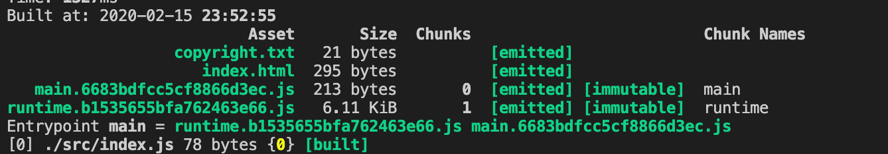

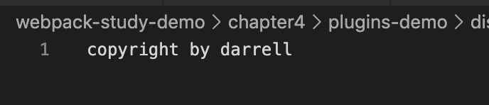

到这里我们一个简单的在打包完成之后生成一个 `copyright.txt` 文件就完成了。


&nbsp;

## 更多 `hooks`

### `entryOption`

在 `entry` 配置项处理过之后，执行插件，这是一个同步的钩子，我们使用的时候就直接使用 `tap` 就行，并且第二个参数，只要传入一个参数 `compilation` 就 ok 了，因为同步就不要回调方法了。

```javascript
compiler.hooks.compile.tap('CopyrightWebpackPlugin', (context, entry) => {
  console.log('context\n', context);
  console.log('entry\n', entry);
})
```

参数是`context`，` entry`，代表所在目录，和入口文件：

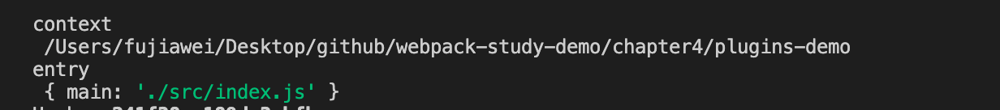

&nbsp;

### `afterEmit`

生成资源到 `output` 目录之后，异步钩子。

&nbsp;

### `done`

编译(compilation)完成。同步钩子

```javascript
compiler.hooks.done.tap('CopyrightWebpackPlugin', (stats) => {
  console.log('stats\n', stats);
})
```

参数是 `stats`，代表生成的文件内容

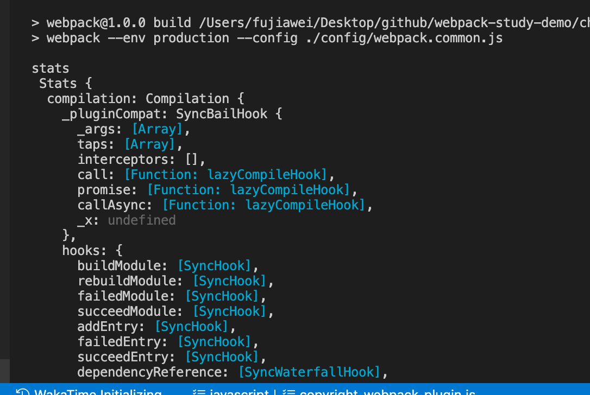

&nbsp;

### `failed`

编译(compilation)失败。同步钩子

```javascript
compiler.hooks.beforeCompile.tap('CopyrightWebpackPlugin', (compilationParams) => {
  throw 'too big'; // 编译(compilation)参数创建之后，执行插件，我们抛出一个错误
})

compiler.hooks.failed.tap('CopyrightWebpackPlugin', (error) => {
  console.log('error\n', error);
})
```

参数是 `error`，代表错误信息：

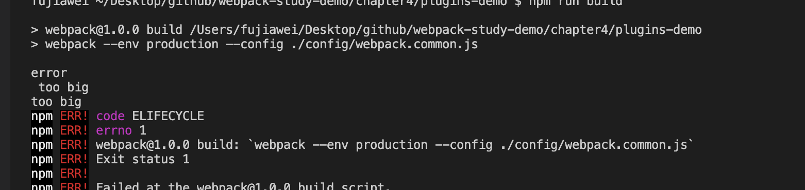

更多的钩子参大家可以在用到的时候再去参考 [webpack 官网 Compiler Hooks](https://webpack.js.org/api/compiler-hooks/)。


&nbsp;

## 使用 `Node` 查看参数

有的时候我们想要知道 `emit` 钩子的 `compilation` 下有哪一些参数，我们需要通过 `console.log` 来进行打印，但是这样会显得不够直观，控制台一下子看不过来。

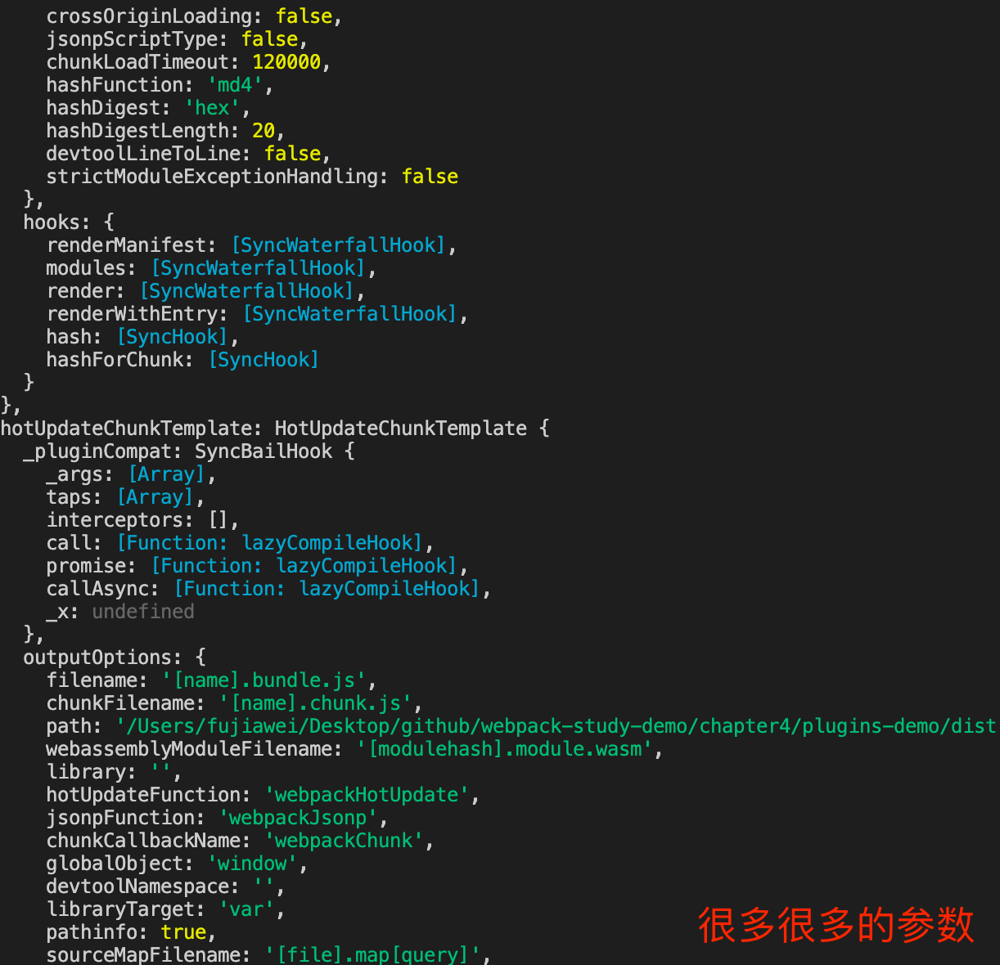

所以我们可以借助 `Node` 帮我们打断点的方式去浏览器中查看。

### 修改 `package.json`

我们在 `scripts` 下在增加一个 `debug` 的命令，这个命令其实和 `build` 的命令是一样的，但是我们能借助 `node` 在运行 `webpack` 的时候传递一些参数进去：

```javascript
...
"scripts": {
  ...
  "debug": "node --inspect --inspect-brk node_modules/webpack/bin/webpack.js --config ./config/webpack.common.js",
},
...
```

* `--inspect` 此参数的意思是开启 `webpack` 调试工具
* `--inspect-brk` 此参数的意思是在 `webpack` 打包的第一行打一个断点。

我们使用 `npm run debug` 开启 `node` 的调试，在命令行中提示我们 `http://127.0.0.1:9229/a5667edf-aea8-4b91-b2e5-2925dcea7dab` 在这个地址刚我们开启了调试。

打开 `chorme` 浏览器，输入网址，右键打开检查窗口，我们可以看到一个 `node` 的按钮，点一下便进到了 `webpack` 源码的页面，因为第一行我们打了一个断点，所以代码会停在第一行。

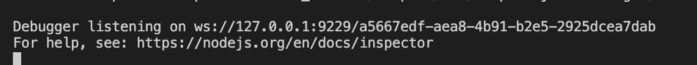

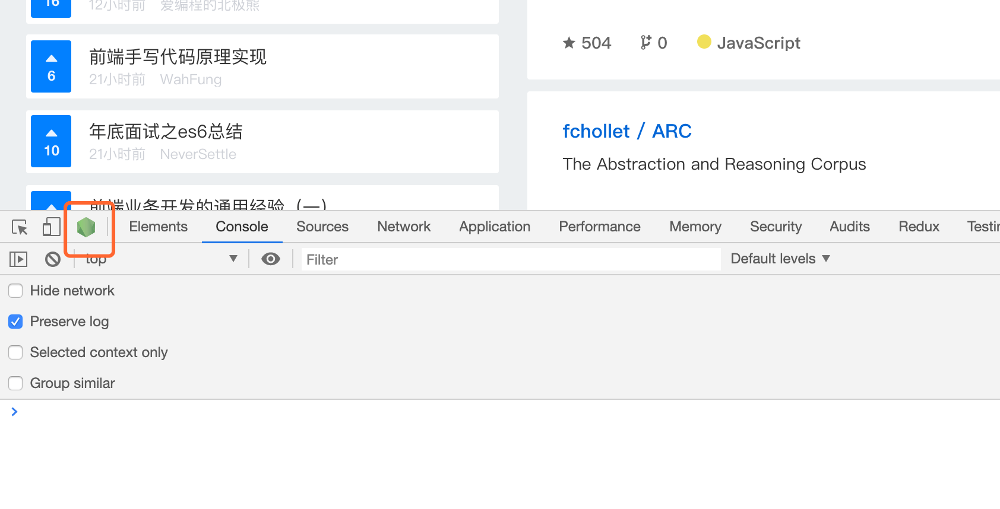

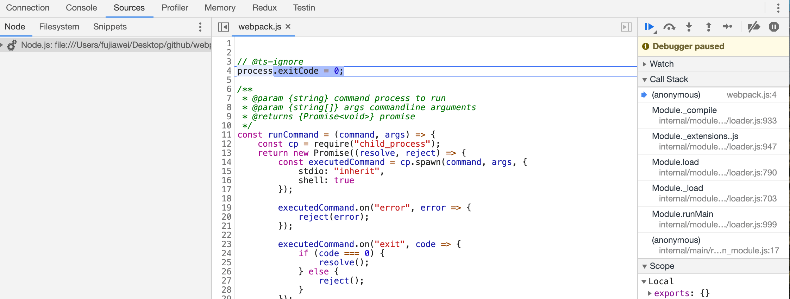

如果现在我们想要查看 `emit` 下的 `compilation`，我们可以在函数里打一个 `debugger`：

```javascript
class CopyrightWebpackPlugin {
  apply(compiler) {
    compiler.hooks.emit.tapAsync('CopyrightWebpackPlugin', (compilation, cb) => {
      debugger;
      // 生成一个一个新的文件资源，插入到 webpack 构建中：
      compilation.assets['copyright.txt']= {
        source: function() {
          return 'copyright by darrell'  // 文件内容
        },
        size: function() {
          return 21; // 文件的长度
        }
      };
      cb();
    })
  }
}
```

我们重新运行 `npm run debug`，我们点击右侧的蓝色三角形，可以直接进到我们打的 `debugger` 这里，我们可以直接将鼠标放到 `compilation` 上查看其属性，也可以在右侧 `watch` 中新增 `compilation` 来查看相关属性：

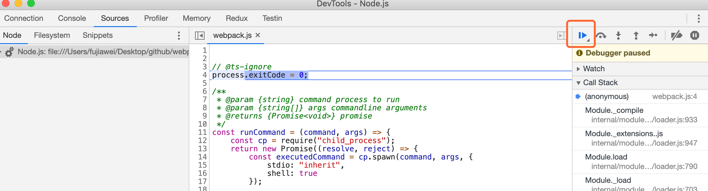

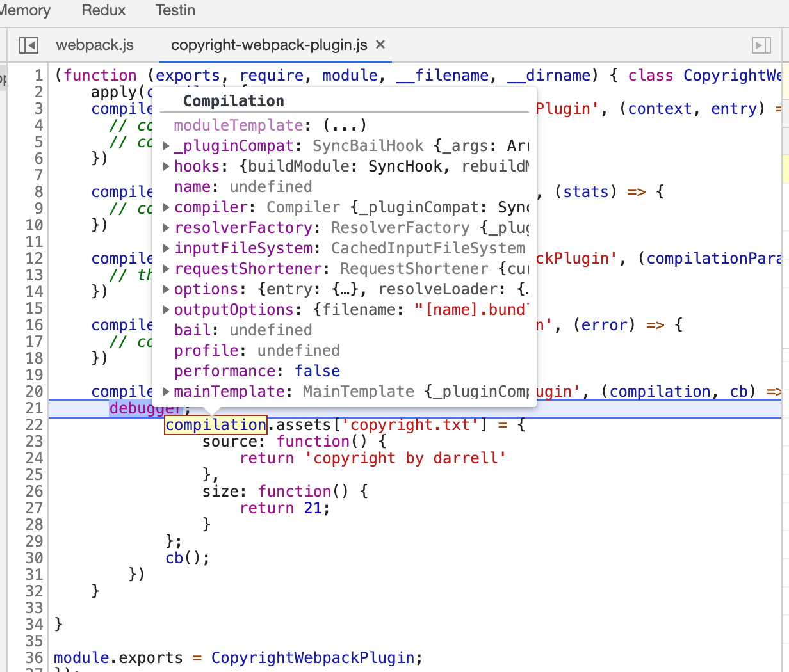

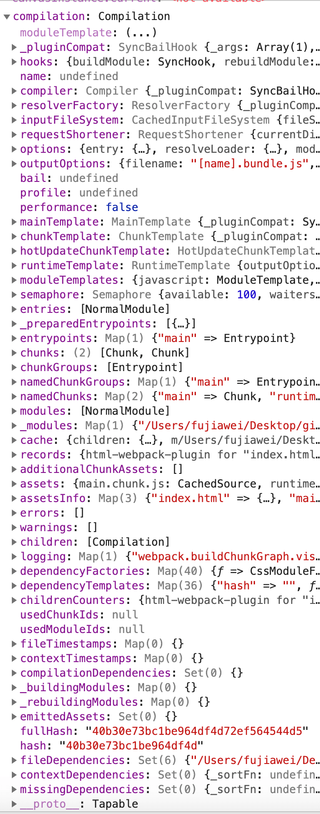

如何对代码进行调试，对每一个程序员都是一项必备的技能，大家还是要掌握起来。


&nbsp;

## 更多插件


&nbsp;

## 相关链接

- [webpack 官网 Plugin API](https://webpack.js.org/api/plugins/)

- [webpack 官网 编写一个插件](https://webpack.js.org/contribute/writing-a-plugin/)

- [webpack 官网 Compiler Hooks](https://webpack.js.org/api/compiler-hooks/)

  


&nbsp;

## 示例代码

示例代码可以看这里：

- [plugins  示例代码]()

