# 如何编写一个简易的 Webpack

之前都是学习 `webpack` 的使用，今天我们来写一个简单的 `webpack`。


## 写点代码

我们新建一个 `src` 目录，并创建 `index.js`、`message.js`、`word.js` 三个文件，并在根目录创建一个打包 `bundle.js` 文件，我们在 `bundle.js`  中做一些 `webpack` 要做的事情

```javascript
// index.js
// 项目的入口文件
import message from './message.js';
console.log(message);

// message.js

import { word } from './word.js';
const message = `say ${word}`;
export default message;

// word.js
export const word = 'hello';
```

&nbsp;

## 模块分析

打包的第一步我们需要去读取项目的入口文件，并且去分析其中的代码。

我们从模块分析先开始讲起，首先我们新建一个 `moduleAnalyser` 的方法，此方法接受一个参数，就是要分析的文件的路径，帮助我们分析文件的信息。

### 读取文件信息

我们通过 `Node` 的 `fs` 模块读取文件内容：

```javascript
const fs = require('fs');

const moduleAnalyser = (filename) => {
  const content = fs.readFileSync(filename, 'utf-8');
  console.log(content);
}

moduleAnalyser('./src/index.js')
```

接着我们修改 `package.json` 中的 `scripts` 中新增一条命令，帮祝我们使用 `Node` 运行 `bundle.js` 文件：

```javascript
"scripts": {
  "bundle": "node bundler.js"
},
```

我们运行一下 `npm run bundle`，我们可以看到命令行输出了 `index.js` 的文件信息：

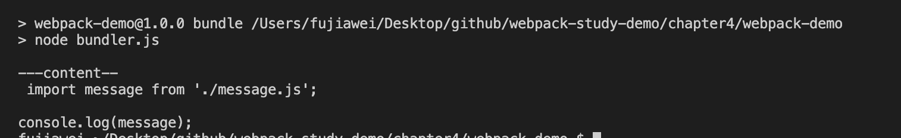

我们使用 `cli-highlight` 给我们的代码加一点颜色，高亮显示代码，安装依赖：

```javascript
npm install cli-highlight -g
```

接着修改 `scripts` 命令，加上 `highlight`：

```javascript
"scripts": {
  "bundle": "node bundler.js | highlight"
},
```

我们重新运行 `npm run bundle`，这个时候我们的代码便有了颜色：

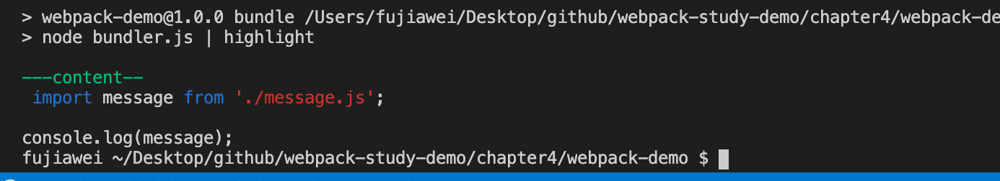


### 获得文件依赖

获得文件信息之后，我们需要去获得这个文件中所用到的依赖，

```javascript
import message from './message.js';
```

就如同上面代码中的依赖路径信息，即 `./message.js`。

这个时候我们可以使用 `babel` 的一个工具 [`@babel/parser`](https://www.babeljs.cn/docs/babel-parser) 帮我们做这件事情，它会将我们的代码转化为抽象语法树，即 `AST`，我们首先安装依赖：

```javascript
npm install @babel/parser -D
```

接着修改 `moduleAnalyser` 函数：

```javascript
const fs = require('fs');
const parser = require('@babel/parser');

const moduleAnalyser = (filename) => {
  const content = fs.readFileSync(filename, 'utf-8');
  const ast = parser.parse(content, {
    sourceType: 'module'
  });
  console.log('--ast---\n', ast);
}

moduleAnalyser('./src/index.js')
```

重新打包一下，我们可以看到：


他能很好的表述我们引入的这段代码的意思，我们还可以代印其中 `program` 属性下的 `body` 字段：

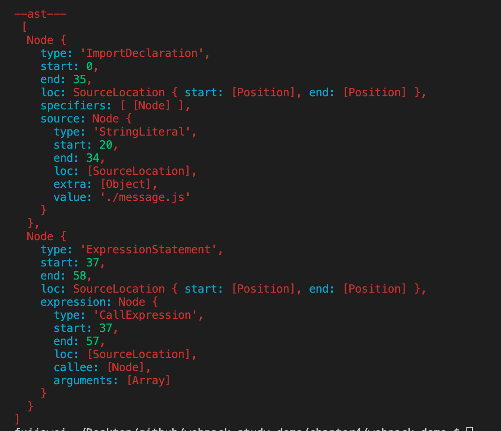

在这个字段里我们能更清晰的看到哪一些是引用的申明 `ImportDeclaration`，哪一些是表达式的语句 `ExpressionStatement`，

这个时候我们如果再在 `index.js` 中引入一个 `message1.js`：

```javascript
import message from './message.js';
import message from './message1.js';

console.log(message);
```

我们重新打印一下 `program` 属性下的 `body` 字段，我们可以发现出现了两个引用申明 `ImportDeclaration`，一个表达式申明 `ExpressionStatement`：

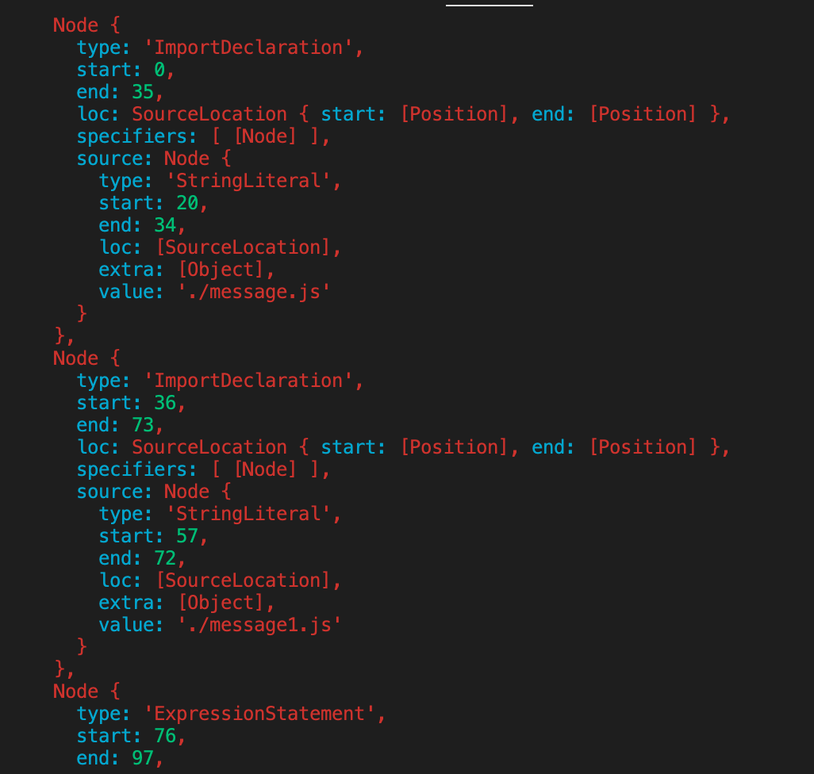

既然我们拿到了代码有几个引用属性，我们就可以遍历我们的 `body` 字段，将这些 `ImportDeclaration` 输出出来，手动去遍历还是有点麻烦，我们可以接着 `babel` 的 [`@babel/traverse`](https://www.babeljs.cn/docs/babel-traverse) 这个工具帮助我们来完成这件事，我们安装依赖：

```javascript
npm install @babel/traverse -D
```

接着我们在 `bunder.js` 中去进行使用：

```javascript
const fs = require('fs');
const parser = require('@babel/parser');
const traverse = require('@babel/traverse').default;

const moduleAnalyser = (filename) => {
  const content = fs.readFileSync(filename, 'utf-8');
  const ast = parser.parse(content, {
    sourceType: 'module'
  });
  traverse(ast, {
    ImportDeclaration({ node }) {
      console.log(node);
    }
});
}

moduleAnalyser('./src/index.js')
```

我们引入 `traverse`，它接受两个参数，一个是 `AST`，第二个就是对象，当 `ast` 中有引用申明 `ImportDeclaration` 的时候，它就会进入 `ImportDeclaration({ node }) {}` 这个方法，`ImportDeclaration` 函数参数是一个对象，对象中有 `node` 这个字段，值如下图所示：

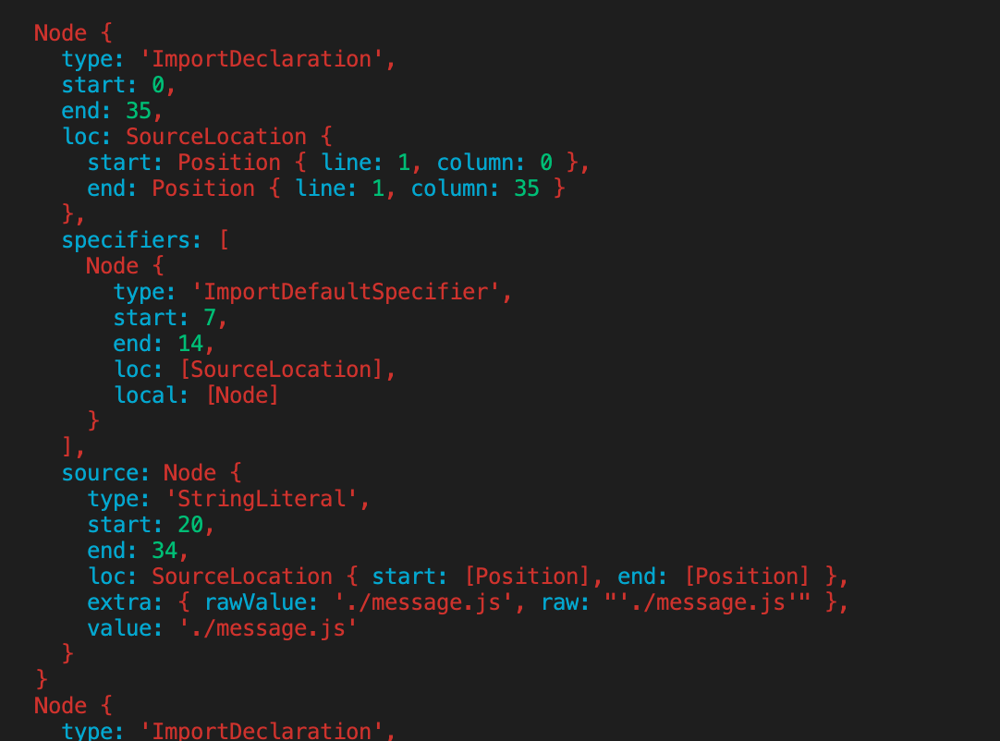

我们可以看到 `node.source.value` 的值就是引入的文件的地址，于是我们就可以进行遍历，我们希望得到每一个引用申明都是一个对象，**键**是引入的值，即 `node.source.value` ，**值**是其相对于项目 `src` 的地址，为了帮助我们之后的打包分析，我们新建一个 `dependencies` 存放申明对象的 **键值对**。

```javascript
const fs = require('fs');
const path = require('path');
const parser = require('@babel/parser');
const traverse = require('@babel/traverse').default;

const moduleAnalyser = (filename) => {
  const content = fs.readFileSync(filename, 'utf-8');
  const ast = parser.parse(content, {
    sourceType: 'module'
  });
  const dependencies = {};
  traverse(ast, {
    ImportDeclaration({ node }) {
      const dirname = path.dirname(filename);
      const newFile = './' + path.join(dirname, node.source.value);
      dependencies[node.source.value] = newFile;
    }
  });
  console.log('---dependencies-\n', dependencies);
}

moduleAnalyser('./src/index.js')
```

我们使用 `node` 模块的 `path` 模块将应用文件相对项目 `src` 文件夹的地址拼出来了，重新打包可以得到下图：


&nbsp;

### 编译 `es6` 代码

因为我们的代码是 `es6` 的代码，他在浏览器中肯定不能执行，所以我们需要打包编译一下代码，将其转化为浏览器能运行的代码。

这里我们可以借助 `babel` 的核心模版 `@babel/core` 帮我们来编译我们的代码，安装依赖：

```javascript
npm install @babel/core @babel/preset-env -D 
```

接着修改 `moduleAnalyser` 函数，使用我们的 [`@babel/core`](https://www.babeljs.cn/docs/babel-core) 这个模块，`babel` 有一个方法 `transformFromAst` 能帮 `AST` 转化为浏览器能运行的代码：

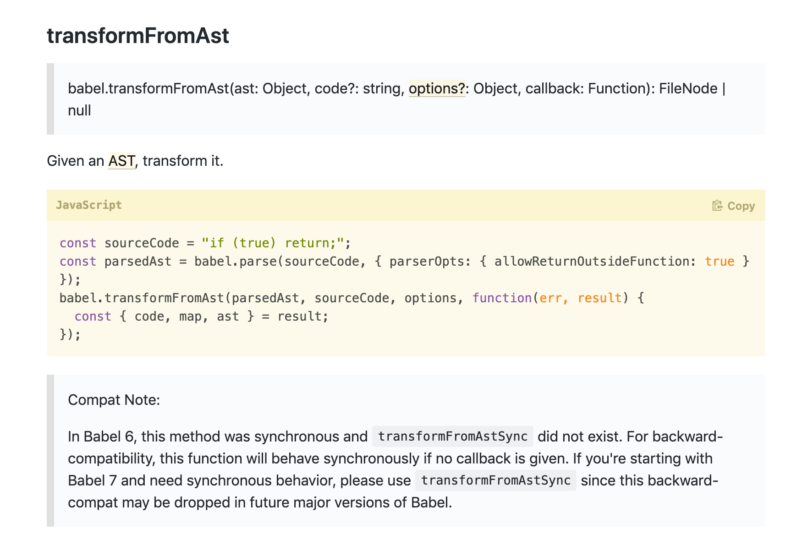

在转化过程中我们需要使用一个 `preset`，叫做 [`@babel/preset-env`](https://www.babeljs.cn/docs/babel-preset-env)，帮助我们解析转化我们的代码：

```javascript
const fs = require('fs');
const path = require('path');
const parser = require('@babel/parser');
const traverse = require('@babel/traverse').default;

const moduleAnalyser = (filename) => {
  const content = fs.readFileSync(filename, 'utf-8');
  const ast = parser.parse(content, {
    sourceType: 'module'
  });
  const dependencies = {};
  traverse(ast, {
    ImportDeclaration({ node }) {
      const dirname = path.dirname(filename);
      const newFile = './' + path.join(dirname, node.source.value);
      dependencies[node.source.value] = newFile;
    }
  });
  const { code } = babel.transformFromAst(ast, null, {
    presets: ["@babel/preset-env"]
  });
  console.log('---code---', code);
}

moduleAnalyser('./src/index.js')
```

我们重新打包一下，可以看到编译好的代码 `code` 如下图所示：

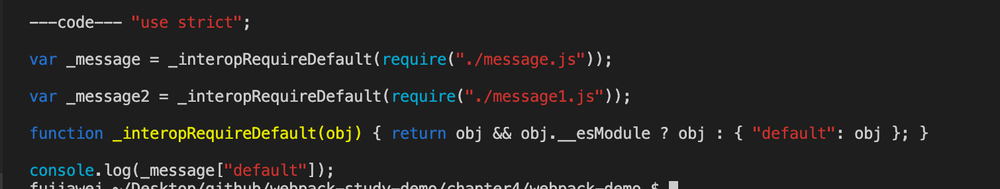


### 导出

最后我们将分析的文件名、依赖、编译好的代码导出去就完成了：

```javascript
const fs = require('fs');
const path = require('path');
const parser = require('@babel/parser');
const traverse = require('@babel/traverse').default;

const moduleAnalyser = (filename) => {
  const content = fs.readFileSync(filename, 'utf-8');
  const ast = parser.parse(content, {
    sourceType: 'module'
  });
  const dependencies = {};
  traverse(ast, {
    ImportDeclaration({ node }) {
      const dirname = path.dirname(filename);
      const newFile = './' + path.join(dirname, node.source.value);
      dependencies[node.source.value] = newFile;
    }
  });
  const { code } = babel.transformFromAst(ast, null, {
    presets: ["@babel/preset-env"]
  });
  return {
    filename,
    dependencies,
    code
  }
}

const moduleInfo = moduleAnalyser('./src/index.js')
```

重新打包一下，我们可以看到打印一下入口文件分析的结果如下图：

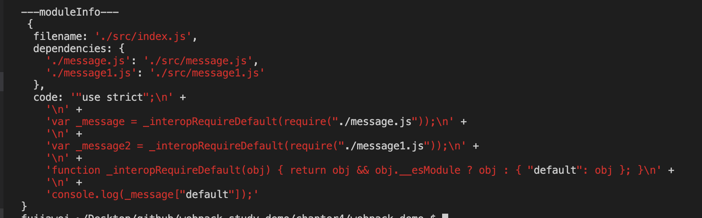


&nbsp;

## 依赖图谱

英文名 `Dependencies Graph`，即从入口文件开始，对所有应用到的文件做分析，最后把所有文件的依赖信息都给分析出来。

我们新建一个函数 `makeDependenciesGraph`，我们通过这个函数来得到 **从项目入口文件开始中所有文件的依赖关系**，我们修改一下 `bundle.js`：

```javascript
...

const makeDependenciesGraph = (entry) => {
  const entryModule = moduleAnalyser(entry);
  console.log('entryModule\n', entryModule);
}

const graphInfo = makeDependenciesGraph('./src/index.js');
```

我们打包一下，可以看到打印出了 `index.js` 的文件依赖信息：


接着我们需要做一个递归遍历，将所有的依赖到文件都去走一下 `moduleAnalyser` 这个方法，取出依赖文件的依赖信息，反复进行这步操作，直到我们的依赖被分析完成为止：

```javascript
...

const makeDependenciesGraph = (entry) => {
  const entryModule = moduleAnalyser(entry);
  const graphArray = [ entryModule ];
  
  for(let i = 0; i < graphArray.length; i++) {
    const item = graphArray[i];
    const { dependencies } = item;
    if(dependencies) {
      for(let j in dependencies) {
        graphArray.push(
          moduleAnalyser(dependencies[j])
        );
      }
    }
  }
  console.log('graphArray\n', graphArray);
}

const graphInfo = makeDependenciesGraph('./src/index.js');
```

我们将入口文件的依赖信息放入 `graphArray` 数组中，接着便对其做一个循环，循环里面的依赖关系，如果有依赖关系，在进行一次 `moduleAnalyser` 的处理，并将处理的结果塞到  `graphArray` 中去，以此类推，我们最终便能得到项目文件所有的依赖关系，我们可以看到得到的结果如下图所示：

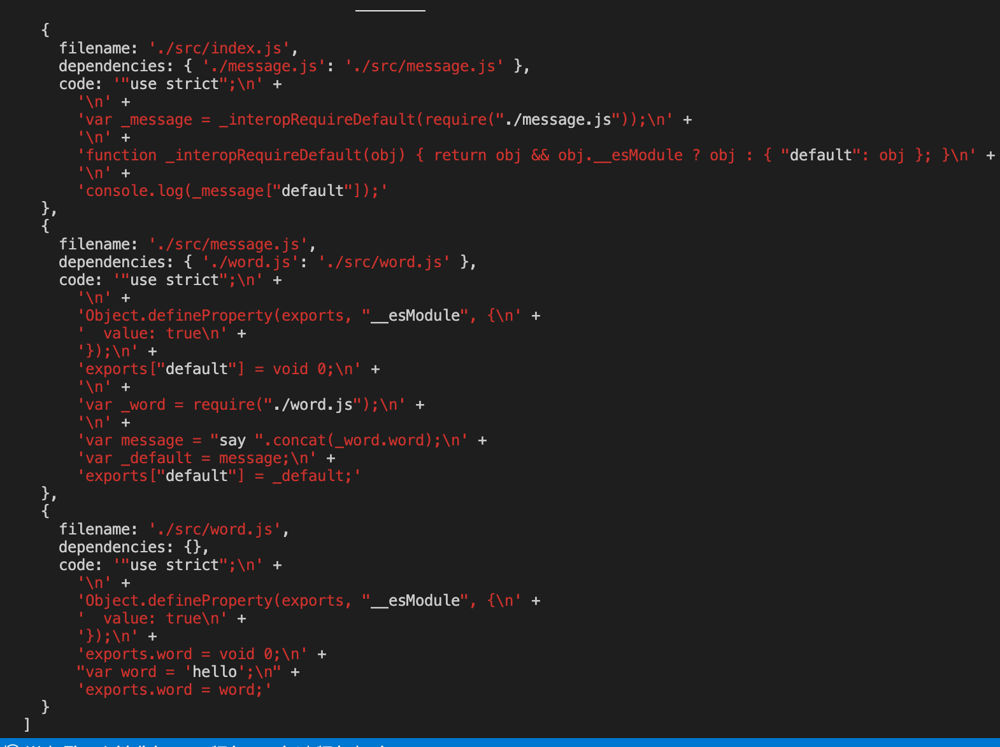

首先我们会分析 `index.js` 文件下的依赖关系，我们发现其引用了 `message.js`，接着我们便对 `message.js` 做 `moduleAnalyser` 操作，发现其依赖了 `word.js`，接着我们会在对 `word.js` 做 `moduleAnalyser` 操作，最后发现 `word.js` 没有任何依赖了，于是循环结束了。

我们在修改一下依赖图谱的展示，最好也想依赖关系的展示一样，以对象的形式进行存放，**键为文件地址，值为此文件的依赖关系和对应编译好的代码**，我们修改一下 `makeDependenciesGraph` 函数：

```javascript
...

const makeDependenciesGraph = (entry) => {
  const entryModule = moduleAnalyser(entry);
  const graphArray = [ entryModule ];
  
  for(let i = 0; i < graphArray.length; i++) {
    const item = graphArray[i];
    const { dependencies } = item;
    if(dependencies) {
      for(let j in dependencies) {
        graphArray.push(
          moduleAnalyser(dependencies[j])
        );
      }
    }
  }
  const graph = {};
  graphArray.forEach(item => {
    graph[item.filename] = {
      dependencies: item.dependencies,
      code: item.code
    }
  });
  console.log('---graph---\n', graph);
}

const graphInfo = makeDependenciesGraph('./src/index.js');
```

我们循环遍历 `graphArray` 将其放到对应的 `graph` 中，我们重新打包一下，可以看到如图所示：

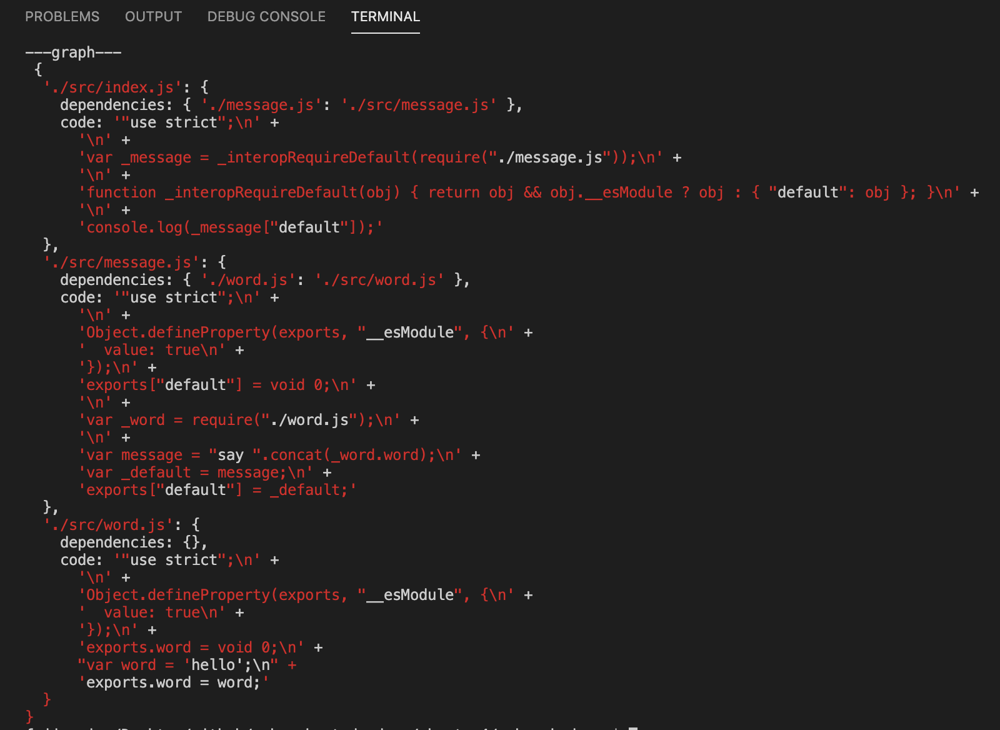

&nbsp;

### 导出

最后我们将结果导出：

```javascript
...

const makeDependenciesGraph = (entry) => {
  const entryModule = moduleAnalyser(entry);
  const graphArray = [ entryModule ];
  
  for(let i = 0; i < graphArray.length; i++) {
    const item = graphArray[i];
    const { dependencies } = item;
    if(dependencies) {
      for(let j in dependencies) {
        graphArray.push(
          moduleAnalyser(dependencies[j])
        );
      }
    }
  }
  const graph = {};
  graphArray.forEach(item => {
    graph[item.filename] = {
      dependencies: item.dependencies,
      code: item.code
    }
  });
  return graph;
}

const graphInfo = makeDependenciesGraph('./src/index.js');
console.log('---graphInfo---\n', graphInfo);
```

我们打印一下 `graphInfo`，可以得到如下结果：


&nbsp;

## 生成代码

接下来我们要做的就是通过 **依赖图谱** 来生成对应的代码了。

我们新建一个函数 `generateCode`，我们通过这个函数来得到生成代码，我们修改一下 `bundle.js`：

```javascript
...
const generateCode = (entry) => {
  const graph = JSON.stringify(makeDependenciesGraph(entry));
  console.log('---graph--\n', graph);
}

const code = generateCode('./src/index.js');
```

我们打包一下，可以看到打印出了依赖图谱的信息：


接着我们就要去生成代码了，首先代码肯定是一段字符串，而在浏览器上运行代码需要已闭包的形式注入，这样可以避免污染全局变量，我们闭包代码中传入 `graph` 信息，于是可以写出这样的代码：

```javascript
...
const generateCode = (entry) => {
  const graph = JSON.stringify(makeDependenciesGraph(entry));
  return `
    (function(graph){
    })(${graph})
  `;

  console.log('---graph--\n', graph);
}

const code = generateCode('./src/index.js');
console.log(code)
```

我们打包一下，会发现传入的 `graph` 参数是 `[object Object]`：

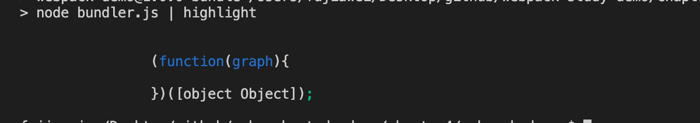

因为 `graph` 本身是一个对象，他会被转换成 `[object Object]` 这样的一个字符串，所以我们要将 `graph` 进行一次 `JSON.stringify()`，将其转化为字符串：

```javascript
...
const generateCode = (entry) => {
  const graph = JSON.stringify(makeDependenciesGraph(entry));
  ... 
}

const code = generateCode('./src/index.js');
console.log(code)
```

这个时候我们可以看到 `graph` 被正确传入了：

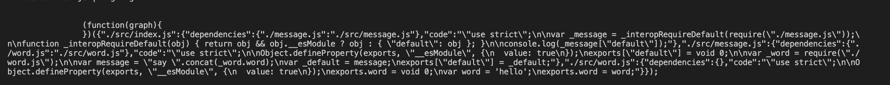

在编写闭包代码之前，我们首先看一下依赖图谱中编译后的代码长什么样子：


我们可以看到在这些函数中有一个 `require` 这个方法，和 `exports` 这个对象，但实际上在浏览器中是没有 `require` 这个方法 和 `exports` 这个函数的，所以我们需要自定义一个`requier` 这个方法 和 `epxorts` 这个对象，我们可以编写如下代码： 

```javascript
...
const generateCode = (entry) => {
  const graph = JSON.stringify(makeDependenciesGraph(entry));
  return `
    (function(graph){
      function require(module) {
        (function(code){
          eval(code)
        })(graph[module].code);
      };
      require('${entry}')
    })(${graph});
  `;
}

const code = generateCode('./src/index.js');
console.log(code)
```

上面的代码中我们构建了一个 `require` 函数，并且调用一次将 `entry` 入口传进去，在 `require` 中我们还是以一个闭包的形式去写代码，将入口文件对应的 `code` 以参数的形式传进去，最后我们用 `eval` 函数来执行代码。

我们在回过头来看看 `index.js` 编译后的代码：

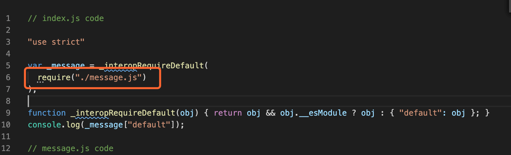

我们可以看到其中还会执行 `require()` 这个函数，并将 `"./message.js"` 这个文件引入，但是我们发现其实我们需要依赖图谱的 `key` 值需要一个以 `src` 为基准的地址，所以我们需要对路径做一个转化，将 `"./message.js"` 转化为类似 `./src/message.js` 这个地址之后，我们才能在依赖图谱中找到其对应的源代码，所以我们在修改一下代码：

```javascript
...
const generateCode = (entry) => {
  const graph = JSON.stringify(makeDependenciesGraph(entry));
  return `
    (function(graph){
      function require(module) {
        function localRequire(relativePath) {
          return require(graph[module].dependencies[relativePath]);
        }
        
        (function(require, code){
          eval(code)
        })(localRequire, graph[module].code);
      };
      require('${entry}')
    })(${graph});
  `;
}

const code = generateCode('./src/index.js');
console.log(code)
```

我们新建一个 `localRequire` 用来转化文件的路径，并作为参数传给 `require` 中执行的闭包函数，其实在闭包函数中执行的 `require` 函数，是我们经过路径转换过的 `localRequire` 函数，这样就能把依赖图谱对应的编译后的代码都执行一遍了。

接下来我们在回过头来看一下 `exports` 这个对象，我们先看一下下图：

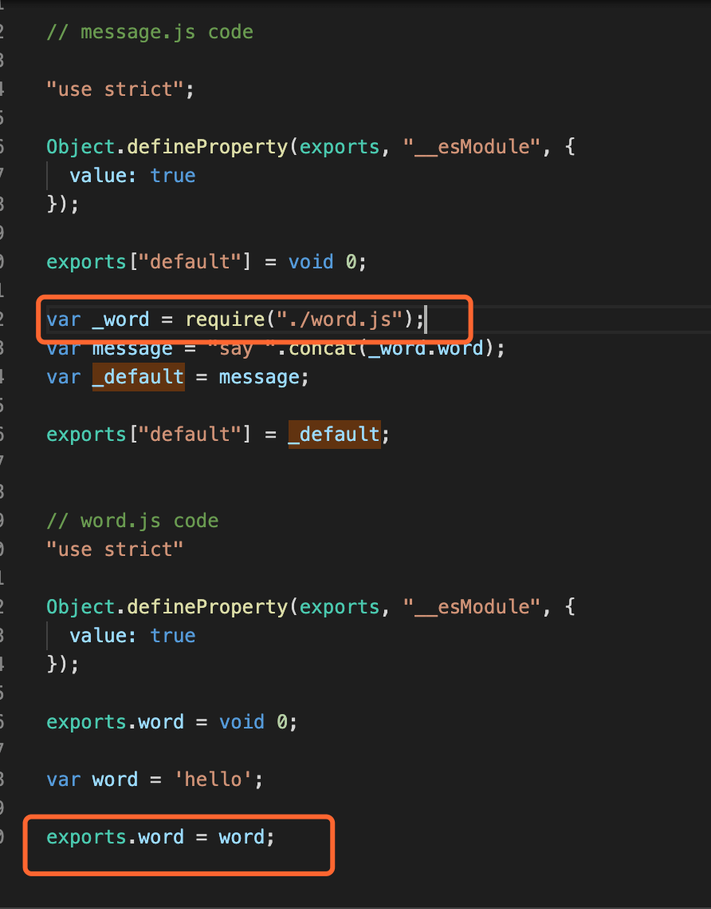

在 `word.js` 中通过 `exports` 导出的 `word` 会在 `message.js` 中会被 `require` 应用，并通过 `_word.word` 的形式进行调用，所以我们可以先申明一个 `exports` 对象，用于存放每一个模块中在 `exports` 中存放的内容：

```javascript
...
const generateCode = (entry) => {
  const graph = JSON.stringify(makeDependenciesGraph(entry));
  return `
    (function(graph){
      function require(module) {
        function localRequire(relativePath) {
          return require(graph[module].dependencies[relativePath]);
        }
        var exports = {};
        (function(require, exports, code){
          eval(code)
        })(localRequire, exports, graph[module].code);
        return exports;
      };
      require('${entry}')
    })(${graph});
  `;
}

const code = generateCode('./src/index.js');
console.log(code)
```

在上述代码中我们在 `require` 外层申明一个 `exports` 对象，在闭包函数中以参数的形式传进去，在代码执行过程中，模块代码可以拿到 `exports` 这个对象，于是便能通过这个对象向外导出一些内容，在最后我们将 `exports` 这个模块进行导出，这样下一个模块在引用这个模块的时候，就能够使用 `exports` 中的一些内容了。

我们可以打印出对应的 `module` 和 `exports`：

```javascript
...
const generateCode = (entry) => {
  const graph = JSON.stringify(makeDependenciesGraph(entry));
  return `
    (function(graph){
      function require(module) {
        function localRequire(relativePath) {
          return require(graph[module].dependencies[relativePath]);
        }
        var exports = {};
        (function(require, exports, code){
          eval(code)
        })(localRequire, exports, graph[module].code);
        console.log('---module---', module);
        console.log('---exports---', exports);
        return exports;
      };
      require('${entry}')
    })(${graph});
  `;
}

const code = generateCode('./src/index.js');
console.log(code)
```

我们打包一下，将打包出来的代码放到浏览器中执行：

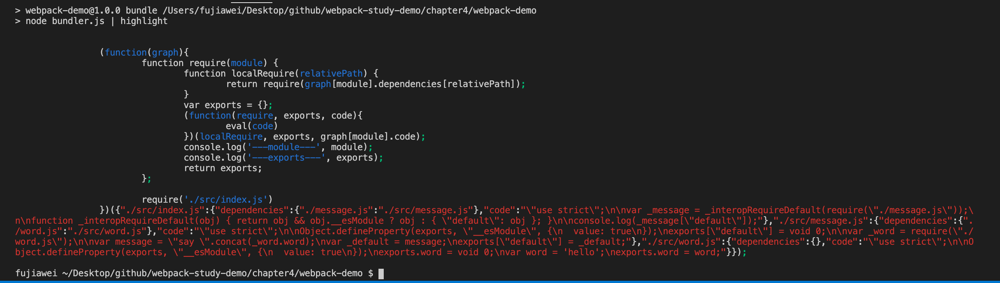

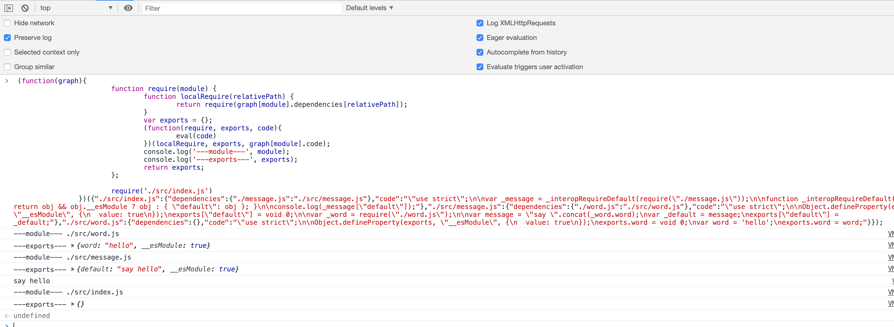

我们可以看到页面中打印出了 `say world`，以及每一个 `module` 对应的 `exports` 的值。


&nbsp;

## 总结

到此我们便完成了一个简单的 `webpack` 的编写，虽然说是一个简单的例子，但是从中也涉及到蛮多的知识点的，我们也能从中对 `webpack` 的打包流程有一定的了解。


&nbsp;

## 相关链接

- [官方叫你手写 webpack](https://webpack.js.org/api/compiler-hooks/)
- [module 和 exports 的实现](https://www.jianshu.com/p/011f2a90291d)
- [Node.js 模块(module)](http://nodejs.cn/api/modules.html#modules_modules)

&nbsp;

## 示例代码

示例代码可以看这里：

- [webpack  示例代码]()

