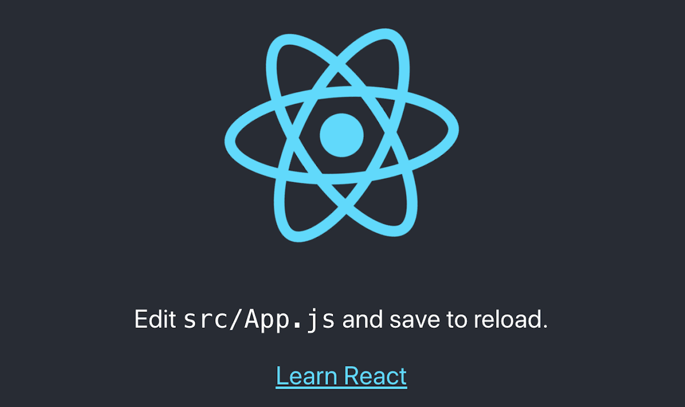
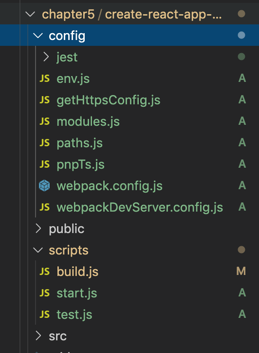
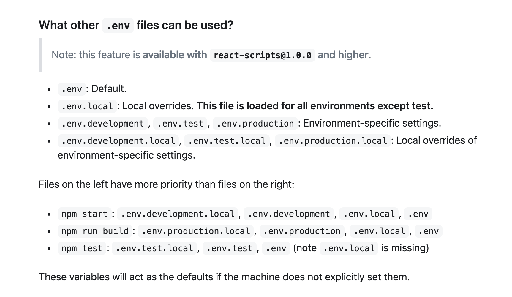

# Create-React-App 中 Webpack 配置

今天我们来讲一下 `create-react-app` 中的 `webpack` 配置，看一下大型项目中对 `webpack` 的配置。


&nbsp;

## 安装

首先我们我们要安装 `create-react-app`，我们可以通过一下方式进行安装，不过前提是你的电脑上面已经安装了 `Node` 环境：

```javascript
// 全局安装create-react-app
$ sudo npm install -g create-react-app

// 或 临时安装 create-react-app，my-app 是要创建的文件夹的名字
$ npx create-react-app my-app

```

我是全局安装 `create-react-app`，接着我们创建 `create-react-app-demo`：

```javascript
// 创建项目
create-react-app create-react-app-demo

// 依赖安装完成后
cd my-app
npm start
```

看到如下图，就代表我们的项目安装成功了：



但是现在的目录中没有 `webpack` 的配置文件，我们需要通过 `package.json` 中 `scripts` 命令中 `npm run eject` 命令弹出相应的 `webpack` 配置，执行成功后，我们可以发现项目目录多了 `config` 和 `scripts` 两个文件夹，这两个文件夹中的文件便是 `create-react-app` 中核心的 `webpack` 配置文件：




&nbsp;

### 先来看一波文件目录：

```javascript
.
├── config    	// webpack 配置的文件目录
    ├── jest 	  // 测试文件配置文件夹
    ├── env.js  // 存放环境配置的文件
    ├── getHttpsConfig.js  // 本地开发 https 配置文件
    ├── modules.js  // 模块配置文件
    ├── paths.js  // 路径配置的文件
    ├── pnpTs.js  // 使用 typescript 将会使用到的配置文件
    ├── webpack.config.js  // webpack 核心配置文件
    └── webpackDevServer.config.js   // devServer 所需文件
├── scripts  // node 执行 js 的文件
    ├── build.js // npm run build 命令执行的文件
    ├── start.js // npm start 命令执行的文件
    └── test.js  // npm run test 命令执行的文件
...
└── package.json // 当前整一个项目的依赖
```


&nbsp;

## 文件分析

我们一个文件一个文件进行分析。

### `env.js`：环境配置文件

读取 `env` 配置文件并将 `env` 的配置信息给到全局变量 `process.env`。




&nbsp;

&nbsp;

## 命令

### `npm start`

打包开发环境。


&nbsp;

### `npm run build`

打包生产环境。


&nbsp;

## 相关链接

* [Create React App 中文文档](https://www.html.cn/create-react-app/)
* [从 create-react-app 学习 webpack（一）](https://www.jianshu.com/p/1f054623ecac)
* [从 create-react-app 学习 webpack（二）](https://www.jianshu.com/p/195712bb0429)


&nbsp;

## 示例代码

示例代码可以看这里：

- [create-react-app 示例代码]()