# `Create-React-App` 中 `Webpack` 配置

今天我们来讲一下 `create-react-app` 中的 `webpack` 配置，看一下大型项目中对 `webpack` 的配置。

&nbsp;

## 安装

首先我们我们要安装 `create-react-app`，我们可以通过一下方式进行安装，不过前提是你的电脑上面已经安装了 `Node` 环境：

```javascript
// 全局安装create-react-app
$ sudo npm install -g create-react-app

// 或 临时安装 create-react-app，my-app 是要创建的文件夹的名字
$ npx create-react-app my-app
```

我是全局安装 `create-react-app`，接着我们创建 `create-react-app-demo`：

```javascript
// 创建项目
create-react-app create-react-app-demo

// 依赖安装完成后
cd my-app
npm start
```

看到如下图，就代表我们的项目安装成功了：


但是现在的目录中没有 `webpack` 的配置文件，我们需要通过 `package.json` 中 `scripts` 命令中 `npm run eject` 命令弹出相应的 `webpack` 配置，执行成功后，我们可以发现项目目录多了 `config` 和 `scripts` 两个文件夹，这两个文件夹中的文件便是 `create-react-app` 中核心的 `webpack` 配置文件：


&nbsp;

### 先来看一波文件目录：

```javascript
.
├── config    	// webpack 配置的文件目录
    ├── jest 	  // 测试文件配置文件夹
    ├── env.js  // 存放环境配置的文件
    ├── getHttpsConfig.js  // 本地开发 https 配置文件
    ├── modules.js  // 模块配置文件
    ├── paths.js  // 路径配置的文件
    ├── pnpTs.js  // 使用 typescript 将会使用到的配置文件
    ├── webpack.config.js  // webpack 核心配置文件
    └── webpackDevServer.config.js   // devServer 所需文件
├── scripts  // node 执行 js 的文件
    ├── build.js // npm run build 命令执行的文件
    ├── start.js // npm start 命令执行的文件
    └── test.js  // npm run test 命令执行的文件
...
└── package.json // 当前整一个项目的依赖
```

&nbsp;

## 命令文件解析

### `npm start`

我们通过此命令打包开发环境。这个文件中我们会设置 `NODE_ENV` 为 `development`，引入开发环境的 `webpack` 配置文件，通过 `createCompiler `生成一个 `compiler`，  并通过 `compiler` 和 `devServer` 配置文件，生成一个 `devServer` 实例，接着就可以启动服务了。

#### 代码一

首先，定义开发环境，使得任何读取它的文件都能知道正确的环境。同时引入 `env` 文件，确保一些全局变量已经被设置好了。

```javascript
process.env.BABEL_ENV = 'development';
process.env.NODE_ENV = 'development';

// 确保已经设置好了环境变量。
require('../config/env');
```

&nbsp;

#### 代码二

通过下面的段代码生成一个 `webpack` 的编译器。

```javascript
const webpack = require('webpack');

...

// 返回一些 server 配置
const {
  choosePort,
  createCompiler,
  prepareProxy,
  prepareUrls,
} = require('react-dev-utils/WebpackDevServerUtils');

// webpack 核心配置文件
const configFactory = require('../config/webpack.config');
  
// 是否使用了 Yarn
const useYarn = fs.existsSync(paths.yarnLockFile);

...

const config = configFactory('development');
const protocol = process.env.HTTPS === 'true' ? 'https' : 'http';
const appName = require(paths.appPackageJson).name;
const useTypeScript = fs.existsSync(paths.appTsConfig);
const tscCompileOnError = process.env.TSC_COMPILE_ON_ERROR === 'true';
const urls = prepareUrls(
  protocol,
  HOST,
  port,
  paths.publicUrlOrPath.slice(0, -1)
);

const devSocket = {
  warnings: warnings =>
    devServer.sockWrite(devServer.sockets, 'warnings', warnings),
  errors: errors =>
    devServer.sockWrite(devServer.sockets, 'errors', errors),
};
// 创建一个配置了自定义消息的 webpack 编译器。
const compiler = createCompiler({
  appName,
  config,
  devSocket,
  urls,
  useYarn,
  useTypeScript,
  tscCompileOnError,
  webpack,
});
```

&nbsp;

#### 代码三

通过 `devServer` 配置和 `compiler`，`new` 一个 `WebpackDevServer` 实例，并启动 `server`，自动帮我们打开浏览器。

```javascript
// 加载代理配置
const proxySetting = require(paths.appPackageJson).proxy;
const proxyConfig = prepareProxy(
  proxySetting,
  paths.appPublic,
  paths.publicUrlOrPath
);

// 生成 webpack-dev-server 配置文件
const serverConfig = createDevServerConfig(
  proxyConfig,
  urls.lanUrlForConfig
);

const devServer = new WebpackDevServer(compiler, serverConfig);

// 启动 WebpackDevServer.
devServer.listen(port, HOST, err => {
  // ...
  openBrowser(urls.localUrlForBrowser);
});
```

其他的比如错误处理，如何使命令行输出更加美化等，笔者就不细讲了，大家可以去看示例代码。

&nbsp;

### `npm run build`

我们通过此命令打包生产环境。

这个文件中我们会设置 `NODE_ENV` 为 `production`。引入生产环境的 `webpack` 配置文件，通过文件中的 `build` 函数对项目进行打包。打包成功后输出一些信息。

#### 代码一

和 `npm start` 一样，定义环境为生产环境，同时引入一下 `env` 这个文件，确保一些全局变量已经被设置好了。

```javascript
process.env.BABEL_ENV = 'production';
process.env.NODE_ENV = 'production';

// 确保已经设置好了环境变量
// 笔者感觉其实在这里不引入也没事，因为在核心配置文件中也会引入一次
require('../config/env');
```

&nbsp;

#### 代码二

通过核心配置文件生成 `compiler`，接着通过 `build` 函数对 `webpack` 进行打包，这里面其实就是在 `Node.js` 中使用 `webpack` 了，更多的 `Api` 大家可以参考 [webpack 官网 Node.js API](https://webpack.js.org/api/node/#installation)。

```javascript
// webpack 核心配置文件
const configFactory = require('../config/webpack.config');

// 生成 Webpack 核心配置文件
const config = configFactory('production');

// 构建 webpack
function build(previousFileSizes) {
  ...
  const compiler = webpack(config);
  return new Promise((resolve, reject) => {
    compiler.run((err, stats) => {
      // ... 一系列对于错误的处理 和打包过程的分析记录
			return resolve({
        stats, // 打包过程的文件分析
        previousFileSizes, // 上一次的打包大小
        warnings: messages.warnings, // 警告信息
      });
    });
  })
}
```

其他的比如错误处理，如何使命令行输出更加美化等，笔者就不细讲了，大家可以去看示例代码。

&nbsp;

## 配置文件分析

接下来，我们一个文件一个文件进行分析。

大致讲这些文件的一些要点，详细的注释我都写在了案例代码中，大家可以自行去查看。

&nbsp;

### `path.js`

**项目路径配置文件**。`path.js` 是项目路径相关的配置文件，这个文件比较简单，就是导出项目中文件的路径，我们简单过一下。

&nbsp;

#### 代码一

确保项目中的路径都是 **绝对路径**。

```javascript
const appDirectory = fs.realpathSync(process.cwd());
const resolveApp = relativePath => path.resolve(appDirectory, relativePath);
```

&nbsp;

#### 代码二

设置 `publicPath` 或者 `url`。

```javascript
const publicUrlOrPath = getPublicUrlOrPath(
  process.env.NODE_ENV === 'development',
  require(resolveApp('package.json')).homepage,
  process.env.PUBLIC_URL
);
```

如果你的项目运行的目录并不是根目录下 例如是 `xxx.com/html/`，那么我们可以根据上面的分析在 `package.json` 中添加 `homepage` 的属性。来使 `buld` 时各种静态资源的正确引入。

修改 `package.json`：

```json
{
  ...
  "homepage": "html"
}
```

重新打包可以发现 `publicUrl` 的值变成了 `/html/`：

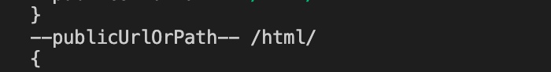

在看 `build` 出来的资源文件路径上都带上了 `/html`：

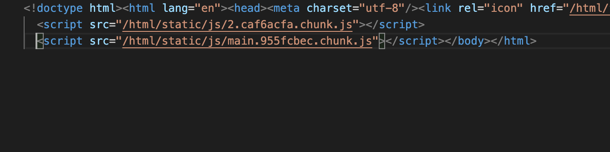

&nbsp;

#### 代码三

根据 `webpack` 文件后缀的顺序，通过 `resolveModule` 这个方法解析文件。

```javascript
// 一些文件的后缀
// webpack 解析文件后缀的顺序 排布

const moduleFileExtensions = [
  'web.mjs',
  'mjs',
  'web.js',
  'js',
  'web.ts',
  'ts',
  'web.tsx',
  'tsx',
  'json',
  'web.jsx',
  'jsx',
];

// 以 webpack 相同的顺序解析 文件的路径
const resolveModule = (resolveFn, filePath) => {
  const extension = moduleFileExtensions.find(extension =>
    fs.existsSync(resolveFn(`${filePath}.${extension}`))
  );

  if (extension) {
    return resolveFn(`${filePath}.${extension}`);
  }

  return resolveFn(`${filePath}.js`);
};
```

&nbsp;

#### 代码四

```javascript
module.exports = {
  dotenv: resolveApp('.env'),
  appPath: resolveApp('.'),
  appBuild: resolveApp('build'),
  appPublic: resolveApp('public'),
  appHtml: resolveApp('public/index.html'),
  appIndexJs: resolveModule(resolveApp, 'src/index'),
  appPackageJson: resolveApp('package.json'),
  appSrc: resolveApp('src'),
  appTsConfig: resolveApp('tsconfig.json'),
  appJsConfig: resolveApp('jsconfig.json'),
  yarnLockFile: resolveApp('yarn.lock'),
  testsSetup: resolveModule(resolveApp, 'src/setupTests'),
  proxySetup: resolveApp('src/setupProxy.js'),
  appNodeModules: resolveApp('node_modules'),
  publicUrlOrPath,
};
```

就是导出一坨路径配置，如下图所示：

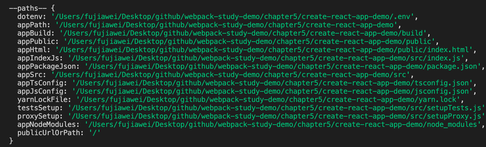

&nbsp;

### `env.js`：

**项目环境配置文件**。读取 `env` 配置文件并将 `env` 的配置信息给到全局变量 `process.env`。

&nbsp;

#### 代码一

删除一下缓存 `'./paths'`  ，确保下次可以拿到 `require` 重新加载被删除的模块，获取最新的内容 

```javascript
delete require.cache[require.resolve('./paths')];
```

&nbsp;

#### 代码二

判断打包环境，没有打包环境则抛出错误

```javascript
const NODE_ENV = process.env.NODE_ENV;
if (!NODE_ENV) {
  throw new Error(
    'The NODE_ENV environment variable is required but was not specified.'
  );
}
```

&nbsp;

#### 代码三

下面两行代码意思是 **读取根目录下面 `.env` 下面的路径，并通过 `dotenv` 设置到全局变量中去**。

```javascript
// 读取 根目录下面 .env 相关的配置
const dotenvFiles = [
  `${paths.dotenv}.${NODE_ENV}.local`,
  `${paths.dotenv}.${NODE_ENV}`,
  NODE_ENV !== 'test' && `${paths.dotenv}.local`,
  paths.dotenv,
].filter(Boolean);

// 取到上面的 dotenvFiles 路径，会判断路径是否存在
// 存在则 通过 dotenv 设置相应的环境变量
dotenvFiles.forEach(dotenvFile => {
  if (fs.existsSync(dotenvFile)) {
    require('dotenv-expand')(
      require('dotenv').config({
        path: dotenvFile,
      })
    );
  }
});
```

我们可以看看 `dotenvFiles` 的路径，我们都是以 `npm run build` 这个命令来执行的，可以得到如下路径：

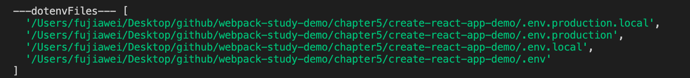

其实这里面有很多配置文件可供选择：


他们的优先级都是从前往后的，前面的会覆盖后面的，我们举一个例子，在项目根目录新建 `.env.production.local`， `.env.production`，  `.env.local`， `.env`

分别在文件中填入

```javascript
// .env.production.local
APP_ID = 123
REACT_APP_ID = 123

// .env.production
APP_ID = 456
REACT_APP_ID = 456

// .env.local
APP_ID = 789
REACT_APP_ID = 789

// .env
APP_ID = 910
REACT_APP_ID = 910
```

我们输出一下最后 通过 `getClientEnvironment` 这个函数整理的全局变量 `raw`：

输出了一个 `REACT_APP_ID` 为 `123`：

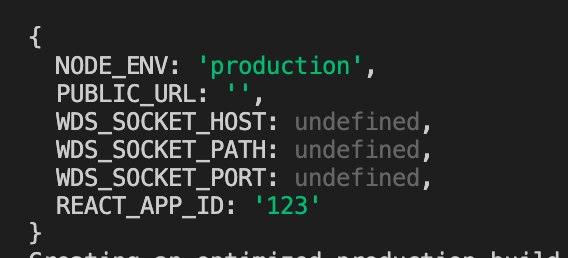

当我们删除 `.env.production.local` 中的 `REACT_APP_ID` 的时候，现在输出的  `REACT_APP_ID` 变成了 `456`。

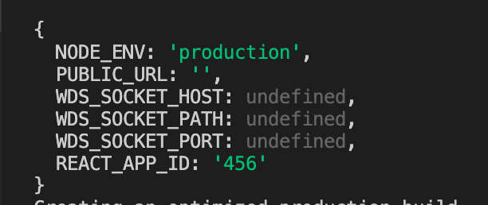

但是为什么没有 `APP_ID` 这个东西呢，因为在项目中 `create-react-app` 默认有一个正则过滤，只取以 `REACT_APP_` 开头的配置未见：

```javascript
const REACT_APP = /^REACT_APP_/i;
```

所以自然就没有 `APP_ID` 这个选项了。

&nbsp;

#### 代码五

这里我们定义了一个 `NODE_PATH`，存放项目的路径。这里的路径跟 `Node` 中的 `NODE_PATH` 类似。

```javascript
const appDirectory = fs.realpathSync(process.cwd());
process.env.NODE_PATH = (process.env.NODE_PATH || '')
  .split(path.delimiter)
  .filter(folder => folder && !path.isAbsolute(folder))
  .map(folder => path.resolve(appDirectory, folder))
  .join(path.delimiter);
```

&nbsp;

#### 代码六

`getClientEnvironment` 是整合外部传进来的一些变量参数，对全局变量进行整理的一个函数，并将整合的结果输出，并附带一份全局变量的字符串话，以便我们可以将其输入到 `webpack` 中 `DefinePlugin`。

```javascript
// 正则过滤，只区 `REACT_APP_` 开头的变量
const REACT_APP = /^REACT_APP_/i;

function getClientEnvironment(publicUrl) {
  ...
  return { raw, stringified };
}

module.exports = getClientEnvironment;
```

&nbsp;

### `getHttpsConfig.js`

返回 `devServer` 中所需要的 `https` 配置文件，如下图：

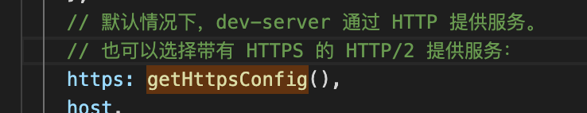


&nbsp;

### `modules.js`

这个文件是项目中获取模块相关配置的一个文件。主要是导出四个配置：

* `additionalModulePaths`：在 `webpack.config.js` 中 `resolve` 的 `modules` 的其他模块路径

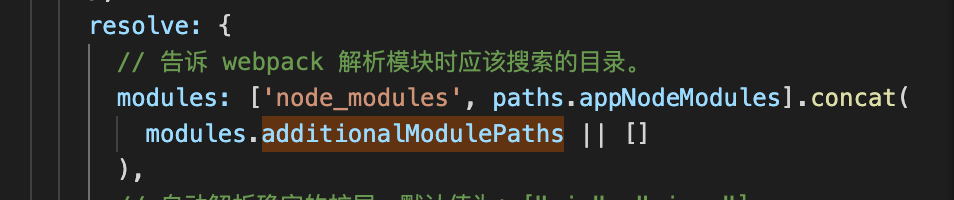

* `webpackAliases`：在 `webpack.config.js` 中 `resolve` 的 `alias` 配置

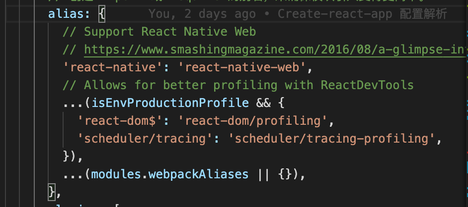

* `jestAliases`：`jest` 测试中使用的别名
* `hasTsConfig`：项目是否是 `ts` 


### `pnpTs.js`

这个文件具体用法笔者也不是很清楚，`pnp` 是 `Plug-and-Play` 的简称，译文为 **即插即用**，应该是帮助 `webpack` 自动配置 `typesctript` 的一个文件：

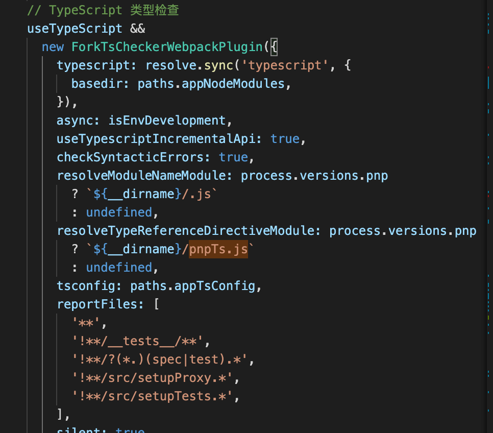

&nbsp;

### `webpackDevServer.config.js`

这个文件是 `webpack` 关于 `devServer` 的配置文件，它导出了一个函数，用来获取相关配置。

文件中的配置跟 `webpack` 官网 `devServer` 的配置是一样的，大家如果有兴趣，可以跟着官网的教程一起过一下。当然我在示例代码中也写了相应的注释。

这个文件中使用了很多 `create-react-app` 自己写的中间件，来帮助我们优化开发流程的。注册中间件是在 `devServer` 的 [`before`](https://webpack.js.org/configuration/dev-server/#devserverbefore) 和 [`after`](https://webpack.js.org/configuration/dev-server/#devserverafter) 这两个钩子中实现的。

接着在 `/scripts/start.js` 中导入，生成相应的 `devServer` 配置：

```javascript
// scripts/start.js

// 生成 webpack-dev-server 配置文件
const serverConfig = createDevServerConfig(
  proxyConfig,
  urls.lanUrlForConfig
);

// 生成 WebpackDevServer 实例子
const devServer = new WebpackDevServer(compiler, serverConfig);
```

&nbsp;

### `webpack.config.js`

这个文件是 `create-react-app` 的核心 `webpack` 文件，基本上所有的配置都写在这个文件之中。他会导出一个函数，用于获取整个项目的 `webpack` 的配置文件。

参数是相应的环境变量 `webpackEnv`，因为在这个文件之中会根据环境变量进行区分打包。

&nbsp;

#### 代码一

定义打包环境，并通过 `env` 获取全局的环境变量

```javascript
// 开发环境
const isEnvDevelopment = webpackEnv === 'development';

// 生产环境
const isEnvProduction = webpackEnv === 'production';

// 获取到项目中 定义的 全局环境变量
const env = getClientEnvironment(paths.publicUrlOrPath.slice(0, -1));
```

&nbsp;

#### 代码二

`Webpack` 的配置参数。意思是遇到错误时，立即停止。在线上环境开启个参数。

```javascript
bail: isEnvProduction,
```

&nbsp;

#### 代码三

使用 `TerserPlugin` 来进行 `js` 代码的压缩，他能支持 `es6` 代码的压缩，之前我们都是使用 [`uglifyjs-webpack-plugin`](https://github.com/webpack-contrib/uglifyjs-webpack-plugin)，但是它不能压缩 `es6` 的代码；

我们使用 `OptimizeCSSAssetsPlugin` 来压缩 `css` 文件。

```javascript
optimization: {
  // 根据环境，选择是不是压缩
  minimize: isEnvProduction,
  minimizer: [
    new TerserPlugin({
      ...
    }),
    new OptimizeCSSAssetsPlugin({
      ...
    })
  ]
}
```

&nbsp;

#### 代码四

这里是 `webpack` 中 `resolve` 的配置内容，配置了相应的 `modules`、`extensions`、`alias`、`plugins`，其中 `modules.additionalModulePaths` 和 `modules.webpackAliases` 是从 `modules.js` 中读取的。

`resolve` 可以使用相应的 `plugin`，即走了 `resolve` 的都会走其中配置的插件。

`PnpWebpackPlugin` 笔者也不知道他的作用，可能对性能有帮助吧；`ModuleScopePlugin` 能确保引入的文件不会到项目文件夹外去。

```javascript
resolve: {
  // 告诉 webpack 解析模块时应该搜索的目录。
  modules: ['node_modules', paths.appNodeModules].concat(
    modules.additionalModulePaths || []
  ),
  // 自动解析确定的扩展。默认值为：[".js", ".json"]
  extensions: paths.moduleFileExtensions
    .map(ext => `.${ext}`)
    .filter(ext => useTypeScript || !ext.includes('ts')),
  alias: {
    // ...
    ...(modules.webpackAliases || {}),
  },
  plugins: [
    // 增加了对使用 Plug'n'Play 安装的支持，可能是能加快了安装和添加过程
    PnpWebpackPlugin,
    // 确保从应用程序源目录的相对导入不会到达外部。
    new ModuleScopePlugin(paths.appSrc, [paths.appPackageJson]),
  ],
},
```

&nbsp;

#### 代码五

在 `module` 的配置项中，使用了 `oneof` 这个参数，它会遍历所有后续 `loader`，直到命中一个满足条件为止，若都不满足，则掉入最后的 `file-loader`。

我们主要讲一下 `css-loader` 的使用，首先在最外层定义了相关的匹配规则的正则，同时还在外层定义了一个 `getStyleLoaders` 方法。接受两个参数：一个是 `css-loader` 的配置参数，另外一个是其他需要的 `loader`，比如 `sass-loader`。

这个方法返回一个处理样式文件的 `loaders` 的数组，包括 `style-loader`、`css-loader`、`MiniCssExtractPlugin.loader`、`postcss-loader`。

> 其中 `css-loader` 的 `importLoaders` 属性是针对于通过 `@import` 引入的css，告诉它还需要走几个 `loader` 才能到 `style-loader`。
>
> 如果引入了 `sass-loader`，则默认还有走三个 `loader`，分别是 `sass-loader`、`resolve-url-loader`、`postcss-loader`。

```javascript
const cssRegex = /\.css$/;
const cssModuleRegex = /\.module\.css$/;

...
// 获取样式加载 loader 的方法
const getStyleLoaders = (cssOptions, preProcessor) => {
  // ...
}
...

{
  oneOf: [
    //...各种 loader
    {
      test: cssRegex,
      exclude: cssModuleRegex,
      use: getStyleLoaders({
        importLoaders: 1,
        sourceMap: isEnvProduction && shouldUseSourceMap,
      }),
      // 开启 tree-shaking
      sideEffects: true,
    },
    {
      test: cssModuleRegex,
      use: getStyleLoaders({
        importLoaders: 1,
        sourceMap: isEnvProduction && shouldUseSourceMap,
        modules: {
          getLocalIdent: getCSSModuleLocalIdent,
        },
      }),
    },
   	// ...
  ]
}
```

&nbsp;

#### 代码六

`plugins` 选项中放置了项目中用到的所有的插件：

```javascript
...

plugins: {
  // 生成一个注入了生成 chunks 的 index.html
	new HtmlWebpackPlugin({
  	...
	})

	// 指定的代码文件通过行内的形式 嵌入到的 `html` 文件中
	new InlineChunkHtmlPlugin(HtmlWebpackPlugin, [/runtime-.+[.]js/]),
  
  // 通过 DefinePlugin 向 js 代码中注入相关的环境变量
  new webpack.DefinePlugin(env.stringified),
    
  // 热更新
  new webpack.HotModuleReplacementPlugin(),
    
  // 抽离出 css，单独打包成 css 文件
  new MiniCssExtractPlugin({
    // 配置项与 webpack.output 类似
    filename: 'static/css/[name].[contenthash:8].css',
    chunkFilename: 'static/css/[name].[contenthash:8].chunk.css',
  }),
  
  // 用来生成一份 assets 资源文件的 json 文件，
  // 即 chunks 插入到 html 中的地址，与 chunks 一一对应
  // 可以参考下图
  new ManifestPlugin({
    ...
  })
  
  // 忽略第三方包指定目录，让这些指定目录不要被打包进去
  new webpack.IgnorePlugin(/^\.\/locale$/, /moment$/),

  // TypeScript 类型检查
  new ForkTsCheckerWebpackPlugin({
    ...
  })
}
  
...
```

上面说到的 `ManifestPlugin` 中生成的 `json` 文件如下图所示：

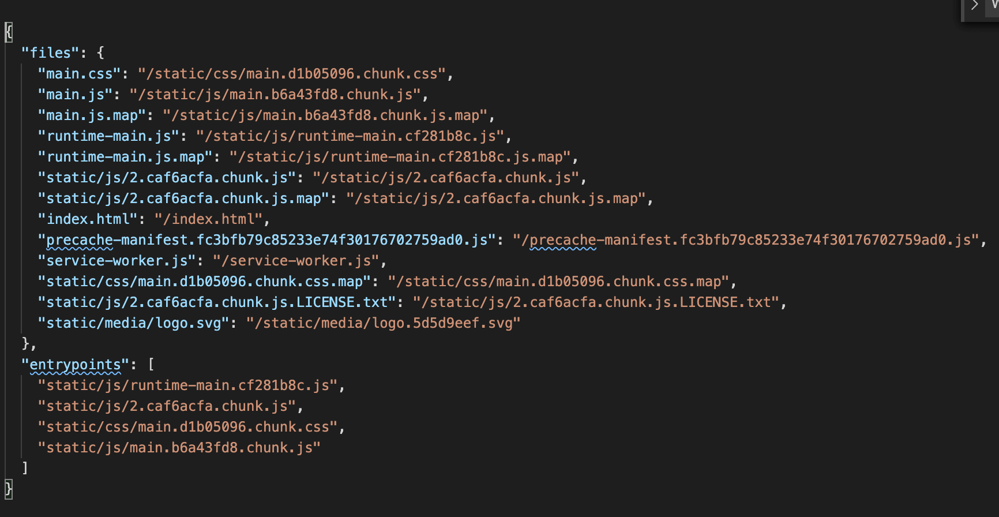


&nbsp;

#### 代码七

有的时候打包代码会跑在 `Node` 的环境下面，所以需要做一点 `Node` 的配置，告诉 `webpack` 为它们提供空的模拟，只要将其导入使用即可。

```javascript
node: {
  module: 'empty',
  dgram: 'empty',
  dns: 'mock',
  fs: 'empty',
  http2: 'empty',
  net: 'empty',
  tls: 'empty',
  child_process: 'empty',
},
```

&nbsp;

## 一些说明

整个 `create-react-app` 中 `webpack` 的注释我都放到了示例代码之中。其中肯定会有理解错误的地方，到时候希望大家能指出来，大家一起讨论一波。

&nbsp;

## 相关链接

* [Create React App 文档](https://create-react-app.dev/)
* [react-dev-utils](https://www.npmjs.com/package/react-dev-utils)
* [dotenv](https://github.com/motdotla/dotenv)
* [webpack 官网 DefinePlugin](https://webpack.js.org/plugins/define-plugin/)
* [浅谈webpack之plugin，webpack-manifest-plugin源码解读](https://segmentfault.com/a/1190000018628264)
* [从 create-react-app 学习 webpack](https://www.jianshu.com/p/195712bb0429)

* [实用webpack插件之DefinePlugin](https://segmentfault.com/a/1190000017217915)

* [webpack优化(3)——IgnorePlugin](https://blog.csdn.net/qq_17175013/article/details/86845624)

* [module、chunk和bundle到底是什么样的存在？](https://blog.csdn.net/YaoDeBiAn/article/details/103570693)
* [Node 常用模块之 fs-extra](https://www.jianshu.com/p/d6990a03d610)

&nbsp;

## 示例代码

示例代码可以看这里：

- [create-react-app 示例代码 + 注释](https://github.com/darrell0904/webpack-study-demo/tree/master/chapter5/create-react-app-demo)