# `Vue CLI` 中 `Webpack` 配置

这一节我们来讲一下 `Vue CLI` 中的关于 `Webpack` 中的配置，`Vue` 对 `webpack` 有了自己的一套封装，这使得在 `vue` 中配置 `webpack` 更加简单了。


## 安装

我们通过一下方式安装 `@vue/cli`：

```shell
npm install -g @vue/cli
#OR
yarn global add @vue/cli
```

我们通过以下命令查看一下 `vue` 的 `version`：

```shell
vue --version // @vue/cli 4.2.2
```

接着我们创建项目：

```shell
vue create vue-cli-demo
```

他会提示我们一个 `preset`，我们选择默认设置：

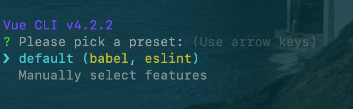

安装成功后，我们执行：

```shell
# 打开项目目录
cd vue-cli-demo

# 启动项目
yarn serve

# or
npm run serve
```

看到如下界面，我们的项目变安装成功了：

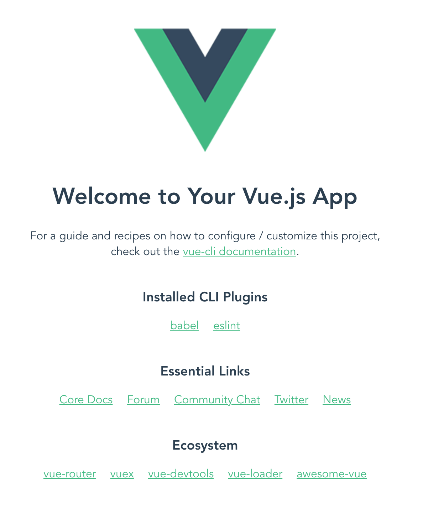

具体的目录如下：

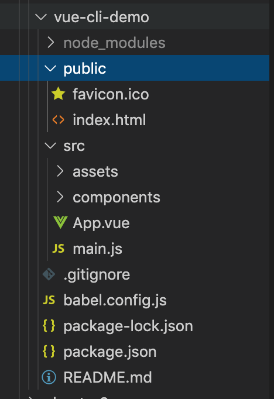

`vue-cli` 还提供了可视化界面，我们可以通过：

```shell
vue ui
```

运行此命令后，浏览器会打开以下界面：

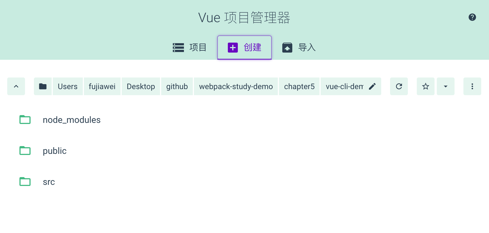

我们可以添加我么当前这个项目，添加完成之后，就可以对项目做相应的配置了。比如安装插件、代码编译、热更新、检查等。

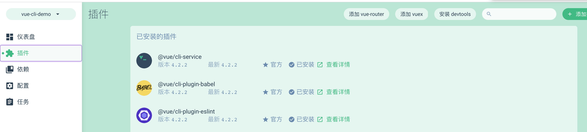

更多的笔者在这里就不详述了，大家可以自己动手尝试。

&nbsp;

## `Vue CLI` 中的 `Webpack`

在 `vue-cli 2.x` 中，通过其构建出来的目录会包含相应的 `webpack` 的配置文件。但在最新的 `Vue CLI` 中，我们找不到一份关于 `Webpack` 的配置文件，这是因为最新的版本为了让我们用的更加简单，提供了一种开箱即用的模式，即我们不用配置 `webpack` 就可以运行项目，同时它提供了 `vue.config.js` 文件来满足我们对开发者对其封装的 `Webpack` 默认配置的修改，如下图：

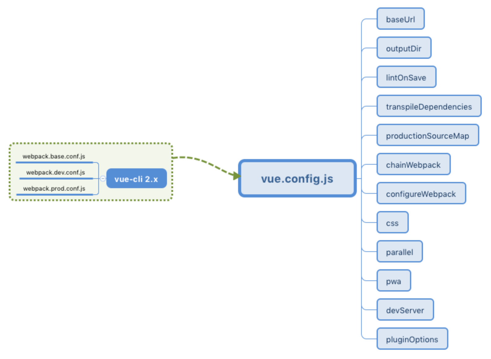

与 `create-react-app` 中通过 `npm run eject` 弹出 `webpack` 原生配置不同，`vue` 提供了一套自己的配置，帮助我们简化对 `webpack` 的配置，底层通过 `@vue/cli-service` 将 `vue.config.js` 翻译成 `webpack` 的原生配置。

所以在 `Vue CLI` 中，我们需要学习的可能不是 `webpack` 官网的东西了，而是学习 [`vue.config.js`]([https://cli.vuejs.org/zh/config/#%E5%85%A8%E5%B1%80-cli-%E9%85%8D%E7%BD%AE](https://cli.vuejs.org/zh/config/#全局-cli-配置)) 这个配置文件。

&nbsp;

## `vue.config.js` 常用配置

### outputDir

当运行 `vue-cli-service build` 时生成的生产环境构建文件的目录。默认是 `dist` 目录，如果你想将构建好的文件打包输出到 `output` 文件夹下，我们可以配置：

```javascript
// vue.config.js
module.exports = {
  ...
  outputDir: 'output',
  ...
}
```

这其实改变了 `webpack` 配置中 `output` 下的 `path` 项，修改了文件的输出路径。

&nbsp;

### productionSourceMap

该配置项用于设置是否为生产环境构建生成 `source map`，一般在生产环境下为了快速定位错误信息，我们都会开启 `source map`：

```javascript
// vue.config.js
module.exports = {
  ...
  productionSourceMap: true,
  ...
}
```

该配置会修改 `webpack` 中 `devtool` 项的值为 `source-map`。

&nbsp;

### publicPath

部署应用包时的基本 URL。用法和 `webpack` 本身的 `output.publicPath` 一致。默认值是 `/`。

例如 `https://www.my-app.com/`，如果应用被部署在一个子路径上，你就需要用这个选项指定这个子路径。例如，如果你的应用被部署在 `https://www.my-app.com/my-app/`，则设置 `publicPath` 为 `/my-app/`。

&nbsp;

### chainWebpack

`chainWebpack` 配置项允许我们更细粒度的控制 `webpack` 的内部配置，其集成的是 [webpack-chain](https://github.com/Yatoo2018/webpack-chain/tree/zh-cmn-Hans) 这一插件，该插件可以让我们能够使用链式操作来修改配置，比如：

```javascript
// 用于做相应的合并处理
const merge = require('webpack-merge');

module.exports = {
  ... 
  // config 参数为已经解析好的 webpack 配置
  chainWebpack: config => {
    config.module
      .rule('images')
      .use('url-loader')
      .tap(options =>
        merge(options, {
          limit: 5120,
        })
      )
  }
  ...
}
```

以上操作我们可以成功修改 `webpack` 中 `module` 项里配置 `rules` 规则为图片下的 `url-loader` 值，将其 `limit` 限制改为 `5M`，修改后的 `webpack` 配置代码如下：

```javascript
{
  ...
  module: {
    rules: [
      {   
        /* config.module.rule('images') */
        test: /\.(png|jpe?g|gif|webp)(\?.*)?$/,
        use: [
          /* config.module.rule('images').use('url-loader') */
          {
            loader: 'url-loader',
            options: {
              limit: 5120,
              name: 'img/[name].[hash:8].[ext]'
            }
          }
        ]
      }
    ]
  }
  ...
}
```

关于 ` webpack-chain` 的使用可以参考其 github 官方地址：[github.com/mozilla-neu…](https://github.com/Yatoo2018/webpack-chain/tree/zh-cmn-Hans)，它提供了操作类似 `javaScript Set` 和 `Map` 的方式，以及一系列速记方法。

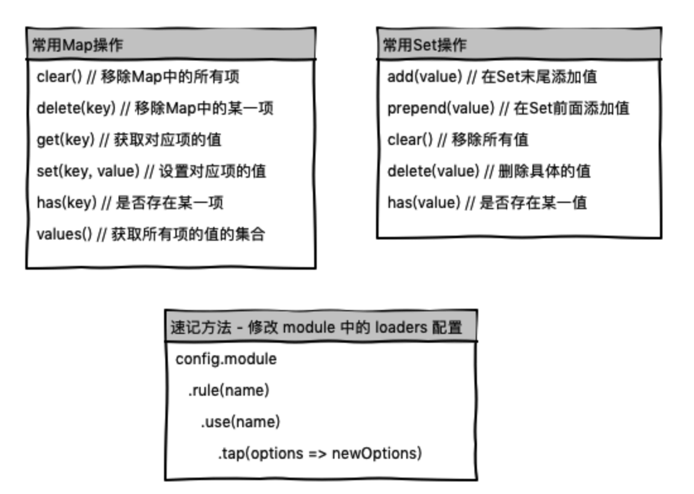

&nbsp;

### configureWebpack

除了上述使用 `chainWebpack` 来改变 `webpack` 内部配置外，我们还可以使用 `configureWebpack` 来进行修改。

两者的不同点在于 chainWebpack 是链式修改，而 configureWebpack 更倾向于整体替换和修改。

* 如果这个值是一个对象，则会通过 [webpack-merge](https://github.com/survivejs/webpack-merge) 合并到最终的配置中。

* 如果这个值是一个函数，则会接收被解析的配置作为参数。该函数既可以修改配置并不返回任何东西，也可以返回一个被克隆或合并过的配置版本。

示例代码如下：

```javascript
// vue.config.js
module.exports = {
  ...
  // config 参数为已经解析好的 webpack 配置
  configureWebpack: config => {
    // config.plugins = []; // 这样会直接将 plugins 置空
    // 使用 return 一个对象会通过 webpack-merge 进行合并，plugins 不会置空
    return {
      plugins: []
    }
  }
  ...
}
```

我们可以在项目目录下运行 `vue inspect` 来查看你修改后的 webpack 完整配置，当然你也可以缩小审查范围，比如：

```shell
# 只查看 plugins 的内容
vue inspect plugins
```

&nbsp;

### devServer

`vue.config.js` 还提供了 `devServer` 项用于配置 `webpack-dev-server` 的行为，使得我们可以对本地服务器进行相应配置。

所有 [`webpack-dev-server`](https://webpack.js.org/configuration/dev-server/) 的选项他都支持：

```javascript
// vue.config.js
module.exports = {
  ...
  devServer: {
    open: true, // 是否自动打开浏览器页面
    host: '0.0.0.0', // 指定使用一个 host。默认是 localhost
    port: 8080, // 端口地址
    https: false, // 使用https提供服务
    proxy: null, // string | Object 代理设置
        
    // 提供在服务器内部的其他中间件之前执行自定义中间件的能力
    before: app => {
      // `app` 是一个 express 实例
    }
  }
  ...
}
```


以上是 `vue.config.js` 中一些常用的配置项功能，更多大家可以参考 [`vue.config.js`](https://cli.vuejs.org/zh/config/)。


上面我们提到了可以通过 `vue inspect` 查看 `webpack` 的完整配置，我们还可以通过可视化工具来查看 `Vue CLI` 默认的插件配置，以及他们的用处，我们可以如下图进行操作：

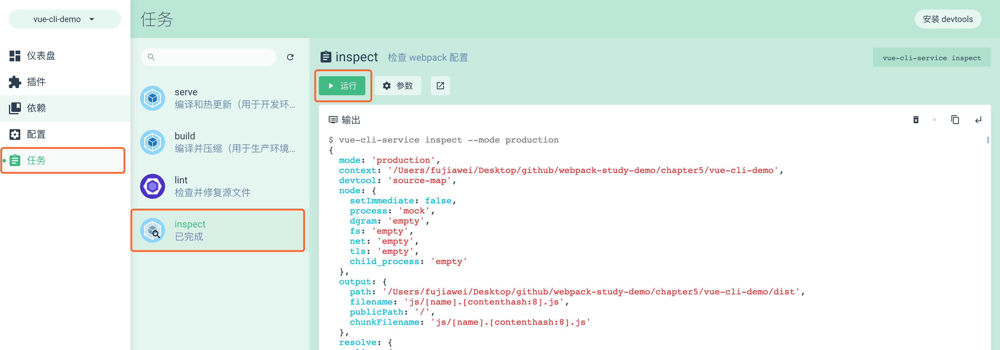

我们可以从配置项中找到 `plugins` 数组，其包含了如下插件（配置项已经省略，增加了定义插件的代码）：

```javascript
// vue-loader是 webpack 的加载器，允许你以单文件组件的格式编写 Vue 组件
const VueLoaderPlugin = require('vue-loader/lib/plugin');

// webpack 内置插件，用于创建在编译时可以配置的全局常量
const { DefinePlugin } = require('webpack');

// 用于强制所有模块的完整路径必需与磁盘上实际路径的确切大小写相匹配
const CaseSensitivePathsPlugin = require('case-sensitive-paths-webpack-plugin');

// 识别某些类型的 webpack 错误并整理，以提供开发人员更好的体验。
const FriendlyErrorsPlugin = require('friendly-errors-webpack-plugin');

// 将 CSS 提取到单独的文件中，为每个包含 CSS 的 JS 文件创建一个 CSS 文件
const MiniCssExtractPlugin = require("mini-css-extract-plugin");

// 用于在 webpack 构建期间优化、最小化 CSS文件
const OptimizeCssnanoPlugin = require('optimize-css-assets-webpack-plugin');

// webpack 内置插件，用于根据模块的相对路径生成 hash 作为模块 id, 一般用于生产环境
const { HashedModuleIdsPlugin } = require('webpack');

// 用于根据模板或使用加载器生成 HTML 文件
const HtmlWebpackPlugin = require('html-webpack-plugin');

// 用于在使用 html-webpack-plugin 生成的 html 中添加 <link rel ='preload'> 或 <link rel ='prefetch'>，有助于异步加载
const PreloadPlugin = require('preload-webpack-plugin');

// 用于将单个文件或整个目录复制到构建目录
const CopyWebpackPlugin = require('copy-webpack-plugin');

module.exports = {
  plugins: [
    /* config.plugin('vue-loader') */
    new VueLoaderPlugin(), 
        
    /* config.plugin('define') */
    new DefinePlugin(),
        
    /* config.plugin('case-sensitive-paths') */
    new CaseSensitivePathsPlugin(),
        
    /* config.plugin('friendly-errors') */
    new FriendlyErrorsWebpackPlugin(),
        
    /* config.plugin('extract-css') */
    new MiniCssExtractPlugin(),
        
    /* config.plugin('optimize-css') */
    new OptimizeCssnanoPlugin(),
        
    /* config.plugin('hash-module-ids') */
    new HashedModuleIdsPlugin(),
        
    /* config.plugin('html') */
    new HtmlWebpackPlugin(),
        
    /* config.plugin('preload') */
    new PreloadPlugin(),
        
    /* config.plugin('copy') */
    new CopyWebpackPlugin()
  ]
}
```

我们可以看到每个插件上方都添加了使用 `chainWebpack` 访问的方式，同时我也添加了每个插件相应的用途注释。


## `env` 文件与环境设置

### 配置文件

与 `create-react-app` 的 `env.js` 一样，我们同样可以在项目根目录中创建以下形式的文件进行不同环境下变量的配置：

```
.env                # 在所有的环境中被载入
.env.local          # 在所有的环境中被载入，但会被 git 忽略
.env.[mode]         # 只在指定的模式中被载入
.env.[mode].local   # 只在指定的模式中被载入，但会被 git 忽略
```

`npm run serve` 的默认环境是 `development`；`npm run build` 的默认环境是 `production`；

我们在 `vue.config.js` 中打印出项目的 `NODE_ENV`：

```javascript
// vue.config.js

console.log(process.env.NODE_ENV); // 在终端会输出 development
console.log(process.env.VUE_APP_TITLE); // 在终端会输出 undefined
```

我们可以在项目根目录中创建 `.env.development.local`，我们可以添加一个 `VUE_APP_TITLE`：

```
NODE_ENV=development
VUE_APP_TITLE=development mode
```

重新运行 `npm run server`，我们可以看到在终端中  `VUE_APP_TITLE` 会输出 `development mode`：

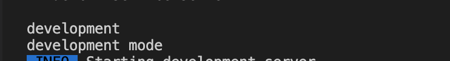

和 `create-react-app` 一样，环境文件的权重如下：

```
.env.[mode].local > .env.[mode] > .env.local > .env 
```

但是需要注意的是，除了相同配置项权重大的覆盖小的，不同配置项它们会进行合并操作，类似于 `javascript` 中的 `Object.assign` 的用法。

> 如果我们需要更改环境 `mode` 为 `stage`，则需要相应的 `scripts` 命令下增加相应的 `mode`
>
> ```json
> "scripts": {
>     "serve": "vue-cli-service serve --mode stage",
> }
> ```

&nbsp;

### 环境注入

和 `create-react-app` 一样，我们可以通过 `webpack.DefinePlugin` 插件将环境变量注入到 `js` 代码之中，其实就只在 `vue` 前端代码中使用 `process.env` 相关变量：

```javascript
// webpack 配置
{
  ...
  plugins: [
    new webpack.DefinePlugin({
      'process.env': {
        NODE_ENV: JSON.stringify(process.env.NODE_ENV)
      }
    }),
  ],
  ...
}
```

我们可以通过这个方式来引入，但是 `Vue CLI` 中已经帮助我们完成了这个任务，我们可以直接在 `src/main.js` 下打印出来 `process.env` 看一看：

```javascript
import Vue from 'vue'
import App from './App.vue'

Vue.config.productionTip = false

console.log(process.env);

new Vue({
  render: h => h(App),
}).$mount('#app')
```

我们可以得到如下图所示：

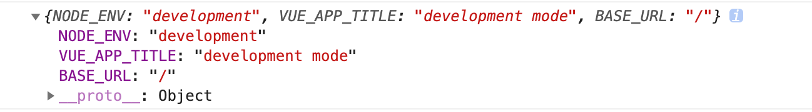

这里跟 `create-react-app` 只有 `REACT_APP_` 开头的变量才能注入一样，`Vue CLI` 中也是仅支持注入环境配置文件中以 `VUE_APP_` 开头的变量，而 `NODE_ENV` 和 `BASE_URL` 这两个特殊变量除外。

比如我们在 `.env.development.local` 中新增 `NAME=vue` 字段：

```
NODE_ENV=development
VUE_APP_TITLE=development mode
NAME=vue
```

我们尝试在 `vue.config.js` 中打印 `process.env`，打印出如下图所示：

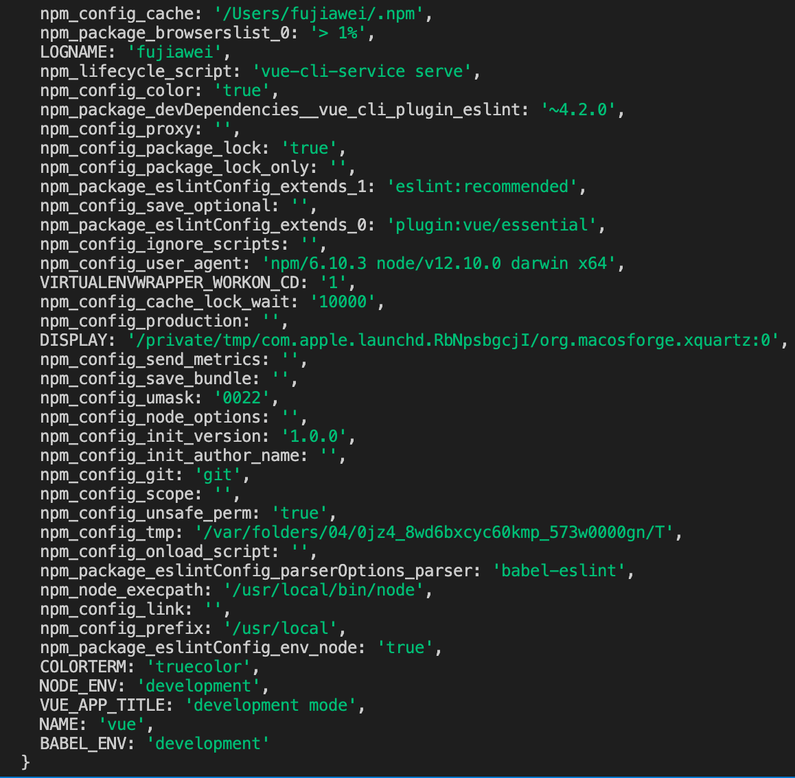

但是在入口文件 `main.js` 中还是没有 `NAME`：


&nbsp;

### 额外配置

以上我们通过新建配置文件的方式为项目不同环境配置不同的变量值，能够实现项目基本的环境管理，但是 `.env` 这样的配置文件中的参数目前只支持静态值，无法使用动态参数。

在某些情况下无法实现特定需求，这时候我们可以在根目录下新建 `config` 文件夹用于存放一些额外的配置文件。

```javascript
/* 配置文件 index.js */

// 公共变量
const com = {
  IP: JSON.stringify('xxx')
};

module.exports = {
  // 开发环境变量
  dev: {
    env: {
      TYPE: JSON.stringify('dev'),
      ...com
    }
  },
  
  // 生产环境变量
  build: {
    env: {
      TYPE: JSON.stringify('prod'),
      ...com
    }
  }
}
```

上方代码我们把环境变量分为了公共变量、开发环境变量和生产环境变量，当然这些变量可能是动态的，比如用户的 `ip` 等。现在我们要在 `vue.config.js` 里注入这些变量，我们可以使用 `chainWebpack` 修改 `DefinePlugin` 中的值：

```javascript
/* vue.config.js */
const configs = require('./config');

// 用于做相应的 merge 处理
const merge = require('webpack-merge');

// 根据环境判断使用哪份配置
const cfg = process.env.NODE_ENV === 'production' ? configs.build.env : configs.dev.env;

module.exports = {
  ...
  chainWebpack: config => {
    config.plugin('define')
      .tap(args => {
        let name = 'process.env';
        // 使用 merge 保证原始值不变
        args[0][name] = merge(args[0][name], cfg);
        return args
    })
  },
  ...
}
```

这个时候在 `main.js` 中我们就可以得到对应的 `Type` 和 `ip` 了：

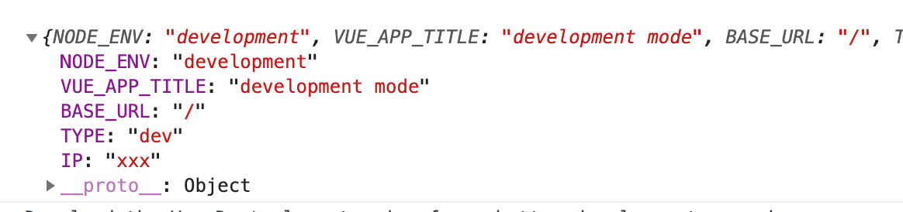

&nbsp;

### 移动端场景

比如在非线上环境我们需要给自己的移动端项目开启 [vConsole](https://github.com/Tencent/vConsole) 调试，但是在线上环境肯定不需要开启这一功能，我们可以在入口文件中进行设置，代码如下：

首先安装 `vconsole`：

```shell
npm install vconsole -D
```

在 `main.js` 中使用：

```javascript
import Vue from 'vue'
import App from './App.vue'
import VConsole from 'vconsole';

Vue.config.productionTip = false

// 如果是非正式环境，加载 VConsole
if (process.env.NODE_ENV !== 'production') {
  var vConsole = new VConsole();
}

Vue.use(vConsole)

console.log(process.env);

new Vue({
  render: h => h(App),
}).$mount('#app')
```

接着我们就可以手机端查看相应的 `console` 代码了：

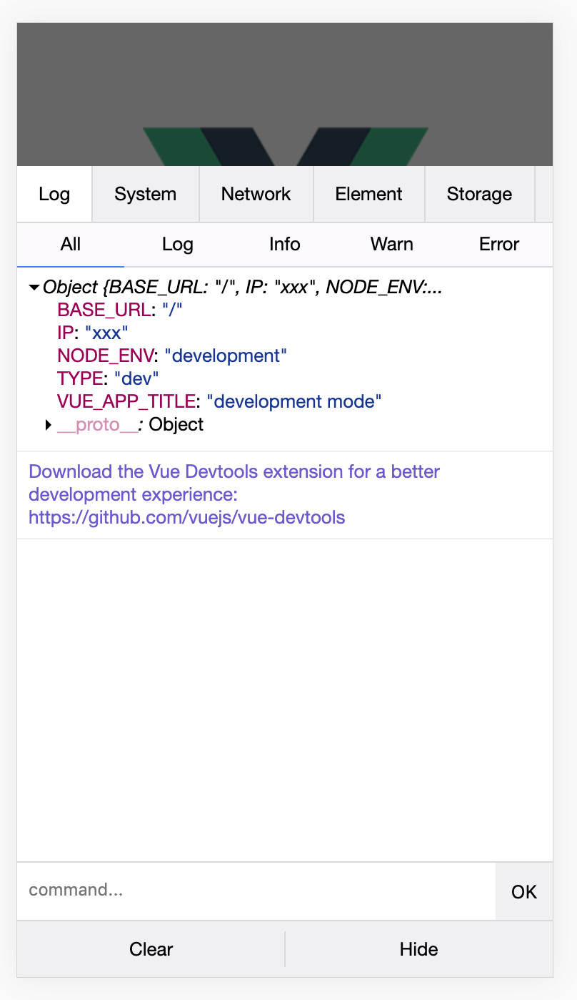

&nbsp;

## 一些说明

这篇文章主要是讲解了 `Vue CLI` 的一些基本的配置内容，更详细的资料大家可以参考 [Vue Cli 官网](https://cli.vuejs.org/zh/guide/)。

其中这篇文章配置方面的内容基本上是参考了 [掘金小册——Vue 项目构建与开发入门](https://juejin.im/book/5b23a5aef265da59716fda09/section/5b23b233f265da599911422a#heading-1) 的内容，作者写的很清晰易懂，笔者就把这方面的内容搬了过来。

&nbsp;

## 相关链接

- [Vue Cli 官网](https://cli.vuejs.org/zh/guide/)
- [Vue Cli 官网 Webpack 配置]([https://cli.vuejs.org/zh/guide/webpack.html#%E7%AE%80%E5%8D%95%E7%9A%84%E9%85%8D%E7%BD%AE%E6%96%B9%E5%BC%8F](https://cli.vuejs.org/zh/guide/webpack.html#简单的配置方式))
- [Vue 项目构建与开发入门 掘金小册](https://juejin.im/book/5b23a5aef265da59716fda09/section/5b23b233f265da599911422a#heading-1)

&nbsp;

## 示例代码

示例代码可以看这里：

- [Vue CLI 中的 Webpack 配置](https://github.com/darrell0904/webpack-study-demo/tree/master/chapter5/vue-cli-demo)