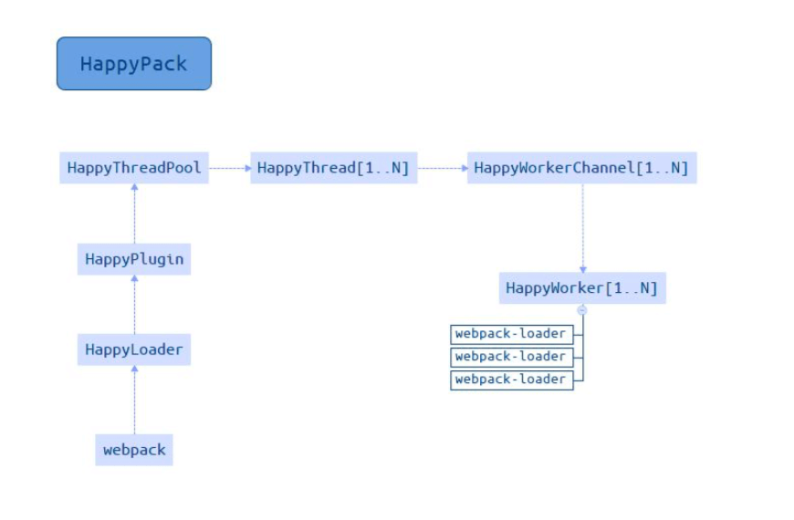
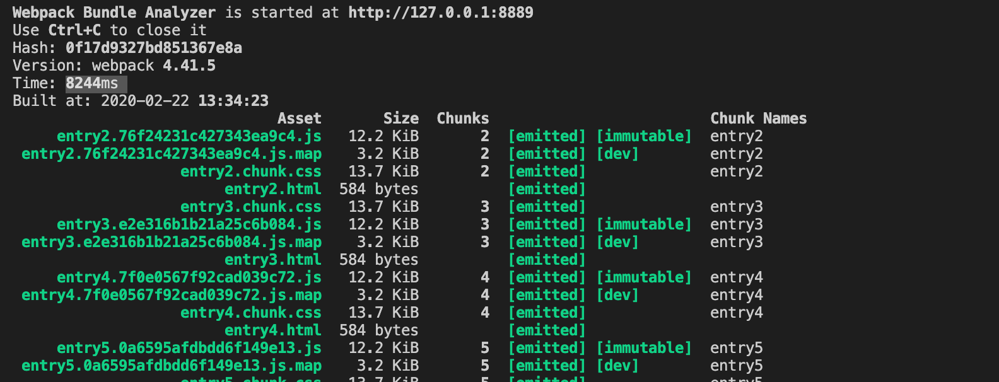
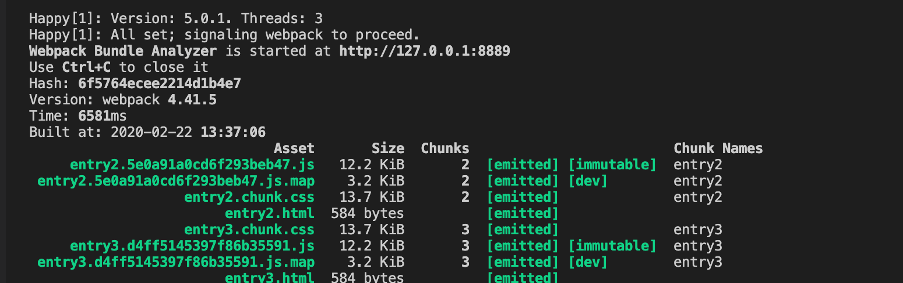
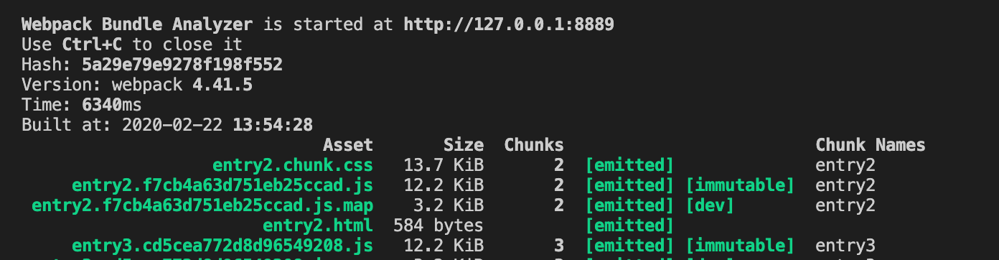

# 使用多进程打包

实现的方案我们在上一节已经讲过了，这一节我们来讲一下怎么使用 `HappyPack` 和 `thread-loader`。

&nbsp;

## `HappyPack`

原理：每次 `webapck` 解析一个模块，`HappyPack` 会将它及它的依赖分配给 `worker` 线程中。处理完成之后，再将处理好的资源返回给 `HappyPack` 的主进程，从而加快打包速度。



在 `webpack4.0` 中使用 `happypack` 需要使用其 `5.0` 版本。

### 安装

```shell
npm install happypack -D
```

### 使用

我们将 `HappyPack` 引入公共配置文件，他的用法就是将相应的 `loader` 替换成 `happypack/loader`，同时将替换的 `loader` 放入其插件的 `loaders` 选项，我们暂且替换一下 `babel-loader`：

```javascript
...
const makePlugins = (configs) => {
  const plugins = [
    ...
    new HappyPack({
      loaders: [ 'babel-loader' ]
    }),
  ];
  ...
  return plugins;
}
...

const commonConfig = {
  entry: {
    main: "./src/index.js",
    entry2: "./src/entry2.js",
    entry3: "./src/entry3.js",
    entry4: "./src/entry4.js",
    entry5: "./src/entry5.js",
    entry6: "./src/entry6.js",
  },
  ...
  module: {
    rules: [{ 
      test: /\.jsx?$/, 
      // exclude: /node_modules/,
      // include: path.resolve(__dirname, '../src'), 
      use: [
        'happypack/loader'
        // 'babel-loader'
      ]
    }]
  },
  ...
}

commonConfig.plugins = makePlugins(commonConfig);
```

为了让效果更加明显一点，我们在项目下多增加几个入口文件，在不使用 `happypack` 的情况下，进行一次打包，时间差不多是 `8s` 多：



开启 `happypack` 之后，我们可以从控制台中看到，`happypack` 默认帮我们开启了 `3` 个进程，打包时间变成了`6.5s` 左右：



> 注意：`HappyPack` 的作者现在基本上也不维护这个插件了，说是对此项目的兴趣正在减弱。他也推荐我们使用 `webpack` 官方 [`thread-loader`](https://github.com/webpack-contrib/thread-loader)。

更多参数大家可以参考 [HappyPack 官网](https://github.com/amireh/happypack)

&nbsp;

## `thread-loader`

`webpack` 官方推出的一个多进程方案，用来替代 `HappyPack`。

原理和 `HappyPack` 类似，也是每次 `webpack` 解析一个模块，`thread- loader` 会将它及它的依赖分配给 `worker` 线程中，从而达到多进程打包的目的。

### 安装

```shell
npm install thread-loader -D
```

### 使用

使用很简单，直接在我们使用的 `loader` 之前加上 `thread-loader` 就行，我们需要先注释掉 `HappyPack` 代码：

```javascript
...
const commonConfig = {
  ...
  module: {
    rules: [{ 
      test: /\.jsx?$/, 
      // exclude: /node_modules/,
      // include: path.resolve(__dirname, '../src'), 
      use: [
        {
          loader: 'thread-loader',
          options: {
            workers: 3, // 开启几个 worker 进程来处理打包，默认是 os.cpus().length - 1
          }
        },
        'babel-loader'
      ]
    }]
  },
  ...
}

commonConfig.plugins = makePlugins(commonConfig);

...
```

我们重新运行一下，也是差不多 `6.5s` 左右：

 

更多参数大家可以参考 [thread-loader 官网](https://github.com/webpack-contrib/thread-loader)。

&nbsp;

## 多进程/多示例 压缩

有的时候我们构建会在 `80%` 多的地方卡住，这是因为压缩代码会占用大量的 `cpu` 资源。所以我们也可以使用 **多进程/多实例** 来处理压缩。

### 方案一

使用 [`webpack-parallel-uglify-plugin`](https://github.com/gdborton/webpack-parallel-uglify-plugin) 插件来帮我们完成，我们可以传递一些参数进去，然后完成多进程压缩代码。

```javascript
import ParallelUglifyPlugin from 'webpack-parallel-uglify-plugin';

module.exports = {
  plugins: [
    new ParallelUglifyPlugin({
      uglifyJS: {
        output: {
          beautify: false,
          comments: false,
        },
        compress: {
          warnings: false,
          drop_console: true,
          collapse_vars: true,
          reduce_vars: true,
        }
      },
    }),
  ],
};
```

&nbsp;

### 方案二

使用 [`uglifyjs-webpack-plugin`](https://github.com/webpack-contrib/uglifyjs-webpack-plugin)，并开启 `parallel` 参数，之前的 `webpack` 版本推荐使用这个插件来对代码进行压缩，现在 `webpack4.0` 之后默认使用是 [`terser-webpack-plugin`](https://github.com/webpack-contrib/terser-webpack-plugin)。

 两者的区别是前者不支持 `es6` 代码的压缩，后者是支持的。

```javascript
const UglifyJsPlugin = require('uglifyjs-webpack-plugin');
...
const plugins = [
  ...
  new UglifyJsPlugin({
    uglifyOptions: {
      warnings: false,
      parse: {},
      compress: {},
      mangle: true, // Note `mangle.properties` is `false` by default.
      output: null,
      toplevel: false,
      nameCache: null,
      ie8: false,
      keep_fnames: false,
    },
    parallel: true,
  }),
];
...
```

&nbsp;

### `方案三`

使用  [`terser-webpack-plugin`](https://github.com/webpack-contrib/terser-webpack-plugin)，并开启 `parallel` 参数。

```javascript
const TerserPlugin = require('terser-webpack-plugin');
...
const commonConfig = {
  ...
  optimization: {
    minimize: true,
    minimizer: [
      new TerserPlugin({
        parallel: 4, // 开启几个进程来处理压缩，默认是 os.cpus().length - 1
      }),
    ],
  },
  ...
}
```

大家可以在项目中打包一下，看看打包时长，笔者在这里就不展示相应的时间了，因为案例本身比较小，时间有可能存在不准的情况。

&nbsp;

## 相关链接

- [Webpack 官网 thread-loader](https://webpack.js.org/loaders/thread-loader/)
- [happypack](https://github.com/amireh/happypack)
- [parallel-webpack](https://github.com/trivago/parallel-webpack)
- [使用 happypack 提升 Webpack 项目构建速度](https://blog.csdn.net/zgd826237710/article/details/88172290)

&nbsp;

## 示例代码

示例代码可以看这里：

- [性能优化  示例代码](https://github.com/darrell0904/webpack-study-demo/tree/master/chapter6/performance-demo)