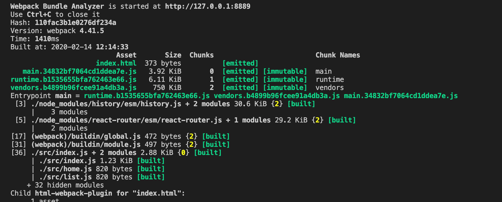
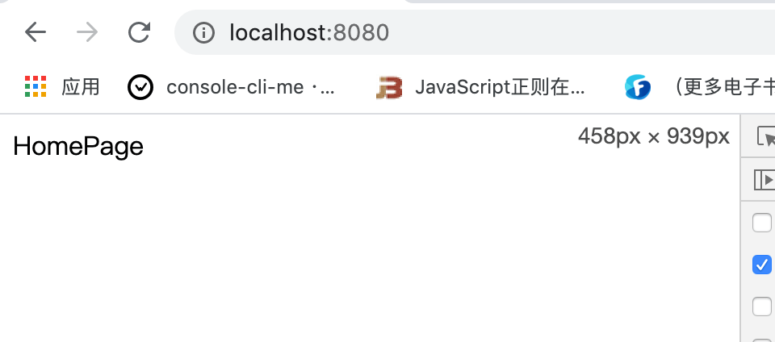
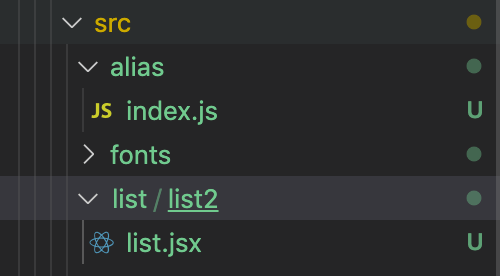
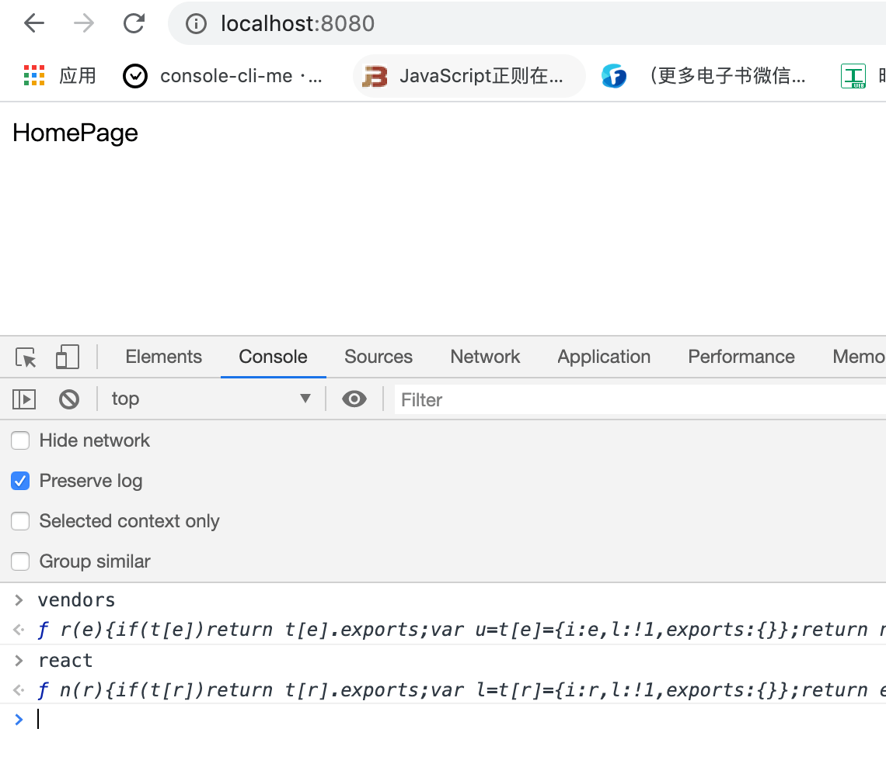
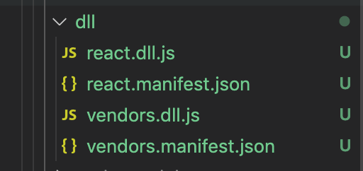
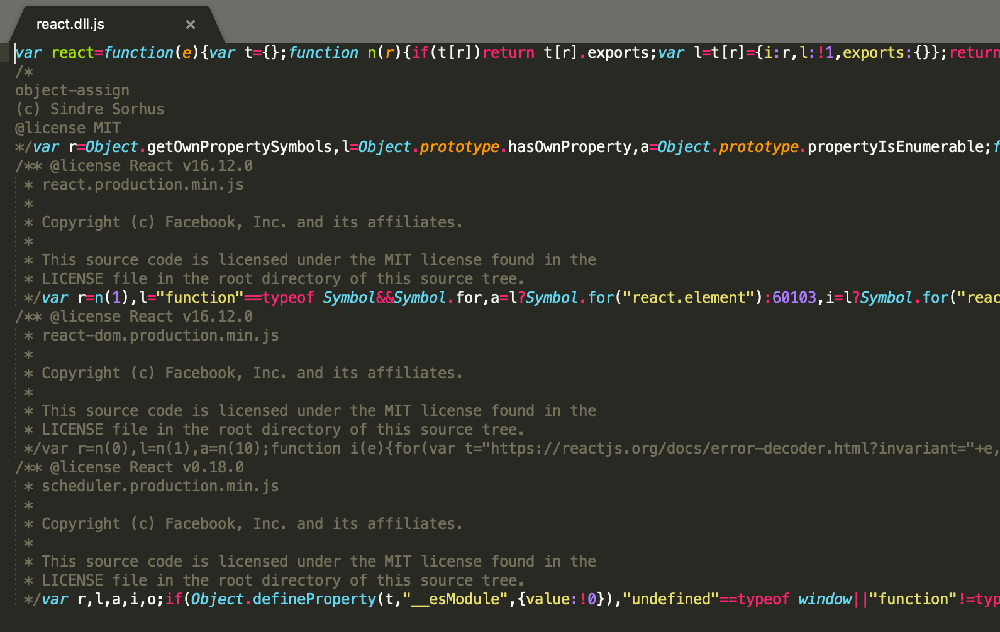
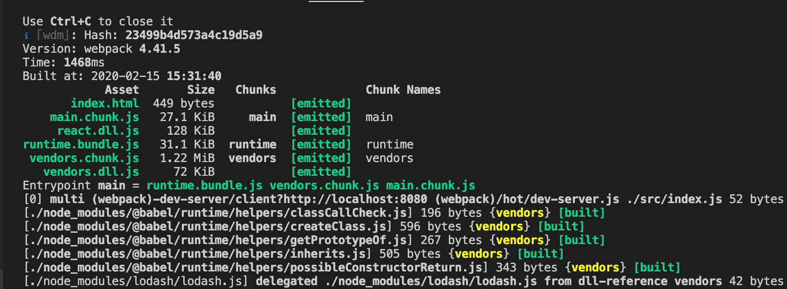

# Webpack 性能优化

## 更新版本（Node、Npm、Yarn）

每一个版本的更新，`Webpack` 内部肯定会做很多优化，而 `Webpack` 是依赖 `Node` 的 `js` 运行环境，升级他们对应的版本，`Webpack` 的速度肯定也能够获得提升。

新版本的包管理工具（`Npm`、`Yarn`）可以更快的帮助我们分析一些包的依赖和引入，从而提高打包速度。

所以在项目上尽可能使用比较新的 `Webpack`、`Node`、`Npm`、`Yarn` 版本，是我们提升打包速度的第一步。

&nbsp;

## 在尽可能少的模块上应用 `Loader`

使用 `loader` 的时候，我们需要在尽量少的模块中去使用。

我们可以借助 `include` 和 `exclude` 这两个参数，规定 `loader` 只在那些模块应用和在哪些模块不应用。

我们修改公共配置文件 `webpack.common.js`：

```javascript
...
const commonConfig = {
  ...
  module: {
    rules: [
      { 
        test: /\.js|jsx$/, 
        // exclude: /node_modules/,
        // include: path.resolve(__dirname, '../src'), 
        use: ['babel-loader']
      },
      ...
    ]
  },
}
...
```

首先我们不加 `exclude` 和 `include` 两个参数，打包一下 `npm run build`，打包时间 `3350ms` 左右：


接着我们加上这两个参数，意思分别是：

* `exclude: /node_modules/`：排除 `node_modules` 下面的文件
* `include: path.resolve(__dirname, '../src')`：只对 `src` 下面的文件使用

重新打包一下，打包时间变成了 `1400ms` 左右：




所以我们在打包的过程中要合理的使用这两个配置参数，从而提高我们的打包速度。

&nbsp;

## `Plugin` 尽可能精简并确保可靠

我们举个简单的例子，我们需要对线上的 `css` 代码进行压缩，所以我们使用了 `OptimizeCSSAssetsPlugin` 插件帮助我们来压缩 `css` 文件，但是我们在开发环境上实际上是不需要压缩 `css` 代码的，所以我们可以去掉这个配置。

我们修改 `webpack.prod.js`，我们来看看 `OptimizeCSSAssetsPlugin` 的耗时：

```javascript
...

const OptimizeCSSAssetsPlugin = require("optimize-css-assets-webpack-plugin");

...

const prodConfig = {
  ...
  optimization: {
    minimizer: [
      new OptimizeCSSAssetsPlugin({})
    ]
  },
  ...
}
...

```

使用此插件在开发环境打包 `npm run build`，打包时间是 `2480ms` 左右，


当我们去掉此插件的耗时差不多是 `2250ms` 左右：


因为我们测试代码中的 `less` 代码比较少，所以时间页差的不是特别多，但是能肯定的是，使用插件肯定会减缓打包速度的。


所以我们尽量使用 `webpack` 官网上推荐的一些插件，因为这些插件肯定是经过官方测试过的，是比较快的。

其次尽量使用在社区里验证过的性能比较好的插件。因为当我们自己写一些插件或者使用第三方公司提供的插件，虽然它能帮我们解决某些问题，但是可能性能上会得不到保证。


&nbsp;

## `resolve` 参数合理配置

我们先来举几个例子：

### `extensions`

我们新建一个 `list` 目录，创建 `list.jsx` 文件：

```javascript
import React, { Component } from 'react';

class List extends Component {
  render() {
    return <div>ListPage</div>;
  }
}

export default List;

```

如果我们想在 `index.js` 中使用名字引入，不写 `jsx` 后缀：

```javascript
...
import List from './list/list';
...
```

我们先修改 `webpack.common.js` 文件，让 `jsx` 文件能被 `babel-loader` 进行处理：

```javascript
...

const commonConfig = {
  ...
  module: {
    rules: [
      { 
        test: /\.jsx?$/, 
        exclude: /node_modules/,
        include: path.resolve(__dirname, '../src'), 
        use: ['babel-loader']
      }
    ]
  },
  ...
}

...
```

接着我们打包一下 `npm run dev`，会报一个错误，说是 `list` 找不到


这个时候我们可以在配置文件中增加 `resolve` 参数，增加一个 `extensions` 属性，我们配置 `['.js', '.jsx']`，意思是我们会先去找指定目录下面以 `.js` 结尾的文件，再去找 `.jsx` 结尾的文件，如果还是找不到就返回找不到。

```javascript
...

const commonConfig = {
  ...
  resolve: {
    extensions: ['.js', '.jsx'],
  },
  ...
}

...
```

现在重新打包一下，就可以打包成功了：



但是这里我们要尽量少配置，因为如果配置多了，我们把诸如 `css`、`jpg` 结尾的都配置进去了，这会调用多次文件的查找，这样就会减慢打包速度。

&nbsp;

### `mainFiles`

如果我们想在 `index.js` 中直接使用下面这种引用方式进行引用：

```javascript
import List from './list';
```

我们可以在 `resolve` 下在增加一个 `mainFiles` 参数，表示直接引用这个目录的时候，就会先默认查找 `index` 为名字的文件、没找到的话接着查找 `list` 为名字的文件。

```javascript
...

const commonConfig = {
  ...
  resolve: {
    extensions: ['.js', '.jsx'],
    mainFiles: ['index', 'list']
  },
  ...
}

...
```

现在重新打包一下，就可以打包成功了：


不过这个参数基本上我们不用配置，直接使用默认参数，即 `index`。


&nbsp;

### `alias`

**别名**，我们在 `list` 目录下在新建一个 `list2` 目录，并将 `list.jsx` 放到 `list2` 下，同时我们新建一个 `alias` 目录，里面新建一个 `index.js` 文件：

```javascript
// alias/index.js

export default '我是 alias 的 demo';
```




如果在 `list.jsx` 中使用 `alias/index.js` 的文件，正常情况下我们需要使用相对路径：

```javascript
// 正常情况下
import aliasText from '../../alias';
```

如果我们想要这样引入：

```javascript
import aliasText from 'alias';
```

我们就需要给 `alias` 这个目录配置一个别名：

```javascript
...

const commonConfig = {
  ...
  resolve: {
    extensions: ['.js', '.jsx'],
    mainFiles: ['index', 'list'],
    alias: {
      alias: path.resolve(__dirname, '../src/alias'),
    }
  },
  ...
}

...
```

我们给 `alias` 这个目录配置了一个别名，当其他地方使用 `import *** from 'alias'` 导入的时候，就会自动到我们配置的路径中去找。

我们打包一下，可以发现打包成功了：


虽然 `resolve` 比较好用，但是我们也要合理去使用，不能一股脑儿的把所有的后缀都往 `extensions` 里面去塞。

&nbsp;

## 使用 `DllPlugin` 提高打包速度

我们在打包的时候，一般来说第三方模块是不会变化的，所以我们想只要在第一次打包的时候去打包一下第三方模块，并将第三方模块打包到一个特定的文件中，当第二次 `webpack` 进行打包的时候，就不需要去 `node_modules` 中去引入第三方模块，而是直接使用我们第一次打包的第三方模块的文件就行，这样就能加快 `webpack` 的打包速度。

### 添加配置文件

我们在配置文件目录 `config` 下新建一个 `webpack.dll.js`，此文件用于将我们的第三方包文件打包到 `dll` 文件夹中去：

```javascript
const path = require('path');
const webpack = require('webpack');

module.exports = {
  mode: 'production', // 环境
  entry: {
    vendors: ['lodash'], // 将 lodash 打包到 vendors.js 下
    react: ['react', 'react-dom'], // 将 react 和 react-dom 打包到 react.js 下
  },
  output: {
    filename: '[name].dll.js', // 输出的名字
    path: path.resolve(__dirname, '../dll'), // 输出的文件目录
    library: '[name]' // 将我们打包出来的文件以全部变量的形式暴露，可以在浏览器变量的名字进行访问
  },
  plugins: [
    // 对生成的库文件进行分析，生成库文件与业务文件的映射关系，将结果放在 mainfest.json 文件中
    new webpack.DllPlugin({
      name: '[name]', // 和上面的 library 输出的名字要相同
      path: path.resolve(__dirname, '../dll/[name].manifest.json'),
    })
  ]
}
```

* 上面的 `library` 的意思其实就是将 `dll` 文件以一个全局变量的形式导出出去，便于接下来引用，如下图：



* `mainfest.json` 文件是一个映射关系，它的作用就是帮助 `webpack` 使用我们之前打包好的 `***.dll.js` 文件，而不是重新再去 `node_modules` 中去寻找。


接着我们在 `package.json` 的 `scripts` 下在增加一个命令：

```json
"scripts": {
  ...
  "build:dll": "webpack --config ./config/webpack.dll.js",
  ...
},
```

我们在命令行中打包一下 `dll` 文件 `npm run build:dll` 目录，我们可以看到根目录生成了一个 `dll` 文件夹，并且在下面生成了相应的文件，并且 `loader` 打包到了 `vendor.dll.js` 中，`react` 和 `react-dom` 打包到了 `react.dll.js` 中了：







接着我们需要去修改公共配置文件 `webpack.common.js`，将我们之前生成的 `dll` 文件导入到 `html` 中去，我们可以在借助一个插件 `add-asset-html-webpack-plugin`，此插件顾名思义，就是将一些文件加到 `html` 中去。同时我们可以是使用 `webpack` 自带的 `DllReferencePlugin` 文件对 `mainfest.json` 映射文件进行分析。

我们安装一下：

```javascript
npm install add-asset-html-webpack-plugin -D
```

使用此插件：

```javascript
const webpack = require('webpack');
const AddAssetHtmlWebpackPlugin = require('add-asset-html-webpack-plugin');

...

const commonConfig = {
  ...
  plugins: [
    ...
    new AddAssetHtmlWebpackPlugin({
      filepath: path.resolve(__dirname, '../dll/vendors.dll.js')
    }),
    new AddAssetHtmlWebpackPlugin({
      filepath: path.resolve(__dirname, '../dll/react.dll.js')
    }),
    new webpack.DllReferencePlugin({
      manifest: path.resolve(__dirname, '../dll/vendors.dll.mainfest.json')
    }),
    new webpack.DllReferencePlugin({
      manifest: path.resolve(__dirname, '../dll/react.dll.mainfest.json')
    }),
  ],
  ...
}

...
```

我们进行一次打包，可以看到打包耗时为 `1450ms` 左右：



我们注释掉对 `dll` 的引用分析之后，重新打包，打包耗时为 `1950ms` 左右：


因此我们可以看到 `dll` 对的打包的速度提升还是很明显的。

&nbsp;

### 一些优化

当我们在 `webpack.dll.js` 中在增加了一个入口文件 `jquery` 文件，我们就需要在在 `webpack.common.js` 在引入两个插件：

```javascript
...
new webpack.DllReferencePlugin({
  manifest: path.resolve(__dirname, '../dll/jquery.dll.js')
}),
  new webpack.DllReferencePlugin({
  manifest: path.resolve(__dirname, '../dll/jquery.dll.mainfest.json')
}),
...
```

这样就很麻烦，所以我们可以写一个方法自动去分析入口，帮我们引入这个入口生成的 `dll` 文件所需的 `plugins`，我们可以修改 `webpack.common.js`，我们定义一个数组变量 `plugins`，并将只用到一次的插件挪进去，接着通过 `node` 的 `fs` 模块去遍历 `dll` 目录下面的文件，并进行引入。

```javascript
...
const fs = require('fs');
...

const plugins = [
  new CleanWebpackPlugin(),
  new HtmlWebpackPlugin({
    template: 'src/index.html',
  }),
  new BundleAnalyzerPlugin({
    analyzerHost: '127.0.0.1',
    analyzerPort: 8889,
    openAnalyzer: false,
  }),
];

const files = fs.readdirSync(path.resolve(__dirname, '../dll'));

files.forEach(file => {
  if(/.*\.dll.js/.test(file)) {
    plugins.push(new AddAssetHtmlWebpackPlugin({
      filepath: path.resolve(__dirname, '../dll', file)
    }))
  }
  if(/.*\.manifest.json/.test(file)) {
    plugins.push(new webpack.DllReferencePlugin({
      manifest: path.resolve(__dirname, '../dll', file)
    }))
  }
})

...

const commonConfig = {
  ...
  plugins,
  ...
}
...
```

这样当我们无论在新加几个变量，就都不需要重复的再去手动去引入了。


回顾一下，当 `webpack` 打包引入第三方模块的时候，每一次引入，它都会去从 `node_modules` 中去分析，这样肯定会影响 `webpack` 打包的一些性能，如果我们能在第一次打包的时候就生成一个第三方打包文件，在接下去的过程中应用第三方文件的时候，就直接使用这个文件，这样就会提高 `webpack` 的打包速度。这就是 `DllPlugin` 的作用。


&nbsp;

## 控制包文件大小

有的时候当我们写代码的时候，经常会使用一些再页面中没用用的模块，或者没有使用到的模块，这样便会在打包过程中出现很多冗余的代码，这样便会拖累 `webpack` 的打包速度。

所以如果我们在项目中没有使用到的代码，我们需要通过 `tree-shaking` 把这些代码去掉，或者直接去掉就行；或者我们也可以使用 `splitChunksPlugin` 把一个大的文件分割成几个小的文件，这样也可以有效的提升 `webpack` 的打包速度。

&nbsp;

## `thread-loader`、`parallel-webpack`、`happypack` 多进程打包

由于运行在 `Node.js` 之上的 `Webpack` 是单线程模型的，所以 `Webpack` 需要处理的事情需要一件一件的做，不能多件事一起做。

我们需要 `Webpack`  能同一时间处理多个任务，发挥多核 `CPU` 电脑的威力，由于 `javaScript` 是单线程模型，要想发挥多核 `CPU` 的能力，只能通过多进程去实现，而无法通过多线程实现。

这就需要借助我们上面提到的几个工具，这样速度也会提升很多。

详细资料大家可以参考，后续我也会写一篇文章来详细介绍这三者的使用：

* [parallel-webpack](https://github.com/trivago/parallel-webpack)
* [thread-loader](https://webpack.js.org/loaders/thread-loader/)
* [happypack](https://github.com/amireh/happypack)


&nbsp;

## 合理使用 `sourceMap`

之前我们有讲过，之前我们打包生成 `sourceMap` 的时候，如果信息越详细，打包速度就会越慢


所以我们要在代码打包过程中的时候，在对应的环境使用对应的 `sourceMap` 很重要。


&nbsp;

## 合理使用 `stats` 分析打包结果

在之前我们讲过可以使用官方的 `stats.json` 文件帮助我们分析打包结果，或者通过第三方的工具帮助我们分析，我们可以通过分析打包结果，看到那些文件耗时比较多，在对特定的文件进行优化。


&nbsp;

## 开发环境使用内存编译

### 使用内存编译

我们在开发的时候会使用 `webpack-dev-server` 帮助我们进行打包开发，它会把打包文件放在内存中去，不会放到相应的 `dist` 目录下，而内存的读取肯定会比硬盘的读取要快的多。所以这页可以提升 `webpack` 的打包速度。

&nbsp;

### 无用插件剔除

因为在 `webpack4.0` 后，它会根据环境帮助我们做一些环境相关的事情，比如我们将 `mode` 设置为 `production` 的时候，`webpack` 会自动的帮助我们去压缩代码。 压缩的过程必然会耗费一定的时间，所以我们要在开发环境尽量剔除掉一些我们不需要用到的代码，这对 `webpack` 构建速度的提升也会有一定的帮助。


&nbsp;

## 更多

`webpack` 性能优化的方法还会有很多，我们只是列举了一些比较常用的方法，更多的用法需要大家在实践中慢慢去摸索。


&nbsp;

## 相关链接

- [Webpack 官网 DllPlugin](https://webpack.js.org/plugins/dll-plugin/)
- [Webpack 官网 Resolve](https://webpack.js.org/configuration/resolve/)
- [Webpack 官网 thread-loader](https://webpack.js.org/loaders/thread-loader/)
- [happypack](https://github.com/amireh/happypack)
- [parallel-webpack](https://github.com/trivago/parallel-webpack)
- [使用 happypack 提升 Webpack 项目构建速度](https://blog.csdn.net/zgd826237710/article/details/88172290)

&nbsp;

## 示例代码

示例代码可以看这里：

- [性能优化  示例代码](https://github.com/darrell0904/webpack-study-demo/tree/master/chapter3/typescript-demo)


