# Webpack 优化策略

## 更新版本（Node、Npm、Yarn）

每一个版本的更新，`Webpack` 内部肯定会做很多优化，而 `Webpack` 是依赖 `Node` 的 `js` 运行环境，升级他们对应的版本，`Webpack` 的速度肯定也能够获得提升。

新版本的包管理工具（`Npm`、`Yarn`）可以更快的帮助我们分析一些包的依赖和引入，从而提高打包速度。

所以在项目上尽可能使用比较新的 `Webpack`、`Node`、`Npm`、`Yarn` 版本，是我们提升打包速度的第一步。

我们可以看一张对比图：

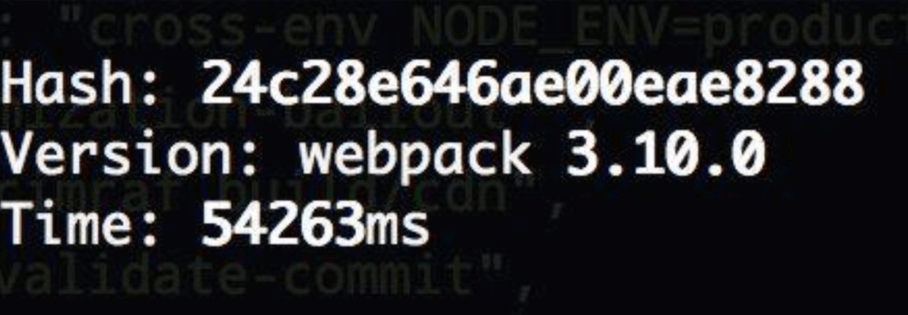

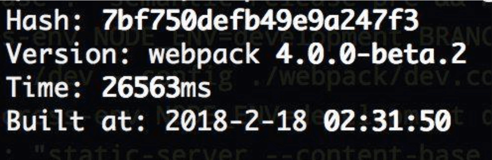

从上图中我们可以看到，`webpack4.0` 的构建速度远远快于 `webpack3.0`，升级之后，构建时间降低了 `60% - 98%` 左右。

&nbsp;

### `webpack4.0` 的优化

* `v8` 引擎带来的优化（`for of` 替代 `forEach`、`Map` 和 `Set` 替代 `Object`、`includes` 替代 `indexOf`）
* 默认使用更快的 `md4 hash` 算法
* `webpack AST` 可以直接从 `loader` 传递给 `AST`，减少解析时间
* 使用字符串方法替代正则表达式

我们可以在 `github` 上的 `webpack` 库的 [`releases` 版本迭代](https://github.com/webpack/webpack/releases?after=v4.4.0)页面中查看其带来的性能优化：


&nbsp;

### 不同 `Node` 版本的例子

#### 安装 `nvm`

首先我们安装[ `nvm`](https://github.com/nvm-sh/nvm/blob/master/README.md)，他是一个 `Node.js` 版本管理工具。也就是说：一个 `nvm` 可以管理很多 `Node` 版本和 npm 版本。

```shell
curl -o- https://raw.githubusercontent.com/nvm-sh/nvm/v0.35.2/install.sh | bash
```

安装完成后需要修改 `.bash_profile` 文件：

我们通过以下命令打开：

```shell
open ~/.bash_profile
```

在文件中加入以下代码：

```shell
export NVM_DIR="$([ -z "${XDG_CONFIG_HOME-}" ] && printf %s "${HOME}/.nvm" || printf %s "${XDG_CONFIG_HOME}/nvm")"
[ -s "$NVM_DIR/nvm.sh" ] && \. "$NVM_DIR/nvm.sh" # This loads nvm
```

接着通过 `source ~/.bash_profile` 保存配置。接着我们在命令行中 `nvm`，出现以下界面说明安装成功：

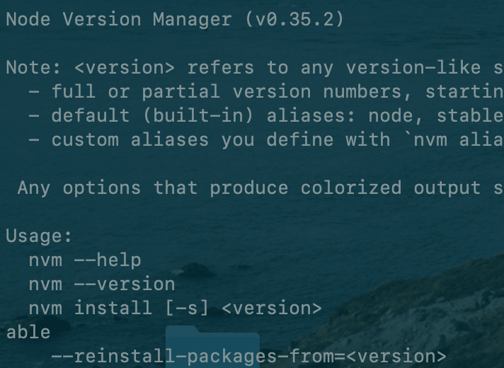

我们通过 `nvm install <version>` 安装三个 `Node` 版本`12.10.0`、`8.9.4`、`6.9.2`，在这三个 `Node` 环境下去测试相关性能，安装完成后，我们可以通过 `nvm ls` 查看版本情况，如下图所示：

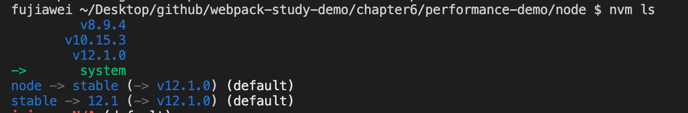

接着我们就可以通过 `nvm use <version>` 来切换对应的 `Node` 版本

&nbsp;

#### 写点代码

##### 代码一

在高版本的 `Node.js` 中，`Map` 速度的提升，我们在项目中新建 `node` 文件夹，创建 `map-preformance.js` 文件，我们在文件中测试 `10000000` 次 `map` 在不同 `Node` 中的运行时间，其中我们通过 [`process.hrtime()`](http://nodejs.cn/api/process/process_hrtime_time.html) 来计算更加精确的时间：

```javascript
'use strict';

const runCount = 100;
const keyCount = 100000;

let map = new Map();
let keys = new Array(keyCount);

for (let i = 0; i < keyCount; i++) keys[i] = {};
for (let key of keys) map.set(key, true);

let startTime = process.hrtime();

for (let i = 0; i < runCount; i++) {
  for (let key of keys) {
    let value = map.get(key);
    if (value !== true) throw new Error();
  }
}

let elapsed = process.hrtime(startTime);

// seconds：s
// nanoseconds：纳s
let [seconds, nanoseconds] = elapsed;

let milliseconds = Math.round(seconds * 1e3 + nanoseconds / 1e6);
console.log(`${process.version} ${milliseconds} ms`);
```

我们在不同 `Node` 中分别运行一下，进入到 `node` 目录，运行 `node map-preformance.js`，下面是几个版本的时间：

* `12.10.0`：`450ms` 左右
* `8.9.4`：`1200 ms - 1300 ms` 左右
* `6.9.2`：`1850 ms` 左右 

从这里我们可以发现，越高版本的 `Node` 对于 `map` 的运行速度就越快。

&nbsp;

##### 代码二

比较 `includes` 和 `indexOf` 这两个函数的性能，我们切换到系统自己的 `Node` 环境，创建 `compare-includes-indexof.js` 文件，在这个文件中建一个 `10000000` 长度的数组，记录两个函数分别消耗的时间：

```javascript
const ARR_SIZE = 10000000;
const hugeArr = new Array(ARR_SIZE).fill(1);

// includes
const includesTest = () => {
  const arrCopy = [];
  console.time('includes')
  let i = 0;
  while (i < hugeArr.length) {
    arrCopy.includes(i++);
  }
  console.timeEnd('includes');
}

// indexOf
const indexOfTest = () => {
  const arrCopy = [];
  console.time('indexOf');
  for (let item of hugeArr) {
    arrCopy.indexOf(item);
  }
  console.timeEnd('indexOf');
}

includesTest();
indexOfTest();
```

我们发现 `includes` 的速度远远快于 `indexOf`：

* `includes`：`12.224ms`
* `indexOf`：`147.638ms`

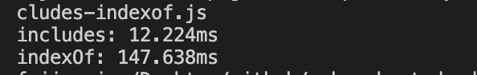


&nbsp;

## 使用 `stats` 分析打包结果

在之前的 **打包分析** 分析一节我们讲过可以使用官方的 `stats.json` 文件帮助我们分析打包结果，或者通过第三方的工具 `webpack-bundle-analyzer` 这个神器帮助我们分析。

我们可以通过分析打包结果，看到那些文件耗时比较多，打包出来的体积比较大，从而对特定的文件进行优化。


&nbsp;

## 分析 `webpack` 的构建速度

我们可以通过 [`speed-measure-webpack-plugin`](https://github.com/stephencookdev/speed-measure-webpack-plugin) 这个插件帮助我们分析整个打包的总耗时，以及每一个`loader` 和每一个 `plugins` 构建所耗费的时间，从而帮助我们快速定位到可以优化 `webpack` 的配置。

官方给出的效果图是下面这样：

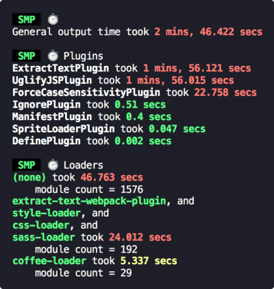

耗时比较长的会以红色标出。

### 安装

```shell
npm install speed-measure-webpack-plugin -D
```

### 使用

> 说明：由于 `speed-measure-webpack-plugin` 对于 `webpack` 的升级还不够完善，目前（就笔者书写本文的时候）还存在一个 BUG，就是无法与你自己编写的挂载在 `html-webpack-plugin` 提供的 `hooks` 上的自定义 `Plugin` （`add-asset-html-webpack-plugin` 就是此类）共存，因此，在你需要打点之前，如果存在这类 `Plugin`，请先移除，否则会产生如我这篇 `issue` 所提到的问题。
>
> github 上的有一个 [issure](https://github.com/stephencookdev/speed-measure-webpack-plugin/issues/92)，但是貌似还没有解决。

我们引入此插件，创建一个实例包裹 `webpack` 配置文件，我们修改一下 `webpack.common.js` 文件：

```javascript
const SpeedMeasurePlugin = require("speed-measure-webpack-plugin");

const smp = new SpeedMeasurePlugin();

...

module.exports = (production) => {
	if (production) {
		const endProdConfig = merge(commonConfig, prodConfig);
		return smp.wrap(endProdConfig);
	} else {
    const endDevConfig = merge(commonConfig, devConfig);
		return smp.wrap(endDevConfig);
	}
};
```

我们执行一下 `npm run build`，可以看到打印出如下效果图：

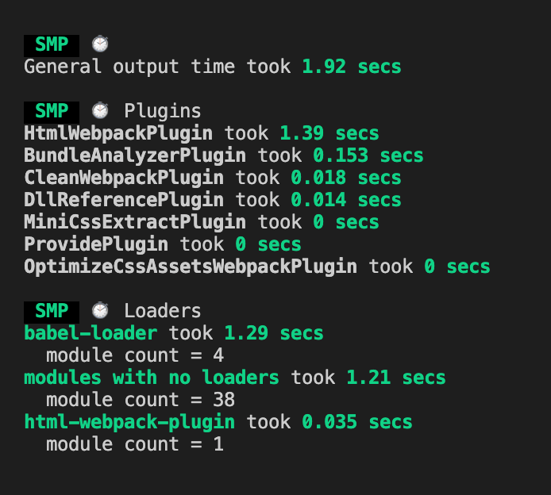

&nbsp;

## `Webpack` 多进程打包

由于运行在 `Node.js` 之上的 `Webpack` 是单线程模型的，所以 `Webpack` 需要处理的事情需要一件一件的做，不能多件事一起做。

如果 `Webpack`  能同一时间处理多个任务，发挥多核 `CPU` 电脑的威力，那么对其打包速度的提升肯定是有很大的作用的。

这就需要借助我们下面几个工具，这样速度也会提升很多。

- [parallel-webpack](https://github.com/trivago/parallel-webpack)
- [thread-loader](https://webpack.js.org/loaders/thread-loader/)
- [happypack](https://github.com/amireh/happypack)

详细的使用案例我会在下一节进行介绍。

&nbsp; 

## 使用 `DllPlugin` 提高打包速度

我们在打包的时候，一般来说第三方模块是不会变化的，所以我们想只要在第一次打包的时候去打包一下第三方模块，并将第三方模块打包到一个特定的文件中，当第二次 `webpack` 进行打包的时候，就不需要去 `node_modules` 中去引入第三方模块，而是直接使用我们第一次打包的第三方模块的文件就行，这样就能加快 `webpack` 的打包速度。

具体的使用案例我会在下面几节进行介绍。


&nbsp;

## 充分利用缓存提升二次构建速度

我们可以开启相应 `loader` 或者 `plugin` 的缓存，来提升二次构建的速度。一般我们可以通过下面几项来完成：

* `babel-loader` 开启缓存
* `terser-webpack-plugin` 开启缓存
* 使用 `cache-loader` 或者 [`hard-source-webpack-plugin`](https://github.com/mzgoddard/hard-source-webpack-plugin)

如果项目中有缓存的话，在 `node_modules` 下会有相应的 `.cache` 目录来存放相应的缓存。

### `babel-loader`

首先我们开启 `babel-loader` 的缓存，我们修改 `babel-loader` 的参数，将参数 `cacheDirectory` 设置为 `true`：

```javascript
...
module: {
  rules: [
    { 
      test: /\.jsx?$/, 
      // exclude: /node_modules/,
      // include: path.resolve(__dirname, '../src'), 
      use: [
        {
          loader: 'babel-loader',
          options: {
            cacheDirectory: true,
          }
        },
      ]
    }, 
  ]
}         
...
```

首次打包时间为 `8.5s` 左右，打包完成之后，我们可以发现在 `node_modules` 下生成了一个 `.cache` 目录，里面存放了 `babel` 的缓存文件：


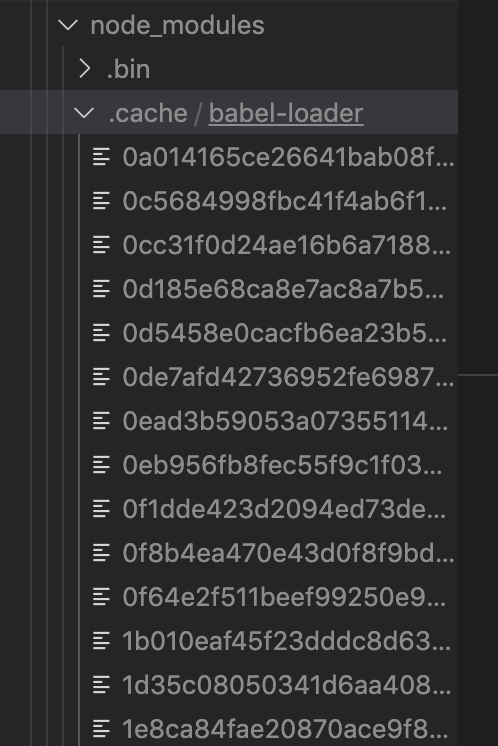

我们重新打包一次，会发现时间变成了 `6s` 左右：

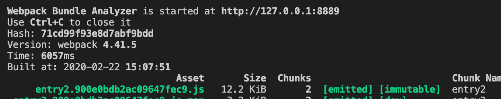

&nbsp;

###`TerserPlugin`

我们通过将 `TerserPlugin` 中的 `cache` 设为 `true`，就可以开启缓存：

```javascript
const TerserPlugin = require('terser-webpack-plugin');
...
const commonConfig = {
  ...
  optimization: {
    minimize: true,
    minimizer: [
      new TerserPlugin({
        parallel: 4, // 开启几个进程来处理压缩，默认是 os.cpus().length - 1
        cache: true,
      }),
    ],
  },
  ...
}
```

首次打包时间为 `8-9s` 左右，同时在 `.cache` 目录下生成了 `terser-webpack-plugin` 缓存目录：

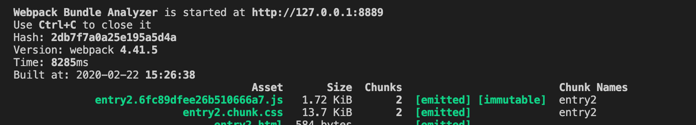

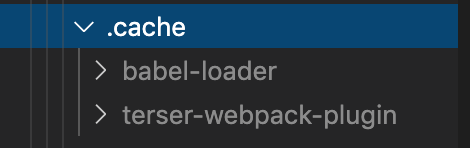

我们重新打包一次，会发现时间变成了 `5s` 左右：

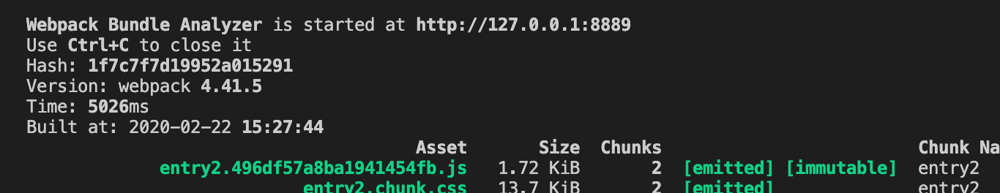

&nbsp;

### HardSourceWebpackPlugin

这个插件其实就是用于给模块提供一个中间的缓存。

#### 安装

```shell
npm install hard-source-webpack-plugin -D
```

#### 使用

我们直接在插件中引入就 ok 了：

```javascript
const HardSourceWebpackPlugin = require('hard-source-webpack-plugin');
...
const plugins = [
  ...
  new HardSourceWebpackPlugin(),
];
...
```

我们打包一下，可以看到在第一次打包的时候 `HardSourceWebpackPlugin` 就帮我们开始生成打包文件了，同时在 `.cache` 目录生成了 `hard-source` 目录，第一次打包耗时 `6.6s` 左右：

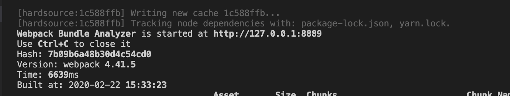

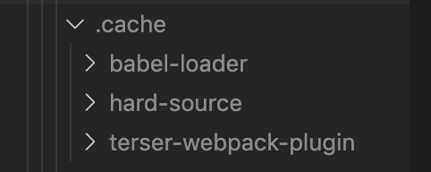

我们重新打包一次，会发现时间变成了 `2.7s` 左右：

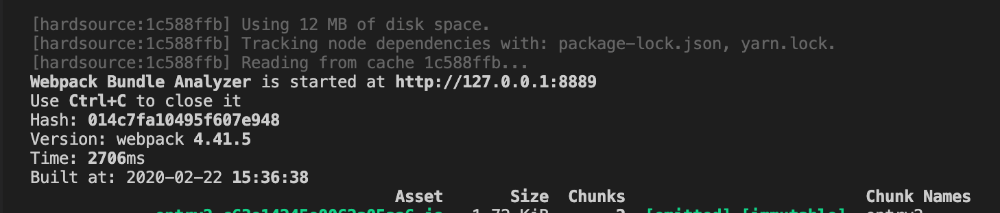


&nbsp;

##缩小构建目标

### 在尽可能少的模块上应用 `Loader`

使用 `loader` 的时候，我们需要在尽量少的模块中去使用。

我们可以借助 `include` 和 `exclude` 这两个参数，规定 `loader` 只在那些模块应用和在哪些模块不应用。

我们修改公共配置文件 `webpack.common.js`：

```javascript
...
const commonConfig = {
  ...
  module: {
    rules: [
      { 
        test: /\.js|jsx$/, 
        // exclude: /node_modules/,
        // include: path.resolve(__dirname, '../src'), 
        use: ['babel-loader']
      },
      ...
    ]
  },
}
...
```

首先我们不加 `exclude` 和 `include` 两个参数，打包一下 `npm run build`，打包时间 `3350ms` 左右：


接着我们加上这两个参数，意思分别是：

* `exclude: /node_modules/`：排除 `node_modules` 下面的文件
* `include: path.resolve(__dirname, '../src')`：只对 `src` 下面的文件使用

重新打包一下，打包时间变成了 `1400ms` 左右：


所以我们在打包的过程中要合理的使用这两个配置参数，从而提高我们的打包速度。

&nbsp;

### `Plugin` 尽可能精简并确保可靠

我们举个简单的例子，我们需要对线上的 `css` 代码进行压缩，所以我们使用了 `OptimizeCSSAssetsPlugin` 插件帮助我们来压缩 `css` 文件，但是我们在开发环境上实际上是不需要压缩 `css` 代码的，所以我们可以去掉这个配置。

我们修改 `webpack.prod.js`，我们来看看 `OptimizeCSSAssetsPlugin` 的耗时：

```javascript
...

const OptimizeCSSAssetsPlugin = require("optimize-css-assets-webpack-plugin");

...

const prodConfig = {
  ...
  optimization: {
    minimizer: [
      new OptimizeCSSAssetsPlugin({})
    ]
  },
  ...
}
...
```

使用此插件在开发环境打包 `npm run build`，打包时间是 `2480ms` 左右，


当我们去掉此插件的耗时差不多是 `2250ms` 左右：


因为我们测试代码中的 `less` 代码比较少，所以时间页差的不是特别多，但是能肯定的是，使用插件肯定会减缓打包速度的。

所以我们尽量使用 `webpack` 官网上推荐的一些插件，因为这些插件肯定是经过官方测试过的，是比较快的。

其次尽量使用在社区里验证过的性能比较好的插件。因为当我们自己写一些插件或者使用第三方公司提供的插件，虽然它能帮我们解决某些问题，但是可能性能上会得不到保证。

&nbsp;

### `resolve` 参数合理配置

我们先来举几个例子：

### `extensions`

我们新建一个 `list` 目录，创建 `list.jsx` 文件：

```javascript
import React, { Component } from 'react';

class List extends Component {
  render() {
    return <div>ListPage</div>;
  }
}

export default List;

```

如果我们想在 `index.js` 中使用名字引入，不写 `jsx` 后缀：

```javascript
...
import List from './list/list';
...
```

我们先修改 `webpack.common.js` 文件，让 `jsx` 文件能被 `babel-loader` 进行处理：

```javascript
...

const commonConfig = {
  ...
  module: {
    rules: [
      { 
        test: /\.jsx?$/, 
        exclude: /node_modules/,
        include: path.resolve(__dirname, '../src'), 
        use: ['babel-loader']
      }
    ]
  },
  ...
}

...
```

接着我们打包一下 `npm run dev`，会报一个错误，说是 `list` 找不到


这个时候我们可以在配置文件中增加 `resolve` 参数，增加一个 `extensions` 属性，我们配置 `['.js', '.jsx']`，意思是我们会先去找指定目录下面以 `.js` 结尾的文件，再去找 `.jsx` 结尾的文件，如果还是找不到就返回找不到。

```javascript
...

const commonConfig = {
  ...
  resolve: {
    extensions: ['.js', '.jsx'],
  },
  ...
}

...
```

现在重新打包一下，就可以打包成功了：


但是这里我们要尽量少配置，因为如果配置多了，我们把诸如 `css`、`jpg` 结尾的都配置进去了，这会调用多次文件的查找，这样就会减慢打包速度。

&nbsp;

### `mainFiles`

如果我们想在 `index.js` 中直接使用下面这种引用方式进行引用：

```javascript
import List from './list';
```

我们可以在 `resolve` 下在增加一个 `mainFiles` 参数，表示直接引用这个目录的时候，解析目录要使用的文件名。

我们做以下配置之后：就会先默认查找 `index` 为名字的文件、没找到的话接着查找 `list` 为名字的文件。

```javascript
...

const commonConfig = {
  ...
  resolve: {
    extensions: ['.js', '.jsx'],
    mainFiles: ['index', 'list']
  },
  ...
}

...
```

现在重新打包一下，就可以打包成功了：


不过这个参数基本上我们不用配置，直接使用默认参数，即 `index`。

&nbsp;

### `alias`

**别名**，我们在 `list` 目录下在新建一个 `list2` 目录，并将 `list.jsx` 放到 `list2` 下，同时我们新建一个 `alias` 目录，里面新建一个 `index.js` 文件：

```javascript
// alias/index.js
export default '我是 alias 的 demo';
```


如果在 `list.jsx` 中使用 `alias/index.js` 的文件，正常情况下我们需要使用相对路径：

```javascript
// 正常情况下
import aliasText from '../../alias';
```

如果我们想要这样引入：

```javascript
import aliasText from 'alias';
```

我们就需要给 `alias` 这个目录配置一个别名：

```javascript
...

const commonConfig = {
  ...
  resolve: {
    extensions: ['.js', '.jsx'],
    mainFiles: ['index', 'list'],
    alias: {
      alias: path.resolve(__dirname, '../src/alias'),
    }
  },
  ...
}

...
```

我们给 `alias` 这个目录配置了一个别名，当其他地方使用 `import *** from 'alias'` 导入的时候，就会自动到我们配置的路径中去找。

我们打包一下，可以发现打包成功了：


&nbsp;

### `modules`

我们还可以优化 `resolve.modules` 的配置，这个属性告诉 `webpack` 解析模块时应该搜索的目录。绝对路径和相对路径都能使用。使用绝对路径之后，将只在给定目录中搜索。从而减少模块的搜索层级：

```javascript
...

const commonConfig = {
  ...
  resolve: {
    extensions: ['.js', '.jsx'],
    mainFiles: ['index', 'list'],
    alias: {
      alias: path.resolve(__dirname, '../src/alias'),
    },
    modules: [path.resolve(__dirname, 'node_modules')]
  },
  ...
}

...
```

虽然 `resolve` 比较好用，但是我们也要合理去使用，不能一股脑儿的把所有的后缀都往 `extensions` 里面去塞。

&nbsp;

## 控制包文件大小

有的时候当我们写代码的时候，经常会使用一些再页面中没用用的模块，或者没有使用到的模块，这样便会在打包过程中出现很多冗余的代码，这样便会拖累 `webpack` 的打包速度。

所以如果我们在项目中没有使用到的代码，我们需要通过 `tree-shaking` 把这些代码去掉，或者直接去掉就行；或者我们也可以使用 `splitChunksPlugin` 把一个大的文件分割成几个小的文件，这样也可以有效的提升 `webpack` 的打包速度。

接下来我们举几个例子：

&nbsp;

### 使用 `webpack` 进行图片压缩

一般来说在打包之后，一些图片文件的大小是远远要比 `js` 或者 `css` 文件要来的大的，所以一般来说我们首先要做的就是对于图片的优化，我们可以手动的去通过线上的图片压缩工具，如 [tiny png](https://tinypng.com/) 帮我们来压缩图片，笔者在文章中引入的图片也是手动的去这个网站压缩了一下，再引入的。

但是这个比较繁琐，在项目中我们希望能够更加的自动化一点，自动帮我们做好图片压缩，这个时候我们就可以借助 [`image-webpack-loader`](https://github.com/tcoopman/image-webpack-loader) 帮助我们来实现。它是基于 [imagemin](https://github.com/imagemin/imagemin) 这个 `Node` 库来实现图片压缩的。

#### `Imagemin的优点分析`

* 有很多定制选项
* 可以引入更多第三方优化插件，例如 `pngquant`
* 可以处理多种图片格式，基本上的图片格式都是支持的。

#### `Imagemin` 的压缩原理

* `pngquant`：是一款 `PNG` 压缩器，通过将图像转换为具有 `alpha` 通道(通常比 `24/32` 位 `PNG` 文件小 `60-80%` )的更高效的 `8` 位 `PNG` 格式，可显著减小文件大小。

* `pngcrush`：其主要目的是通过尝试不同的压缩级别和 `PNG` 过滤方法来降低 `PNG IDAT` 数据流的大小。

* `optipng`：其设计灵感来自于 `pngcrush`。`optipng` 可将图像文件重新压缩为更小尺寸，而不会丢失任何信息。

* `tinypng`：也是将 `24位png` 文件转化为更小有索引的 `8` 位图片，同时所有非必要的 `metadata` 也会被剥离掉。

#### 安装

```shell
npm install image-webpack-loader -D
```

#### 使用

使用很简单，我们只要在 `file-loader` 之后加入 `image-webpack-loader` 即可：

```javascript
...
module: {
  rules: [
    {
      test: /\.(png|jpg|gif)$/,
      use: [
        {
          loader: 'file-loader',
          options: {
            name: '[name]_[hash].[ext]',
            outputPath: 'images/',
          }
        },
        {
          loader: 'image-webpack-loader',
          options: {
            mozjpeg: {
              progressive: true,
              quality: 65
            },
            // optipng.enabled: false will disable optipng
            optipng: {
              enabled: false,
            },
            pngquant: {
              quality: '65-90',
              speed: 4
            },
            gifsicle: {
              interlaced: false,
            },
            // the webp option will enable WEBP
            webp: {
              quality: 75
            }
          }
        }
      ]
    },
  ]
}
            
...
```

我们先不使用这个 `loader` 打包一下，图片大小是 `2.1MB`：

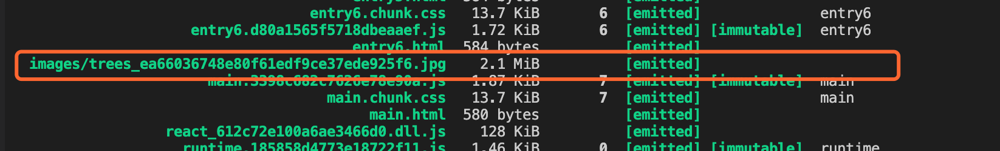

使用 `image-webpack-loader` 之后，图片大小是 `666KB`：


压缩的效果还是特别明显的。

> 笔者在安装此 `loader` 的时候，碰到了一个问题，会报一个错误，如下图所示，这个时候使用 `cnpm`，就能解决这个问题了。
>
> ```shell
> cnpm install image-webpack-loader -D
> ```

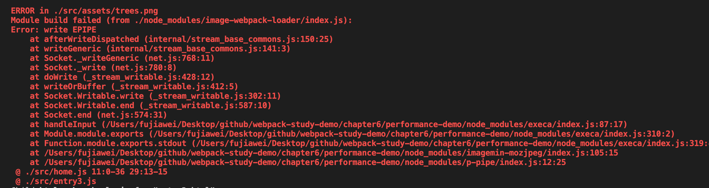


&nbsp;

### 对无用的 `CSS` 使用 `tree shaking`

在这一节我们对没有使用到的 `css` 也做一下 `tree shaking`。

`tree shaking` 的概念是 `1` 个模块可能有多个方法，只要其中的某个方法使用到了，则整个文件都会被打到 `bundle` 里面去，`tree shaking` 就是只把用到的方法打入 `bundle` ，没用到的方法会在 `uglify` 阶段被擦除掉。

#### 两种方案

[`PurgeCSS`](https://github.com/FullHuman/purgecss)：遍历代码，识别已经用到的 `CSS class`，打上标记。

[`uncss`](https://github.com/uncss/uncss)：`HTML` 需要通过 `jsdom` 加载，所有的样式通过 `PostCSS` 解析，通过 `document.querySelector` 来识别在 `html` 文件里面不存在的选择器。

&nbsp;

#### 使用 `PurgeCSS`

在这里我们使用一下第一种方案来完成对无用 `css` 的擦除。它需要和 `mini-css-extract-plugin` 配合使用。

##### 安装

```shell
npm install purgecss-webpack-plugin glob -D
```

##### 使用

我们在 `webpack.common.js` 中引入：

```javascript
...
const glob = require('glob');
const PurgecssPlugin = require('purgecss-webpack-plugin');

const PATHS = {
	src: path.join(__dirname, './src')
};
...
const plugins = [
  ...
  new PurgecssPlugin({
    paths: glob.sync(`${PATHS.src}/**/*`,  { nodir: true }),
  }),
]
```

修改 `index.js` 和 `index.less`：

```jsx
import '@babel/polyfill';
import React, { Component } from 'react';
import { BrowserRouter, Route } from 'react-router-dom';
import ReactDom from 'react-dom';
// import _ from 'lodash';
// import $ from 'jquery';
import Home from './home';
import List from './list/list2/list';
import './index.less'

class App extends Component {
  render() {
    return (
      <BrowserRouter>
        <div className="navcontact">
          <Route path="/" exact component={Home} />
          <Route path="/list" component={List} />
        </div>
      </BrowserRouter>
    );
  }
}

ReactDom.render(<App />, document.getElementById('root'));

```

```less
.navcontact {
  float: left;
  display: inline;
  color: #fff;
  line-height: 30px;
  height: 30px;
  margin: 10px 0 10px 82px;
  padding: 0 10px;
  background: #2c2c2c;
  border-radius: 5px;
  color: red;

  span {
    color: #cc0;
  }
}

.link{
  width: 960px;
  margin: 0 auto;
  font-size: 12px;
  line-height: 20px;
  clear: both;
  border-bottom: 1px solid #aaa;
  padding-bottom: 10px;

  span {
    color: #333;
    width: 65px;
    text-align: center;
  }

  a {
    margin: 0 5px;
  }
}
```

我们只用到了 `navcontact` 这个类，其他的都没有用到，我们在未引入之前打包一下，发现未用到的 `css` 还是会被打包进去：

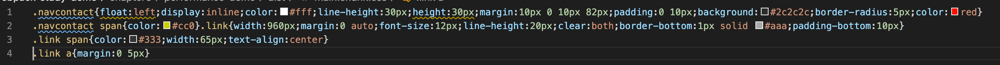

引入插件后，重新进行打包，发现没有用到的 `css` 都被擦除了：

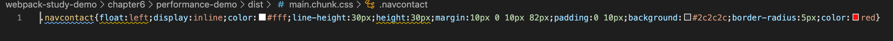

更多参数大家可参考 [`PurgeCSS` 文档](https://purgecss.com/plugins/webpack.html#usage)。


### 使用动态 `Polyfill` 服务

一般为了兼容低版本的浏览器，使低版本的浏览器也能支持类似 `promise`、`Map`、`Set` 等方法，我们需要引入类似 `@babel/polyfill` 这样的垫片，但是考虑到每一款浏览器所需的 `polyfill` 都是不一样的，有些可能根本就不需要，而 `polyfill` 的特点是非必须和不变。

我们看一下 `promise` 这个方法在手机端的浏览器支持情况，如下图：

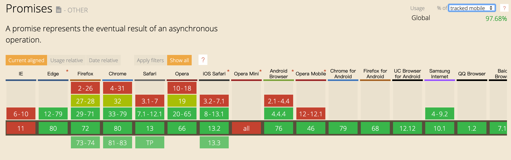

全球有 `97.68%` 的用户是支持 `promise` 这个方法的，为了百分之二点几的用户都去加载 `promsie` 其实是没有必要的。

#### 一些方案

* `babel-polyfill`

优点：`react` 官方推荐；

缺点：1，包体积 `200K`，难以单独抽离 `Map`、`Set`等方法；2，项目里 `react` 是单独引用 `cdn`，如果要用它，就需要单独构建一份放在 `react` 前加载

* `babel-plugin-transform-runtime`

优点：能只用到 `polyfill` 用到的类和方法，相对体积较小

缺点：不能使用 `polyfill` 原型上的方法，不使用业务项目的复杂开发环境，一般适用于类库之中。

* 自己写 `Map`、`Set` 的 `polyfill`

优点：定制化高，体积小，业内常用的代表就是 [`es6-shim`](https://github.com/paulmillr/es6-shim)

缺点：1，重复造轮子，容易在日后年久失修成为坑，不是特别的灵活；2，即使提交小，依然所有用户都要加载

* `polyfill-service`

优点：只给用户返回需要的 `polyfill`，社区维护

缺点：部分国内奇葩浏览器 `UA` 可能无法识别（但可以降级返回所需全部的 `polyfill`）

&nbsp;

#### `polyfill-service` 原理

每次打开浏览器，浏览器都会去请求 `Polyfill.im`，它会识别浏览器的 `User Agent`，下发不同的 `Polyfill`


&nbsp;

#### 使用

[`polyfill.io`](https://polyfill.io/v3/) 官方提供的服务

```html
<script crossorigin="anonymous" src="https://polyfill.io/v3/polyfill.min.js"></script>
```

我们可以在不同的 `User Agent` 下去访问上面这个网址，我们可以看到不同的 `UA` 获取到的 `polyfill` 文件大小也有所不同：

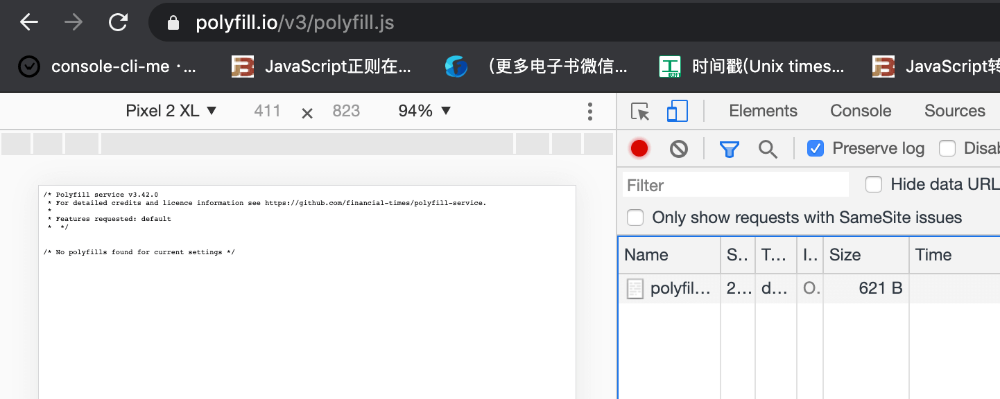

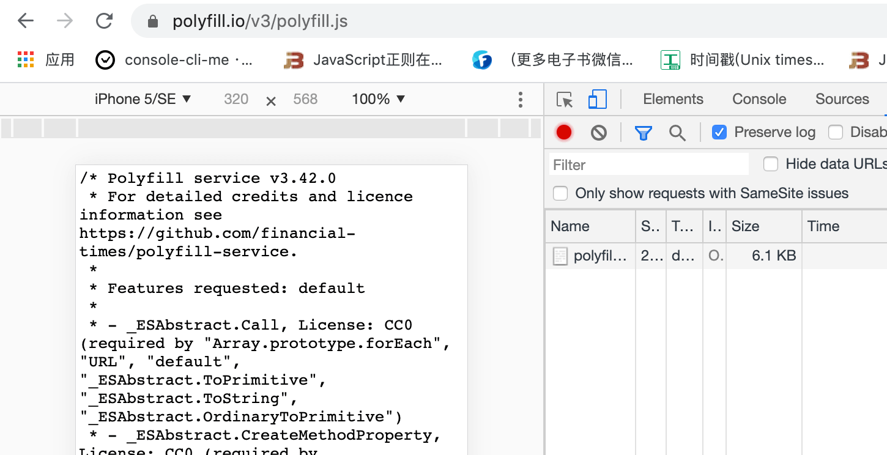

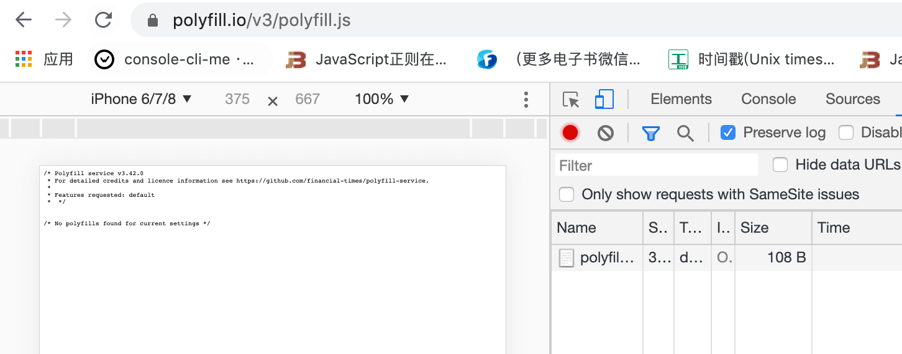

`polyfill` 官方也是把 `service` 这个服务做了开源，我们可以基于官方开源的 `polyfill` 服务来自己穿件自己的 `cdn`，这样就不会因为官方的业务出现了问题之后，对我们自己的业务造成影响。具体可以参考 [polyfillio-cdn](https://www.npmjs.com/package/polyfill-service#polyfillio-cdn)

&nbsp;

## 合理使用 `sourceMap`

之前我们有讲过，之前我们打包生成 `sourceMap` 的时候，如果信息越详细，打包速度就会越慢


所以我们要在代码打包过程中的时候，在对应的环境使用对应的 `sourceMap` 很重要。

&nbsp;

## 开发环境使用内存编译

### 使用内存编译

我们在开发的时候会使用 `webpack-dev-server` 帮助我们进行打包开发，它会把打包文件放在内存中去，不会放到相应的 `dist` 目录下，而内存的读取肯定会比硬盘的读取要快的多。所以这页可以提升 `webpack` 的打包速度。

&nbsp;

### 无用插件剔除

因为在 `webpack4.0` 后，它会根据环境帮助我们做一些环境相关的事情，比如我们将 `mode` 设置为 `production` 的时候，`webpack` 会自动的帮助我们去压缩代码。 压缩的过程必然会耗费一定的时间，所以我们要在开发环境尽量剔除掉一些我们不需要用到的代码，这对 `webpack` 构建速度的提升也会有一定的帮助。

&nbsp;

## 更多

`webpack` 性能优化的方法还会有很多，我们只是列举了一些比较常用的方法，更多的用法需要大家在实践中慢慢去摸索。

&nbsp;

## 相关链接

- [Webpack 官网 DllPlugin](https://webpack.js.org/plugins/dll-plugin/)
- [Webpack 官网 Resolve](https://webpack.js.org/configuration/resolve/)
- [Webpack 官网 thread-loader](https://webpack.js.org/loaders/thread-loader/)
- [happypack](https://github.com/amireh/happypack)
- [parallel-webpack](https://github.com/trivago/parallel-webpack)
- [使用 happypack 提升 Webpack 项目构建速度](https://blog.csdn.net/zgd826237710/article/details/88172290)
- [用 process.hrtime 获取纳秒级的计时精度](https://segmentfault.com/a/1190000021587678)
- [Webpack优化——将你的构建效率提速翻倍](https://blog.csdn.net/QQ729533020/article/details/100589186)
- [webpack 构建性能优化策略小结](https://segmentfault.com/a/1190000007891318)

&nbsp;

## 示例代码

示例代码可以看这里：

- [性能优化  示例代码](https://github.com/darrell0904/webpack-study-demo/tree/master/chapter6/performance-demo)
