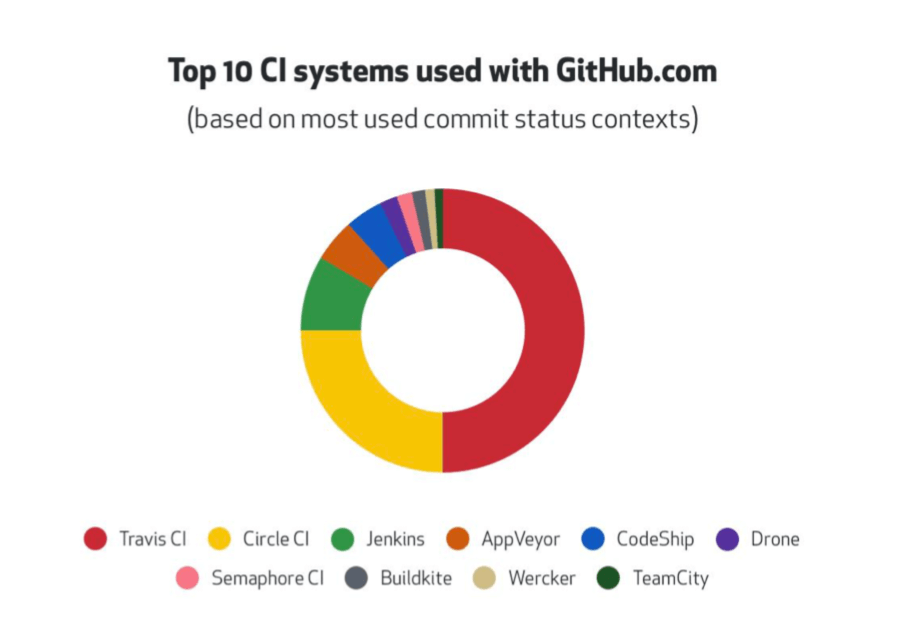
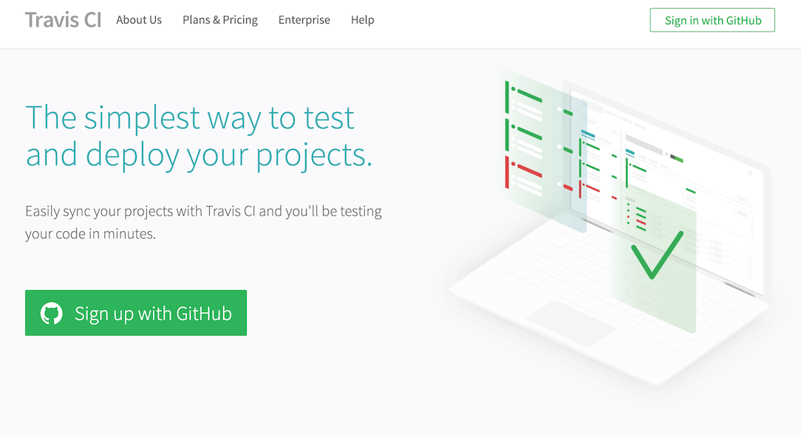
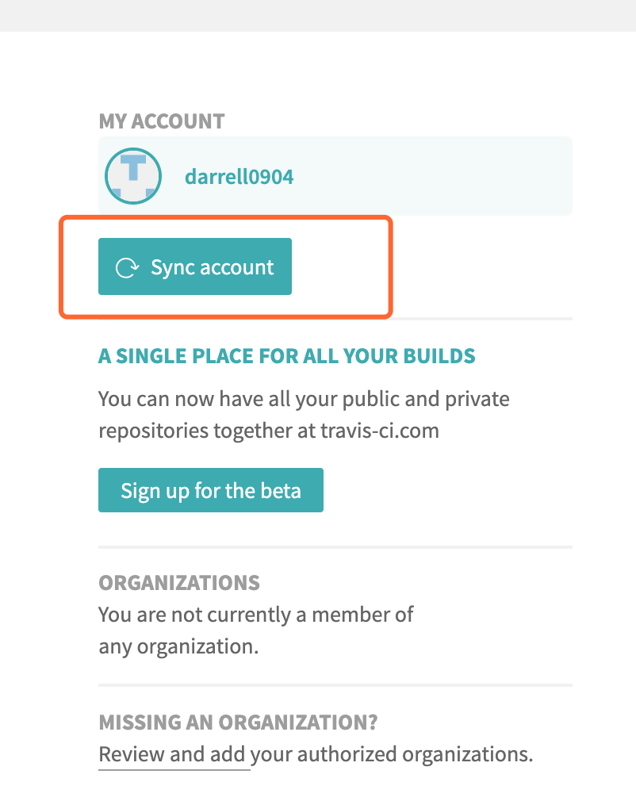
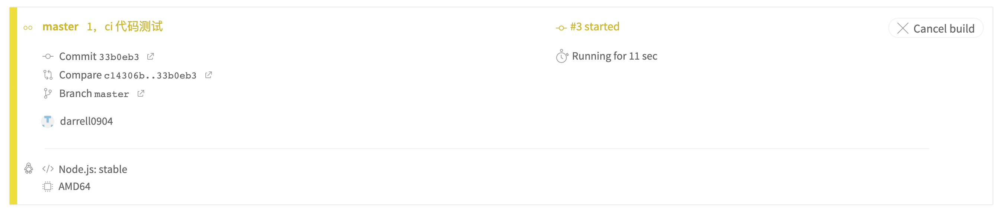
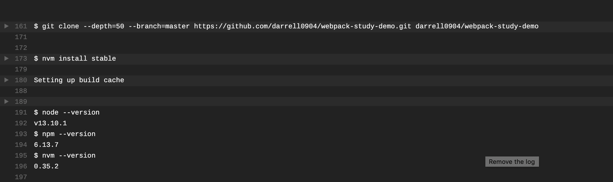
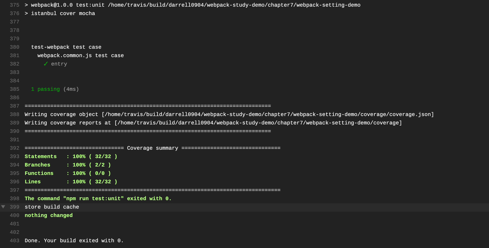
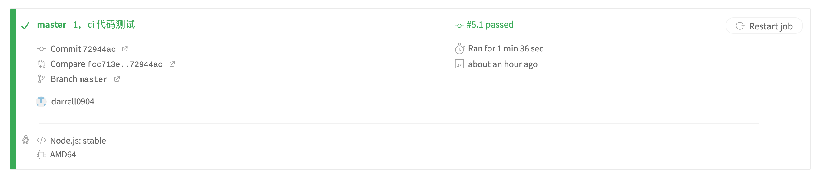

# 持续集成 CI

## 持续集成

全名 `Continuous Integration`，我们每天都会频繁地（一天多次）将代码集成到主干。而持续集成的目的，就是让产品可以快速迭代，同时还能保持高质量。

它的核心措施是，代码集成到主干之前，必须通过自动化测试。只要有一个测试用例失败，就不能集成。


## `Github` 流行的 `CI`

在 `Github` 流行的 `CI`，如下图所示：



可以看到 [`Travis CI`](https://travis-ci.org/)、[`Circle CI`](https://circleci.com/) 和 [`Jenkins`](https://jenkins.io/zh/) 是相对来说使用比较多的持续集成工具。我们接下来就以 `Travis CI` 来讲一下持续集成。

&nbsp;

## 接入 `Travis CI`

### 为项目开启 `Travis CI`

我们使用 `Github` 账号登陆 [travis](https://travis-ci.org/)，登陆之后进入 [项目页面](https://travis-ci.org/account/repositories)，刷新一下已有项目，找到我们这个系列的案例仓库 `webpack-study-demo`，并开启，如下图：

> `Travis CI` 首页



> 刷新项目



> 找到我们的项目，并开启


经过上面的配置，我们已经为项目开启了 `Travis CI`，接下来我们就需要在项目的更目录下面增加 `.travis.yml`。

&nbsp;

### 增加 `travis.yml`

我们在项目的根目录下增加这个文件，文件的主要目的是为了告诉 `Travis CI` 需要做什么：

```nginx
# 语言是 Node.js
language: node_js

# 使用缓存，
cache:
  apt: true
  directories:
    - node_modules

# Node.js 的版本
node_js: stable

# 安装依赖
install:
	# 进入到这一节目录
  - cd ./chapter7/webpack-setting-demo
	# 安装依赖
  - npm install -D
	# 进入到测试项目文件夹
  - cd ./test/smoke/template
	# 安装依赖
  - npm install -D
	# 重新回到 webpack-setting-demo 根目录
  - cd ../../../

# 执行 测试命令
script:
  - npm run test
```

关于 `Travis CI` 更多的配置参数，笔者在这里就不细讲了，大家可以参考 [官网文档](https://docs.travis-ci.com/user/tutorial/)，这里我写了一些比较基础的功能。

&nbsp;

到此为止我们的项目已经接入了 `Travis CI` 了，接下来我们看看其运行情况。

&nbsp;

## 运行

当我们合并分支代码的时候，`Travis` 就已经开始工作了，如下面几张图，首先其会开始执行在 `travis.yml` 文档的内容，首先 `clone` 项目，安装 `Node.js`，接着就进入项目安装相应的依赖，最后执行测试命令。

> 黄色表示开始执行集成



> `clone` 项目，安装 `Node`



> 执行 `npm run test` 命令



> 持续集成成功



到这里为止我们项目的持续集成，就算接入成功了。


## 小结

这一节笔者只是简单的讲了一下 **持续集成** 在项目中的接入和使用，就算是给大家开一个头，大家有兴趣可以去深入了解一下。

那是不是测试有报错，代码就不会合并到分支中去了，这个大家可以自行去做测试。


&nbsp;

## 相关链接

- [CI 持续集成介绍](jianshu.com/p/61b5b549d215)
- [travis](https://travis-ci.org/)
- [持续集成服务 Travis CI 教程](http://www.ruanyifeng.com/blog/2017/12/travis_ci_tutorial.html)

&nbsp;

## 示例代码

示例代码可以看这里：

- [编写可维护的 Webpack 构建配置 示例代码](https://github.com/darrell0904/webpack-study-demo/tree/master/chapter7/webpack-setting-demo)


