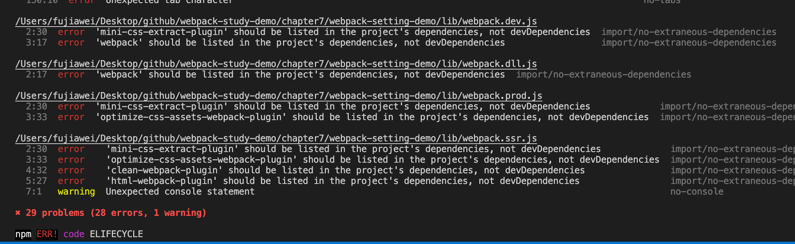

# 构建包设计与规范

## 抽离构建配置

有的时候，我们基本上只需要开发业务，对于构建配置无需太关注，这个时候我们可以将这份构建配置单独抽离成 `npm` 包。这样有如下优点：

### 通用性

这样业务开发者就无需关注构建配置本身，可以专注于业务开发。这份配置由相关人员维护，统一整个团队的构建脚本。

### 可维护性

单独抽离了之后，可以进行相应的合理拆分，同时可以设置相应的规范：`Git 规范`、`ESLint` 规范、`semver` 语义化版本等，方便日后的更新维护。

### 质量

我们可以通过对抽离出来的配置文件进行 **冒烟测试**、**单元测试**、**测试覆盖率** 来保证配置的质量，同时进行进行持续集成（`CI`）。

> `CI`：全名 `Continuous Integration`，**持续集成**，频繁地（一天多次）将代码集成到主干。
> 持续集成的目的，就是让产品可以快速迭代，同时还能保持高质量。它的核心措施是，代码集成到主干之前，必须通过自动化测试。只要有一个测试用例失败，就不能集成。
>
> `CD`：全名 `Continuous Deployment`，**持续部署**，指的是代码通过评审以后，自动部署到生产环境。持续部署的目标是，代码在任何时刻都是可部署的，可以进入生产阶段。持续部署的前提是能自动化完成测试、构建、部署等步骤。
>
> 更多大家可以参考 [CI 持续集成介绍](jianshu.com/p/61b5b549d215)

&nbsp;

## 可选方案

### 方案一

通过多个配置文件管理不同环境的构建，`webpack --config` 参数进行控制。

我们之前的项目中都是使用这个方案搭配 `webpack-merge` 来进行不同环境的打包的。

### 方案二

将构建配置设计成一个库，比如：`hjs-webpack`、`Neutrino`、`webpack-blocks`，其实就是提取一系列经常用到的插件，以便我们可以更简单的使用。具体配置笔者在这里就不细讲了，我贴了相应的仓库地址，大家可以在用到的时候去了解一下。

* [hjs-webpack](https://github.com/HenrikJoreteg/hjs-webpack)

  使用 `Babel` 使用热加载 `React` 和 `ES6（2015）` 设置 `Webpack` 的帮助程序/预设。

* [neutrino](https://github.com/neutrinojs/neutrino)

  此库可以帮助我们使用零初始配置创建和构建现代 `JavaScript` 项目。

* [webpack-blocks](https://github.com/andywer/webpack-blocks)

  此库允许我们使用功能部件配置 `webpack`。

### 方案三

抽成一个工具进行管理，即一个脚手架，能帮我们快速新建一个项目。比如：`create-react-app`、`Vue CLI`、[`kyt`](https://github.com/nytimes/kyt)、[`nwb`](https://github.com/insin/nwb)。

笔者会对前两个脚手架在后面的章节进行相应的分析，详细的可以去 **`React`、`Vue` 框架脚手架配置分析** 去进行查看，只不过 `Vue CLI` 又对 `webpack` 的配置进行了一层封装，我们可以 `Vue CLI` 提供的配置参数进行配置。


### 方案四

将所有的配置放在一个文件，通过 `--env` 参数控制分支选择

这个我们在第三章讲 `env` 参数的时候有讲到过，我们可以根据传入的 `env` 参数去进行环境的选择，进而进行区分打包。

&nbsp;

## 构建包设计

我们新建一个项目，将相应的 `webpack` 配置文件放到 `lib` 文件夹中，有以下几个配置文件：

* `webpack.common.js`：基础配置文件
* `webpack.dev.js`：开发环境配置文件
* `webpack.prod.js`：生产环境配置文件
* `webpack.ssr.js`：`SSR` 环境配置文件
* `webpack.dll.js`：`dll` 配置文件

同时我们还需要增加相应的规范 `ESLint` 规范、`Semver` 规范，此外我们还需要增加相关的测试代码：比如冒烟测试、单元测试、测试覆盖率等等。

&nbsp;

## 使用 `ESlint` 规范构建脚本

之前讲到 `Eslint` 的时候，我们使用 `eslint-config-airbnb` 来进行 `Eslint` 的规范设计，这里我们可以使用 `eslint-config-airbnb-base`，它提供了 `Airbnb` 的基础 `.eslintrc`（无 `React` 插件）的配置。

### 安装配置

```shell
npm install eslint babel-eslint eslint-config-airbnb-base -D
```

### 配置 `.eslintrc.js`

```javascript
module.exports = {
  "env": {
    "browser": true,
    "es6": true
  },
  "parser": "babel-eslint",
  "extends": "airbnb-base",
};
```

### 增加 `package.json`

```json
"scripts": {
  // ...
  "lint": "eslint --fix ./lib",
},
```

我们运行一下 `npm run lint`，可以看到相应的错误代码：



我们便可以根据错误进行相应的修复。

&nbsp;

## 当前目录结构

```javascript
.
├── lib  // webpack 配置文件夹
    ├── webpack.common.js  // 基础配置文件
		├── webpack.dev.js     // 开发环境配置文件
		├── webpack.prod.js    // 生产环境配置文件
    ├── webpack.ssr.js     // SSR 环境配置文件
		├── ...
    └── webpack.dll.js     // dll 配置文件
├── test  // 测试文件夹
├── .eslintrc.js  // eslint 的配置文件
├── .babelrc      // babel 配置文件
├── README.md     // 项目 README 文件
├── .gitignore    // git 忽略文件
└── package.json  // 当前整一个项目的依赖
```

接下去我们会讲项目的测试相关的代码。

&nbsp;

## 相关链接

- [CI 持续集成介绍](jianshu.com/p/61b5b549d215)
- [看完这篇就看懂了很多webpack脚手架](https://segmentfault.com/a/1190000007972133)
- [hjs-webpack](https://github.com/HenrikJoreteg/hjs-webpack)

&nbsp;

## 示例代码

示例代码可以看这里：

- [编写可维护的 Webpack 构建配置 示例代码](https://github.com/darrell0904/webpack-study-demo/tree/master/chapter7/webpack-setting-demo)

