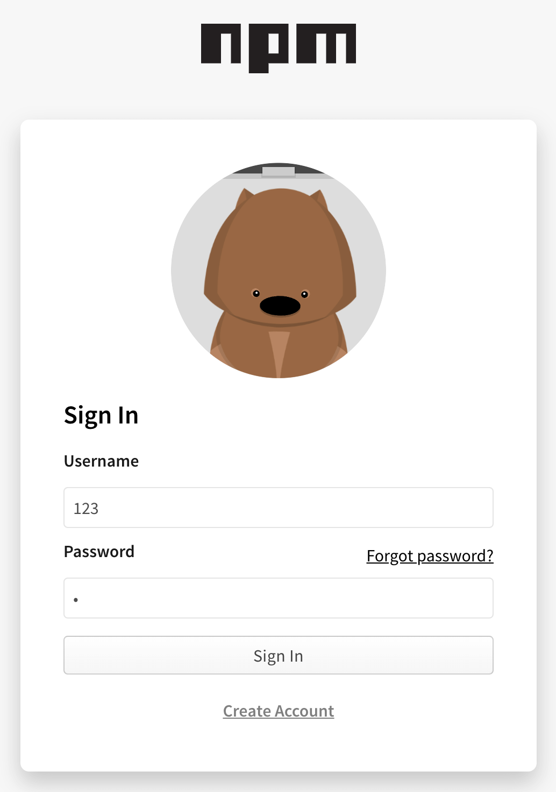
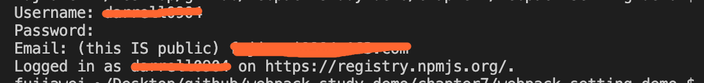
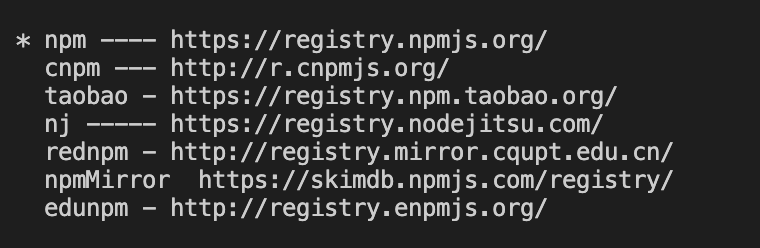
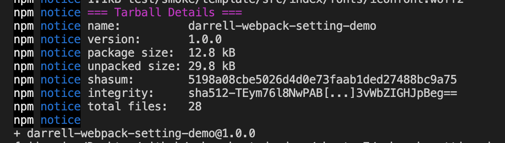
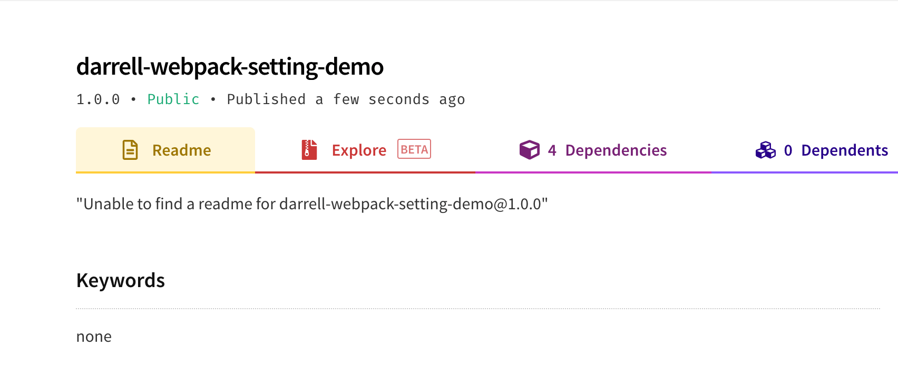
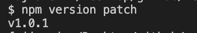
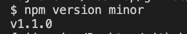
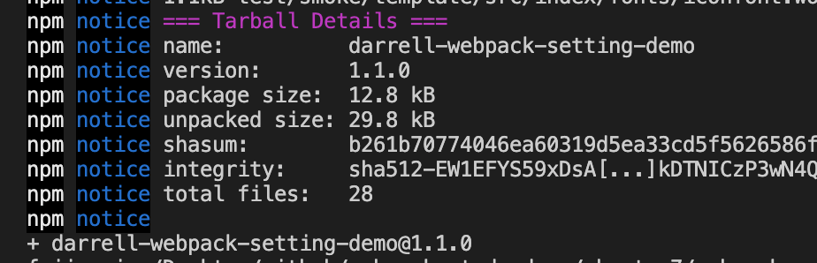

# 发布到 npm

## 什么是 `npm`

[`npm`](https://www.npmjs.com/) 是 `javascript` 著名的 **包管理工具**，是 **前端模块化** 下的一个标志性产物。

&nbsp;

## 如何发布一个自己的 npm 包

### 注册账号

首先去官网注册一个 `npm` 账号，如下图所示：



接着在命令行中我们就可以使用下面命令，进行登录：

```shell
npm adduser
```

如下图所示，就说明登录成功：



&nbsp;

### 发布

我们使用一下命令发布包：

```shell
npm publish
```

> 有一点需要注意的是，在我们上传的时候，需要将源更换为 `npm` 官方源，我们可以使用 `nrm` 来帮我们管理源，具体可以参考 [使用NRM进行NPM的源管理](https://www.meaoo.cn/2020/02/11/113.html)

我们使用 `nrm ls` 查看源列表，`nrm use ***` 使用具体源。

源更改后如下图：




在发布包之前首先要确认在 `npm` 上没有和我们发布包同名的包，如果有的话我们就需要改一下包的名字。

接着我们就可以运行提交命令，可以看到，包提交成功了：



在 `npm` 上我们也能搜索到此项目：



&nbsp;

## 升级版本

我们可以通过下面的命令升级 `npm` 包的版本：

* `npm version patch`：升级补丁版本号



* `npm version minor`：升级小版本号



* `npm version major`：升级大版本号

在这里我们升级一个小版本号，发布之后可以看到 `1.1.0` 的包版本发布了：



&nbsp;

## 实战案例

实战案例大家可以参考笔者之前写的 [从零开始实现类 antd 分页器 系列文章](https://juejin.im/post/5e5dbc9051882549281bf898)，里面详细讲到了 **项目结构的搭建**、**组件代码的编写** 以及 **上传 `npm`**，大家有兴趣的话可以看一波。 

&nbsp;

## 相关链接

* [双因素认证（2FA）教程](http://www.ruanyifeng.com/blog/2017/11/2fa-tutorial.html)

&nbsp;

## 示例代码

示例代码可以看这里：

- [编写可维护的 Webpack 构建配置 示例代码](https://github.com/darrell0904/webpack-study-demo/tree/master/chapter7/webpack-setting-demo)


