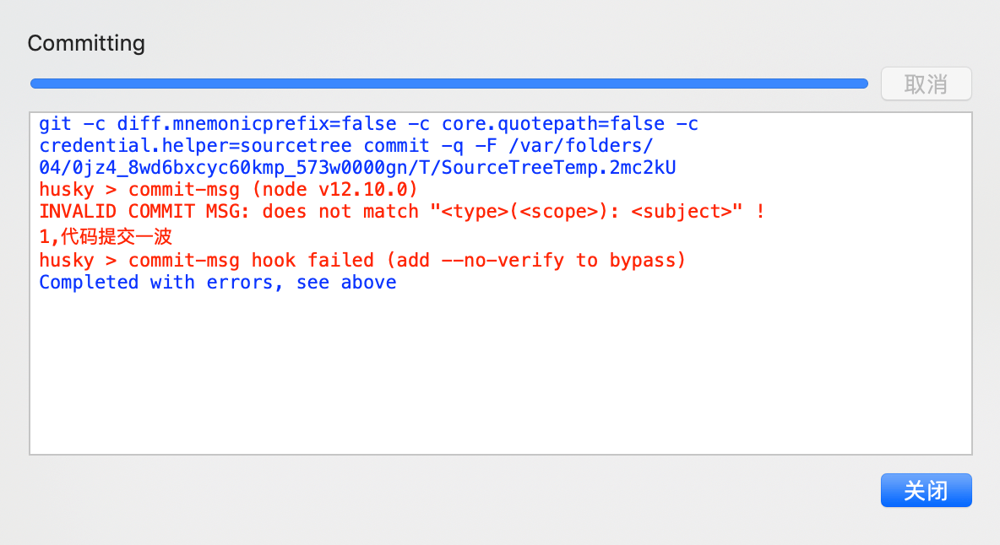
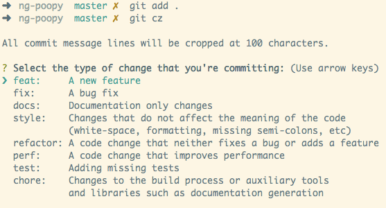
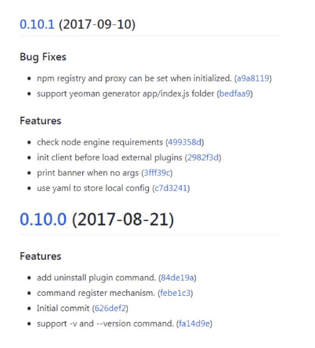
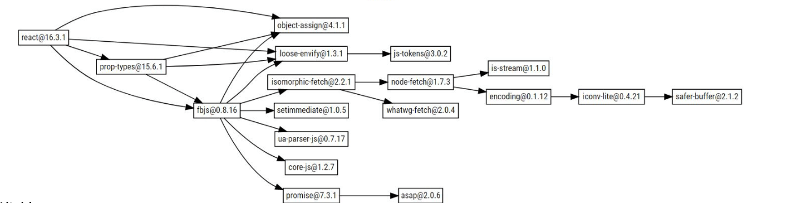
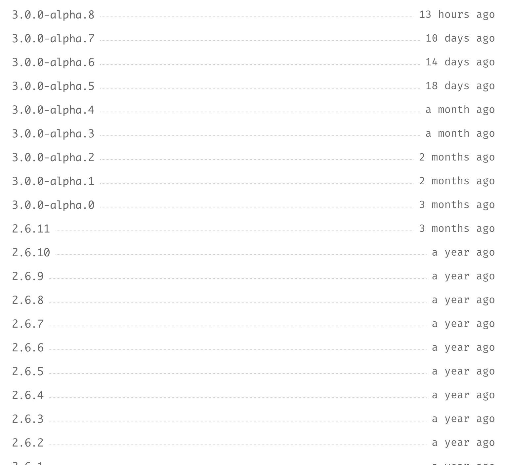
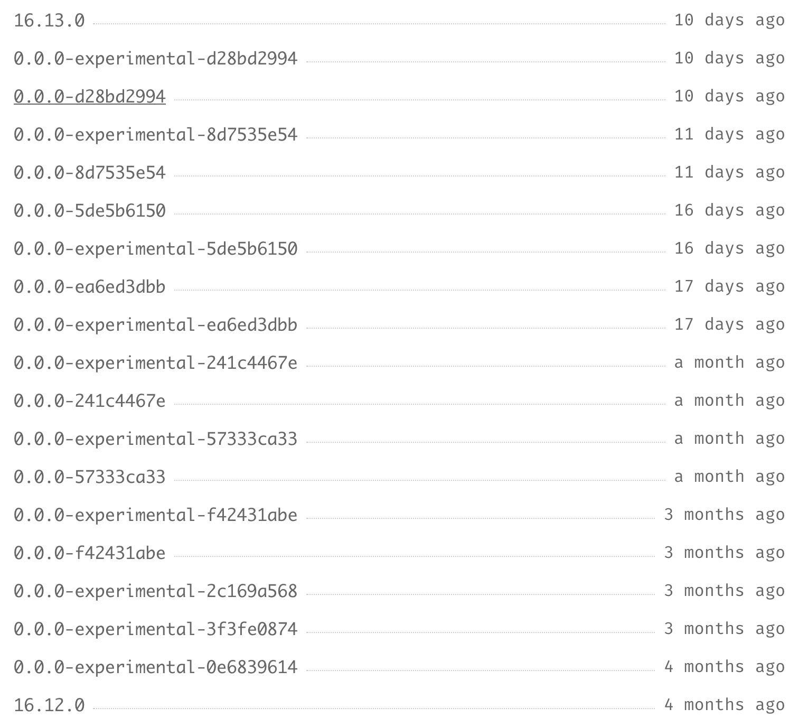

# git 与 语义化规范

## `Git commit` 规范

### 作用

* 能加快 `Code Review` 的流程
* 根据 `Git Commit` 的元数据生成 `Changelog`
* 后续维护者可以知道 `Feature` 被修改的原因

&nbsp;

### 技术方案


其实社区有多种 `Commit message` 的写法规范，我们这里使用 [`Angular`](https://docs.google.com/document/d/1QrDFcIiPjSLDn3EL15IJygNPiHORgU1_OOAqWjiDU5Y/edit#heading=h.greljkmo14y0) 规范，这是目前使用最广的写法。如下图所示：


&nbsp;

### 提交的格式要求

一般提交格式的要求如下图：


#### `type`

`type` 代表了某次提交的类型，比如是修复一个 `bug` 还是增加了一个新的 `feature`。所有的`type` 类型如下：

* `feat`：新增 `feature`
* `fix`：修复 `bug`
* `docs`：仅仅修改了文档，比如 `README`、`CHANGLELOG` 等等
* `style`：仅仅修改了空格、格式缩进、多行等等，不改变逻辑
* `refactor`：代码重构，没有加新的功能或者修复 `bug`
* `perf`：优化相关，比如提升性能、体验等
* `test`：测试用例，包括单元测试、集成测试等
* `chore`：改变构建流程，或者增加依赖库、工具等
* `revert`：回滚到上一个版本

#### `Scope`

`scope` 字段用于说明本次 `commit` 所影响的范围，比如视图层、数据模型或者路由模块等，是一个可选参数。

#### `subject`

`subject` 字段是本次 `commit` 的一个概要，需要用最简洁的语言来说明本次修改的内容。

#### `Body`

可以使用多行文本详细地说明本次提交所改动的一些细节，从而帮助后续的使用者们更好地了解代码的内容。

```bash
More detailed explanatory text, if necessary.  Wrap it to 
about 72 characters or so. 

Further paragraphs come after blank lines.

- Bullet points are okay, too
- Use a hanging indent
```

> 案例取自 阮一峰老师的 [Commit message 和 Change log 编写指南](http://www.ruanyifeng.com/blog/2016/01/commit_message_change_log.html)

#### `Footer`

`Footer` 部分只用于两种情况。

* 不兼容变动

如果本次的 `commit` 与前一个版本的代码无法兼容，那么 `Footer` 部分需要以 `BREAKING CHANGE` 开头，后面描述本次变动的详细情况以及迁移到新版本代码的方法。

```bash
BREAKING CHANGE: isolate scope bindings definition has changed.

  To migrate the code follow the example below:

  Before:

  scope: {
    myAttr: 'attribute',
  }

  After:

  scope: {
    myAttr: '@',
  }

  The removed `inject` wasn't generaly useful for directives so there should be no code using it.
```

> 案例取自 阮一峰老师的 [Commit message 和 Change log 编写指南](http://www.ruanyifeng.com/blog/2016/01/commit_message_change_log.html)

* 关闭 `Issue`

如果当前 `commit` 针对某个 `issue`，那么可以在 `Footer` 部分关闭这个 `issue` 。以 `Close` 开头，后面用 `#` 号标识对应的 `Issue` 号码。

```shell
Closes #123, #245, #992
```

&nbsp;

### `validate-commit-msg`

我们使用 `validate-commit-msg` 在提交之前验证 `commit` 信息是否符合要求。同时我们使用 `husky` 来为本地开发阶段增加 `precommit` 钩子

#### 安装

```shell
npm install validate-commit-msg husky -D
```

#### 配置

我们在 `packages.json` 中新增下面几行代码：

```json
// ...
"husky": {
  "hooks": {
    "commit-msg": "validate-commit-msg"
  }
},
// ...
```

现在当我们在命令行以 `git commit -m '添加代码一波'` 这样的 `commit` 形式提交代码的时候，就会通不过：


#### `sourceTree`

如果你使用的 `sourceTree` 作为 `git` 的提交工具，你可能会发现在命令行中是可以出现错误的，但是 `sourceTree` 有的时候不灵了。

> `git hooks` 在 `sourceTree` 有的时候会不灵，其实这不是 `husky` 的问题，大家可以看这篇文章：[Git hooks doesn't work on Source Tree](https://stackoverflow.com/questions/51074821/git-hooks-doesnt-work-on-source-tree)，其实就是环境变量没有添加的原因

我们可以看一下 `.git/husky.sh` 文件，它是根据 `npx` 去跑相应的命令的，在 `sourceTree` 需要在 `.git/husky.sh` 的头部加上相应的环境参数，才能让 `husky` 正常运作：

```diff
+ # $PATH是已有目录
+ PATH=$PATH:/usr/local/bin:/usr/local
```

这个时候在 `sourceTree` 上提交钩子就会生效了。



#### 其他工具

除了 `validate-commit-msg`，我们其实还可以使用 [`commitlint`](https://github.com/conventional-changelog/commitlint) 来帮我们验证 `commit` 是否规范，笔者在这里就不细讲了。

&nbsp;

### Commitizen

如果你觉得自己写规范的 `comment` 信息太麻烦，那么你可以使用[Commitizen](https://github.com/commitizen/cz-cli) ，这是一个是一个撰写合格 `Commit message` 的工具。

#### 安装

```shell
npm install -g commitizen
```

然后，在项目目录里，运行下面的命令，使其支持 `Angular` 的 `Commit message` 格式。

```shell
commitizen init cz-conventional-changelog --save --save-exact
```

以后，凡是用到 `git commit` 命令，一律改为使用 `git cz`。这时，就会出现选项，用来生成符合格式的 `Commit message`。

如下图：



&nbsp;

### 生成 `changeLog`

如果你的所有 `Commit` 都符合 `Angular` 格式，那么发布新版本时， `Change log` 就可以用脚本自动生成。我们可以借助 [conventional-changelog](https://github.com/conventional-changelog/conventional-changelog) 帮我们生成 `Change log` 的工具，运行下面的命令即可。

```shell
conventional-changelog -p
angular -i CHANGELOG.md -s -r 0
```

我们可以在 `package.json` 中配置相应的 `scripts` 命令：

```json
"scripts": {
  // ...
  "changelog": "conventional-changelog -p angular -i CHANGELOG.md -s -r 0"
},
```

在提交发布之前运行一下这个命令就 `ok` 了，下图是生成的 `change log` 文件的例子，大家可以试一试：



&nbsp;

## 语义化规范

我们选择 [`semver`](https://semver.org/lang/zh-CN/) 来做语义化规范，它是由 `github` 起草的。

它是为了解决软件管理领域中的 **依赖地狱** 这个问题，如果你的依赖越来越多，项目越来越大的时候，就很有可能面临版本控制被锁死的风险（必须对每一个依赖包改版才能完成某次升级）。

&nbsp;

### 优势

* 能避免出现循环依赖
* 依赖冲突介绍

下图是 `react` 中的依赖关系，很清晰，没有循环依赖：



&nbsp;

### 规范格式

主版本号 `MAJOR`、次版本号 `MINOR`、修订号 `PATCH`，版本号递增规则如下：

* 主版本号：当你做了不兼容的 `API` 修改，
* 次版本号：当你做了向下兼容的功能性新增，
* 修订号：当你做了向下兼容的问题修正。

#### 先行版本号

当要发布 **大版本** 或者 **核心的Feature** 时，但是又不能保证这个版本的功能 100% 正常。这个时候就需要通过发布 **先行版本**。

先行版本号可以作为发布正式版之前的版本，格式是在修订版本号后面加上一个连接号**`(-)`**，再加上一连串以点**`(.)`** 分割的标识符，标识符可以由英文、数字和连接号 `([0-9A-Za-z-])` 组成。

* `alpha`：是内部测试版，一般不向外部发布，会有很多 `Bug`。一般只有测试人员使用。
* `beta`：也是测试版（公测，或者灰度版本），这个阶段的版本会一直加入新的功能。在 `Alpha` 版之后推出

* `rc`：全称 `Release Candidate`， 系统平台上就是发行候选版本。`RC` 版不会再加入新的功能了，主要着重于除错。相当于 `git` 中的 `release` 版本。

```shell
1.0.0-alpha
1.0.0-alpha.1
1.0.0-0.3.7
1.0.0-x.7.z.92
```

&nbsp;

### 实际案例

#### `Vue` 的版本

如下图所示：



#### React 版本案例



> `react` 版本的一些注意点，为了能让开发人员更容易地测试 `React` 的预览版，官方使用了三个独立的发布通道来正式确定 `React` 的流程。
>
> - **Latest** 是稳定的，semver React 发布的通道。这是你从 npm 安装 React 时得到的，也是你今天已经使用的通道。**对于所有面向用户的 React 应用程序，请使用此通道**
> - **Next**跟踪 React 源代码库的 master 分支，下一个次要 semver 版本的候选版本，用于 React 和第三方项目之间的集成测试。
> - **Experimental**包括实验性 API 和在稳定版本中不可用的特性。这些特性也会跟踪 master 分支，但会打开附加特性的标记。使用此通道来试用即将发布的特性。
>
> 其中所有的版本都会发布到 `npm`，但只有最新的版本使用了语义版本。预览版（`Next` 和 `Experimental` 通道的版本）是根据其内容的哈希值生成的版本，例如 `0.0.0-1022ee0ec` 用于 `Next` 版本，`0.0.0-experimental-1022ee0ec` 用于 `Experimental` 版本。
>
> 更多 react 版本介绍大家可以参考：[为 React 预览版的未来做准备](https://cloud.tencent.com/developer/article/1528031)

#### 相似点

* 软件的版本通常由三位组成，形如: `X.Y.Z`
* 版本是严格递增的，在 `vue` 中是：`3.0.0 -> 2.6.11 -> 2.6.10`
* 在发布重要版本时，可以发布 `alpha`，`rc` 等先行版本，`react` 比较特别在 `16.6` 之后增加了预览版。
* `alpha` 和 `rc` 等修饰版本的关键字后面可以带上次数和 `meta` 信息

&nbsp;

### 定义依赖版本号

在 [npm](https://npmjs.com/) 的依赖的规则中，还有 `~`、`>`、`<`、`=`、`>=`、`<=`、`-`、`||`、`x`、`X`、`*` 等符号；当使用 `npm install XX` 时，被安装的依赖的版本号前会默认加上 `^` 符号。

* `^` ：表示同一主版本号中，不小于指定版本号的版本号

```shell
`^2.2.1` 对应主版本号为 2，不小于 `2.2.1` 的版本号，比如 `2.2.1`、`2.2.2`、`2.3.0` ,
// 主版本号固定
// 当该依赖有最新版本时(eg:2.3.3)，npm install 会安装最新的依赖
```

* `~` ：表示同一主版本号和次版本号中，不小于指定版本号的版本号

```javascript
 `~2.2.1` 对应主版本号为 2，次版本号为 2，不小于 `2.2.1` 的版本号，比如 `2.2.1、2.2.2`，主版本号和次版本号固定
```

* `>`、`<`、`=`、`>=`、`<=`、`-`：用来指定一个版本号范围

```shell
 `>2.1`
 `1.0.0 - 1.2.0`
// 注意使用 `-` 的时候，必须两边都有空格。
```

* `||`：表示或

```shell
 `^2 <2.2 || > 2.3`
```

* `x`、`X`、`*`：表示通配符

```shell
 `*` 对应所有版本号
 `3.x` 对应所有主版本号为 3 的版本号
```

&nbsp;

## 总结

今天这一节主要讲了 `git commit` 提交规范和 `semver` 语义化规范，当大家以后想要做一个项目，放到社区里里面给大家用的时候，这个会很有帮助。

&nbsp;

## 相关链接

- [Commit message 和 Change log 编写指南](http://www.ruanyifeng.com/blog/2016/01/commit_message_change_log.html)
- [git commit 规范指南](https://segmentfault.com/a/1190000009048911)
- [ghoos](https://www.npmjs.com/package/ghooks)
- [commitlint+husky 规范 commit 日志](https://blog.csdn.net/wei371522/article/details/84070803)
- [Semver(语义化版本号)扫盲](https://segmentfault.com/a/1190000014405355)
- [语义化版本（SemVer）的范围](http://www.u396.com/semver-range.html)
- [为 React 预览版的未来做准备](https://cloud.tencent.com/developer/article/1528031)

&nbsp;

## 示例代码

示例代码可以看这里：

- [编写可维护的 Webpack 构建配置 示例代码](https://github.com/darrell0904/webpack-study-demo/tree/master/chapter7/webpack-setting-demo)

