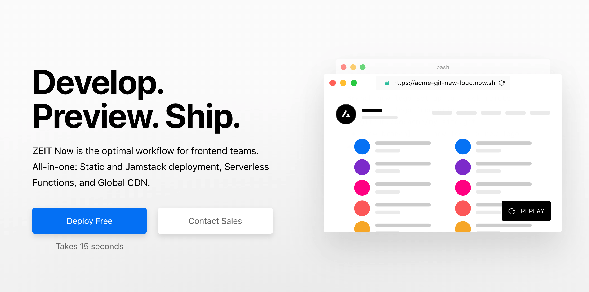
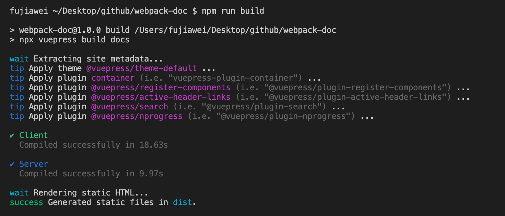
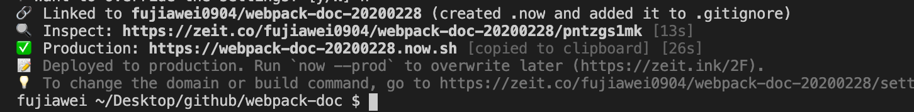
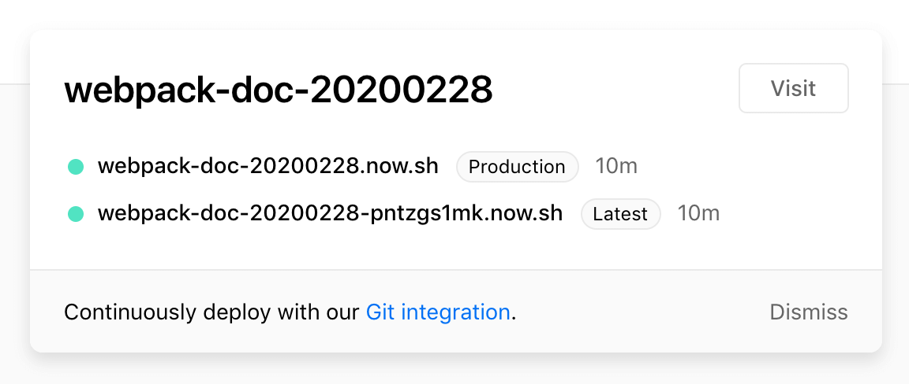

# 代码部署

我们使用 [`now`](https://zeit.co/home)，它可以帮助我们部署一些静态的网站，跟 `github.io` 类似，但个人觉得还是 `now` 好用。



&nbsp;

## 注册账号

注册 `now` 账号，用来之后的部署代码，需要翻墙。

同时必须本地需要安装 `now`，更多指令大家可以参考 [`now cli`](https://zeit.co/docs/now-cli#getting-started)。

```shell
sudo npm i -g now
```

安装完了之后本地登陆一下，直接在命令行 `now` 就行，部署代码需要本地登陆之后才能进行部署。


## 打包 `webpack-doc` 文档

我们通过在 `webpack-doc` 的根目录下运行 `npm run build` 打包文档代码，会生成一个 `dist` 文件，



接着我们在 `package.json` 中新增一个 `now` 部署命令 `deploy`： 

```json
"scripts": {
  // ...
  "deploy": "now ./dist"
},
```

我们运行一下 `npm run deploy`，`now` 会在命令行中给我们很多选项，我们选择打包那个文件夹、`now` 的用户名、部署项目的名字之后，它就会开始帮我们部署：


部署完成之后，我们可以得到一个部署的网址，如下：



最后我们就可以通过我们部署的网址进行访问了 `https://webpack-doc-20200228.now.sh/`。

在 `now` 的个人中心我们也能看到刚刚发布的项目：

